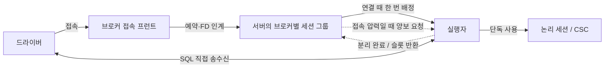
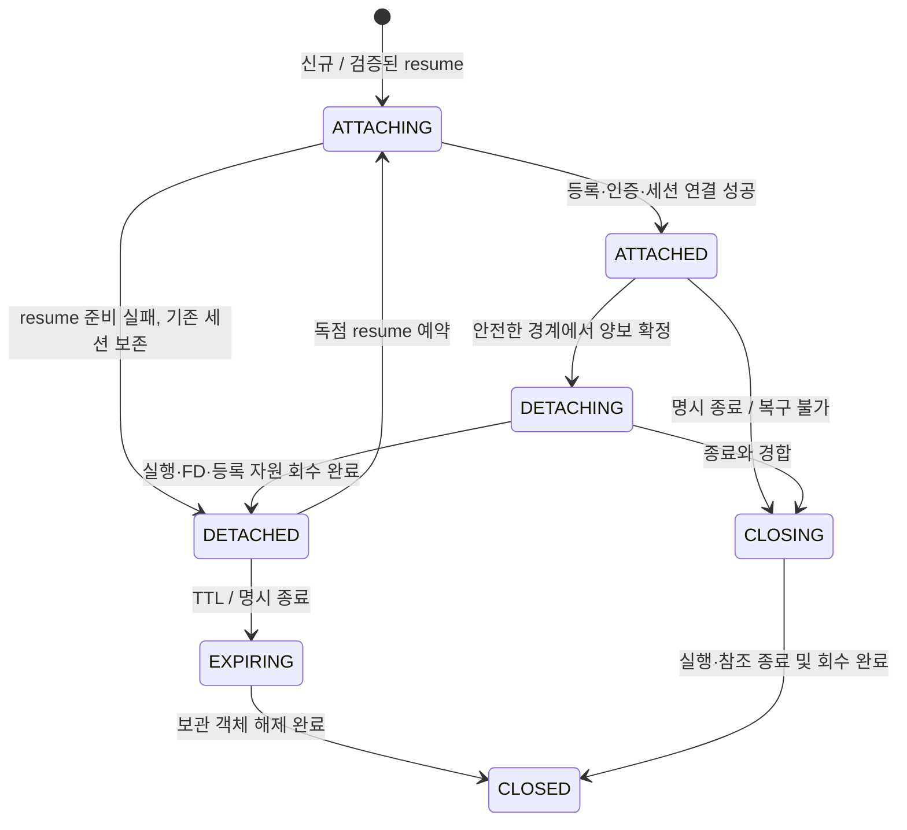

# AUTO 유지: 논리 세션 보존과 실행자 재사용 설계

2026-09-13 · 설계안 · 담당: Codex 리드

[CAS 통합 제품화 준비 — 코드·아키텍처 6대 과제 통합](https://github.com/xmilex-git/workspace/issues/259)의 AUTO/접속 수명 부분 설계다. 사용자 지시: **“응 유지하자. 최대한 성능 잘나오게끔 디자인해줘!”**. AUTO 유지 여부는 확정됐으며 다시 묻지 않는다. 이번 산출물은 소스 조사와 설계이며 엔진 구현·실측 완료가 아니다. 통합 티켓 전체를 종료하지 않는다.

## 1. 선택한 구조와 성능 판단 범위

**논리 세션은 서버에 보존하고, 실행자는 연결을 맡는 동안 고정한다. 접속 압력이 있을 때만 안전한 유휴 연결을 양보하고, 재접속한 논리 세션을 빈 실행자에 다시 붙인다.** 브로커는 접속 프런트이며 SQL은 계속 드라이버→서버로 직접 흐른다.

- 정상 연결의 PREPARE/EXECUTE/FETCH마다 공용 실행 큐를 통과시키거나 CSC를 복사하지 않는다.
- 서버의 브로커별 세션 그룹은 예약·양보 후보·회계만 관리한다. SQL 실행, 인증, 정리, 소켓 I/O가 끝날 때까지 그룹 락을 잡지 않는다.
- 세션의 CSC/workspace는 계속 그 세션의 소유다. 브로커나 다른 사용자의 공용 workspace로 바꾸지 않는다.
- 재사용할 실행자는 OS 스레드·thread entry와 소유권이 명확한 빈 임시 버퍼를 보유한다. 이전 사용자의 인증·트랜잭션·취소 상태를 보유한 실행자를 다음 사용자에게 주지 않는다.
- 자리가 있으면 기존 연결을 끊지 않는다. 포화 때도 필요한 수만 양보하고, 양보가 불가능하면 유한 대기·명시적 거절로 끝낸다.

성능 목표는 ① 포화 전 OLTP 처리량·tail latency 유지, ② 실행 슬롯보다 많은 WAS 논리 연결의 진행, ③ 교체당 초기화·할당·제어 대기의 감소, ④ 유한한 메모리다. 현재 AUTO 교대 부하의 실측은 없다. 아래 구조는 성능을 검증할 설계 후보이며, 개선율·최적 풀 크기를 주장하지 않는다. **구현의 첫 단계는 최신 baseline 측정**이다(MEAS-01/04/06/07). 사용자 요청에 맞춰 설계를 구체화하되, 실측 없는 미세 최적화를 제품 채택하지 않는다.

## 2. 조사 기준과 현재 코드의 결합

엔진 기준: [`99bf777afa7c74ca34f66e588d21ca43c317bcdf`](https://github.com/xmilex-git/cubrid/commit/99bf777afa7c74ca34f66e588d21ca43c317bcdf). 기존 CAS 비교: develop `c3967ec22`. 아래 링크는 고정 커밋의 정적 소스 근거다.

| 소스 | 확인한 사실 | 설계 영향 |
|---|---|---|
| [driver_session.cpp:447](https://github.com/xmilex-git/cubrid/blob/99bf777afa7c74ca34f66e588d21ca43c317bcdf/src/connection/driver_session.cpp#L447) | 드라이버 session blob을 버리고 항상 새 세션 | 검증된 resume와 신규 생성 경로를 분리해야 함 |
| [driver_session.cpp:541](https://github.com/xmilex-git/cubrid/blob/99bf777afa7c74ca34f66e588d21ca43c317bcdf/src/connection/driver_session.cpp#L541) | 연결마다 thread entry/CSC/CSS 생성, db_restart_ex, 종료 시 모두 회수 | 실행자 수명과 연결·논리 세션 수명 분리 |
| [driver_session.cpp:487](https://github.com/xmilex-git/cubrid/blob/99bf777afa7c74ca34f66e588d21ca43c317bcdf/src/connection/driver_session.cpp#L487) | request_loop가 FN_KEEP_SESS 등 종료 이유를 호출자에게 돌려주지 않음 | AUTO 양보와 실제 종료를 명시적으로 구별 |
| [session.c:122](https://github.com/xmilex-git/cubrid/blob/99bf777afa7c74ca34f66e588d21ca43c317bcdf/src/session/session.c#L122) | 논리 세션이 변수·SQL PREPARE·설정·PL session·CSC 소유 | 기존 소유권 유지, attached 참조만 별도 관리 |
| [session.c:823](https://github.com/xmilex-git/cubrid/blob/99bf777afa7c74ca34f66e588d21ca43c317bcdf/src/session/session.c#L823) | keep flag는 GC skip, 정상 TTL 보관과 다름 | AUTO에 영구 keep 재사용 금지 |
| [client_session_context.hpp:60](https://github.com/xmilex-git/cubrid/blob/99bf777afa7c74ca34f66e588d21ca43c317bcdf/src/object/client_session_context.hpp#L60) | CSC bracket, workspace, tm, 인증, DB identity, callback 상태가 묶임 | 보존할 상태와 새 attachment에 재바인딩할 상태를 분류 |
| [memory_alloc.c:467](https://github.com/xmilex-git/cubrid/blob/99bf777afa7c74ca34f66e588d21ca43c317bcdf/src/base/memory_alloc.c#L467) | client-half는 workspace heap, server-half는 thread private heap | CSC 이동 가능성과 모든 보관 포인터의 이동 가능성은 별개 |
| [broker_direct.cpp:1514](https://github.com/xmilex-git/cubrid/blob/99bf777afa7c74ca34f66e588d21ca43c317bcdf/src/broker/broker_direct.cpp#L1514) | 단일 dispatch가 슬롯 부족에 30ms 반복 대기 | 준비된 DB별 접속을 비동기 진행해야 함 |
| [broker_direct.cpp:545](https://github.com/xmilex-git/cubrid/blob/99bf777afa7c74ca34f66e588d21ca43c317bcdf/src/broker/broker_direct.cpp#L545) | 채널당 응답 대기 1개, request_mutex가 왕복 전체 보호 | request ID와 bounded pending으로 응답 매칭 |
| [adoption.cpp:1118](https://github.com/xmilex-git/cubrid/blob/99bf777afa7c74ca34f66e588d21ca43c317bcdf/src/connection/adoption.cpp#L1118) | cancel은 registry unlock 후 tran_index만 사용 | attachment 세대와 수명 pin 필요 |
| [adoption.cpp:1155](https://github.com/xmilex-git/cubrid/blob/99bf777afa7c74ca34f66e588d21ca43c317bcdf/src/connection/adoption.cpp#L1155) | RESYNC snapshot은 token/IP 위주 | port, 세대, 예약·양보 상태까지 복원 |
| [기존 broker.c:2700](https://github.com/CUBRID/cubrid/blob/c3967ec22/src/broker/broker.c#L2700) | AUTO·OUT_TRAN·holdable 없음·change mode AUTO 후보 재검사 | 기존 양보 의미를 서버 소유 상태로 구현 |
| [기존 cas_execute.c:390](https://github.com/CUBRID/cubrid/blob/c3967ec22/src/broker/cas_execute.c#L390) | 같은 DB 연결이면 재인증·세션 연결로 재사용 | 서버 공용 초기화를 반복할 이유 없음 |

클라이언트 초기화 분리와 전역 restart mutex 제거는 이미 완료됐다. 이 설계는 해당 보호를 다시 도입하지 않는다. 기존 CAS에도 락과 단일 dispatch 대기가 있었으므로 “기존은 무경합”이라고 전제하지 않는다.

## 3. 소유권과 자원 상한

| 단위 | 소유 상태 | 수명 / 회계 |
|---|---|---|
| 논리 세션 S | 사용자 identity, 변수·설정·SQL PREPARE·timezone·last_insert_id·trace, CSC/workspace, 세션 PL 상태 | 명시 종료·만료·DB 종료까지. attached와 detached 모두 byte budget에 포함 |
| 접속 귀속 A (attachment) | client FD/TLS, client IP+port, cancel token, transport 옵션, CAS wire handle namespace, 현재 등록/transaction 연결 | 물리 연결 1회. 새 귀속마다 내부 generation 증가 |
| 실행자 E | OS thread·thread entry, 자기 private heap, 빈 request buffer와 자기 대기 수단 | 여러 A를 순차 담당. 동시에 A 하나. 같은 A 안에서는 이동 없음 |
| 브로커별 세션 그룹 G | S 색인, A/E 예약·반환 기록, 양보 후보, bounded 대기열, 설정 generation | DB 프로세스 안의 브로커 소유 범위. 브로커 재시작 후 재결합 |
| 서버 공통 | 공용 초기화·카탈로그·전체 용량, 기존 query/parallel worker 체계 | 기존 서버 수명 |

그룹 identity는 DB 기동 세대와 로컬 브로커의 안정적인 식별자/소유자로 구성한다. 재시작 때 바뀌는 shm ID나 제어채널 fd를 그룹의 영속 identity로 쓰지 않는다. **그룹 identity, 브로커 기동 세대, 제어채널 세대는 별개**다.

K_b는 기존 브로커 실행 슬롯 상한을 뜻한다. 여러 DB에 연결해도 브로커 전체 합계가 K_b를 넘지 않는다. DB마다 K_b를 새로 주지 않는다. 서버 DB별 상한 K_db와 normal/admin/HA 접속 규칙도 별도 유지한다. 독립 서버 프로세스의 CPU를 여기서 전역 스케줄링한다고 주장하지 않는다.

기본 회계식:

- `R_b + A_b + D_b <= K_b`: 예약 중 R, attached A, 반환 정리 중 D는 모두 슬롯 점유. 반환 완료를 한 번 반영한 뒤만 다음 예약이 가능하다.
- `E_db <= K_db`: idle warm executor까지 실제 실행자 한도에 포함. 한도와 다른 의미의 warm cache를 만들지 않는다. 미귀속 idle E는 DB별 실행자 풀이 보유하고, 그룹은 사용 중인 lease만 보유한다. 특정 브로커가 idle E를 영구 독점하지 않는다.
- `N_logical = N_attached + N_detached + N_transition`: 연결 슬롯과 별도, 모든 상태를 byte budget에 포함한다.
- `M = M_shared + Σ M_executor + Σ M_logical + Σ M_transport + M_pending + M_metadata`. 큐·예약·token tombstone·RESYNC buffer·warm buffer도 포함한다. 브로커별 byte limit의 합과 실제 서버 전체 물리 byte 회계는 별도로 유지한다.

CSS/normal 슬롯을 보유한 idle 실행자는 반환된 접속 슬롯이라고 보고하지 않는다. 첫 구현에서는 분리 후 등록/normal/CSS 활성 슬롯을 실제 반환하고, 실행자에는 thread entry와 빈 버퍼만 남긴다. **빈 CSS 구조체·transaction 등록을 warm cache로 남기는 추가 최적화는 별도 실측과 중립화 증명 후** 채택한다. 이를 위해 상한 의미를 몰래 바꾸지 않는다.

## 4. 정상 경로와 포화 경로



### 포화 전

1. 접속 프런트가 요청을 접수하고, 브로커와 DB 양쪽 용량을 예약한다. 두 프로세스 락을 동시에 잡지 않고 reservation ID를 이용해 실패 시 보상 반환한다.
2. idle 실행자가 있으면 깨우고, 없으면 실제 용량 안에서 생성한다. 모든 슬롯의 스레드를 시작부터 만들지 않는다.
3. 인증/ACL/HA admission을 수행한다. 신규 S를 만들거나 기존 S에 독점 attach한다.
4. 이후 SQL은 현재 request loop로 직접 실행한다. 전역 그룹 탐색·공용 큐 enqueue·CSC 복사는 요청당 0회를 목표로 한다. 기존 엔진 락은 이 수치에 포함하지 않는다.
5. OUT_TRAN에 이른 세션을 후보로 표시한다. 정상 트랜잭션 완료마다 그룹 락과 목록 갱신을 강제하지 않는다. 그룹에 접속 압력이 있을 때 후보 모집을 깨우고, 이미 등록된 후보는 상태/generation으로 재검증한다. 현재 설정·histogram 훅이 registry를 조회하는 경로도 확인해, attachment에 수명 pin된 config/통계 참조와 generation 검사를 사용하도록 연결한다. 새 관리 구조의 정상 경로 0회 목표와 기존 계측 비용을 혼동하지 않는다.

### 포화 때

1. 여유 슬롯이 없고 기다리는 접속이 생기면 같은 브로커의 양보 가능한 attached 연결을 고른다. 빈 실행 슬롯을 먼저 사용한다.
2. 후보는 실행자의 소유 상태에서 OUT_TRAN·요청 미실행·결과 송신 완료·양보 pin 없음·AUTO 허용을 재검사한다. SHOW용 통계는 판정에 사용하지 않는다.
3. 실행자가 wake FD와 client FD를 함께 기다린다. polling sleep을 짧게 바꾸는 방식으로 구현하지 않는다. TLS의 이미 복호화된 pending data와 부분 header도 요청 경합에 포함한다.
4. 같은 세션의 `request_begin`과 `yield_commit` 중 하나만 성공한다. 요청이 먼저 실행권을 얻으면 양보를 거절하고 다른 후보를 고른다. 양보가 먼저면 그 소켓에서 새 SQL을 실행하지 않는다. EOF 후 드라이버 재접속/재시도 가능성은 기존 AUTO 재시도 계약으로 검증하며, 실행 여부가 불명확한 SQL을 서버가 임의 재실행하지 않는다.
5. 논리 세션을 보존하고 transport/connection 자원을 정리한다. cleanup 완료 이벤트로 슬롯을 반환한 뒤 대기 접속을 진행한다. 한 접속을 위해 여러 후보를 동시에 종료시키지 않는다.
6. 기존 클라이언트가 다시 요청하면 기존 드라이버 동작으로 접속한다. 연결이 바뀌어도 유효한 논리 세션과 그 설정은 이어진다. 서버 재시작·HA 전환은 별도 실패/재접속 계약이다.

## 5. 상태 전이와 동기화



- 신규 ATTACHING 실패는 CLOSED로 간다. resume 준비 실패는 DETACHED로 되돌리고 **기존 만료시각을 연장하지 않는다**. 도중에 종료가 확정됐으면 CLOSING으로 수렴한다.
- 양보의 선형화 지점은 세션별 짧은 상태 락 아래 `ATTACHED/idle → DETACHING` 전환이다. 요청 시작도 같은 상태와 attachment generation을 확인한다. CSC bracket을 기다리는 동안 그룹 락을 보유하지 않는다.
- 그룹은 registry/reservation/후보 링크를 짧은 mutex로 보호한다. 구조를 나누는 것부터 적용하며 자체 lock-free queue를 새로 만들지 않는다(COH-12, PAR-05/15).
- 후보는 그룹 내부의 bounded intrusive queue를 기본으로 하고 상태 변경 알림에서 중복 삽입을 막는다. 낡은 후보는 재검증해 제거하며, 한 차례 처리량에 한계를 두어 관리 루프를 독점하지 않는다. 최근 자주 사용하는 연결을 매번 골라 churn을 만들지 않도록 유휴 순서를 보존한다.
- registry의 외부 관측자는 attachment reference를 pin한 뒤 락을 풀고 사용한다. 포인터/FD/transaction index를 숫자만 복사해 나중에 쓰지 않는다.
- 잠금 중 I/O·메모리 대량 할당·engine interrupt 호출·join을 하지 않는다. 그룹 락과 CSC bracket의 중첩 취득도 없도록 인터페이스에서 분리한다.
- 새 atomics는 게시되는 데이터와 acquire/release 관계를 명시한다. x86 동작만 근거로 무잠금 정합성을 주장하지 않는다(COH-10). 선택 구조 자체는 mutex와 기존 wake primitive로 검증 가능하다.

## 6. 무엇을 보존하고 무엇을 다시 만드는가

| 상태 | 처리 계약 |
|---|---|
| 세션 변수·SQL PREPARE·timezone·last_insert_id·row_count | 기존 S를 보존. 새 S 생성 후 덮어쓰기로 흉내 내지 않음 |
| 컴파일/렌더링 설정·cost override·schema identity | S/CSC에 보존. resume 시 최초 접속 기본값이나 다른 사용자의 기본값으로 덮지 않음. 기존 설정 격리와 cache key 계약 유지 |
| CSC workspace/MOP·세션 domain·label table | 원래 S 소유 유지. 세션 간 공유 금지. 사용자 의미가 있는 객체는 일반 메모리 압력 때문에 조용히 삭제하지 않음 |
| transaction index·CSS/conn entry·transport identity | A에 재바인딩. 종료 전 interrupt/unregister/references drain 후 해제. 이전 숫자 재사용을 동일성으로 간주하지 않음 |
| 인증 | 새 transport는 인증·ACL·DB/user 확인 필수. 보존 CSC를 사용하기 전에 권한 변경과 현재 schema/auth 상태를 갱신 |
| TLS/SSL·소켓·timeout·packet parser·에러·취소 | A 또는 E 소유로 명시. A 종료 시 종료·초기화. 다른 사용자의 state가 warm executor에 남지 않음 |
| wire prepared handle / driver statement pooling | connection namespace를 재발급. 기존 드라이버의 invalid-handle/재prepare 경로로 안전하게 처리. SQL PREPARE와 구별. 재접속 시 기존 driver handle 무효화와 서버 handle table reset 순서를 맞추며, stale EXECUTE/CLOSE가 같은 번호의 새 handle에 적용되지 않는 것을 gate로 확인. namespace 변경만으로 안전하다고 간주하지 않음 |
| holdable 결과·전송 중 결과·진행 중 트랜잭션·XA prepare·PL 재진입 | 양보 pin. 기존 지원 계약상 살아 있어야 하는 동안 양보하지 않음 |
| idle PL session / 종료된 callback handler | 존재 boolean만으로 영구 pin하지 않음. 실제 실행/retained handle/외부 참조 카운트로 판단하고 안전한 경계에서 회수 또는 보존 |
| SQL/DDL/slow/access log·query replace mapping | 논리 세션 ID와 attachment/log slot 귀속을 구별. A 종료 기록과 S 만료 기록을 혼동하지 않음. 같은 E 재사용 시 이전 사용자 규칙·버퍼·로그 식별자 초기화 |

이 표는 구현 감사의 완료 조건이다. **CSC 전체에 memcpy, TLS 전체의 바이트 snapshot, `session_p->csc_p` 강제 교체는 허용하지 않는다.** 현재 CSC bracket은 일부 client-half 접근만 다루며 CAS의 별도 TLS 전체를 자동 저장/복원하지 않는다.

`cas_session_state`처럼 이름 있는 소유 구조로 CAS의 보존 필드를 묶고, TLS는 현재 활성 S/A에 대한 포인터만 설치하도록 정리한다. 요청 반복 안에서는 현재 포인터를 재사용한다. 단, 실제 구조 이름·필드 분할은 기존 CAS_TLS redirect와 전체 static/TLS 목록을 대조하여 확정한다. 세션/접속/실행자/공용이라는 분류는 모든 필드에 하나씩 배정한다.

workspace heap은 명시적인 S 소유 heap이며 독점 bracket 안에서만 접근한다. E의 private heap은 다른 E로 넘기지 않는다(ALLOC-08). detached 상태에 남는 DB_VALUE/list/callback/label/prepare의 reachable pointer를 감사해 server private heap에서 온 보관 객체를 **원 소유자가 살아 있을 때** 명시적 세션 heap/공유 할당으로 옮기거나 합법적으로 정리한다. 이 증명 전에는 서로 다른 E 사이의 resume를 활성화하지 않는다. 원 E를 영구 pin해서 K보다 많은 클라이언트가 진행하지 못하는 상태도 완료로 인정하지 않는다.

CSC의 `tm`/`db`/boot credential에는 논리 설정과 현재 등록 identity가 섞여 있다. resume는 기존 transaction index·client ID·conn pointer·server-call nesting·interrupt flag를 복원하지 않는다. 새 등록값으로 재바인딩하며 isolation/lock timeout 같은 사용자 설정만 별도로 복원한다. 단순히 `db_restart_ex`를 생략하고 기존 CSC 포인터를 활성화하는 경로는 구현으로 인정하지 않는다.

## 7. attach/detach 인터페이스

기존 `driver_session.cpp`/adoption와 session 모듈 사이에 수명 인터페이스를 둔다. 새 클래스 트리를 넓게 만들거나 모든 engine 호출을 virtual adapter로 감싸지 않는다(PHYS-01/02/05).

개념 인터페이스(컴파일 가능한 패치 아님):

```text
admit(connect_request, deadline) -> pending_id | rejection
bind(pending_id, authenticated_identity, resume_blob) -> attachment_lease | error
request_yield(attachment_id, generation) -> queued | stale | not_eligible
finish_attachment(attachment_lease, reason) -> completion
resume_snapshot(group_id, channel_epoch) -> bounded snapshot + sequence
```

- `attachment_lease`는 세션/예약/실행자 귀속을 소유하며 복사하지 않는다. 작업 종료 경로가 하나의 `finish_attachment`로 수렴한다.
- `reason`은 `auto_yield`, `client_close`, `network_loss`, `auth_failure`, `ha_reset`, `server_stop`을 구분한다. AUTO만 정상 detached 보존 경로로 간다. 기존 FN_KEEP_SESS를 무조건 AUTO로 읽지 않는다.
- `bind`는 먼저 identity와 resume 유효성을 확인하고 독점 ATTACHING을 예약한다. 느린 준비를 락 밖에서 끝낸 뒤 참조/generation을 공개한다. 부분 실패는 자원 취득 기록을 역순으로 반환한다.
- 신규 boot의 “세션 생성”과 resume의 “기존 세션 재결합”을 분리한다. 임시 세션을 만들고 기존 S에 CSC를 겹쳐 채택하는 구현은 금지한다. 등록·인증·HA 검사는 양쪽 모두 수행한다.
- 세션 DB 파라미터는 신규 연결의 전달값과 복원값의 우선순위가 달라야 한다. resume 성공은 보존값 우선, broker 운영 설정은 기존 동적 적용 규약과 generation을 따름, 접속 transport 속성은 새 값 사용이다.
- `finish_attachment`는 cancel/ref pin을 닫고 실행 종료 → 보관 상태 정리 → A 참조 제거 → transaction/CSS 환급 → wire/TLS/FD 종료 → E 중립화 → 반환 완료를 수행한다. 세부 함수 순서는 현재 epilogue와 대조해 double-free/slot refund 없음을 증명한다.

## 8. 재접속과 드라이버 호환

외부 CAS V12 메시지 종류·길이·필드 offset, 기존 드라이버의 재접속 방식을 유지한다. 서버와 브로커 사이의 내부 제어 프로토콜은 version negotiation 후 확장한다. 버전 불일치는 FD 인계 전에 명시 거절한다.

정적 확인: JDBC `UConnection.checkReconnect`는 기존 20-byte session blob을 다시 보내고, CCI도 V12 경로에서 20 bytes를 복사한다. JDBC 조사 checkout은 `4a40cb95c9c876f8ffea7640906ffae33d2efbf5`, CCI는 `bd86063a5bd481f0e22bf07c8a76bf736f86443a`다. **이 사실만으로 모든 드라이버의 AUTO 재시도·statement pooling 호환이 입증되는 것은 아니다.** ODBC·thin csql을 포함해 실제 지원 조합으로 확인한다.

재접속 검증은 현재 DB 기동 세대, 논리 세션 ID, 원 사용자, 인증된 새 사용자, 세션 재접속 증표, 만료, attach 독점성을 포함한다. IP는 resume 인증 키가 아니며 클라이언트 포트는 재접속 때 바뀔 수 있다. 기존 S가 ATTACHED/ATTACHING이면 같은 증표의 두 번째 접속도 소유권을 빼앗지 못한다. bounded 대기 또는 명시 거절하고, 인증 실패·중복 resume는 원 S의 상태/TTL을 변경하지 않는다.

현재 legacy server key는 서버 기동 시각/IP로 만들어져 비밀 capability가 아니다(`boot_sr.c:1946`). 그 키와 숫자 세션 ID만 믿고 기존 `session_check_session`을 재활성화하지 않는다. **구현안은 기존 20-byte blob의 마지막 8 bytes에 세션별 CSPRNG nonce를 두고, 기존 8-byte server key와 4-byte session ID offset은 보존하는 것**이다. nonce는 서버가 발급해 저장하고 동등 비교하며, 로그에 기록하지 않는다. 새 attach 때 인증·원 사용자/DB 확인을 함께 수행한다. nonce 없는 기존 연결은 다른 S를 resume하지 않고 기존 신규 접속 동작으로 처리한다. 인증·시도율 제한·세션 만료를 함께 적용하며 64-bit nonce만으로 인증을 대체하지 않는다.

이 안의 채택 게이트는 지원 드라이버가 blob tail을 변경 없이 보존하는지와 기존 session-key 검사/새 세션 표시가 깨지지 않는지다. tail이 보존되지 않는 드라이버가 있으면 조용히 약한 resume를 허용하지 않는다. 해당 드라이버의 기존 표현에서 가능한 호환안을 검증하기 전 AUTO 출시 완료로 판정하지 않는다. 내부 `csession_find_or_create_session` 경로와 connect reply의 모든 blob 재발급 지점도 nonce를 보존해야 한다. 현재 `make_session_for_driver`의 tail zero-fill만 바꾸고 다른 writer를 남기는 수정은 불완전하다. 새 인증 프로토콜 전체나 utility channel 재설계는 이 작업에 넣지 않는다.

같은 DB에서 다른 브로커로 돌아오는 resume는 단순 그룹 이름 비교로 배제하지 않는다. 대상 브로커의 인증·ACL·ACCESS_MODE/HA 규약을 적용하고, DETACHED S에 한해 대상 그룹의 슬롯/byte 예약 후 독점 ATTACHING 전환과 함께 그룹 소유권을 이전한다. 원 그룹에서의 제거와 대상 그룹의 게시에는 같은 transfer ID/generation을 사용하고, 이중 그룹 락 없이 idempotent 완료 이벤트로 회계를 맞춘다. 실패 시 원 그룹/TTL을 복구한다. 다른 DB/서버 epoch로 S 자체를 이동하지는 않는다. 이 경로도 기존 드라이버의 altHosts/복원 의미와 함께 gate에서 확인한다.

resume 성공 후 첫 요청부터 S의 상태가 보인다. 만료·서버 재시작은 기존 session-expired/new-session 표시에 맞춰 처리한다. 이미 실행한 SQL의 성공 응답이 유실된 경우 exactly-once 재시도를 보장하지 않는다. AUTO 양보는 애초에 실행 중인 SQL을 끊는 기능으로 사용하지 않는다.

## 9. 비동기 접속 제어와 공정성

브로커 전체에는 기존 총량 K_b를 두고 DB별 준비 큐를 둔다. DB A가 용량 부족/제어채널 지연이면 A를 대기 상태로 남기고 준비된 B를 진행한다. 한 DB만 지원하도록 강제하지 않는다.

- 대기·예약·응답마다 request ID와 monotonic deadline을 둔다. 네트워크 I/O는 단일 writer가 부분 write offset까지 소유하고, 다른 스레드는 bounded outbox에 게시한다.
- 채널 응답은 `(channel_epoch, request_id)`로 매칭한다. HANDOFF/양보/STATUS/CANCEL이 하나의 reply mailbox를 공유하지 않는다. 예약 수·outbox bytes·pending 수 상한을 모두 적용한다.
- control 업무는 bounded batch로 처리한다. cancel/stop과 반환 완료를 신규 접속보다 우선 처리하되, 신규 접속에도 진행 기회를 보장한다. 제어 작업을 임의로 무제한 우선순위 큐에 넣지 않는다.
- DB별 ready queue는 순환 배정, DB 안에서는 기존 우선순위 규약을 보존하면서 대기시간으로 기아를 막는다. 재접속이라는 이유만으로 영구 우선하지 않는다.
- 한 DB의 idle 실행자를 다른 DB 서버 프로세스로 넘기지 않는다. 브로커 전체 슬롯이 포화면 다른 DB의 안전한 유휴 A를 양보시켜 총량을 반환할 수 있다. active/holdable 세션을 강제로 희생시켜 여유가 있다고 만들지 않는다.
- 빈 슬롯이 생겼다는 통지와 timeout이 wake 원인이다. `CLIENTS_EXCEEDED` 무한 재시도·30ms 폴링은 제거 대상으로 둔다. 큐가 차거나 deadline이 지나면 현재 wire 단계에 맞는 오류를 보내고 FD/예약을 회수한다.
- shrink된 설정은 새 예약을 막고 자연 반환으로 수렴한다. 운영 설정 변경을 이유로 실행 중 트랜잭션을 강제로 끊지 않는다.

**FD 소유권:** SCM_RIGHTS가 한 byte라도 성공하면 broker는 클라이언트 wire 쓰기를 영구 중단한다. server가 connect reply/오류의 유일 writer다. 짧은 sendmsg도 FD 전달 성공으로 처리한다. 이후 ACK timeout은 FD 재사용·broker 오류 쓰기가 아니라 operation 조회/취소·채널 복구 대상이다. 완전한 인계 메시지 수신 전 서버는 FD를 provisional로만 보유하고 미완료 메시지 timeout에 닫는다. control write 실패/소유 불명확 상태에서는 추가 인계를 동결하고 정상 복구로 회계한다.

## 10. 취소·종료·브로커 재시작

외부 cancel token은 **물리 attachment마다 새로 발급**하며, 현재 DB/서버 기동 세대 동안 재사용하지 않는다. 32-bit 공간 소진 시 wrap해서 재사용하지 않고 신규 발급을 거절한다. 무작위 발급을 사용하면 collision을 검사한다. 같은 S가 다시 붙어도 이전 token은 새 A를 가리키지 않는다.

서버 내부 식별자는 `(server_epoch, group_id, attachment_id, generation)`이다. 외부 token→내부 identity 매핑은 db/IP/port를 포함하고 RESYNC에서도 그대로 복원한다. 여러 DB에서 같은 token과 IP가 겹쳐도 모호한 후보를 임의 선택하지 않는다. port 없는 기존 cancel 요청은 유일하게 식별되는 경우만 처리한다.

cancel 처리자는 A reference와 transaction binding을 pin한다. cancel 전용 수명 가드 아래 현재 generation/closing 상태를 확인하고 interrupt를 전달한다. unregister는 binding을 닫은 뒤 in-flight cancel pin이 빠질 때까지 해당 transaction index를 반납하지 않는다. 그룹 락은 이 대기/engine 호출 동안 잡지 않는다. 다음 요청 전에는 완료된 이전 요청의 취소 상태를 철회한다. 외부 프로토콜에 request generation이 없으므로, 같은 A에서 요청 사이에 도착한 cancel까지 특정 SQL에 정확히 매칭한다고 약속하지 않는다.

RESYNC는 그룹 단위 **snapshot sequence + 이후 delta**다. 짧게 복사한 entry descriptor의 수명을 pin하고 락 밖에서 직렬화한다. 복사 동안 변경된 delta를 bounded journal로 보존해 snapshot 이후 순서대로 재생한다. journal overflow면 불완전 snapshot을 적용하지 않고 새 snapshot을 요구한다. 복구 완료 전 신규 admission은 동결하고 살아 있는 SQL은 계속 실행한다.

- 복원에는 attached·detaching·pending reservation·operation 결과·peer port·token·generation을 포함한다. detached S는 active 슬롯에서 제외하되 보관 메모리 회계에 남는다.
- 브로커 재시작 시 새 broker epoch와 이전 reservation의 귀속을 구별한다. 어느 DB의 회계도 확인되지 않은 상태에서 broker 총량이 비었다고 가정하지 않는다.
- 반환 완료는 ID별 idempotent ledger로 한 번만 적용한다. pre-ACK 종료/중복 종료/늦은 ACK는 동일 operation 상태에 합쳐진다. unmatched event를 `orphan_ends`에 영구 보관하지 않는다.
- 제어채널 EOF만으로 DB 프로세스와 세션이 죽었다고 단정하지 않는다. DB 기동 세대와 RESYNC로 확인한다. 변경된 DB epoch는 이전 A/S 참조를 무효화한다.
- 종료는 admission 차단 → attached 실행 중단/완료 → 참조·반환 drain → detached 해제 → 실행자 join → 공용 자원 해제다. timeout 뒤 살아 있는 실행자가 참조하는 manager/engine을 먼저 free하지 않는다. 기존 종료 정책을 따르며 강제 종료 옵션의 별도 제품 정책을 이 설계에서 신설하지 않는다.

## 11. 메모리·대기·실행 용량 정책

AUTO는 `논리 연결 수 > 실행 슬롯 수`를 지원하지만 무한 세션을 보장하지 않는다. 스레드 수가 K로 제한돼도 workspace/준비문을 N개 보관하면 메모리는 N에 비례한다. 따라서 thread 절감과 전체 PSS 절감을 분리해 보고한다.

- 바이트는 할당 전에 예약하고, 실패·detach/expiry 때 소유자에게 정확히 환급한다. active→detached는 소유권 이동이지 무료 메모리 생성이 아니다.
- detach 때문에 별도 snapshot을 중복 생성하지 않는 것이 기본이다. session-owned CSC 포인터를 독점 이관하고 이미 보존한 상태를 재복사하지 않는다. 실제 private-heap 탈출 객체만 명시적으로 처리한다.
- detached TTL은 단조 시각으로 관리하며 기존 session timeout 의미와 구별한다. 만료 전 세션을 임의 evict해서 AUTO 상태 보존을 깨지 않는다. 예산 부족이면 우선 reclaim 가능한 빈 warm buffer/만료 S를 정리하고, 그래도 부족하면 신규 admission을 거절한다.
- warm buffer는 high-water 전체를 영구 보유하지 않는다. 용량·idle shrink를 두며 수치는 측정으로 정한다. 세션별/브로커별 예산은 서버 전체 한도와 함께 검사한다.
- 기존 요청 전체 byte/deadline 계약과 연결한다. authentication/TLS에는 별도의 bounded pre-auth 수용량과 시간 제한이 필요하며 슬롯 반환을 기다리는 공격적 접속이 인증 자원을 무한 점유하지 못한다.
- 실행자 수 K와 CPU에서 동시에 compile/execute하는 수 C는 다르다. C<K가 필요한지는 sweep으로 정한다. 허용 시 top-level 요청에서만 permit을 획득하고 PL/trigger 재진입은 부모 것을 승계한다. 매 FETCH나 row loop에 공용 permit을 추가하지 않는다. 취소·정리·제어 작업은 그 permit 고갈 때문에 실행 불능이 되지 않아야 한다.

상수값은 이 문서에서 임의로 정하지 않는다. 측정으로 선택할 값은 K_db, warm 최소/유휴 보관, 대기 deadline, detached TTL/바이트 한도, pending/outbox 한도, 필요 시 C다. max_clients를 메모리 예산으로 환산할 때 query parallel worker와 PL 프로세스까지 별도로 포함한다. 기존 메모리 티켓의 수치 입력을 재사용한다.

## 12. 대안 비교와 채택 순서

| 구조 | 정상 질의 경로 | 양보/재접속 비용 | 판단 |
|---|---|---|---|
| 연결마다 스레드 생성·CSC 폐기 후 상태 재구성 | 현재와 유사 | thread/문맥 재생성, 상태 직렬화·복원 | 정확성 대조군. 최종 성능 설계로 우선 선택하지 않음 |
| **보존 S + 연결 동안 고정 E + 안전한 경계의 재결합** | 기존 직접 request loop | 경계에서 인증·등록·TLS/귀속 전환 | 선택한 설계 후보. 기존 CSC 소유권과 AUTO 의미를 유지 |
| 모든 소켓 유지 + 요청마다 공용 worker 배정 | 요청마다 enqueue/문맥 전환 | 물리 재접속을 줄일 수 있음 | 별도 실측 후보. I/O 상태기계·TLS/private heap/PL 재진입 변경이 크므로 현재 구현의 필수 전제 아님 |
| 브로커별 큰 mutex + 기존 연결 구조 | 공유 mutex 경합 가능 | 전역 초기화의 안전성을 대신하지 못함 | 사용하지 않음 |

선택안의 성능 가설은 **새 스레드 생성 수를 연결 교체 수 H에서 실제 실행자 생성/교체 수 W로 줄이고**, 정상 질의에는 중앙 scheduling 왕복을 더하지 않는다는 것이다. CSC 재초기화·MOP 재구성은 resume 성공 때 생략을 목표로 하나, 인증·HA admission·transaction binding·TLS handshake가 사라지는 것은 아니다. 이 생략 경로는 단계별 소유권 증명 후 켠다.

## 13. 구현 순서와 검증 경계

통합 티켓 안에서 수행하며 별도 하위 이슈를 만들지 않는다.

1. **G0: baseline과 인벤토리.** 최신 cas-merge, 기존 CAS AUTO의 같은 workload 측정. CAS_TLS/CSC/SESSION_STATE/entry/CSS/PL/로그 보관 필드를 전수 소유 분류하고, 드라이버 resume blob·handle 재prepare 경로 확인. 비용 계수와 baseline raw 로그를 먼저 남긴다.
2. **G1: 수명과 취소 토대.** attachment ID/generation·단일 finish 경로·transaction pin·종료 이유 반환, 슬롯 exactly-once 회계와 FD 단일 writer를 구현한다. AUTO를 켜기 전에 실패·취소·중복 종료 경합을 검증한다.
3. **G2: S 보존과 다른 E resume.** 설정·workspace·PL/handle의 소유권 감사와 private-heap 분리, 만료/byte budget, 신규 생성과 재결합 분리, 기존 드라이버 credential 전달 검증. A→B→A의 설정·인증·prepared·결과 격리, 악성/만료 resume, 초기화 부분 실패를 검증한다.
4. **G3: AUTO 양보와 비동기 admission.** pressure-triggered 후보 모집, request/yield 선형화, DB별 ready queue, bounded request-ID 제어채널, RESYNC를 연결한다. K보다 많은 논리 연결의 진행과 포화 DB A/여유 DB B를 검증한다.
5. **G4: 실행자 재사용.** 한정된 warm E, 중립화, 재접속 cache/workspace 재사용, idle shrink. G0/G3과 A/B 측정하여 실제 이득과 tail/메모리 비용을 비교한다. 재사용 실패 시 E를 폐기하고 새 E로 갈 수 있으나 S 상태를 잃는 폴백은 허용하지 않는다.
6. **G5: 제품 게이트·QA 인계.** 최신 지도 규약의 fresh optdebug/release·unit·기존 smoke/관련 CTP, 경합·OOM·재시작·driver 행렬, 최종 workload 반복 측정. QA 요구를 최종 단일 test.md에 합친다.

각 단계는 기존 동작을 보존하는 독립 검증점이다. G1~G4가 완료되지 않은 중간 구현을 AUTO 지원 완료로 발표하지 않는다. `KEEP_CON_AUTO` 설정 문자열만 복원하는 커밋은 완료가 아니다.

## 14. 성능 실험과 완료 기준

측정은 기존 AUTO baseline과 새 AUTO의 **동일 논리 클라이언트 수·동일 실행 슬롯 수·동일 동시 활성 수**를 비교한다. 신규 연결을 거절해 처리량이 높아 보이는 결과, 연결 수가 줄어 메모리가 작아 보이는 결과는 무효다. 현재 통합 ON은 포화 전 overhead 대조군이며 N>K 수용성 동등군은 아니다.

| 부하 | 구분해야 할 값 / 판별 |
|---|---|
| 포화 전 장수 WAS 풀, YCSB C/A | throughput, request p50/p95/p99, CPU/op. AUTO 비활성 경로 대비 중앙 scheduling 비용 추가 여부 |
| N/K=1,2,4,8의 짧은 트랜잭션 교대 | 완료/오류/대기 수, 클라이언트별 최대 대기, 교체당 auth/TLS/register/CSC 비용. N/K는 실험 축이며 제품 지원 한도가 아님 |
| 새 접속 burst / 정상 steady-state | OS thread create 수, full boot/CSC init 횟수, control queue 체류, lock wait/hold 시간 |
| 한 DB 포화·다른 DB 여유, 다중 브로커 | B의 지연·진행과 브로커 총량 일치. A가 모든 active 슬롯을 정당하게 점유한 경우와 단일 dispatch로 막힌 경우 구별 |
| 활성 TX/holdable/XA/PL pin 혼합 | 양보 실패 사유별 수·pin 수명, 정상 요청 진행. 핀 대상 강제 중단으로 숫자를 개선하지 않음 |
| 큰 prepare/장시간 idle/느린 소비자 | active/detached/warm 별 bytes, 전체 PSS, FD, thread, 만료·거절 후 회수 |
| 취소·재접속·broker 재시작 교대 | 다른 세션 취소 0, duplicate refund 0, snapshot/delta 회계 정합 |

정상 경로·양보 경로·재결합 경로별 profile을 따로 수집한다. 이벤트/bytes/거절은 소유자별 누적하고 snapshot에서 합친다. SQL마다 전역 통계 원자변수를 여러 개 추가하지 않는다. lock/c2c/allocator 계수는 병목 귀속용이며 결과 판정은 wall-clock median과 MAD·tail이다. 동일 host 상태·SMT off·warmup·conf·CPU·동일 실행시점 교차 baseline을 사용한다. 공식 YCSB 판정은 C×3·A×3 이상으로 하며 분산이 커 결론을 낼 수 없으면 보류한다. 기존 다른 head에서 얻은 절대값을 이번 개선율의 분모로 재사용하지 않는다. hot-symbol ELF layout도 비교한다(MEAS-08).

정확성 완료 조건:

- 동일 S를 동시에 두 E가 실행하지 않고, 양보 후 정상 재접속에 상태가 보존된다.
- raw private-heap pointer가 E 경계를 넘지 않는다. owner가 사라진 보관 객체가 없다.
- 예약/attached/detaching/idle E/논리 S를 분리해 회계하고, 실패·만료·재시작 후 메모리·FD·슬롯이 수렴한다.
- 새 연결 시작·느린 정리·제어채널 stall이 무관한 그룹/준비된 DB의 진행을 막지 않는다.
- 신형 nonce/connection handle 계약은 기존 지원 드라이버에서 byte/동작 호환을 통과한다.
- 모든 세션이 pin된 포화 상태는 유한 대기·거절로 끝나며 무한 spin이나 무제한 큐가 없다.

성능 통과는 정상 OLTP의 통계적으로 구분되는 회귀가 없고, 목표 교대 부하에서 수용성을 유지하면서 교체 비용 또는 tail/CPU의 개선이 실측으로 확인되는 것이다. 가용 세션 메모리·목표 수용량은 [세션·커넥션당 메모리 footprint 축소](https://github.com/xmilex-git/workspace/issues/237)의 예산과 함께 정한다. arbitrary 고정 %를 이 문서에서 새로 강제하지 않는다.

실행 검증은 Codex 리드가 `herdr-integration`의 전용 Sonnet 세션에 위임한다. CTP는 `just ctp ...` 컨테이너 경로와 testcase ref 명시 규약을 따른다. 신규 testcase PR 추가는 QA 담당이며 이 표와 경합 시나리오를 최종 단일 test.md에 인계한다. 이 설계 세션에서는 빌드·실측을 수행하지 않았다.

## 15. 결정 기록과 이행

| 결정 | 이유 | 비용 / 되돌림 |
|---|---|---|
| D1 AUTO 수용성 유지 | 사용자 확정, 기존 WAS 다중 연결 운영 보존 | 재접속·세션 수명 구현 필요. 유지 여부 재투표하지 않음 |
| D2 S 소유 CSC와 연결 동안 고정 E | 기존 workspace 세션 격리 유지, 질의별 스케줄링 불필요 | detached memory 잔류. 예산과 TTL 적용; 수치로 감당 여부 판정 |
| D3 양보는 압력에 반응, 그룹별 짧은 관리 | 불필요한 연결 churn과 전역 대기 억제 | 후보 관리와 공정성 필요. 락 종류 최적화는 profile 이후 |
| D4 경계에서만 E 재사용, transaction/CSS 중립화 | thread 생성 반복 감소 가설과 수명 정확성 | 초기 구현은 등록을 실제 반환. warm 등록 최적화는 별도 채택 |
| D5 제어 프로토콜 request ID·epoch·bounded ledger | 병렬 접속·늦은 ACK·중복 반환·재시작 정합성 | 내부 버전 확장 필요. 구버전 혼합은 인계 전 거절 |
| D6 외부 드라이버 표현 보존, resume 증표 보강 | 오래된 공통 server key만으로 재부착하지 않음 | blob tail 호환 확인 필수. 미확인 시 출시 게이트 미통과 |

롤백은 admission을 닫고 새 예약을 취소한 뒤 live attachment와 보관 세션의 처리 계약을 지켜 drain한다. AUTO 사용 중인 S를 유실시키며 런타임 스위치 하나로 ON으로 바꾸지 않는다. 배포 rollback은 계획된 서버 재시작 경계에서 한다.

초기화 분리, 기존 설정 격리·cost/cache 계약은 유지한다. 이 설계가 영향을 주는 이전 “접속=세션, 재부착 없음” 결정은 **AUTO 지원 경로에 한해 교체**한다. utility·로컬 thin csql의 기존 독립 접속 경로와 native METHOD 지원 정책, 새 요청당 worker 모델, 공유 prepared/native XASL 최적화는 별도 범위다. 이 문서의 기술 선택은 구현 기준이지만, 측정값이 없는 수치와 드라이버/소유권 검증 결과를 완료된 사실로 기록하지 않는다.
