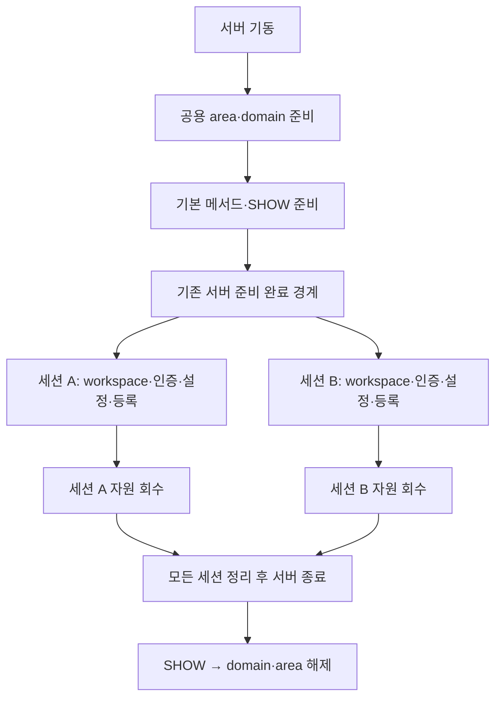

# 클라이언트 초기화의 공용·세션 수명 분리

추적: [CAS 통합 제품화 준비 — 코드·아키텍처 6대 과제 통합](https://github.com/xmilex-git/workspace/issues/259).
기반은 `cas-merge@67c6fe88c54bb627e75f0eef4daa2e3dfe8c8437`이다. 구현은 [99bf777af — shared client initialization 분리](https://github.com/xmilex-git/cubrid/commit/99bf777afa7c74ca34f66e588d21ca43c317bcdf)에 기록했다(`codex/wf259-client-init`, 17개 소스·헤더).

`boot_restart_client`는 서버 재시작이 아니라 서버에 통합된 클라이언트 절반의 초기화다. 정상 접속 전체를 잠그던 `boot_Restart_mutex`를 제거하고, 공용 상태를 서버가 준비한 뒤 세션 초기화를 병렬로 진행한다.

## 결정과 소유권

**D1. 공용 준비 완료는 기존 서버 기동 경계로 공개한다.** 새 전역 접속 락이나 세션 풀을 추가하지 않는다. 공용 데이터는 접속 중 재초기화하지 않으며, 필수 공용 초기화의 부분 실패는 서버 기동 실패로 처리한다. CS/SA의 기존 공용 초기화 경로는 유지한다.

| 대상 | 초기화·쓰기 | 정리·사용 |
|---|---|---|
| lang / tz / msgcat / area / locator / tp / tsc / 문자열 압축 설정 | 기존 `boot_restart_server` | 기존 서버 공용 finalizer. SERVER_MODE 접속 경로의 중복 호출·쓰기를 제거한다. |
| ws / pr / set / obt / classobj area | `ws_initialize_shared`, 서버 기동 초반 | 기존 area finalizer. `ws_init`은 세션 heap·MOP 테이블·Null MOP·클래스 이름 캐시만 생성한다. |
| SHOW 메타데이터와 heap·domain | 서버 기동 후반의 전용 CSC | 마지막 세션 종료와 무관하게 유지한다. 서버 종료 시 같은 CSC에서 attribute → domain → heap 순으로 해제하고, 이후 공용 area를 해제한다. |
| SHOW scan 함수 테이블 | 서버 기동 | 정상 등록 때 초기화하지 않는다. |
| 기본 정적 메서드 표 | 서버 기동 | 서버 종료 때 해제한다. 이름 할당까지 성공한 노드만 목록에 게시한다. |
| native loader | 서버 기동 | 서버 종료. 기존 선택 모듈의 초기화 오류 무시 동작은 유지한다. 동적 METHOD 지원·load/resolve 동시성·ABI 정책은 별도 미결정 과제다. |
| root / catalog OID | 기존 서버 기동의 OID 캐시 | `sm_init`과 접속 초기화는 읽기만 한다. |
| 임시 OID 번호 | CSC | 다른 접속이 초기화·감소시키지 않는다. |
| OS login / host / IP | 서버 기동 시 준비 | 접속별 credential로 복사한다. CS/SA login 임시 버퍼는 호출 소유다. |
| preferred hosts / connect order / delayed-host lookup limit | CSC | 접속·재접속의 setter가 다른 세션의 값을 바꾸지 않는다. preferred-host 문자열은 CSC 정리 때 해제한다. |
| client atexit / SIGFPE 설치·복구 / client all-finalize | CS/SA만 | 서버에서 클라이언트가 서버 공용 상태나 signal handler를 종료·교체하지 않는다. |
| workspace / 인증 / trigger / transaction / 설정 | 기존 CSC·session·TDES | 기존 세션별 초기화와 `csc_teardown`. transaction table·connection 자료구조의 기존 동기화는 유지한다. |

**D2. 실패한 초기화가 취득한 자원만 회수한다.** `sm_init`과 `tr_init`은 실패를 반환하고, `db_find_or_create_session`의 오류를 무시하지 않는다. 세션 객체 생성 또는 설정 배열 초기화가 실패하면 성공한 세션처럼 게시하지 않는다. 생성한 세션은 등록 해제 전에 회수한다. 등록 중 root heap 확인 실패는 이미 취득한 transaction index를 환급한다.

`ws_abort_transaction`은 활성 CSC가 있어도 등록된 클라이언트 트랜잭션이 없으면 반환한다. SHOW 준비용 CSC나 등록 전 workspace의 OOM을 서버 main transaction의 abort로 바꾸지 않는다. 등록된 세션의 기존 OOM 처리 경로는 유지한다.

**D3. 기존 설정 격리를 보존한다.** CSC 비용모델·캐시 키·클라이언트 설정 최초 전달을 유지한다. intl 기본값은 기존 `sysprm_alloc_session_parameters_from_defaults`가 DB 언어와 명시 설정을 반영한다. 세션 생성 전에 실행되던 SERVER_MODE의 불필요한 `sysprm_init_intl_param` 호출을 제거한다.

`db_Host_status_list`와 `db_Delayed_hosts_count`의 정상 접속 시 쓰기는 CS_MODE 원격 서버 선택 경로에 있으며, 서버 내 초기화는 그 경로에 들어가지 않는다. `boot_build_db_info`는 호출별 `DB_INFO`를 만들고 성공·실패 모두 해제한다.

## 검증

전용 Rocky Linux 8 작업 트리·설치본에서 Sonnet 실행 워커가 수행했다. 이번 세션에 만든 fresh optdebug/release 빌드 트리에서 컴파일 오류를 수정·재빌드했으며, 마지막 OOM 가드도 양쪽에서 다시 빌드·검증했다. `ctest`에는 등록된 테스트가 없어 실제 `test_server_compile` 실행 결과를 사용했다.

| 검증 | 결과 |
|---|---|
| optdebug / release 빌드 | 양쪽 성공 |
| `test_server_compile` | 양쪽 20/20 |
| 기본 smoke, PL 활성화 | 마지막 가드·바이너리 복구 후 양쪽 14/14 |
| JDBC smoke | 마지막 바이너리 복구 후 양쪽 성공; SSL·RO·LOB·XA·cancel·재접속·로그 assertion 포함 |
| thin / csql protocol / utility gate smoke | 양쪽 성공. SA `createdb`·`csql -S`, CS utility `spacedb` 포함 |
| 24파 × 동시 16접속 | 각 모드에서 정상 288/288, 없는 사용자 거절 96/96, 마지막 재접속 성공 |
| 정상 접속 작업 | 연결별 테이블 CREATE·INSERT·SUM 확인·rollback·재삽입/commit·DROP |
| 실제 세션 테이블 / 브로커 슬롯 | 정상 접속 묶음 종료 후 사용 중 세션 0 / 슬롯 0 |
| SHOW 메타데이터 수명 | 마지막 세션 종료 후 새 연결의 `SHOW SESSION STATUS`, `SHOW ACCESS STATUS` 정상 |
| FD | 처음 178 → 작업 후 180, 추가 접속 묶음의 증가 0. 추가 2개는 temp volume FD와 socket; socket의 정확한 소유 모듈까지 확인하지는 않았다. |
| 초기화 중첩 | 서로 다른 스레드의 인증 초기화 진입·반환 구간이 겹침. breakpoint 중복 이벤트를 독립 호출 수로 세지 않는다. |
| 접속 중 공용 초기화 | `ws_initialize_shared`, `tp_init`, `showstmt_metadata_init`, `dl_initiate_module`, `boot_initialize_client_modules` 5종 모두 0회 |
| 등록 전 OOM 콜백 | 활성 CSC·`tm_Tran_index=-1`에서 콜백 직접 호출. abort 함수 진입 0, 접속 계속 성공 |
| 공용 기동 실패 | `showstmt_metadata_init`, `ws_initialize_shared` 각각 강제 실패 HIT·비정상 종료·접속 소켓 미게시·server/PL 잔류 없음. 원본 binary checksum·mode 복구 후 정상 기동 성공 |

실패 주입은 **함수 반환값을 강제한 호출자 정리 검증**이다. 모든 하위 `malloc` 실패를 전수 검증했다는 뜻이 아니다. 미커밋 행 `SUM=77, COUNT=1`을 가진 동일 JDBC 연결을 유지하고 각 실패 전후에도 그 행과 트랜잭션이 유지되는지 확인했다. 각 실패 후 새 연결도 성공했고 서버 PID·FD가 유지되었다.

| 실패 경계 | 관찰한 접속 오류 |
|---|---:|
| `ws_init`에서 호출한 `db_create_workspace_heap` → 0 | -3 |
| `sm_init`에서 호출한 `ws_mop` → NULL | -3 |
| `xsession_create_new` → 오류 | -1 |
| 세션 설정 배열 생성 → NULL | -1 |
| 설정 배열 소유권 전달 전 → 오류 | -1 |
| `tr_init` → 오류 | -1 |
| 등록 중 root heap 확인 → 오류 | -2 |

최종 확인은 현재 포트 claim을 취득한 뒤 수행했다(`cubrid_port_id=1704`, broker `36400–36499`). 각 실패의 gdb가 breakpoint를 삭제하고 detach한 뒤, 호출자 정리가 끝난 안정 시점에 별도 snapshot을 취했다.

- 7개 경계 전부: 실제 사용 중 세션 **1**, broker 슬롯 **1/32**, ACTIVE transaction **1**, FD **185**, 동일 server PID. 모두 제어 연결에 귀속된다.
- 각 경계에서 동일 연결의 미커밋 행 `SUM=77, COUNT=1` 유지 및 새 연결 성공을 확인했다.
- 제어 연결 종료 후: 실제 사용 중 세션 **0**, 슬롯 **0/32**, transaction **0**, FD **182**. 제어 연결의 FD 3개가 해제되었다.
- cleanup 후 전용 port claim을 해제했고 전용 Herdr 세션도 종료·삭제했다. 소스 working tree는 커밋과 동일하다.

원시 데이터는 `logs/inject4-b1.log`부터 `inject4-b7.log`와 `post-cleanup-accounting.md`에 있다. 중간의 사용 중 세션 2는 실패한 호출자가 아직 멈춰 있던 시점의 값으로, 비동기 reclamation 증거로 해석하지 않는다.

초기 정상 접속 관찰의 지연 p50/p95는 양쪽 2/4 ms, max는 optdebug 87 ms·release 94 ms였다. 최종 OOM 가드 전의 진단 수치이며 비교 기준선이 없어 개선율로 해석하지 않는다. GDB가 개입한 시간은 일반 지연 수치와 섞지 않는다.

## 검증 중 발견한 제약과 보정

- 긴 설치 경로는 `CONF_LOG_FILE_LEN=128`의 전체 경로 버퍼를 잘랐다. 동일 설치본을 짧은 CUBRID 경로로 참조한 뒤 원래 JDBC 로그 assertion을 통과했다. 엔진의 이 경로 길이 제한은 이번 변경에서 수정하지 않았다.
- 초기 GDB 종료 방식이 INT3를 남겨 SIGTRAP 종료를 일으켰고, 자동 재기동이 이를 가렸다. 코어를 조사·보존한 뒤 breakpoint 삭제·명시적 detach, 자동 재기동 비활성화와 PID 동일성 확인으로 재검증했다.
- 기동 실패 검증은 PL 자식을 따라가는 GDB 설정을 서버 부모 추적으로 고쳤다. `ws_initialize_shared`는 서버 기동 초반에, SHOW 준비는 PL ready 이후에 직접 호출된다.
- 최종 서버 정리에서 작업 소유 `cub_pl` 하나가 수 초 동안 남아 SIGTERM으로 정리했다. 최종 잔류 프로세스는 없으며, 이 관찰만으로 PL 종료 지연의 원인을 확정하지 않는다.
- 초기 heap 실패 주입은 다른 선행 호출에 걸렸다. 호출자가 `ws_init`인 breakpoint와 backtrace로 수정한 뒤 예상 오류를 확인했다.
- 일부 중간 실행이 포트 claim을 다시 취득하지 않고 비어 있던 기존 포트를 재사용했다. 프로토콜 위반으로 기록하며, 최종 확인은 현재 claim을 새로 취득해 수행한다. 다른 세션에 대한 영향은 관측되지 않았다. 최종 확인은 새 claim을 취득해 완료하고 해제했다.

## 인계

[QA 인계 시나리오](client-init-qa-handoff.md)는 지도 최종 단일 `test.md`의 입력이다. 신규 TC를 testcase 저장소에 추가하지 않았다.

요청 자원 예산·admission·취소/SESSION_END 수명·native METHOD 지원·나머지 여섯 축의 미완료 작업은 통합 티켓에 남는다. 이번 결과는 클라이언트 초기화 분리의 완료 근거이며 제품화 전체의 완료 판정이 아니다.

원시 증거: `/home/cubrid/dev/workspace/.git_ignored_dir/scratch/herdr-integration/wf259-init-1789294186/`의 보고서와 `logs/`. 이 문서는 중간 보고서의 과도한 완료·세션 수·중첩 수 해석을 정정한 최종 요약이다.
