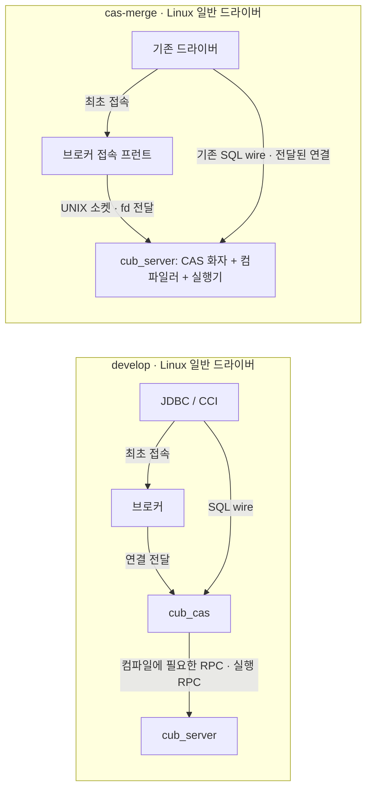

# CAS 통합: develop 대비 변경점과 개발자 논의 자료

> **검토용 초안 · 2026-09-05.** 구현 현황과 이미 확정한 설계를 설명하는 상세 분석 자료다. 운영 호환 정책의 미결 항목을 제품 약속으로 확정하지 않는다.
>
> 작업: [develop 대비 변경점 논의 자료(md) — CUBRID 개발자 대상 '왜 바뀌어야만 하는지·어떤 코드가'](https://github.com/xmilex-git/workspace/issues/217).
> 지도: [CAS 통합 후속 지도: develop 머지 → CI test_shell green → 통합 최적화 브레인스토밍 + 개발자 논의 자료](https://github.com/xmilex-git/workspace/issues/207).
> 코드: [CAS 통합 upstream PR](https://github.com/CUBRID/cubrid/pull/7837).

## 1. 한 장 요약

이 변경은 CAS에서 하던 SQL 컴파일·권한 처리·드라이버 요청 처리를 `cub_server`로 옮긴다. 브로커는 접속을 받아 대상 DB 서버에 연결을 넘기는 프런트로 남는다. Linux의 일반 드라이버 SQL 경로에서 CAS 프로세스와 CAS↔서버 RPC 왕복을 없애는 것이 핵심이다.

브로커·cub_master·cub_server의 **3종 서버 프로세스는 존속**한다. 이는 전체 실행 프로세스가 정확히 세 개라는 뜻이 아니다. DB·브로커 인스턴스 수에 따라 늘고, PL을 사용하면 JVM `cub_pl`, HA에서는 별도 데몬도 남는다. SQL 요청을 브로커가 매번 중계하는 것으로 그려서는 안 된다. 브로커의 주역할은 최초 연결 전달이다.



그림은 데이터 경로만 그린 것이다. 양쪽의 `cub_master`와 관리·HA 경로는 생략했다. Linux의 기존 경로는 드라이버→CAS→서버 2-hop이며, 통합 후 요청 경로는 드라이버→서버 1-hop이다. 서버 내부 컴파일러→실행기는 함수 호출이다.

| 논의 대상 | develop | 통합 후 |
|---|---|---|
| SQL 파스·의미 분석·DDL 권한 처리 | CAS의 client 절반 | 서버 안의 세션 객체 컨텍스트 |
| 드라이버 프로토콜 화자 | CAS 프로세스 | 서버의 driver session |
| 브로커 | CAS 풀에 연결 전달 | DB별 서버로 연결 전달·수용량 관리 |
| PL 내부 SQL 콜백 | 서버 밖 client 절반으로 왕복 | 같은 서버 스레드에서 종단 |
| csql CS | client 라이브러리로 SQL 처리 | CAS V12 전송·서버 렌더 텍스트 |
| 관리·HA RPC | legacy client RPC | 유틸리티 채널로 존속 |
| SQL 처리 결함의 프로세스 격리 | CAS 프로세스 경계 | 서버 장애 범위로 확대 |

일반 드라이버의 기존 wire 메시지를 바꾸지 않는 것이 약속이다. **V12 단일 지원**으로 범위를 좁혔으며, thin csql에는 additive function code가 추가된다. 모든 과거 드라이버 버전과 운영 출력의 완전 호환을 뜻하지 않는다.

## 2. 왜 주소공간을 합치는가

### 2.1 왕복 비용과 컴파일 비용은 따로 봐야 한다

기존 구조에서는 CAS가 SQL의 의미를 해석하는 동안 클래스·권한·트랜잭션 등 서버 정보를 RPC로 요청하고, 실행을 다시 서버에 위임한다. 함수를 호출할 수 있는 같은 주소공간으로 옮기면 이 경계의 수송 비용과 양방향 호출 구조를 없앨 수 있다.

다만 컴파일러 코드를 서버에 넣었다고 파스와 의미 분석 자체가 사라지지는 않는다. 기존 측정은 아래 두 비용을 구분한다.

| 단일 스레드 PK SELECT 측정 | 기록값 | 해석 |
|---|---:|---|
| client library→server, prepared | 약 103µs/문장 | 기존 1-hop 비교점 |
| CCI→CAS→server, prepared | 약 134µs/문장 | 위 비교 대비 약 31µs 증가 |
| 매회 재컴파일 | 약 487µs/문장 | 컴파일 추가 비용 약 380µs |
| hop 상대 증가 | 약 30% | 2-hop이 곧 지연 2배라는 설명은 부정확 |

이 수치는 release·localhost에서 얻은 역사적 기준이다. 380µs를 이번 통합의 절감량으로 계산하거나, 아래 YCSB 처리량 증가와 더해서는 안 된다. statement 재사용은 계속 중요하다. [성능 베이스라인 선측정 — 브로커 경유 현행의 2-hop 비용 정량화](https://github.com/xmilex-git/workspace/issues/125).

### 2.2 권한과 실행 주체가 분리되어 있다

기존 client 절반은 DDL과 권한을 해석하고 서버는 요청된 작업을 수행한다. 통합은 이 해석을 인증된 서버 세션 안으로 옮긴다. 컴파일 시 권한 검사라는 의미론은 유지한다. 매 실행마다 전면적으로 권한을 재검사하는 새 설계는 아니다.

특히 REVOKE 뒤 이미 준비한 핸들이 재컴파일을 건너뛰는 틈은 대상 클래스의 chn을 올려 기존 재prepare 경로에 태운다. GRANT에는 같은 강제 무효화를 추가하지 않는다. [DDL 권한처리 서버 이전 설계](https://github.com/xmilex-git/workspace/issues/118).

### 2.3 PL 내부 SQL이 다시 밖으로 나간다

PL 실행 중 SQL 컴파일·실행을 client 절반에 맡기면 서버에서 시작한 처리가 프로세스 경계를 되돌아간다. client 절반이 서버 안에 있으면 같은 스레드·트랜잭션 문맥으로 처리할 수 있다. JVM 자체를 서버에 집어넣지는 않는다. JVM↔서버 소켓 왕복은 여전히 존재한다. [plcsql/javasp 역접속 제거 설계](https://github.com/xmilex-git/workspace/issues/120).

## 3. 코드 비교 기준과 읽는 방법

본문은 공개 PR의 **`31702ac4a31cd2b1237812d5150a8cff9076d209`**를 기준으로 한다. develop 비교점은 **`e374c7a24c46449c3f79e9413a6f4ff3d23b16c2`**다. 2026-09-05 조회 당시 공개 PR head와 대조했다. 이후 브랜치가 움직여도 이 문서의 설명 범위는 이 커밋 쌍이다.

로컬 `cas-merge` 이름은 공개 PR보다 뒤처져 있었다. 요청된 `git diff origin/develop...cas-merge --stat`만 그대로 쓰면 이전 통합본을 설명하게 된다. 부록에는 실제 비교 명령과 전체 변경 파일 목록을 고정한다.

**변경 파일 목록은 편입 코드 전체 목록과 다르다.** CMake가 기존 client 소스를 SERVER_MODE 타깃에 새로 넣으면 그 파일의 diff가 0이어도 서버의 동작 범위가 달라진다. 따라서 빌드 소스 목록과 함수 내부의 조건부 컴파일을 함께 읽어야 한다.

아래 경로와 심볼은 부록의 고정 커밋 코드 링크에서 찾을 수 있다. 부록은 파일 누락 점검용이고, 본문은 변경의 이유와 리뷰 단위를 설명한다.

## 4. 아키텍처와 핵심 규약

### 4.1 연결 입양과 제어 채널

브로커는 드라이버의 초기 패킷을 비차단으로 살펴 DB 이름을 알아내고, DB별 UNIX 입양 소켓으로 fd를 전달한다. 서버에는 기존 master 연결과 나란히 입양 연결 경로가 생긴다. 지속 제어 채널은 세션 종료 통지·질의 취소·상태 동기화에 쓰인다.

슬롯과 취소 토큰은 실제 CAS PID와 구분해야 한다. 서버가 발급하는 토큰으로 취소 대상을 식별하고 브로커가 대응을 관리한다. 서버의 client 상한과 브로커의 수용량 제한은 모두 남는다. 연결 종료·거절·서버 재시작 시 슬롯 반환과 재동기화가 정확해야 한다.

읽을 코드: `src/connection/adoption.cpp`, `driver_session.cpp`, `src/broker/broker.c`, 관련 헤더. 접속 프런트와 wire dispatch의 경계를 먼저 보고 오류 경로의 fd 소유권을 따라간다. [브로커↔서버 커넥션 핸드오프 설계](https://github.com/xmilex-git/workspace/issues/117).

### 4.2 세션 객체 컨텍스트와 TLS는 역할이 다르다

`client_session_context`는 client 절반의 워크스페이스·스키마·권한·질의 결과·부트 상태를 담는다. 서버 `session_state`의 `csc_p`가 수명의 기준이다. TLS는 지금 실행 중인 스레드가 이 컨텍스트에 접근하는 수단이지, 세션 객체의 영구 소유자가 아니다.

반면 현재 CAS 화자는 입양된 연결당 전담 스레드를 사용한다. 따라서 `CAS_TLS`로 바꾼 CAS 정적 상태는 이 연결-스레드 대응 아래 세션별 상태가 된다. 향후 epoll/워커 풀로 바꿀 때 이 전제를 그대로 둘 수 없다.

| 용어·심볼 | 뜻 | 리뷰에서 피할 혼동 |
|---|---|---|
| 세션 객체 컨텍스트 | 컴파일에 필요한 client 절반 상태 | 전부 서버 전역 캐시로 공유된다는 해석 |
| `csc_activate/deactivate`·브래킷 | 현재 세션 컨텍스트의 실행 범위·직렬화 | 단순 TLS 포인터 설정만으로 보는 것 |
| `db_on_server` | 지금 서버 절반 의미론으로 실행하는지 | 현재 프로세스가 서버인지 판별하는 것 |
| `csc_bracket_is_active()` | 세션 객체 문맥이 활성인지 | 서버 모자에서는 MOP가 절대 없다는 가정 |
| `CAS_TLS` | CAS 화자의 연결 전담 스레드 상태 | 일반 서버 워커에서도 자동 세션 귀속된다는 가정 |
| `CSQL_PARSER_TLS` | 파서·컴파일 임시 상태의 스레드 분리 | 파스 결과의 세션 수명까지 해결한다는 가정 |

동일 서버 스레드가 client 절반과 server 절반을 오간다. 따라서 `#if SERVER_MODE`를 런타임 의미론으로 그대로 읽을 수 없다. 특히 OBJECT/MOP와 OID의 구별에는 현재 모자뿐 아니라 소유권과 브래킷이 필요하다. [client workspace·스키마/locator 캐시의 서버측 세션-스코프 재설계](https://github.com/xmilex-git/workspace/issues/123).

### 4.3 RPC 경계를 함수 경계로 접는다

주요 경계는 `src/communication/network_interface_cl.c`다. `qmgr_prepare_query`, `qmgr_execute_query`, `qmgr_prepare_and_execute_query` 같은 client 진입점이 서버 내부 호출로 이어진다. SA 모드의 직접 호출 경로를 참고하되 SA의 단일 클라이언트·락 생략 가정을 가져와서는 안 된다.

native DB_VALUE 진입에서는 OBJECT를 서버 OID 의미론으로 정규화해야 한다. 결과 첫 페이지 사본의 수명도 보존해야 한다. 수송이 사라졌다고 이전 pack/unpack이 해주던 소유권 분리까지 생략할 수는 없다.

XASL stream은 유지한다. 캐시는 이미 packed stream과 unpack된 실행 클론 풀을 보관한다. prepared 실행이 매번 전체 pack/unpack한다는 설명은 맞지 않는다. 유틸리티 RPC·영속 인덱스 술어·병렬 워커 클론도 stream에 의존한다. [RPC 경계 접기 설계 — cas↔server request의 함수 전환·XASL stream 경로](https://github.com/xmilex-git/workspace/issues/124), [XASL 경로 사실 조사](../research/cas-merge-opt-xasl-no-stream.md).

## 5. 모듈별 변경과 리뷰 초점

### 5.1 빌드와 파서

`cubrid/CMakeLists.txt`의 client 절반 소스 편입과 CAS 화자 소스 편입이 출발점이다. `broker/CMakeLists.txt`는 Linux CAS 실행 파일을 없애고 Windows 경로를 남긴다. 단순 소스 이동 PR로 보기 어려운 이유는 같은 파일이 다른 모드로 컴파일되기 때문이다.

파서의 수기 전역과 bison/flex 생성물 전역을 `CSQL_PARSER_TLS`로 분리한다. 생성물 후처리 CMake는 생성기 버전 변경으로 TLS 전환이 빠지지 않는지도 확인해야 한다. 파서 라벨처럼 세션 수명을 갖는 것은 TLS 임시 상태와 분리한다. `src/parser/csql_parser_tls.h`, grammar/lexer, `src/query/xasl_to_stream.c`가 해당한다. [파서 재진입화 + parse_tree 소유권 정리](https://github.com/xmilex-git/workspace/issues/131).

### 5.2 워크스페이스·객체·메모리

`client_session_context.hpp/.cpp`와 `work_space.c`, `schema_manager.c`, `object_domain.c`, `set_object.c` 등을 함께 읽는다. 워크스페이스를 없앤 것이 아니다. MOP·DDL 쓰기 표현·스키마 표현은 세션별로 유지하고 teardown에서 정리한다.

AREA는 공유하는 기존 동기화 기계 위에 둔다. 전부 per-session AREA로 복제하지 않는다. 서버 private heap과 워크스페이스 할당의 경계도 구별한다. 다른 수명의 힙으로 만든 포인터를 캐시에 남기면 세션 종료 후 UAF가 된다.

CTP에서 실제 발견한 대표 문제는 OBJECT 도메인의 NULL OID끼리 동등 판정해 다른 클래스가 같은 도메인으로 매칭된 경우다. 통합의 검증 단위는 단일 SELECT 성공보다 **서로 다른 세션의 생성·사용·종료 반복**이어야 한다. [MOP/워크스페이스 per-session化](https://github.com/xmilex-git/workspace/issues/133), [medium 잔존 24 NOK — -494 클래스 잔여 + order-by tie C5 판정](https://github.com/xmilex-git/workspace/issues/174).

### 5.3 인증·DDL·파라미터

인증된 서버 세션에 client 권한 컨텍스트를 연결한다. REVOKE는 `sm_touch_class`를 통한 chn 변경으로 prepared 문장의 재검사를 유도한다. 이 과정의 추가 스키마 락 비용은 수용한 설계 비용이다. DROP에서는 디스크 구조 해제 후 권한 경로가 클래스를 재구성하지 않도록 순서가 중요하다.

`src/base/system_parameter.c/.h`에서는 기존 client 전용 파라미터를 서버가 읽고 세션 값에 반영하도록 바뀐다. `PRM_SESSION_READTHROUGH`와 `cas_*` 실행 파라미터가 그 연결점이다. 공유 stub에 세션 값을 덮어쓰는 것은 서버 전역 데이터 레이스가 될 수 있다. 세션 파라미터와 프로세스 전역 설정을 한 규칙으로 설명해서는 안 된다.

[DDL 권한처리 서버 이전 구현](https://github.com/xmilex-git/workspace/issues/135), [create_table_reuseoid 세션 파라미터 CS-wire 미반영](https://github.com/xmilex-git/workspace/issues/159).

### 5.4 CAS 화자·로그·SSL·ACL

`cas_dispatch.c`와 `cas_conn_helpers.c`는 기존 CAS 처리 루프를 서버에서 사용할 수 있게 분리한 축이다. `cas_execute.c`, `cas_handle.c`, `cas_log.c` 등은 서버에서 동시에 여러 세션을 처리하므로 기존 정적 변수의 수명과 동시성 전제가 달라진다.

로그의 생산자는 서버로 이동한다. CAS 로그 포맷을 보존한다는 결정과 기존 per-CAS 파일명·status 행을 보존한다는 결정은 별개다. SSL 종단도 서버로 이동하며 브로커는 암호화된 접속을 라우팅할 정보가 필요하다. IP ACL 프런트와 DB·사용자별 서버 검사를 구분한다.

statement 핸들 풀은 계속 세션별이다. 세션 간 prepared descriptor 공유는 아직 후속 후보다. [CAS 프로토콜 화자 완성](https://github.com/xmilex-git/workspace/issues/139), [prepared statement 공유 사실 조사](../research/cas-merge-opt-shared-prepared-statement.md).

### 5.5 PL/CSQL·JavaSP

`src/communication/network_callback_sr.cpp`의 `xs_callback_send` 경계에서 `method_dispatch`로 같은 스레드 안에서 들어간다. `method_query_handler`와 `method_struct_value`의 값·핸들 소유권도 함께 바뀐다. 핸들 캐시는 워크스페이스가 살아 있는 동안 정리할 수 있도록 client session context에 귀속된다.

wire로 복사하던 객체를 직접 넘기면 alias를 소유 포인터로 오해할 수 있다. 실제 `execute_info::call_info`의 내장 객체 alias를 delete한 결함이 있었고, 소유권 구분으로 고쳤다. 에러 격리·중첩 호출 후 deferred 핸들 정리도 정상 경로와 함께 읽어야 한다.

JVM의 PREPARE·EXECUTE·FETCH 왕복을 합치는 최적화는 이번 구현의 성과가 아니다. [plcsql/javasp in-process 종단 구현](https://github.com/xmilex-git/workspace/issues/136), [PL wire 우회 사실 조사](../research/cas-merge-opt-pl-inprocess-call.md).

### 5.6 csql과 유틸리티 채널

`src/executables/csql_wire.c`와 csql 결과 포매터를 본다. CS 모드에서는 `csql_wire.c`가 CAS V12 프로토콜로 직접 요청을 보내고 서버가 기존 포매터로 텍스트를 만든다. 현재 구현은 CCI API 호출을 사용하지 않는다. 설계 기록의 “CCI 전송 재사용”은 현재 코드의 라이브러리 의존을 설명하는 표현으로 쓰지 않는다. 클라이언트는 표시와 터미널 처리를 담당한다. 로컬 csql은 입양 UNIX 소켓으로 연결해 브로커 없이 사용할 수 있다. 원격 csql은 대상 노드 브로커가 필요하다. `csql -S`는 SA 경로로 남는다.

관리 유틸리티의 `libcubridcs`를 지우거나 별도 라이브러리로 물리 분할한 것은 아니다. boot 등록의 client type 허용목록으로 일반 SQL 경로와 관리·HA 경로를 구별한다. CDC API와 cub_manager의 CI 실패는 이 도달성 계약을 다시 확인해야 한다는 신호다. 로그만으로 단일 근인을 확정하지 않는다.

[csql thin-client화·유틸리티 전용 라이브러리 분리 설계](https://github.com/xmilex-git/workspace/issues/126).

### 5.7 HA·취소·실패 경계

브로커의 ACCESS_MODE를 서버가 client type으로 합성하고 접속 시 HA 상태와 대조한다. 트랜잭션 경계의 reset은 드라이버의 기존 재접속 규약으로 돌려준다. CAS가 수행하던 별도 failover 계층은 사라지고 드라이버 altHosts가 중요해진다.

서버가 없으면 빠르게 retryable 접속 실패를 반환하고, 실행 중 서버 사망은 연결 실패로 드라이버에 드러난다. 접속 허용·읽기 전용·REPLICA/SO·유지보수 상태를 한 가지 정상 master 접속 테스트로 대신할 수 없다. 기존 2-pass 허용의 일부 최종 상태를 포기하는 엄격 단일-pass 정책도 의도된 의미 차이다. [HA 접속 의미론 — ACCESS_MODE 라우팅·standby 거절·altHosts failover의 서버 직결 재배치](https://github.com/xmilex-git/workspace/issues/121).

### 5.8 에러와 크래시의 영향 범위

서버에 컴파일러가 들어오면 컴파일러의 메모리 손상이 서버 전체를 죽일 수 있다. 시그널을 잡아 longjmp로 세션만 살리는 새 격리 계층은 도입하지 않는다. 불변식 위반은 fail-fast를 유지하고, 사용자 입력 오류는 에러 경로로 처리한다. OOM은 문장 에러·필요 시 트랜잭션 abort로 대응한다.

표현식 깊이 가드, 스레드별 sigaltstack, 워크스페이스 abort 경로가 추가됐다. 초기 깊이 한도와 후속 CTP 수정 후 한도는 다르므로 옛 스테이지 기록의 1024를 현재 값으로 인용하지 않는다. 중첩 서브쿼리 전체를 포괄하는 안전 증명도 아니다. [컴파일러 편입 후 에러/크래시 격리 정책](https://github.com/xmilex-git/workspace/issues/128).

### 5.9 회귀 수정과 추가 편입 범위

최종 비교에는 초기 구조 편입 뒤 CTP가 검출한 수정도 포함된다. 이를 TLS 변경의 부수적인 줄 수정으로만 묶으면 리뷰에서 값 규약과 동시성 계약을 놓친다.

| 영역 | 코드 | 바뀐 이유 |
|---|---|---|
| SP·메서드 반환값 | `fetch.c`, `method_invoke_group.cpp` | client MOP 반환을 server OID 의미론으로 정규화 |
| SP 결정성 | `pl_signature.cpp/.hpp` | SERVER_MODE에서도 결정성 정보를 전달·초기화 |
| 병렬 쿼리 종료 | `px_query_executor.cpp` | 내부 sibling 종료가 남긴 PL 세션 interrupt 정리 |
| open system operation | `external_sort.c`, `query_hash_join.c` | 디스패처가 가진 topop과 워커의 대기로 생기는 자기 데드락 방지 |
| 페이지 버퍼·중첩 실행 | `page_buffer.c` 등 | 외부 method 실행이 일시 중단된 문맥 보호 |
| 세션 설정 읽기 | `cas_function.c`·`CAS_SHM_CFG` | 공유 stub의 원시 값 대신 해당 세션 설정 사용 |
| 검증 진입점 | `server_compile_tracer.cpp`·`unit_tests/server_compile/` | 서버 내부 컴파일·실제 드라이버 경로를 반복 검증 |

MERGE 병렬 sort 데드락과 메서드 인자 배열 언더할당처럼 develop 선존으로 판정한 수정도 섞여 있다. 통합 고유 회귀와 상류 공통 결함을 구분해 반입 순서를 논의한다. [MERGE 병렬 group-by sort 자기-데드락](https://github.com/xmilex-git/workspace/issues/164), [ws_decache_all_instances SIGSEGV — sql-fix](https://github.com/xmilex-git/workspace/issues/175).

## 6. 운영 호환: 확정한 원칙과 아직 결정하지 않은 것

다음 표의 '현재 관찰'은 그대로 제품 규격으로 채택했다는 뜻이 아니다. 최종 정책은 [폴드가 바꾼 운영 표면의 호환 정책 결정 — driver_session 표기·broker status·sql_log·thin csql·EXECUTE PRINT·접속 에러코드·SHARD](https://github.com/xmilex-git/workspace/issues/209)에서 정한다. 자료 작성 시 해당 티켓은 열려 있다.

| 표면 | 현재 관찰·구현 방향 | 남은 결정 |
|---|---|---|
| 일반 드라이버 wire | V12 유지, 서버가 CAS 화자 | 다른 드라이버별 회귀 검증 범위 |
| killtran·tranlist·접속 상태 | 프로그램명이 driver_session으로 보임 | 레거시 cub_cas/csql 표기를 보존할지 |
| broker status | CAS 행이 없음 | 세션 행 대체 또는 축소 형식 확정 |
| SQL·slow·DDL 로그 | 서버가 생산, 포맷 보존 방향 | 파일명·경로·per-CAS 기대 TC 정리 |
| broker add/drop/restart·changer | CAS 풀 조작 및 실행 파라미터 변경 거부 | 거부 메시지 또는 cas_* 라우팅 |
| thin csql plan·histogram·메시지 | 무출력·미지원·텍스트 차이 보고 | 복원할 기능과 의도된 비호환 분리 |
| EXECUTE PRINT | client stdout 출력 누락 보고 | 출력 전달 규약 |
| block_ddl/block_nowhere | 미적용 의심 CI 결과 | 제품 수정 범위 |
| 접속 에러 | JDBC/CCI/csql 코드·텍스트 차이 | 레거시 코드 번역 범위 |
| SHARD | 미지원 선언 | 관련 TC 전체 제외 범위 |
| Windows | 별도 CAS/중계 경로 잔류 | Linux 1-hop 성과로 Windows를 대표하지 않음 |
| query replace | 서버에 링크됐지만 초기화되지 않아 inert | 세션 상태·공유 세그먼트·명령/카운터 호환 |
| 원격 thin csql 특권 옵션 | read-only/sysadm/skip-vacuum 로컬 전용 제한 | 전용 타입·메타데이터 확장 여부 |
| cub_manager·CDC 연결 | CI에서 실패·크래시 보고 | 제품 경로 확인과 재현 후 수정 |

query replace는 develop 머지로 새로 들어온 중요한 예다. `query_replace.c`를 서버 타깃에 링크해야 빌드는 되지만 `qr_init`이 실행되지 않아 기능이 활성화되지는 않는다. 활성화하려면 CAS 단일 스레드를 가정한 정적 상태와 `remap_argv`의 세션 분리를 먼저 해결해야 한다. [develop → cas-merge 머지 — 충돌 4파일 해소 + 양 빌드·unit/smoke green + PR 7837 갱신](https://github.com/xmilex-git/workspace/issues/208).

## 7. 검증 결과와 한계

이번 문서 작업에서는 빌드·CTP·벤치마크를 새로 실행하지 않았다. 아래는 이슈의 기존 검증 기록이며 **서로 다른 커밋의 결과를 모은 것**이다.

| 검증 | 대상·기준 | 기록된 결과 | 의미 |
|---|---|---:|---|
| fresh optdebug + release | develop 머지 31702ac4a | 양 빌드 성공 | 최신 비교 커밋 컴파일 검증 |
| server compile unit | 같은 머지 게이트 | 18/18 | 지정 unit 바이너리 결과 |
| in-process smoke | 같은 머지 게이트 | 14/14 | 핵심 경로 회귀 |
| thin/csql/JDBC/gate smoke | 같은 머지 게이트 | 4종 SUCCESS | 전체 CTP를 대체하지 않음 |
| medium CTP | cas-merge 80491597d 시점 게이트 기록 | 975/975 | 머지 전 스위트 결과 |
| SQL CTP | 같은 최종 SQL 게이트 | 17,455/17,457, core 0 | 2건은 baseline 동률 정렬 known-benign으로 수용 |
| HA _22_ha | 선행 최종 게이트 | 25/28 | 잔여 3건 TC 비호환 분류 |
| HA 나머지 버킷 | 후속 티켓 | 14버킷 미완 | HA 전체 green 아님 |
| upstream test_shell | 7117c8a66, CircleCI 151311 | OK 2,704 / NOK 372 / skip 29 | 머지 전 실패 분석 |
| 같은 shell CI | 배정 3,222 | 미실행 105 / core 18 | 타임아웃 노드의 업로드 누락 OK 22건도 별도 존재 |

shell 집계 3,105와 미실행 105의 합이 3,222보다 12 작다고 숫자를 임의 보정하면 안 된다. 원 분석은 timeout 노드의 별도 실행·업로드 누락을 설명하며 배정량과 집계량의 집합 정의가 다르다. 이 자료는 원 기록의 집계를 그대로 싣는다. 전체 결과를 단순 합산해 새로운 통과율을 만들지 않는다.

근거: [머지 게이트 기록](https://github.com/xmilex-git/workspace/issues/208), [medium/sql CTP 재실행 + 잔존 NOK 최종 분류](https://github.com/xmilex-git/workspace/issues/169), [CI 실패 전수 분석](../research/cas-merge-ci-test-shell-7837.md), [HA/shell 잔여 14버킷 통과](https://github.com/xmilex-git/workspace/issues/219).

### 성능: 처리량 개선과 꼬리 지연을 함께 제시

release·100 connections·10M rows·20M operations·C/A 각 1회 기준이다. 기준 측정은 develop 5862371ba, 통합 측정 설치본은 d4c9c4f88이다. 공개 PR 머지 커밋에서 재측정한 결과가 아니다.

| 지표 | 기존 | 통합 | 변화 |
|---|---:|---:|---:|
| YCSB C 처리량, ops/s | 130,686 | 147,013 | +12.5% |
| YCSB A 처리량, ops/s | 27,279 | 29,063 | +6.5% |
| C READ p99, µs | 1,707 | 2,119 | +24.1% |
| A READ p99, µs | 8,071 | 11,279 | +39.7% |
| A UPDATE p99, µs | 29,231 | 23,679 | −19.0% |
| 오류 | 0 | 0 | 양쪽 기록 기준 |

기존 분석은 A의 꼬리 악화를 체크포인트 flush와 foreground 래치 경합, C를 일반 경합 큐잉으로 귀속했다. 단일 스레드 비교에서 통합 경로가 개선된 것도 근거로 삼았다. 이 해석이 지연 수치 악화 자체를 없애지는 않는다. 처리량과 꼬리를 같이 보고하며, 접속 churn·다른 워크로드·다른 동시성으로 일반화하지 않는다. [최종 게이트 YCSB 레그 — cas-merge 최종 tip release 비교](https://github.com/xmilex-git/workspace/issues/177).

## 8. 미결과 추가 최적화의 경계

현재 가장 큰 완료 조건은 CI shell·HA 잔여 검증과 운영 정책이다. shell 분석의 PRODUCT 표시는 로그 기반 1차 분류인 경우가 많다. 코어·PL isolation 대기·CDC 접속 실패를 'TC만 바꾸면 됨'으로 묶지 않는다. 발견 결함은 [CTP/CI 결함 통합 추적 (2기) — 결함 19번부터 단일 티켓](https://github.com/xmilex-git/workspace/issues/210)에 모은다.

추가 최적화는 다음 후보의 **조사 결과**까지 있으며 채택·우선순위 결정은 아직 남는다.

| 후보 | 이미 확인한 사실 | 다음 판단에 필요한 것 |
|---|---|---|
| prepared descriptor 공유 | 핸들은 세션별, xcache는 이미 공유 | 컴파일 비용 분해·키/권한/DDL 무효화 계약 |
| workspace→catalog 직접 읽기 | MOP는 캐시 외에도 DDL·의미 표현 역할 | 누락된 서버 표현·수명·락 계약 |
| XASL stream 제거 | prepared 클론 풀 히트는 unpack 생략 | clone miss 비율·비-prepared 비용·소유권 |
| PL 왕복 감소 | 서버측 재호출은 이미 in-process | JVM PREPARE/EXECUTE/FETCH 병합·프로토콜 변경 |
| TLS·할당·기존 락 비용 | TLS 비용 일부 실측, 기존 락·malloc 비용 관찰 | 효과를 귀속할 별도 측정과 회귀 조건 |

각 조사: [prepared](../research/cas-merge-opt-shared-prepared-statement.md), [workspace](../research/cas-merge-opt-workspace-to-catalog-latch.md), [XASL](../research/cas-merge-opt-xasl-no-stream.md), [PL](../research/cas-merge-opt-pl-inprocess-call.md).

cpp-perf-rules 관점의 재브레인스토밍과 구현은 이 문서가 대신하지 않는다. 후보 구현은 이 지도의 범위 밖이다.

## 9. 리뷰를 위한 PR 분할 제안 — 미확정

리뷰 묶음은 다음 순서가 이해하기 쉽다. 이는 기존 커밋을 그대로 cherry-pick하면 각 PR이 독립 빌드된다는 보장이 아니다. 최종 코드의 교차 의존을 보존하도록 분할을 다시 검증해야 한다.

| 순서 | 리뷰 묶음 | 먼저 합의할 계약 | 필요한 검증 |
|---|---|---|---|
| 1 | 빌드 편입·파서 TLS·컨텍스트 골격 | 상태 소유자와 모드별 컴파일 | 양 빌드·동시 파스 |
| 2 | 워크스페이스·메모리·RPC native seam | MOP/OID·힙·브래킷 수명 | 다중 세션·teardown·오류 경로 |
| 3 | DDL 권한·세션 파라미터·PL | 인증·무효화·중첩 호출 | GRANT/REVOKE·PL caught-error |
| 4 | 연결 입양·CAS 화자·HA·취소 | fd·슬롯·토큰·reset | JDBC/SSL/altHosts·부하 접속 |
| 5 | thin csql·유틸 도달성·운영 표면 | 로컬/원격·지원 명령·로그 | csql·CDC·관리·HA TC |
| 6 | CAS 제거·회귀 수정·최종 게이트 | 제품 비호환과 TC 갱신의 구분 | shell/HA 포함 전체 게이트 |

기존 S0/A1–A8/B1–B5는 구현 경로의 근거로 연결하되, 설명용 묶음과 반입 가능한 PR 단위를 혼동하지 않는다. 선존 엔진 결함의 상류 기여는 독립 재현·수정이 가능한지 별도로 검토한다. [마이그레이션 단계 분할 + 게이트 매핑](https://github.com/xmilex-git/workspace/issues/122).

사용자 검토에서는 이 순서가 동료 개발자 논의에 적합한지, 더 깊이 설명할 모듈이 무엇인지 확인한다. 운영 호환 정책은 담당 티켓의 결정을 기다려 갱신한다.

## 부록 A. 전체 변경 파일과 고정 코드 링크

비교: **231파일, +18,120/−2,614줄**. 아래 링크는 모두 공개 PR의 고정 커밋을 가리킨다. M=수정, A=추가.

```bash
git diff e374c7a24c46449c3f79e9413a6f4ff3d23b16c2...31702ac4a31cd2b1237812d5150a8cff9076d209 --stat
git diff e374c7a24c46449c3f79e9413a6f4ff3d23b16c2...31702ac4a31cd2b1237812d5150a8cff9076d209 --name-status
```

### 루트 빌드 (1)

- M [CMakeLists.txt](https://github.com/xmilex-git/cubrid/blob/31702ac4a31cd2b1237812d5150a8cff9076d209/CMakeLists.txt)

### broker (1)

- M [broker/CMakeLists.txt](https://github.com/xmilex-git/cubrid/blob/31702ac4a31cd2b1237812d5150a8cff9076d209/broker/CMakeLists.txt)

### cmake (1)

- A [cmake/patch_parser_tls.cmake](https://github.com/xmilex-git/cubrid/blob/31702ac4a31cd2b1237812d5150a8cff9076d209/cmake/patch_parser_tls.cmake)

### cs (1)

- M [cs/CMakeLists.txt](https://github.com/xmilex-git/cubrid/blob/31702ac4a31cd2b1237812d5150a8cff9076d209/cs/CMakeLists.txt)

### cubrid (1)

- M [cubrid/CMakeLists.txt](https://github.com/xmilex-git/cubrid/blob/31702ac4a31cd2b1237812d5150a8cff9076d209/cubrid/CMakeLists.txt)

### src/base (18)

- M [src/base/area_alloc.c](https://github.com/xmilex-git/cubrid/blob/31702ac4a31cd2b1237812d5150a8cff9076d209/src/base/area_alloc.c)
- M [src/base/ddl_log.c](https://github.com/xmilex-git/cubrid/blob/31702ac4a31cd2b1237812d5150a8cff9076d209/src/base/ddl_log.c)
- M [src/base/error_context.cpp](https://github.com/xmilex-git/cubrid/blob/31702ac4a31cd2b1237812d5150a8cff9076d209/src/base/error_context.cpp)
- M [src/base/error_context.hpp](https://github.com/xmilex-git/cubrid/blob/31702ac4a31cd2b1237812d5150a8cff9076d209/src/base/error_context.hpp)
- M [src/base/error_manager.c](https://github.com/xmilex-git/cubrid/blob/31702ac4a31cd2b1237812d5150a8cff9076d209/src/base/error_manager.c)
- M [src/base/error_manager.h](https://github.com/xmilex-git/cubrid/blob/31702ac4a31cd2b1237812d5150a8cff9076d209/src/base/error_manager.h)
- M [src/base/intl_support.c](https://github.com/xmilex-git/cubrid/blob/31702ac4a31cd2b1237812d5150a8cff9076d209/src/base/intl_support.c)
- M [src/base/intl_support.h](https://github.com/xmilex-git/cubrid/blob/31702ac4a31cd2b1237812d5150a8cff9076d209/src/base/intl_support.h)
- M [src/base/language_support.c](https://github.com/xmilex-git/cubrid/blob/31702ac4a31cd2b1237812d5150a8cff9076d209/src/base/language_support.c)
- M [src/base/language_support.h](https://github.com/xmilex-git/cubrid/blob/31702ac4a31cd2b1237812d5150a8cff9076d209/src/base/language_support.h)
- M [src/base/memory_alloc.c](https://github.com/xmilex-git/cubrid/blob/31702ac4a31cd2b1237812d5150a8cff9076d209/src/base/memory_alloc.c)
- M [src/base/perf_monitor.c](https://github.com/xmilex-git/cubrid/blob/31702ac4a31cd2b1237812d5150a8cff9076d209/src/base/perf_monitor.c)
- M [src/base/perf_monitor.h](https://github.com/xmilex-git/cubrid/blob/31702ac4a31cd2b1237812d5150a8cff9076d209/src/base/perf_monitor.h)
- M [src/base/system_parameter.c](https://github.com/xmilex-git/cubrid/blob/31702ac4a31cd2b1237812d5150a8cff9076d209/src/base/system_parameter.c)
- M [src/base/system_parameter.h](https://github.com/xmilex-git/cubrid/blob/31702ac4a31cd2b1237812d5150a8cff9076d209/src/base/system_parameter.h)
- M [src/base/unicode_support.c](https://github.com/xmilex-git/cubrid/blob/31702ac4a31cd2b1237812d5150a8cff9076d209/src/base/unicode_support.c)
- M [src/base/unicode_support.h](https://github.com/xmilex-git/cubrid/blob/31702ac4a31cd2b1237812d5150a8cff9076d209/src/base/unicode_support.h)
- M [src/base/xserver_interface.h](https://github.com/xmilex-git/cubrid/blob/31702ac4a31cd2b1237812d5150a8cff9076d209/src/base/xserver_interface.h)

### src/broker (33)

- M [src/broker/broker.c](https://github.com/xmilex-git/cubrid/blob/31702ac4a31cd2b1237812d5150a8cff9076d209/src/broker/broker.c)
- M [src/broker/broker_acl.c](https://github.com/xmilex-git/cubrid/blob/31702ac4a31cd2b1237812d5150a8cff9076d209/src/broker/broker_acl.c)
- M [src/broker/broker_admin_pub.c](https://github.com/xmilex-git/cubrid/blob/31702ac4a31cd2b1237812d5150a8cff9076d209/src/broker/broker_admin_pub.c)
- M [src/broker/broker_config.c](https://github.com/xmilex-git/cubrid/blob/31702ac4a31cd2b1237812d5150a8cff9076d209/src/broker/broker_config.c)
- M [src/broker/broker_config.h](https://github.com/xmilex-git/cubrid/blob/31702ac4a31cd2b1237812d5150a8cff9076d209/src/broker/broker_config.h)
- A [src/broker/broker_direct.cpp](https://github.com/xmilex-git/cubrid/blob/31702ac4a31cd2b1237812d5150a8cff9076d209/src/broker/broker_direct.cpp)
- A [src/broker/broker_direct.h](https://github.com/xmilex-git/cubrid/blob/31702ac4a31cd2b1237812d5150a8cff9076d209/src/broker/broker_direct.h)
- M [src/broker/broker_monitor.c](https://github.com/xmilex-git/cubrid/blob/31702ac4a31cd2b1237812d5150a8cff9076d209/src/broker/broker_monitor.c)
- M [src/broker/broker_shm.h](https://github.com/xmilex-git/cubrid/blob/31702ac4a31cd2b1237812d5150a8cff9076d209/src/broker/broker_shm.h)
- M [src/broker/cas.c](https://github.com/xmilex-git/cubrid/blob/31702ac4a31cd2b1237812d5150a8cff9076d209/src/broker/cas.c)
- M [src/broker/cas_cgw.c](https://github.com/xmilex-git/cubrid/blob/31702ac4a31cd2b1237812d5150a8cff9076d209/src/broker/cas_cgw.c)
- M [src/broker/cas_common_execute.c](https://github.com/xmilex-git/cubrid/blob/31702ac4a31cd2b1237812d5150a8cff9076d209/src/broker/cas_common_execute.c)
- M [src/broker/cas_common_main.c](https://github.com/xmilex-git/cubrid/blob/31702ac4a31cd2b1237812d5150a8cff9076d209/src/broker/cas_common_main.c)
- M [src/broker/cas_common_vars.c](https://github.com/xmilex-git/cubrid/blob/31702ac4a31cd2b1237812d5150a8cff9076d209/src/broker/cas_common_vars.c)
- M [src/broker/cas_common_vars.h](https://github.com/xmilex-git/cubrid/blob/31702ac4a31cd2b1237812d5150a8cff9076d209/src/broker/cas_common_vars.h)
- A [src/broker/cas_conn_helpers.c](https://github.com/xmilex-git/cubrid/blob/31702ac4a31cd2b1237812d5150a8cff9076d209/src/broker/cas_conn_helpers.c)
- A [src/broker/cas_csql.cpp](https://github.com/xmilex-git/cubrid/blob/31702ac4a31cd2b1237812d5150a8cff9076d209/src/broker/cas_csql.cpp)
- M [src/broker/cas_db_inc.h](https://github.com/xmilex-git/cubrid/blob/31702ac4a31cd2b1237812d5150a8cff9076d209/src/broker/cas_db_inc.h)
- A [src/broker/cas_dispatch.c](https://github.com/xmilex-git/cubrid/blob/31702ac4a31cd2b1237812d5150a8cff9076d209/src/broker/cas_dispatch.c)
- A [src/broker/cas_dispatch.h](https://github.com/xmilex-git/cubrid/blob/31702ac4a31cd2b1237812d5150a8cff9076d209/src/broker/cas_dispatch.h)
- M [src/broker/cas_execute.c](https://github.com/xmilex-git/cubrid/blob/31702ac4a31cd2b1237812d5150a8cff9076d209/src/broker/cas_execute.c)
- M [src/broker/cas_execute.h](https://github.com/xmilex-git/cubrid/blob/31702ac4a31cd2b1237812d5150a8cff9076d209/src/broker/cas_execute.h)
- M [src/broker/cas_function.c](https://github.com/xmilex-git/cubrid/blob/31702ac4a31cd2b1237812d5150a8cff9076d209/src/broker/cas_function.c)
- M [src/broker/cas_function.h](https://github.com/xmilex-git/cubrid/blob/31702ac4a31cd2b1237812d5150a8cff9076d209/src/broker/cas_function.h)
- M [src/broker/cas_handle.c](https://github.com/xmilex-git/cubrid/blob/31702ac4a31cd2b1237812d5150a8cff9076d209/src/broker/cas_handle.c)
- M [src/broker/cas_log.c](https://github.com/xmilex-git/cubrid/blob/31702ac4a31cd2b1237812d5150a8cff9076d209/src/broker/cas_log.c)
- M [src/broker/cas_meta.c](https://github.com/xmilex-git/cubrid/blob/31702ac4a31cd2b1237812d5150a8cff9076d209/src/broker/cas_meta.c)
- M [src/broker/cas_network.c](https://github.com/xmilex-git/cubrid/blob/31702ac4a31cd2b1237812d5150a8cff9076d209/src/broker/cas_network.c)
- M [src/broker/cas_optimization.c](https://github.com/xmilex-git/cubrid/blob/31702ac4a31cd2b1237812d5150a8cff9076d209/src/broker/cas_optimization.c)
- M [src/broker/cas_protocol.h](https://github.com/xmilex-git/cubrid/blob/31702ac4a31cd2b1237812d5150a8cff9076d209/src/broker/cas_protocol.h)
- A [src/broker/cas_server_support.cpp](https://github.com/xmilex-git/cubrid/blob/31702ac4a31cd2b1237812d5150a8cff9076d209/src/broker/cas_server_support.cpp)
- M [src/broker/cas_ssl.c](https://github.com/xmilex-git/cubrid/blob/31702ac4a31cd2b1237812d5150a8cff9076d209/src/broker/cas_ssl.c)
- M [src/broker/cas_ssl.h](https://github.com/xmilex-git/cubrid/blob/31702ac4a31cd2b1237812d5150a8cff9076d209/src/broker/cas_ssl.h)

### src/communication (8)

- M [src/communication/network_callback_cl.cpp](https://github.com/xmilex-git/cubrid/blob/31702ac4a31cd2b1237812d5150a8cff9076d209/src/communication/network_callback_cl.cpp)
- M [src/communication/network_callback_sr.cpp](https://github.com/xmilex-git/cubrid/blob/31702ac4a31cd2b1237812d5150a8cff9076d209/src/communication/network_callback_sr.cpp)
- M [src/communication/network_cl.h](https://github.com/xmilex-git/cubrid/blob/31702ac4a31cd2b1237812d5150a8cff9076d209/src/communication/network_cl.h)
- M [src/communication/network_histogram.hpp](https://github.com/xmilex-git/cubrid/blob/31702ac4a31cd2b1237812d5150a8cff9076d209/src/communication/network_histogram.hpp)
- M [src/communication/network_interface_cl.c](https://github.com/xmilex-git/cubrid/blob/31702ac4a31cd2b1237812d5150a8cff9076d209/src/communication/network_interface_cl.c)
- M [src/communication/network_interface_cl.h](https://github.com/xmilex-git/cubrid/blob/31702ac4a31cd2b1237812d5150a8cff9076d209/src/communication/network_interface_cl.h)
- M [src/communication/network_interface_sr.cpp](https://github.com/xmilex-git/cubrid/blob/31702ac4a31cd2b1237812d5150a8cff9076d209/src/communication/network_interface_sr.cpp)
- M [src/communication/network_sr.c](https://github.com/xmilex-git/cubrid/blob/31702ac4a31cd2b1237812d5150a8cff9076d209/src/communication/network_sr.c)

### src/compat (11)

- M [src/compat/db.h](https://github.com/xmilex-git/cubrid/blob/31702ac4a31cd2b1237812d5150a8cff9076d209/src/compat/db.h)
- M [src/compat/db_admin.c](https://github.com/xmilex-git/cubrid/blob/31702ac4a31cd2b1237812d5150a8cff9076d209/src/compat/db_admin.c)
- M [src/compat/db_macro.c](https://github.com/xmilex-git/cubrid/blob/31702ac4a31cd2b1237812d5150a8cff9076d209/src/compat/db_macro.c)
- M [src/compat/db_query.c](https://github.com/xmilex-git/cubrid/blob/31702ac4a31cd2b1237812d5150a8cff9076d209/src/compat/db_query.c)
- M [src/compat/db_query.h](https://github.com/xmilex-git/cubrid/blob/31702ac4a31cd2b1237812d5150a8cff9076d209/src/compat/db_query.h)
- M [src/compat/db_vdb.c](https://github.com/xmilex-git/cubrid/blob/31702ac4a31cd2b1237812d5150a8cff9076d209/src/compat/db_vdb.c)
- M [src/compat/dbi.h](https://github.com/xmilex-git/cubrid/blob/31702ac4a31cd2b1237812d5150a8cff9076d209/src/compat/dbi.h)
- M [src/compat/dbi_compat.h](https://github.com/xmilex-git/cubrid/blob/31702ac4a31cd2b1237812d5150a8cff9076d209/src/compat/dbi_compat.h)
- M [src/compat/dbtype_def.h](https://github.com/xmilex-git/cubrid/blob/31702ac4a31cd2b1237812d5150a8cff9076d209/src/compat/dbtype_def.h)
- M [src/compat/dbtype_function.c](https://github.com/xmilex-git/cubrid/blob/31702ac4a31cd2b1237812d5150a8cff9076d209/src/compat/dbtype_function.c)
- M [src/compat/dbtype_function.h](https://github.com/xmilex-git/cubrid/blob/31702ac4a31cd2b1237812d5150a8cff9076d209/src/compat/dbtype_function.h)

### src/connection (10)

- A [src/connection/adoption.cpp](https://github.com/xmilex-git/cubrid/blob/31702ac4a31cd2b1237812d5150a8cff9076d209/src/connection/adoption.cpp)
- A [src/connection/adoption.hpp](https://github.com/xmilex-git/cubrid/blob/31702ac4a31cd2b1237812d5150a8cff9076d209/src/connection/adoption.hpp)
- M [src/connection/connection_cl.cpp](https://github.com/xmilex-git/cubrid/blob/31702ac4a31cd2b1237812d5150a8cff9076d209/src/connection/connection_cl.cpp)
- M [src/connection/connection_cl.h](https://github.com/xmilex-git/cubrid/blob/31702ac4a31cd2b1237812d5150a8cff9076d209/src/connection/connection_cl.h)
- M [src/connection/connection_defs.h](https://github.com/xmilex-git/cubrid/blob/31702ac4a31cd2b1237812d5150a8cff9076d209/src/connection/connection_defs.h)
- M [src/connection/connection_less.cpp](https://github.com/xmilex-git/cubrid/blob/31702ac4a31cd2b1237812d5150a8cff9076d209/src/connection/connection_less.cpp)
- A [src/connection/driver_session.cpp](https://github.com/xmilex-git/cubrid/blob/31702ac4a31cd2b1237812d5150a8cff9076d209/src/connection/driver_session.cpp)
- A [src/connection/driver_session.hpp](https://github.com/xmilex-git/cubrid/blob/31702ac4a31cd2b1237812d5150a8cff9076d209/src/connection/driver_session.hpp)
- M [src/connection/server_support.c](https://github.com/xmilex-git/cubrid/blob/31702ac4a31cd2b1237812d5150a8cff9076d209/src/connection/server_support.c)
- M [src/connection/server_support.h](https://github.com/xmilex-git/cubrid/blob/31702ac4a31cd2b1237812d5150a8cff9076d209/src/connection/server_support.h)

### src/executables (9)

- M [src/executables/csql.c](https://github.com/xmilex-git/cubrid/blob/31702ac4a31cd2b1237812d5150a8cff9076d209/src/executables/csql.c)
- M [src/executables/csql.h](https://github.com/xmilex-git/cubrid/blob/31702ac4a31cd2b1237812d5150a8cff9076d209/src/executables/csql.h)
- M [src/executables/csql_result.c](https://github.com/xmilex-git/cubrid/blob/31702ac4a31cd2b1237812d5150a8cff9076d209/src/executables/csql_result.c)
- M [src/executables/csql_result_format.c](https://github.com/xmilex-git/cubrid/blob/31702ac4a31cd2b1237812d5150a8cff9076d209/src/executables/csql_result_format.c)
- M [src/executables/csql_session.c](https://github.com/xmilex-git/cubrid/blob/31702ac4a31cd2b1237812d5150a8cff9076d209/src/executables/csql_session.c)
- M [src/executables/csql_support.c](https://github.com/xmilex-git/cubrid/blob/31702ac4a31cd2b1237812d5150a8cff9076d209/src/executables/csql_support.c)
- A [src/executables/csql_wire.c](https://github.com/xmilex-git/cubrid/blob/31702ac4a31cd2b1237812d5150a8cff9076d209/src/executables/csql_wire.c)
- A [src/executables/csql_wire.h](https://github.com/xmilex-git/cubrid/blob/31702ac4a31cd2b1237812d5150a8cff9076d209/src/executables/csql_wire.h)
- M [src/executables/server.c](https://github.com/xmilex-git/cubrid/blob/31702ac4a31cd2b1237812d5150a8cff9076d209/src/executables/server.c)

### src/method (12)

- M [src/method/method_callback.cpp](https://github.com/xmilex-git/cubrid/blob/31702ac4a31cd2b1237812d5150a8cff9076d209/src/method/method_callback.cpp)
- M [src/method/method_callback.hpp](https://github.com/xmilex-git/cubrid/blob/31702ac4a31cd2b1237812d5150a8cff9076d209/src/method/method_callback.hpp)
- M [src/method/method_oid_handler.hpp](https://github.com/xmilex-git/cubrid/blob/31702ac4a31cd2b1237812d5150a8cff9076d209/src/method/method_oid_handler.hpp)
- M [src/method/method_query_handler.hpp](https://github.com/xmilex-git/cubrid/blob/31702ac4a31cd2b1237812d5150a8cff9076d209/src/method/method_query_handler.hpp)
- M [src/method/method_query_result.hpp](https://github.com/xmilex-git/cubrid/blob/31702ac4a31cd2b1237812d5150a8cff9076d209/src/method/method_query_result.hpp)
- M [src/method/method_query_util.cpp](https://github.com/xmilex-git/cubrid/blob/31702ac4a31cd2b1237812d5150a8cff9076d209/src/method/method_query_util.cpp)
- M [src/method/method_query_util.hpp](https://github.com/xmilex-git/cubrid/blob/31702ac4a31cd2b1237812d5150a8cff9076d209/src/method/method_query_util.hpp)
- M [src/method/method_schema_info.hpp](https://github.com/xmilex-git/cubrid/blob/31702ac4a31cd2b1237812d5150a8cff9076d209/src/method/method_schema_info.hpp)
- M [src/method/method_struct_query.cpp](https://github.com/xmilex-git/cubrid/blob/31702ac4a31cd2b1237812d5150a8cff9076d209/src/method/method_struct_query.cpp)
- M [src/method/method_struct_query.hpp](https://github.com/xmilex-git/cubrid/blob/31702ac4a31cd2b1237812d5150a8cff9076d209/src/method/method_struct_query.hpp)
- M [src/method/method_struct_value.cpp](https://github.com/xmilex-git/cubrid/blob/31702ac4a31cd2b1237812d5150a8cff9076d209/src/method/method_struct_value.cpp)
- M [src/method/query_method.cpp](https://github.com/xmilex-git/cubrid/blob/31702ac4a31cd2b1237812d5150a8cff9076d209/src/method/query_method.cpp)

### src/object (39)

- M [src/object/authenticate.c](https://github.com/xmilex-git/cubrid/blob/31702ac4a31cd2b1237812d5150a8cff9076d209/src/object/authenticate.c)
- M [src/object/authenticate.h](https://github.com/xmilex-git/cubrid/blob/31702ac4a31cd2b1237812d5150a8cff9076d209/src/object/authenticate.h)
- M [src/object/authenticate_cache.cpp](https://github.com/xmilex-git/cubrid/blob/31702ac4a31cd2b1237812d5150a8cff9076d209/src/object/authenticate_cache.cpp)
- M [src/object/authenticate_grant.cpp](https://github.com/xmilex-git/cubrid/blob/31702ac4a31cd2b1237812d5150a8cff9076d209/src/object/authenticate_grant.cpp)
- M [src/object/class_description.hpp](https://github.com/xmilex-git/cubrid/blob/31702ac4a31cd2b1237812d5150a8cff9076d209/src/object/class_description.hpp)
- M [src/object/class_object.c](https://github.com/xmilex-git/cubrid/blob/31702ac4a31cd2b1237812d5150a8cff9076d209/src/object/class_object.c)
- M [src/object/class_object.h](https://github.com/xmilex-git/cubrid/blob/31702ac4a31cd2b1237812d5150a8cff9076d209/src/object/class_object.h)
- A [src/object/client_session_context.cpp](https://github.com/xmilex-git/cubrid/blob/31702ac4a31cd2b1237812d5150a8cff9076d209/src/object/client_session_context.cpp)
- A [src/object/client_session_context.hpp](https://github.com/xmilex-git/cubrid/blob/31702ac4a31cd2b1237812d5150a8cff9076d209/src/object/client_session_context.hpp)
- M [src/object/deduplicate_key.c](https://github.com/xmilex-git/cubrid/blob/31702ac4a31cd2b1237812d5150a8cff9076d209/src/object/deduplicate_key.c)
- M [src/object/deduplicate_key.h](https://github.com/xmilex-git/cubrid/blob/31702ac4a31cd2b1237812d5150a8cff9076d209/src/object/deduplicate_key.h)
- M [src/object/msgcat_help.hpp](https://github.com/xmilex-git/cubrid/blob/31702ac4a31cd2b1237812d5150a8cff9076d209/src/object/msgcat_help.hpp)
- M [src/object/object_accessor.c](https://github.com/xmilex-git/cubrid/blob/31702ac4a31cd2b1237812d5150a8cff9076d209/src/object/object_accessor.c)
- M [src/object/object_accessor.h](https://github.com/xmilex-git/cubrid/blob/31702ac4a31cd2b1237812d5150a8cff9076d209/src/object/object_accessor.h)
- M [src/object/object_description.hpp](https://github.com/xmilex-git/cubrid/blob/31702ac4a31cd2b1237812d5150a8cff9076d209/src/object/object_description.hpp)
- M [src/object/object_domain.c](https://github.com/xmilex-git/cubrid/blob/31702ac4a31cd2b1237812d5150a8cff9076d209/src/object/object_domain.c)
- M [src/object/object_domain.h](https://github.com/xmilex-git/cubrid/blob/31702ac4a31cd2b1237812d5150a8cff9076d209/src/object/object_domain.h)
- M [src/object/object_fetch.h](https://github.com/xmilex-git/cubrid/blob/31702ac4a31cd2b1237812d5150a8cff9076d209/src/object/object_fetch.h)
- M [src/object/object_primitive.c](https://github.com/xmilex-git/cubrid/blob/31702ac4a31cd2b1237812d5150a8cff9076d209/src/object/object_primitive.c)
- M [src/object/object_print.h](https://github.com/xmilex-git/cubrid/blob/31702ac4a31cd2b1237812d5150a8cff9076d209/src/object/object_print.h)
- M [src/object/object_print_util.hpp](https://github.com/xmilex-git/cubrid/blob/31702ac4a31cd2b1237812d5150a8cff9076d209/src/object/object_print_util.hpp)
- M [src/object/object_printer.cpp](https://github.com/xmilex-git/cubrid/blob/31702ac4a31cd2b1237812d5150a8cff9076d209/src/object/object_printer.cpp)
- M [src/object/object_printer.hpp](https://github.com/xmilex-git/cubrid/blob/31702ac4a31cd2b1237812d5150a8cff9076d209/src/object/object_printer.hpp)
- M [src/object/object_template.c](https://github.com/xmilex-git/cubrid/blob/31702ac4a31cd2b1237812d5150a8cff9076d209/src/object/object_template.c)
- M [src/object/object_template.h](https://github.com/xmilex-git/cubrid/blob/31702ac4a31cd2b1237812d5150a8cff9076d209/src/object/object_template.h)
- M [src/object/quick_fit.c](https://github.com/xmilex-git/cubrid/blob/31702ac4a31cd2b1237812d5150a8cff9076d209/src/object/quick_fit.c)
- M [src/object/schema_manager.c](https://github.com/xmilex-git/cubrid/blob/31702ac4a31cd2b1237812d5150a8cff9076d209/src/object/schema_manager.c)
- M [src/object/schema_manager.h](https://github.com/xmilex-git/cubrid/blob/31702ac4a31cd2b1237812d5150a8cff9076d209/src/object/schema_manager.h)
- M [src/object/schema_template.h](https://github.com/xmilex-git/cubrid/blob/31702ac4a31cd2b1237812d5150a8cff9076d209/src/object/schema_template.h)
- M [src/object/set_object.c](https://github.com/xmilex-git/cubrid/blob/31702ac4a31cd2b1237812d5150a8cff9076d209/src/object/set_object.c)
- M [src/object/set_object.h](https://github.com/xmilex-git/cubrid/blob/31702ac4a31cd2b1237812d5150a8cff9076d209/src/object/set_object.h)
- M [src/object/transform_cl.h](https://github.com/xmilex-git/cubrid/blob/31702ac4a31cd2b1237812d5150a8cff9076d209/src/object/transform_cl.h)
- M [src/object/trigger_description.cpp](https://github.com/xmilex-git/cubrid/blob/31702ac4a31cd2b1237812d5150a8cff9076d209/src/object/trigger_description.cpp)
- M [src/object/trigger_description.hpp](https://github.com/xmilex-git/cubrid/blob/31702ac4a31cd2b1237812d5150a8cff9076d209/src/object/trigger_description.hpp)
- M [src/object/trigger_manager.c](https://github.com/xmilex-git/cubrid/blob/31702ac4a31cd2b1237812d5150a8cff9076d209/src/object/trigger_manager.c)
- M [src/object/trigger_manager.h](https://github.com/xmilex-git/cubrid/blob/31702ac4a31cd2b1237812d5150a8cff9076d209/src/object/trigger_manager.h)
- M [src/object/virtual_object.h](https://github.com/xmilex-git/cubrid/blob/31702ac4a31cd2b1237812d5150a8cff9076d209/src/object/virtual_object.h)
- M [src/object/work_space.c](https://github.com/xmilex-git/cubrid/blob/31702ac4a31cd2b1237812d5150a8cff9076d209/src/object/work_space.c)
- M [src/object/work_space.h](https://github.com/xmilex-git/cubrid/blob/31702ac4a31cd2b1237812d5150a8cff9076d209/src/object/work_space.h)

### src/optimizer (5)

- M [src/optimizer/optimizer.h](https://github.com/xmilex-git/cubrid/blob/31702ac4a31cd2b1237812d5150a8cff9076d209/src/optimizer/optimizer.h)
- M [src/optimizer/query_graph.c](https://github.com/xmilex-git/cubrid/blob/31702ac4a31cd2b1237812d5150a8cff9076d209/src/optimizer/query_graph.c)
- M [src/optimizer/query_graph.h](https://github.com/xmilex-git/cubrid/blob/31702ac4a31cd2b1237812d5150a8cff9076d209/src/optimizer/query_graph.h)
- M [src/optimizer/query_planner.c](https://github.com/xmilex-git/cubrid/blob/31702ac4a31cd2b1237812d5150a8cff9076d209/src/optimizer/query_planner.c)
- M [src/optimizer/query_planner.h](https://github.com/xmilex-git/cubrid/blob/31702ac4a31cd2b1237812d5150a8cff9076d209/src/optimizer/query_planner.h)

### src/parser (22)

- M [src/parser/csql_grammar.y](https://github.com/xmilex-git/cubrid/blob/31702ac4a31cd2b1237812d5150a8cff9076d209/src/parser/csql_grammar.y)
- M [src/parser/csql_grammar_scan.h](https://github.com/xmilex-git/cubrid/blob/31702ac4a31cd2b1237812d5150a8cff9076d209/src/parser/csql_grammar_scan.h)
- M [src/parser/csql_lexer.l](https://github.com/xmilex-git/cubrid/blob/31702ac4a31cd2b1237812d5150a8cff9076d209/src/parser/csql_lexer.l)
- A [src/parser/csql_parser_tls.h](https://github.com/xmilex-git/cubrid/blob/31702ac4a31cd2b1237812d5150a8cff9076d209/src/parser/csql_parser_tls.h)
- M [src/parser/double_byte_support.c](https://github.com/xmilex-git/cubrid/blob/31702ac4a31cd2b1237812d5150a8cff9076d209/src/parser/double_byte_support.c)
- M [src/parser/keyword.c](https://github.com/xmilex-git/cubrid/blob/31702ac4a31cd2b1237812d5150a8cff9076d209/src/parser/keyword.c)
- M [src/parser/method_transform.c](https://github.com/xmilex-git/cubrid/blob/31702ac4a31cd2b1237812d5150a8cff9076d209/src/parser/method_transform.c)
- M [src/parser/name_resolution.c](https://github.com/xmilex-git/cubrid/blob/31702ac4a31cd2b1237812d5150a8cff9076d209/src/parser/name_resolution.c)
- M [src/parser/parse_evaluate.c](https://github.com/xmilex-git/cubrid/blob/31702ac4a31cd2b1237812d5150a8cff9076d209/src/parser/parse_evaluate.c)
- M [src/parser/parse_tree.c](https://github.com/xmilex-git/cubrid/blob/31702ac4a31cd2b1237812d5150a8cff9076d209/src/parser/parse_tree.c)
- M [src/parser/parse_tree.h](https://github.com/xmilex-git/cubrid/blob/31702ac4a31cd2b1237812d5150a8cff9076d209/src/parser/parse_tree.h)
- M [src/parser/parse_tree_cl.c](https://github.com/xmilex-git/cubrid/blob/31702ac4a31cd2b1237812d5150a8cff9076d209/src/parser/parse_tree_cl.c)
- M [src/parser/parser.h](https://github.com/xmilex-git/cubrid/blob/31702ac4a31cd2b1237812d5150a8cff9076d209/src/parser/parser.h)
- M [src/parser/parser_support.c](https://github.com/xmilex-git/cubrid/blob/31702ac4a31cd2b1237812d5150a8cff9076d209/src/parser/parser_support.c)
- M [src/parser/parser_support.h](https://github.com/xmilex-git/cubrid/blob/31702ac4a31cd2b1237812d5150a8cff9076d209/src/parser/parser_support.h)
- M [src/parser/scanner_support.c](https://github.com/xmilex-git/cubrid/blob/31702ac4a31cd2b1237812d5150a8cff9076d209/src/parser/scanner_support.c)
- M [src/parser/show_meta.c](https://github.com/xmilex-git/cubrid/blob/31702ac4a31cd2b1237812d5150a8cff9076d209/src/parser/show_meta.c)
- M [src/parser/show_meta.h](https://github.com/xmilex-git/cubrid/blob/31702ac4a31cd2b1237812d5150a8cff9076d209/src/parser/show_meta.h)
- M [src/parser/view_transform.c](https://github.com/xmilex-git/cubrid/blob/31702ac4a31cd2b1237812d5150a8cff9076d209/src/parser/view_transform.c)
- M [src/parser/xasl_generation.c](https://github.com/xmilex-git/cubrid/blob/31702ac4a31cd2b1237812d5150a8cff9076d209/src/parser/xasl_generation.c)
- M [src/parser/xasl_generation.h](https://github.com/xmilex-git/cubrid/blob/31702ac4a31cd2b1237812d5150a8cff9076d209/src/parser/xasl_generation.h)
- M [src/parser/xasl_regu_alloc.hpp](https://github.com/xmilex-git/cubrid/blob/31702ac4a31cd2b1237812d5150a8cff9076d209/src/parser/xasl_regu_alloc.hpp)

### src/query (19)

- M [src/query/cursor.c](https://github.com/xmilex-git/cubrid/blob/31702ac4a31cd2b1237812d5150a8cff9076d209/src/query/cursor.c)
- M [src/query/execute_schema.c](https://github.com/xmilex-git/cubrid/blob/31702ac4a31cd2b1237812d5150a8cff9076d209/src/query/execute_schema.c)
- M [src/query/execute_schema.h](https://github.com/xmilex-git/cubrid/blob/31702ac4a31cd2b1237812d5150a8cff9076d209/src/query/execute_schema.h)
- M [src/query/execute_statement.c](https://github.com/xmilex-git/cubrid/blob/31702ac4a31cd2b1237812d5150a8cff9076d209/src/query/execute_statement.c)
- M [src/query/execute_statement.h](https://github.com/xmilex-git/cubrid/blob/31702ac4a31cd2b1237812d5150a8cff9076d209/src/query/execute_statement.h)
- M [src/query/fetch.c](https://github.com/xmilex-git/cubrid/blob/31702ac4a31cd2b1237812d5150a8cff9076d209/src/query/fetch.c)
- M [src/query/parallel/px_query_execute/px_query_executor.cpp](https://github.com/xmilex-git/cubrid/blob/31702ac4a31cd2b1237812d5150a8cff9076d209/src/query/parallel/px_query_execute/px_query_executor.cpp)
- M [src/query/parallel/px_scan/px_scan_instnum.cpp](https://github.com/xmilex-git/cubrid/blob/31702ac4a31cd2b1237812d5150a8cff9076d209/src/query/parallel/px_scan/px_scan_instnum.cpp)
- M [src/query/parallel/px_scan/px_scan_instnum.hpp](https://github.com/xmilex-git/cubrid/blob/31702ac4a31cd2b1237812d5150a8cff9076d209/src/query/parallel/px_scan/px_scan_instnum.hpp)
- M [src/query/query_cl.h](https://github.com/xmilex-git/cubrid/blob/31702ac4a31cd2b1237812d5150a8cff9076d209/src/query/query_cl.h)
- M [src/query/query_executor.c](https://github.com/xmilex-git/cubrid/blob/31702ac4a31cd2b1237812d5150a8cff9076d209/src/query/query_executor.c)
- M [src/query/query_hash_join.c](https://github.com/xmilex-git/cubrid/blob/31702ac4a31cd2b1237812d5150a8cff9076d209/src/query/query_hash_join.c)
- M [src/query/query_manager.c](https://github.com/xmilex-git/cubrid/blob/31702ac4a31cd2b1237812d5150a8cff9076d209/src/query/query_manager.c)
- M [src/query/show_scan.c](https://github.com/xmilex-git/cubrid/blob/31702ac4a31cd2b1237812d5150a8cff9076d209/src/query/show_scan.c)
- M [src/query/string_opfunc.c](https://github.com/xmilex-git/cubrid/blob/31702ac4a31cd2b1237812d5150a8cff9076d209/src/query/string_opfunc.c)
- M [src/query/string_opfunc.h](https://github.com/xmilex-git/cubrid/blob/31702ac4a31cd2b1237812d5150a8cff9076d209/src/query/string_opfunc.h)
- M [src/query/xasl.h](https://github.com/xmilex-git/cubrid/blob/31702ac4a31cd2b1237812d5150a8cff9076d209/src/query/xasl.h)
- M [src/query/xasl_to_stream.c](https://github.com/xmilex-git/cubrid/blob/31702ac4a31cd2b1237812d5150a8cff9076d209/src/query/xasl_to_stream.c)
- M [src/query/xasl_to_stream.h](https://github.com/xmilex-git/cubrid/blob/31702ac4a31cd2b1237812d5150a8cff9076d209/src/query/xasl_to_stream.h)

### src/session (3)

- M [src/session/session.c](https://github.com/xmilex-git/cubrid/blob/31702ac4a31cd2b1237812d5150a8cff9076d209/src/session/session.c)
- M [src/session/session.h](https://github.com/xmilex-git/cubrid/blob/31702ac4a31cd2b1237812d5150a8cff9076d209/src/session/session.h)
- M [src/session/session_sr.c](https://github.com/xmilex-git/cubrid/blob/31702ac4a31cd2b1237812d5150a8cff9076d209/src/session/session_sr.c)

### src/sp (7)

- M [src/sp/jsp_cl.cpp](https://github.com/xmilex-git/cubrid/blob/31702ac4a31cd2b1237812d5150a8cff9076d209/src/sp/jsp_cl.cpp)
- M [src/sp/jsp_cl.h](https://github.com/xmilex-git/cubrid/blob/31702ac4a31cd2b1237812d5150a8cff9076d209/src/sp/jsp_cl.h)
- M [src/sp/method_invoke_group.cpp](https://github.com/xmilex-git/cubrid/blob/31702ac4a31cd2b1237812d5150a8cff9076d209/src/sp/method_invoke_group.cpp)
- M [src/sp/method_invoke_group.hpp](https://github.com/xmilex-git/cubrid/blob/31702ac4a31cd2b1237812d5150a8cff9076d209/src/sp/method_invoke_group.hpp)
- M [src/sp/pl_session.cpp](https://github.com/xmilex-git/cubrid/blob/31702ac4a31cd2b1237812d5150a8cff9076d209/src/sp/pl_session.cpp)
- M [src/sp/pl_signature.cpp](https://github.com/xmilex-git/cubrid/blob/31702ac4a31cd2b1237812d5150a8cff9076d209/src/sp/pl_signature.cpp)
- M [src/sp/pl_signature.hpp](https://github.com/xmilex-git/cubrid/blob/31702ac4a31cd2b1237812d5150a8cff9076d209/src/sp/pl_signature.hpp)

### src/storage (5)

- M [src/storage/external_sort.c](https://github.com/xmilex-git/cubrid/blob/31702ac4a31cd2b1237812d5150a8cff9076d209/src/storage/external_sort.c)
- M [src/storage/oid.h](https://github.com/xmilex-git/cubrid/blob/31702ac4a31cd2b1237812d5150a8cff9076d209/src/storage/oid.h)
- M [src/storage/page_buffer.c](https://github.com/xmilex-git/cubrid/blob/31702ac4a31cd2b1237812d5150a8cff9076d209/src/storage/page_buffer.c)
- M [src/storage/statistics.h](https://github.com/xmilex-git/cubrid/blob/31702ac4a31cd2b1237812d5150a8cff9076d209/src/storage/statistics.h)
- M [src/storage/storage_common.h](https://github.com/xmilex-git/cubrid/blob/31702ac4a31cd2b1237812d5150a8cff9076d209/src/storage/storage_common.h)

### src/thread (1)

- M [src/thread/thread_entry.cpp](https://github.com/xmilex-git/cubrid/blob/31702ac4a31cd2b1237812d5150a8cff9076d209/src/thread/thread_entry.cpp)

### src/transaction (10)

- M [src/transaction/boot.h](https://github.com/xmilex-git/cubrid/blob/31702ac4a31cd2b1237812d5150a8cff9076d209/src/transaction/boot.h)
- M [src/transaction/boot_cl.c](https://github.com/xmilex-git/cubrid/blob/31702ac4a31cd2b1237812d5150a8cff9076d209/src/transaction/boot_cl.c)
- M [src/transaction/locator_cl.c](https://github.com/xmilex-git/cubrid/blob/31702ac4a31cd2b1237812d5150a8cff9076d209/src/transaction/locator_cl.c)
- M [src/transaction/locator_cl.h](https://github.com/xmilex-git/cubrid/blob/31702ac4a31cd2b1237812d5150a8cff9076d209/src/transaction/locator_cl.h)
- M [src/transaction/log_comm.h](https://github.com/xmilex-git/cubrid/blob/31702ac4a31cd2b1237812d5150a8cff9076d209/src/transaction/log_comm.h)
- M [src/transaction/log_tran_table.c](https://github.com/xmilex-git/cubrid/blob/31702ac4a31cd2b1237812d5150a8cff9076d209/src/transaction/log_tran_table.c)
- A [src/transaction/server_compile_tracer.cpp](https://github.com/xmilex-git/cubrid/blob/31702ac4a31cd2b1237812d5150a8cff9076d209/src/transaction/server_compile_tracer.cpp)
- A [src/transaction/server_compile_tracer.hpp](https://github.com/xmilex-git/cubrid/blob/31702ac4a31cd2b1237812d5150a8cff9076d209/src/transaction/server_compile_tracer.hpp)
- M [src/transaction/transaction_cl.c](https://github.com/xmilex-git/cubrid/blob/31702ac4a31cd2b1237812d5150a8cff9076d209/src/transaction/transaction_cl.c)
- M [src/transaction/transaction_cl.h](https://github.com/xmilex-git/cubrid/blob/31702ac4a31cd2b1237812d5150a8cff9076d209/src/transaction/transaction_cl.h)

### unit_tests (14)

- M [unit_tests/CMakeLists.txt](https://github.com/xmilex-git/cubrid/blob/31702ac4a31cd2b1237812d5150a8cff9076d209/unit_tests/CMakeLists.txt)
- A [unit_tests/server_compile/B1JdbcSmoke.java](https://github.com/xmilex-git/cubrid/blob/31702ac4a31cd2b1237812d5150a8cff9076d209/unit_tests/server_compile/B1JdbcSmoke.java)
- A [unit_tests/server_compile/CMakeLists.txt](https://github.com/xmilex-git/cubrid/blob/31702ac4a31cd2b1237812d5150a8cff9076d209/unit_tests/server_compile/CMakeLists.txt)
- A [unit_tests/server_compile/csql.access](https://github.com/xmilex-git/cubrid/blob/31702ac4a31cd2b1237812d5150a8cff9076d209/unit_tests/server_compile/csql.access)
- A [unit_tests/server_compile/probe_csql.py](https://github.com/xmilex-git/cubrid/blob/31702ac4a31cd2b1237812d5150a8cff9076d209/unit_tests/server_compile/probe_csql.py)
- A [unit_tests/server_compile/probe_direct.py](https://github.com/xmilex-git/cubrid/blob/31702ac4a31cd2b1237812d5150a8cff9076d209/unit_tests/server_compile/probe_direct.py)
- A [unit_tests/server_compile/probe_direct_connect.py](https://github.com/xmilex-git/cubrid/blob/31702ac4a31cd2b1237812d5150a8cff9076d209/unit_tests/server_compile/probe_direct_connect.py)
- A [unit_tests/server_compile/smoke.sh](https://github.com/xmilex-git/cubrid/blob/31702ac4a31cd2b1237812d5150a8cff9076d209/unit_tests/server_compile/smoke.sh)
- A [unit_tests/server_compile/smoke_csql.sh](https://github.com/xmilex-git/cubrid/blob/31702ac4a31cd2b1237812d5150a8cff9076d209/unit_tests/server_compile/smoke_csql.sh)
- A [unit_tests/server_compile/smoke_direct.sh](https://github.com/xmilex-git/cubrid/blob/31702ac4a31cd2b1237812d5150a8cff9076d209/unit_tests/server_compile/smoke_direct.sh)
- A [unit_tests/server_compile/smoke_gate.sh](https://github.com/xmilex-git/cubrid/blob/31702ac4a31cd2b1237812d5150a8cff9076d209/unit_tests/server_compile/smoke_gate.sh)
- A [unit_tests/server_compile/smoke_jdbc.sh](https://github.com/xmilex-git/cubrid/blob/31702ac4a31cd2b1237812d5150a8cff9076d209/unit_tests/server_compile/smoke_jdbc.sh)
- A [unit_tests/server_compile/smoke_thin.sh](https://github.com/xmilex-git/cubrid/blob/31702ac4a31cd2b1237812d5150a8cff9076d209/unit_tests/server_compile/smoke_thin.sh)
- A [unit_tests/server_compile/test_main.cpp](https://github.com/xmilex-git/cubrid/blob/31702ac4a31cd2b1237812d5150a8cff9076d209/unit_tests/server_compile/test_main.cpp)
