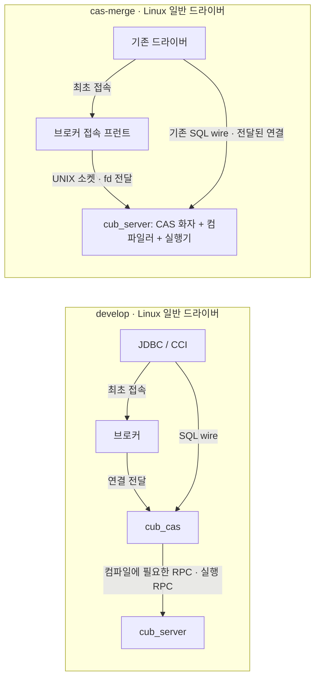

# CAS 통합: 구조 변경의 이유와 대가

> **사용자 검토 중 · 2026-09-05.** 본문은 구조 변경을 논의하기 위한 설명이다. 주요 코드를 리뷰하려면 [코드 해설](develop-vs-cas-merge-code-walkthrough.md), 운영 정책·검증 수치·전체 변경 파일은 [부록](develop-vs-cas-merge-appendices.md)을 읽는다.
>
> 비교 코드: 공개 PR [CAS 통합](https://github.com/CUBRID/cubrid/pull/7837)의 31702ac4a와 develop e374c7a24. 문서 검토 작업: [develop 대비 변경점 논의 자료(md) — CUBRID 개발자 대상 '왜 바뀌어야만 하는지·어떤 코드가'](https://github.com/xmilex-git/workspace/issues/217).

## 1. 한 장 요약

이 변경은 CAS에서 하던 SQL 컴파일·권한 처리·드라이버 요청 처리를 `cub_server`로 옮긴다. 브로커는 접속을 받아 대상 DB 서버에 연결을 넘기는 프런트로 남는다. Linux의 일반 드라이버 SQL 경로에서 CAS 프로세스와 CAS↔서버 RPC 왕복을 없애는 것이 핵심이다.

브로커·cub_master·cub_server의 **3종 서버 프로세스는 존속**한다. 이는 전체 실행 프로세스가 정확히 세 개라는 뜻이 아니다. DB·브로커 인스턴스 수에 따라 늘고, PL을 사용하면 JVM `cub_pl`, HA에서는 별도 데몬도 남는다. SQL 요청을 브로커가 매번 중계하는 것으로 그려서는 안 된다. 브로커의 주역할은 최초 연결 전달이다.

그림은 데이터 경로만 그린 것이다. 양쪽의 `cub_master`와 관리·HA 경로는 생략했다. Linux의 기존 경로는 드라이버→CAS→서버 2-hop이며, 통합 후 요청 경로는 드라이버→서버 1-hop이다. 서버 내부 컴파일러→실행기는 함수 호출이다.

| 논의 대상 | develop | 통합 후 |
|---|---|---|
| SQL 파스·의미 분석·DDL 권한 처리 | CAS의 client 절반 | 서버 안의 세션 객체 컨텍스트 |
| 드라이버 프로토콜 화자 | CAS 프로세스 | 서버의 driver session |
| 브로커 | CAS 풀에 연결 전달 | DB별 서버로 연결 전달·수용량 관리 |
| PL 내부 SQL 콜백 | 서버 밖 client 절반으로 왕복 | 같은 서버 스레드에서 종단 |
| csql CS | client 라이브러리로 SQL 처리 | CAS V12 전송·서버 렌더 텍스트 |
| 관리·HA RPC | legacy client RPC | 유틸리티 채널로 존속 |
| SQL 처리 결함의 프로세스 격리 | CAS 프로세스 경계 | 서버 장애 범위로 확대 |

일반 드라이버의 기존 wire 메시지를 바꾸지 않는 것이 약속이다. **V12 단일 지원**으로 범위를 좁혔으며, thin csql에는 additive function code가 추가된다. 모든 과거 드라이버 버전과 운영 출력의 완전 호환을 뜻하지 않는다.

## 2. 핵심 선택을 이해하는 순서

### 2.1 CAS의 SQL 처리를 서버 주소공간으로 옮긴다

**기존 제약.** SQL을 해석하는 CAS와 실제 데이터·트랜잭션을 관리하는 서버가 분리되어 있다. 컴파일 중 서버 정보를 읽는 요청과 실행 요청이 이 경계를 넘고, PL 실행이 SQL 처리를 위해 다시 client 절반을 부른다.

**선택한 변경.** 기존 client 절반을 서버에 편입한다. 일반 드라이버의 프로토콜은 서버가 처리하고, 컴파일러→서버 실행기 경계는 함수 호출로 바뀐다.

**다른 방법이 어려운 이유.** 연결 전달만 바꾸면 서버에는 SQL을 해석할 코드와 상태가 없다. 별도 컴파일 프로세스를 두면 상태·트랜잭션을 경계 너머로 전달하는 문제가 계속 남는다. 이미 기각한 노선을 재검토하려는 것이 아니라, 소스 편입이 접속 프런트 변경보다 선행한 이유다.

**치르는 비용.** 이전에는 CAS 프로세스 종료로 제한되던 컴파일러 메모리 손상이 서버 전체 장애가 될 수 있다. 연결당 전담 스레드·워크스페이스 비용도 서버가 떠안는다. 통합의 이익과 함께 수용한 구조적 대가다.

### 2.2 SA의 직접 호출 경로는 쓰되, 단일 세션 전제는 가져오지 않는다

**기존 제약.** SA 모드에는 컴파일과 실행이 한 주소공간에 있는 선례가 있다. 하지만 단일 클라이언트 조건에서 동기화와 상태 관리가 성립한다. 같은 코드를 서버에 링크하는 것만으로 여러 세션이 안전하게 쓸 수는 없다.

**선택한 변경.** 직접 호출 경계를 활용하면서, client 절반의 지속 상태는 세션 객체 컨텍스트에 담고 파서 임시 전역은 TLS로 분리한다. 실행 시 브래킷이 현재 세션을 활성화한다.

**다른 방법이 어려운 이유.** TLS만 쓰면 데이터 수명이 스레드에 묶인다. 세션 지속 상태와 현재 실행 스레드의 연결을 분리해야 한다. 반대로 모든 상태를 프로세스 전역으로 두고 직렬화하면 세션별로 달라야 할 권한·스키마·질의 상태를 표현하지 못하며 전체 컴파일이 병목이 된다.

**치르는 비용.** 세션별 메모리와 활성화 규약을 관리해야 한다. 현재 CAS 화자의 연결당 전담 스레드와 일반 서버의 세션 컨텍스트는 구분해야 하며, 워커 풀로 전환하면 CAS_TLS의 귀속 전제를 다시 설계해야 한다.

### 2.3 워크스페이스와 XASL stream은 유지한다

**기존 제약.** 워크스페이스는 단순 읽기 캐시가 아니라 MOP와 DDL·스키마의 의미 표현이기도 하다. XASL stream도 RPC용 바이트열 외에 실행 클론·영속 술어 등에 쓰인다.

**선택한 변경.** 워크스페이스는 세션별로 유지하고 RPC 수송을 접는다. XASL stream과 기존 캐시·클론 기계도 유지한다.

**다른 방법이 어려운 이유.** 카탈로그 래치를 잡는 것으로 컴파일러의 객체 표현을 대체할 수는 없다. stream을 건너뛴 포인터 전달도 이전 변환이 수행하던 MOP→OID 정규화와 parser/실행 메모리 수명의 분리를 대신하지 못한다.

**치르는 비용.** 중복 표현과 일부 복사·직렬화 비용이 남는다. 주소공간을 합친 것과 이 비용까지 제거한 것은 별개의 성과다. 후속 최적화는 각각의 비용 측정과 소유권 설계가 필요하다.

### 2.4 브로커와 관리·HA 경로를 남긴다

**기존 제약.** 브로커는 SQL 중계 외에도 최초 접속·라우팅·수용량 관리 역할을 한다. 관리·HA 프로그램은 일반 드라이버와 다른 RPC 경로를 사용한다.

**선택한 변경.** 브로커는 연결을 서버에 넘기는 프런트로 남기고, 관리·HA의 legacy RPC는 유틸리티 채널로 유지한다.

**다른 방법이 어려운 이유.** CAS 제거를 모든 연결 경로의 일괄 삭제로 확대하면 관리·복제 기능까지 대체해야 한다. 일반 드라이버와 관리 프로그램의 도달성을 구분해야 한다.

**치르는 비용.** 서버 안에 드라이버·유틸리티 두 경로가 공존한다. 등록 타입·인증·종료 처리와 운영 관찰 지점을 각각 검증해야 한다. 원격 SQL에는 대상 노드 브로커가 필요하다.

설계 근거와 모듈별 코드 위치는 [코드 해설](develop-vs-cas-merge-code-walkthrough.md)에 연결했다.

## 3. 상태는 누가 소유하는가

동일 서버 프로세스에 있다는 이유로 모든 상태를 공유할 수는 없다. 설명과 리뷰의 기준은 아래 수명이다.

| 수명·범위 | 대표 상태 | 반드시 구별할 책임 |
|---|---|---|
| 서버 프로세스 | 서버의 기존 캐시·공유 AREA 등 | 세션보다 오래 살아야 하며 공유 동기화 계약이 필요 |
| 서버 세션 | client_session_context의 워크스페이스·권한·스키마 상태 | 다른 세션의 객체를 참조하지 않고 teardown에서 정리 |
| 현재 실행 스레드 | 활성 컨텍스트 TLS·실행 모자·파서 임시 상태 | 세션 소유권을 대신하지 않으며 실행 경계에서 복원 |
| 현재 CAS 연결 전담 스레드 | CAS_TLS 핸들 테이블·로그 상태 | 연결↔스레드 대응 아래 성립하는 별도 전제 |
| 문장·실행 | 파스 트리·바인드 값·실행 결과·XASL 클론 | 소유·빌림·캐시 보관을 구분; commit이 모든 객체 수명의 끝은 아님 |

가령 세션 A가 만든 객체 포인터를 서버 전역 캐시에 남기면, A 종료 뒤 세션 B가 이를 읽을 수 있다. 같은 주소공간이어서 처음에는 정상처럼 보여도 수명 계약은 깨진다. 반대로 실행 도중 서버 모자로 바뀌었다고 세션 소유 MOP가 자동으로 OID가 되는 것도 아니다. 이 때문에 브래킷·값 정규화·할당/해제를 함께 리뷰해야 한다.

## 4. 드라이버 요청 하나를 따라가면

일반 JDBC prepared SELECT의 흐름은 다음과 같다. 정상 경로를 설명하는 개요이며, 실제 함수와 코드 발췌는 [요청 경로 상세](develop-vs-cas-merge-code-walkthrough.md)에 둔다.

1. **접속:** 브로커가 DB를 식별하고 연결 fd를 서버에 전달한다. 이후 일반 SQL 데이터 경로는 드라이버↔서버다.
2. **prepare:** 서버의 CAS 화자가 기존 prepare 요청을 받는다. 해당 세션의 client 절반이 SQL을 컴파일하고, 필요한 서버 작업은 직접 호출한다. 기존 XASL 캐시도 사용한다.
3. **execute·fetch:** 세션 핸들과 바인드 값을 바탕으로 서버 실행기에 들어간다. 경계에서 값 표현과 소유권을 맞추며 결과는 기존 드라이버 wire로 돌려준다.
4. **commit·rollback:** 세션과 트랜잭션 상태를 정리한다. 핸들·캐시의 수명이 트랜잭션과 같은지는 별도 계약이다. HA reset 조건도 이 경계에 관여한다.
5. **연결 종료:** 핸들·워크스페이스·연결 자원과 수용량을 반환한다. 모든 정상·실패 분기에서 같은 자원이 정확히 한 번 정리돼야 한다.

기존 구조에서는 2·3의 client 절반이 CAS 프로세스에 있었다. 통합은 이 역할을 없애는 것이 아니라 서버로 옮기고 중간 수송 경계를 제거한다.

## 5. 개발자가 먼저 논의해야 할 대가와 의미 변화

| 변화 | 논의할 의미 |
|---|---|
| CAS 프로세스 격리 소멸 | 컴파일러 메모리 손상은 서버 전체에 영향을 준다. fail-fast를 유지하며 별도 프로세스 수준 격리는 제공하지 않는다. |
| CAS 풀의 다중화 상실 | 다수 연결을 CAS 풀로 다루던 모델에서 연결당 전담 스레드 모델로 바뀐다. 수용량 제한이 남는다고 비용이 같아지는 것은 아니다. |
| 세션별 상태 서버 편입 | 서버 메모리에 워크스페이스와 CAS 상태가 더해진다. 상주 연결 YCSB만으로 접속 churn·대규모 연결 비용을 검증했다고 볼 수 없다. |
| 엄격한 HA 접속 판정 | 기존 일부 2-pass 허용 상태를 포기한다. 드라이버 재접속·읽기 전용·트랜잭션 경계 reset을 함께 검토해야 한다. |
| 운영 관찰 단위 변경 | CAS PID·행·파일을 기준으로 하던 도구는 세션을 관찰해야 할 수 있다. 구체 출력 호환은 아직 미결이다. |
| 유틸리티 경로 존속 | 일반 드라이버 wire 보존과 관리·CDC·HA 도달성 검증은 각각 필요하다. |
| 적용 범위 | Linux 일반 드라이버 경로의 1-hop 성과다. Windows·SHARD·과거 wire 버전 전체에 확대해 읽지 않는다. |

항목별 출력·명령·설정의 현재 차이와 정책 미결은 [운영·검증 부록](develop-vs-cas-merge-appendices.md)에 둔다. 이 문서는 미결 정책을 확정하지 않는다.

## 6. 무엇을 검증했고, 무엇이 남았는가

| 근거 | 현재 설명할 수 있는 결과 |
|---|---|
| 공개 PR 비교 커밋 31702ac4a | fresh optdebug/release 성공, unit 18/18, in-process smoke 14/14 및 4종 smoke 성공 기록 |
| 머지 전 CTP 기록 | medium 975/975, SQL 17,455/17,457·core 0; 잔여 2건은 baseline known-benign으로 수용 |
| 머지 전 shell·HA | shell NOK 372·core 18 및 HA 잔여 검증이 남음. 전체 CI green 상태가 아님 |
| 기존 release YCSB | C 처리량 +12.5%, A +6.5%; C READ p99 +24.1%, A READ p99 +39.7%도 함께 관측 |

단문 비교의 hop 비용 약 31µs와 재컴파일 추가 비용 약 380µs는 다른 측정이다. 후자를 통합의 절감량으로 제시하지 않는다. 위 검증들은 커밋과 실행 조건이 다르며, 문서 개정 중 새 테스트를 수행하지 않았다. 수치·귀속 분석·원자료는 [검증 상세](develop-vs-cas-merge-appendices.md)에 있다.

후속 최적화 후보는 prepared descriptor 공유, 카탈로그 표현 활용, XASL 경계 복사 감소, JVM 왕복 감소 등이다. 아직 채택·우선순위를 확정하지 않았으며 이번 통합의 구현 성과에 포함시키지 않는다.

## 7. 다음 독해

- [코드 해설](develop-vs-cas-merge-code-walkthrough.md): 호출 경로·실제 코드 전후 비교·모듈별 설계 근거.
- [운영·검증·변경 파일 부록](develop-vs-cas-merge-appendices.md): 운영 정책 미결, CI 수치, 최적화 조사, PR 분할 초안과 231개 파일 링크.
- [편집 결정 기록](briefing-editorial-decisions.md): 사용자 검토에서 합의한 본문·상세·부록의 역할.
