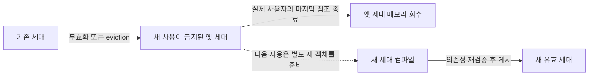

# 공유 준비 객체의 invalidation·회수 정책 검토안

코드 기준: `cas-merge@dbf0b6409ab8e15516a2df5580bffc0e5c1dcfe4`. 목표 구조(공유 준비 객체 / 세션 문장 핸들 / 실행 상태)와 다른 DB 사용자 간 미공유는 사용자 확정이다. 아래 정책은 현재 코드에 근거한 검토안이며, Q4/Q5 답변 전에는 최종 정책으로 기록하지 않는다.

## 무효화·교체·회수를 구분한다

- **정확성 무효화:** 해당 준비 결과를 새 실행이 재사용하면 안 되는 상태로 만든다. 이미 참조 중인 객체의 메모리를 즉시 해제하는 뜻이 아니다.
- **재최적화:** 기존 계획도 의미상 유효하지만 통계·바인드 선택도에 더 맞는 새 계획을 만든다.
- **메모리 회수:** 더 이상 실제 사용자가 없는 객체의 저장 공간을 반환한다. 정확성 무효화와 캐시 용량 관리 모두 회수의 원인이 될 수 있다.

같은 사용자라는 이유로 권한 freshness를 생략하지 않는다. 다른 DBA 세션의 REVOKE·group/owner 변경은 그 사용자가 공유하던 준비 객체에도 영향을 준다.

## 변경별 처리안

| 변경 | 새 실행의 처리 | 이미 실행/커서가 사용하는 객체 | 비고 |
|---|---|---|---|
| 테이블·뷰·인덱스/파티션 shape, 참조 객체 제거 | 영향받는 의존성의 세대를 무효화하고 재준비 | 기존 schema lock·수명 규약을 보존; 단순 pin만으로 실행 허용을 판단하지 않음 | 전체 DB cache flush를 기본으로 하지 않음 |
| REVOKE·owner·group 등 권한 변화 | 관련 권한/객체 의존성을 재검증, 허용되지 않으면 원래 권한 오류 | 강제 취소를 새 기능으로 추가하지 않음; 기존 실행/권한 경계 유지 | 같은 DB 사용자끼리 공유해도 필수 |
| 통계만 변경 | 기존 계획은 유효; 첫 요청 하나가 재최적화하고 교체하는 안 | 기존 유효 계획 사용 허용 여부는 **Q4** | hard-invalid 계획에는 적용 금지 |
| 준비 의미에 영향을 주는 세션 설정 | 필요 시 해당 핸들이 새 semantic key로 resolve | 다른 설정의 세션이 쓰는 객체까지 무효화하지 않음 | prepare 시 포착/execute 시 동적 설정 목록은 추가 확인 |
| 미커밋 DDL을 참조한 준비 | transaction-private 결과로 사용; process 공유 cache에 게시하지 않음 | 자기 transaction의 변경 가시성 보존 | commit 후 committed 기준으로 재준비, abort/savepoint는 private 결과 정리 |
| cache 용량 부족 | 유휴 materialized plan을 회수하고 다음 사용 시 재준비하는 안 | 실제 실행·커서·중첩/PX 사용자가 붙든 객체는 보호 | 핸들만 열려 있을 때 회수 허용은 **Q5** |

## 현재 코드에서 재사용할 기반

`xcache_find_sha1`는 cache entry를 fix한다. `xcache_find_xasl_id_for_execute`는 관련 객체 lock을 얻은 **뒤에** 삭제 표시를 재검사한다. 실행 종료는 clone을 반환한 뒤 unfix하며, 삭제 표시가 붙은 객체의 마지막 fix가 내려갈 때 실제로 제거한다.

- [lookup·의존 객체 lock·재검사](https://github.com/xmilex-git/cubrid/blob/dbf0b6409ab8e15516a2df5580bffc0e5c1dcfe4/src/query/xasl_cache.c#L969)
- [마지막 unfix와 삭제](https://github.com/xmilex-git/cubrid/blob/dbf0b6409ab8e15516a2df5580bffc0e5c1dcfe4/src/query/xasl_cache.c#L1182)
- [REVOKE의 class touch](https://github.com/xmilex-git/cubrid/blob/dbf0b6409ab8e15516a2df5580bffc0e5c1dcfe4/src/object/authenticate_grant.cpp#L683)

현행 `ref_count` 필드는 누적 사용 횟수다. 실제 활성 소유권은 `cache_flag`의 fix count이므로 새 자료형 설계에서 둘을 혼동하지 않는다.

## 세대 교체와 수명

무효화된 옛 세대는 새 사용 불가를 뜻한다. 새 세대는 별도 객체이며 옛 객체를 되살리거나 제자리에서 덮어쓰지 않는다. 실행이 pin을 얻었다는 사실만으로 DDL 뒤의 실행을 무조건 허용하지 않는다. 현재처럼 의존 객체 lock을 얻고 무효화 상태를 다시 확인하는 실행 시작 경계를 보존해야 한다. 이미 실행 중인 객체의 메모리와 underlying schema/disk resource의 사용 권한은 별도다.

공유 descriptor의 metadata와 native plan은 서로 맞는 버전 묶음이어야 한다. statistics-only replan은 metadata 계약이 같을 때 내부 plan revision만 교체할 수 있고, schema/auth 변경은 그 전제를 사용할 수 없다. 외부 driver statement ID의 유지/재준비 신호는 기존 protocol 규약과 맞춘다. 내부 세대 번호를 그대로 wire에 노출하는 신규 protocol은 제안하지 않는다.

## compile·publish 경합

- 동일 key에 miss 또는 hard-invalid가 나면 컴파일 중임을 공유하고 중복 compile을 합치는 방향을 제안한다. hard-invalid old plan으로 대기자를 실행시키지는 않는다.
- stats-only 재최적화 동안 대기자가 기존 유효 계획을 쓸지는 Q4에서 정한다.
- compile이 읽은 의존성의 버전과 publish 시점 버전이 달라지면 그 결과를 현재 세대로 게시하지 않는다. 정확한 lock/epoch 관측 방식은 구현 설계에서 확정한다.
- 현행 xcache도 old entry claim→새 entry publish→old retire 구조를 갖지만 일부 재최적화에서는 외부 XASL_ID 호환을 위해 `time_stored`를 계승한다. 새 준비 객체의 schema generation과 이 특례를 동일시하지 않는다.

## transaction·권한 publish

현재 DDL 관련 invalidate는 commit에만 있는 것이 아니다. class force/update/delete 시점과 commit/abort/savepoint의 modified-class cleanup 모두에서 호출된다. 이를 commit-only 무효화로 축소하지 않는다.

미커밋 schema/auth **데이터를 공유하는 것**과 미리 cache를 **무효화해 재검증을 요구하는 것**은 다르다. 전자는 금지하고, 후자는 기존 lock·transaction 규약에 따라 발생할 수 있다. 모든 producer의 실제 시점을 연결하지 않은 채 전역 epoch 하나를 올리는 것으로 대체하지 않는다.

view/trigger/routine·권한/group·synonym/serial·파티션의 의존성 closure는 compiler와 mutation producer 양쪽을 확인해야 한다. 현재 조사로 모든 변경 경로가 완전하다고 판정하지 않았다.

## 메모리 목표와 Q5

열린 문장 핸들이 모든 옛 native plan을 강하게 붙들면, DDL/replan 뒤에도 세션 종료까지 메모리를 회수하지 못한다. Q5의 추천안은 다음과 같다.

- SQL·semantic key·재준비에 필요한 작은 정보는 같은 준비 객체 identity 아래 공유한다.
- 큰 materialized native plan과 더 이상 유효하지 않은 metadata generation의 장기 보유를 핸들 개수에 묶지 않는다.
- 실행·커서·PX 등 실제 사용자가 필요한 generation만 pin한다. materialized result cursor가 plan 없이 살 수 있다면 필요한 result metadata만 보유한다.
- 유휴 계획 eviction은 statement handle 자체를 닫는 것과 다르다. 다음 execute에서 재준비할 수 있다.
- cache 바이트 예산은 reclaimable bytes와 pinned bytes를 나눠 기록한다. 사용 중인 메모리를 안전하게 강제 회수할 수는 없으므로 예산을 서버 전체 메모리 hard cap으로 표현하지 않는다.

현행 xcache도 stream+clone 바이트를 계산하고, 용량/시간 기준 cleanup은 unfixed 객체를 대상으로 한다(`xasl_cache.c:316-324,1432-1448,2437-2445`). 새 정책은 준비 metadata/SQL/native plan/실행 state의 바이트를 이 회계에 통합해야 한다.

## 재시도와 바인드

자동 재준비/재시도는 준비 결과가 stale임을 실행 전 확인한 경우에 한한다. row 변경, sequence 소비, trigger/SP 호출 등의 효과가 시작된 뒤 arbitrary runtime error를 재실행하지 않는다. timeout/interrupt/SP 오류를 invalidation으로 취급하지 않는다. 기존 pooled-statement driver 재준비 규약도 유지 대상으로 검증한다.

bind 값·fingerprint·현재 선택한 plan은 mutable shared descriptor 필드가 되면 안 된다. bind-sensitive plan variant를 둘 경우 같은 semantic identity 아래 불변 variant를 선택하며 statistics generation과 variant별 메모리 상한이 필요하다. generic plan과 variant 선택의 세부 정책은 Q4/Q5 뒤에 정할 남은 결정이다.

## 검증 계획 — 실행 전

YCSB C/A의 처리량·p99와 단계별 메모리 회계를 유지한다. invalidation 정확성은 별도의 기능 검증으로 확인한다.

1. 같은 SQL을 여러 세션이 준비한 뒤 관련/무관 테이블 DDL: 영향 범위와 재준비 횟수.
2. 같은 DB 사용자 두 세션과 별도 DBA의 REVOKE: 새 실행의 권한 거절, 미커밋 권한 노출 없음.
3. 실행 전 lock 대기 중 DDL, compile 중 DDL, 실행/holdable cursor 사용 중 eviction: stale 사용과 UAF 없음.
4. 자기 transaction의 CREATE/ALTER/ROLLBACK TO SAVEPOINT: private schema가 타 세션 공유 객체에 섞이지 않음.
5. 통계 갱신·동시 재최적화·compile 실패: Q4에 맞는 old/new plan 선택과 중복 compile 상한.
6. 열린 유휴 handle 다수 + 반복 DDL/replan + 낮은 cache 예산: old generation 회수, pinned/reclaimable 바이트 분리.
7. stale 사전 검증과 runtime error를 구분해 DML/sequence/trigger/SP 부작용이 두 번 실행되지 않음.

이번에는 정적 코드 조사만 수행했다. 위 기능 검증이나 성능 측정을 실행하지 않았다.

상세 근거: [계획 cache·compile·retry 감사](optimization-audit/invalidation-plan.md), [schema·auth·transaction 감사](optimization-audit/invalidation-schema.md).
