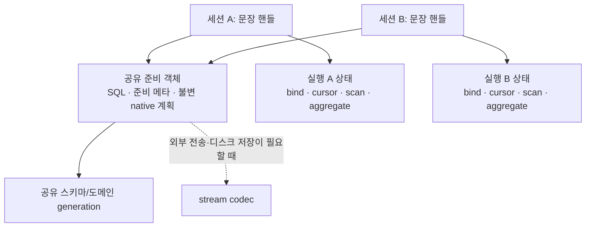

# CAS 통합 최적화 브레인스토밍

상태: 논의 중. 사용자 목표와 현재 코드의 조사 결과를 기록한다. 후보의 최종 채택·보류·기각과 구현은 미확정이다.

- 결정 티켓: [브레인스토밍: CAS·서버 단일 주소공간이 열어준 추가 최적화 — 후보 채택/보류/기각 결정](https://github.com/xmilex-git/workspace/issues/216)
- 지도: [CAS 통합 후속 지도: develop 머지 → CI test_shell green → 통합 최적화 브레인스토밍 + 개발자 논의 자료](https://github.com/xmilex-git/workspace/issues/207)
- 코드 기준: `xmilex-git/cubrid cas-merge@dbf0b6409ab8e15516a2df5580bffc0e5c1dcfe4` (2026-09-06 확인한 upstream PR head)
- 비교 기준: upstream develop `e374c7a24c46449c3f79e9413a6f4ff3d23b16c2`
- 선행 연구 4건은 `7117c8a66` 기준이므로 현재 코드에서 재확인한다.
- CI 게이트는 아직 열린 의존성이다. 이 문서는 성능 측정 또는 CI 통과를 주장하지 않는다.

## 사용자 확정 목표

### D1. 준비된 문장을 공유 객체로 만들고 메모리 중복을 줄인다

prepared statement의 세션 간 공유가 주 목표다. 속도 향상도 중요하지만, 공유 가능한 객체를 여러 세션이 중복 보유하지 않도록 해서 메모리를 아끼는 것 자체가 목표다. 검증 워크로드는 YCSB다.

기존 warm YCSB에서 prepare CPU 비중이 작다는 사실만으로 공유 구조의 가치를 기각하지 않는다. 같은 YCSB의 준비·정상 실행·종료 단계에서 객체 개수와 메모리 보유량도 관찰할 필요가 있다. 구체 측정 절차는 논의 중이다.

### D2. 내부 XASL stream 경계를 검토한다

같은 프로세스 안에서 컴파일 결과를 직렬화한 뒤 역직렬화하는 구조도 독립적인 개선 대상이다. 계획 캐시가 필요하다는 사실과 캐시의 정본이 packed stream이어야 한다는 주장은 구분한다.

현재 stream이 대신 맡고 있는 복제, 소유권·수명 분리, MOP→OID 정규화를 확인한다. 외부 전송·디스크 저장의 직렬화 필요성과 내부 캐시·실행 객체의 표현 선택을 분리해서 논의한다. 구체 native 표현이나 실행 상태 분리 방식은 미확정이다.

### D3. 네 시드에 한정하지 않고 CAS 분리 구조의 잔재를 조사한다

CAS가 독립 프로세스였기 때문에 필요했던 복사·캐시·할당·직렬화·상태 분리를 전체 관련 경로에서 조사한다. 각 항목에 현재 남아 있는 이유, 공유·제거 경계, 정확성 제약, 메모리 중복의 단위, YCSB 노출 여부를 기록한다.

이 지도에서는 후보 결정과 우선순위·측정 계획을 만든다. 실제 최적화 구현은 지도의 기존 범위대로 후속 노력이다.

### D4. 공유 준비 객체 / 세션 문장 핸들 / 실행별 상태의 3단계 분리를 최종 목표로 채택

사용자는 Q2에 "그렇게해"라고 답했다. 불변 SQL·준비 메타데이터·native 계획은 공유 준비 객체에 보관하고, 세션 문장 핸들과 동시에 살아 있는 실행의 바인드·커서·스캔/집계 상태를 분리하는 방향을 확정했다. 세션별 DB_SESSION/PT tree와 전체 XASL clone을 그대로 남기는 구조는 중간 단계다. 구체 자료형/API와 invalidation 정책은 후속 논의다.

### D5. 다른 DB 사용자 사이에는 준비 객체를 공유하지 않는다

사용자는 Q3(서로 다른 DB 사용자까지 공유할지)에 "아니"라고 답했다. 따라서 공유 범위는 같은 DB 사용자 내부다. 동일 SQL이어도 객체 해석·계획·준비 metadata에 영향을 주는 스키마/설정/옵션이 다르면 동일 객체로 합치지 않는다. 캐시 key의 구체 필드 목록과 권한 변경의 invalidation 연결은 후속 설계다.

## 핵심 판정

현재 통합은 프로세스 경계의 호출을 접고, 기존 소유권 모델을 세션/TLS로 번역한 부분이 많다. 그래서 CAS가 사라진 뒤에도 준비 객체와 스키마의 복제, client/server 힙 경계, packed XASL을 이용한 전체 실행 그래프 복제가 남는다.

XASL stream은 지금 단순한 전송 포맷 이상의 일을 한다. 그래프 복제·포인터 재배치, MOP→OID 정규화, parser arena에서 독립된 수명, 실행별 mutable state 분리를 동시에 제공한다. 따라서 내부 stream 제거는 캐시 삭제가 아니라 **그 역할을 native 객체·명시적 소유권·실행 상태로 옮기는 작업**이다. warm-cache hit에서 unpack이 적다는 이유는 이 구조적 목표를 기각하지 않는다.

아래는 코드에서 확인한 34개 검토 항목이다. 채택 결정 34개나 성능 결함 34개를 의미하지 않는다. 기존에 이미 공유된 부분, 추가 공유가 가능한 부분, 여전히 세션별이어야 하는 부분을 함께 포함한다.

## 후보 전체 목록

현재 코드의 각 근거와 소유권·불변식은 분야별 상세 문서에 있다.

### 준비 객체·컴파일·계획

| ID | 남은 구조 / 현재 판정 | 검토할 변경 경계 | YCSB |
|---|---|---|---|
| P1 | CAS_TLS 핸들이 SQL·DB_SESSION·실행/커서를 함께 소유 | 공유 준비 객체 / 세션 문장 핸들 / 실행 상태 분리 | 직접, 세션×문장 |
| P2 | 같은 SQL 원문·정규화 text·hash material 여러 곳 보관 | 원문과 정규형을 구분한 process string 소유권 | 직접 |
| P3 | 결과 metadata의 linked-node·domain/string 생성 반복 | 불변 준비 metadata와 mutable result 분리 | 직접; 일부 metadata는 임시이므로 보유량 과대계상 금지 |
| P4 | DB_SESSION/PARSER/PT tree를 문장 수명 동안 세션별 보유 | MOP-free 준비 결과; parser를 miss/replan 시에만 보유 가능한지 | 핵심 메모리 후보 |
| P5 | SQL PREPARE의 bind-sensitive kept tree 추가 보유 | 불변 replan 입력과 bind fingerprint overlay 분리 | JDBC 경로와 SQL PREPARE를 구분 |
| P6 | xcache에 packed stream + mutable 전체 XASL clone 여러 벌 | 불변 native plan 한 벌 + 실행별 state; 내부 codec 경계 제거 | 핵심, 소수 hot plan 동시 실행 |
| P7 | descriptor/parser와 xcache stream/clone 메모리 회계가 분산 | 공유 전후 live/peak/retained 객체 회계 | 검증 기반 |

상세: [준비 객체·컴파일·XASL 감사](optimization-audit/prepared.md).
대표 근거: [CAS 핸들 소유 구조](https://github.com/xmilex-git/cubrid/blob/dbf0b6409ab8e15516a2df5580bffc0e5c1dcfe4/src/broker/cas_handle.h#L117), [clone 적중/복원 경로](https://github.com/xmilex-git/cubrid/blob/dbf0b6409ab8e15516a2df5580bffc0e5c1dcfe4/src/query/xasl_cache.c#L969), [XASL runtime 필드](https://github.com/xmilex-git/cubrid/blob/dbf0b6409ab8e15516a2df5580bffc0e5c1dcfe4/src/query/xasl.h#L1120).

### 스키마·세션 객체 컨텍스트

| ID | 남은 구조 / 현재 판정 | 검토할 변경 경계 | YCSB |
|---|---|---|---|
| S1 | client_session_context에 불변 참조와 세션 상태 동거 | 공유 payload와 session overlay 분리; bracket은 의미 보존 | 연결 고정항 |
| S2 | MOP bucket·classname hash를 세션별 할당 | lazy/grow + committed name→OID 공유; MOP는 세션별 | 직접 |
| S3 | 같은 테이블의 SM_CLASS 전체 graph 세션별 복원 | committed schema descriptor 공유 + 미커밋 DDL overlay | 핵심 메모리 후보 |
| S4 | MOP 포함 domain만 세션별, MOP-free domain은 이미 공유 | class OID/generation 기반 공유 가능성; 이미 공유된 기본형은 유지 | 추가 이득 제한 가능 |
| S5 | class auth cache와 매 트랜잭션 전체 무효화 | committed 권한 정보 공유 + user/transaction 판정 분리 | 권한 갱신 의미 검증 필수 |
| S6 | trigger 정의와 실행/deferred state 동거 | committed 정의 공유, 실행/미커밋 상태 분리 | 기본 YCSB 미노출 |
| S7 | view parse cache·attribute descriptor가 MOP 포인터로 결합 | 불변 view 정의/metadata와 local binding 분리 | base-table YCSB 미노출 부분 존재 |
| S8 | 세션마다 기본 parameter 배열·변수 node 보유 | default generation + 변경분, 작은 변수 저장 구조 | 기본값 중복 관찰 가능 |
| S9 | workspace LEA heap 세션별; AREA는 이미 공유 | lazy heap + 공유 객체의 process allocator 귀속 | 연결 고정항 |
| S10 | locator CHN/copyarea→SM_CLASS와 server classrepr의 이중 표현 | 좁은 metadata read-through, heap_Guesschn 의존 재검토 | 준비/스키마 fetch |

상세: [스키마·세션 상태 감사](optimization-audit/schema-state.md), [locator·CHN·classrepr 감사](optimization-audit/locator.md).
대표 근거: [client_session_context](https://github.com/xmilex-git/cubrid/blob/dbf0b6409ab8e15516a2df5580bffc0e5c1dcfe4/src/object/client_session_context.hpp#L61), [SM_CLASS](https://github.com/xmilex-git/cubrid/blob/dbf0b6409ab8e15516a2df5580bffc0e5c1dcfe4/src/object/class_object.h#L737), [workspace 초기 할당](https://github.com/xmilex-git/cubrid/blob/dbf0b6409ab8e15516a2df5580bffc0e5c1dcfe4/src/object/work_space.c#L2415).

### 내부 복사·결과·PL

| ID | 남은 구조 / 현재 판정 | 검토할 변경 경계 | YCSB |
|---|---|---|---|
| T1 | execute 입력 DB_VALUE 배열 전량 clone 후 clear | 동기 borrow + 필요한 값의 정규화/소유권만 분리 | 매 실행 |
| T2 | 결과 첫 페이지의 temp-list page→client-compatible heap 사본→cursor 사본 | query 수명 pin 또는 페이지 ownership move | 작은 READ에도 페이지 단위 복사 |
| T3 | cursor가 list-id/domain-pointer 배열/buffer 별도 소유 | native result view + cursor 상태 | READ |
| T4 | 내부 wrapper·값 처리의 client/server 모드/TLS와 error scope | 명시적 typed API와 필요한 scope만 유지 | 매 실행/커밋 |
| T5 | 같은-thread PL callback에도 packet+queue adapter 잔류 | typed callback 직접 호출; JVM codec은 실제 경계에 유지 | 기본 YCSB 미노출 |
| T6 | PL row의 DB_VALUE vector/중간 tuple 복사 | 즉시 pack 또는 move한 단일 소유 row | 기본 YCSB 미노출 |
| T7 | PL SQL prepare/execute/fetch의 분리 왕복 | 메시지 결합·첫 page 동봉·metadata version | 기본 YCSB 미노출 |
| T8 | PL SET pack 전 원소 copy/clear | 즉시 소비하는 const/nocopy iterator | 기본 YCSB 미노출 |

상세: [내부 전송·결과·PL 감사](optimization-audit/transport-pl.md).
대표 근거: [바인드 clone](https://github.com/xmilex-git/cubrid/blob/dbf0b6409ab8e15516a2df5580bffc0e5c1dcfe4/src/communication/network_interface_cl.c#L7753), [첫 페이지 사본 생성](https://github.com/xmilex-git/cubrid/blob/dbf0b6409ab8e15516a2df5580bffc0e5c1dcfe4/src/communication/network_interface_cl.c#L201), [cursor의 재복사](https://github.com/xmilex-git/cubrid/blob/dbf0b6409ab8e15516a2df5580bffc0e5c1dcfe4/src/query/cursor.c#L107).

### 접속·버퍼·CAS compatibility 상태

| ID | 남은 구조 / 현재 판정 | 검토할 변경 경계 | YCSB |
|---|---|---|---|
| R1 | 접속당 전용 thread + CAS_TLS + socketless conn | 연결 상태와 active worker/scratch 분리 | 연결 수에 비례 |
| R2 | 로그 버퍼 168KiB를 TLS 배열로 선언 | 로그 활성화 시 할당; 실제 RSS는 별도 확인 | SQL_LOG=OFF의 footprint도 관찰 |
| R3 | 접속당 기본 80KiB 출력 buffer, high-water 유지 | 작은 시작 크기·bounded 재사용/trim | 직접 |
| R4 | TLS 연결마다 SSL_CTX·인증서 재구성 | process TLS config generation + 연결별 SSL | 비-TLS YCSB 미노출 |
| R5 | 작은 설정을 위해 전체 T_SHM_APPL_SERVER stub 보유 | server용 최소 config와 legacy SHM ABI 분리 | 프로세스 고정항 |
| R6 | CAS slot/semaphore와 server session/진단 상태 중첩 | 명시적 session state와 안전한 진단 snapshot | 메모리·동기화 계약 |
| R7 | 매 요청 body malloc·인자마다 argv realloc | bounded request scratch / inline argv | 매 요청 |
| R8 | 서버에서도 과거 protocol/SHARD/재접속 분기 운반 | 활성 native facade와 legacy adapter 분리 | 구조 단순화; 큰 속도 이득 미주장 |
| R9 | hint 불변 정의와 parse별 hit/arg를 TLS table로 복제 | process 정의 + parse별 scratch | 준비 단계/고정항 |

상세: [접속·버퍼·CAS 상태 감사](optimization-audit/runtime-shell.md), [SHM·상태 동기화 보충 검증](optimization-audit/cas-shell-validation.md).
대표 근거: [접속별 스레드](https://github.com/xmilex-git/cubrid/blob/dbf0b6409ab8e15516a2df5580bffc0e5c1dcfe4/src/connection/adoption.cpp#L516), [로그 TLS 배열](https://github.com/xmilex-git/cubrid/blob/dbf0b6409ab8e15516a2df5580bffc0e5c1dcfe4/src/broker/cas_log.c#L59), [출력 버퍼 수명](https://github.com/xmilex-git/cubrid/blob/dbf0b6409ab8e15516a2df5580bffc0e5c1dcfe4/src/connection/driver_session.cpp#L438), [SHM의 4096개 CAS slot 배열](https://github.com/xmilex-git/cubrid/blob/dbf0b6409ab8e15516a2df5580bffc0e5c1dcfe4/src/broker/broker_shm.h#L651).

## 확정한 목표 구조 — 구체 invalidation 설계 중

다음 3단계 분리는 사용자 Q2 답변으로 최종 목표에 채택됐다(D4). 아직 구현된 구조는 아니다. 다른 DB 사용자 사이에는 공유하지 않는다(D5).

- 공유 준비 객체를 새로 만들더라도 세션마다 DB_SESSION/PT tree와 전체 XASL clone을 그대로 보유하면 큰 중복은 남는다. 그것은 중간 단계이며, 최종 메모리 목표의 완료로 세지 않는다.
- mutable execution state는 세션이 아니라 **동시에 살아 있는 실행** 단위다. 중첩 SQL, holdable cursor, 병렬 worker 때문에 단순한 세션당 scratch 하나로 대체할 수 없다.
- 현재 XASL은 불변 객체가 아니다. list-id·SCAN_ID·집계값·DB_VALUE·memoize·parallel state 등을 실제로 수정하고 clear한다. 모든 write site를 plan/state로 분류하는 후속 설계가 필요하다.
- 공유 객체의 참조 수명과 allocator는 parser/session heap과 분리해야 한다. DDL/REVOKE, 통계 변경, 미커밋 DDL, bind-sensitive replan, OID 재사용도 기존 의미를 유지한다.
- 단순 SQL 문자열만 key로 사용하면 안 된다. 사용자·현재 스키마·컴파일/metadata 영향 설정·prepare 옵션의 동일성을 확인해야 한다. 다른 DB 사용자 사이에는 공유하지 않는다(D5).

## 우선순위 검토안

1. **주 목표:** P1/P4/P6을 묶어 준비 객체·native plan·실행 상태의 소유권 경계를 설계한다. P2/P3/P5는 여기서 빠뜨리면 안 되는 부속 보유물이다.
2. **함께 검토할 공유 메타데이터:** S3 schema descriptor, S4 MOP-free domain 확대 가능성, S5/S7의 권한·view 바인딩 경계. read latch 하나로 workspace를 치환하는 원안보다 공유 불변 정보와 local overlay의 분리가 목표에 맞는다.
3. **독립적으로 쪼갤 수 있는 작업:** T1/T2/T3/R2/R3/R5/R7/R9. 구조 설계가 끝나기 전에 성능 수치만 보고 우선순위를 확정하지 않는다.
4. **큰 실행 모델 변경:** R1은 별도 크기의 변경이다. prepared/native plan 공유가 thread-pool 전환을 기다려야 하는 것은 아니다.
5. **YCSB에 드러나지 않는 후보:** PL·SSL·trigger/view는 목록에 유지하되 YCSB 측정값으로 효용을 판정하지 않는다. 사용자가 원하면 후속 대상별 검증 범위를 결정한다.

## YCSB에서 확인할 것

하네스 기준: `cubrid-perftools-internal@99e07035fb63fb21d53a41dd30b184edca5d3c83`. tracked Java 소스 변경은 없었고 untracked run.log만 존재했다.

- `ycsb/ycsb/core/src/main/java/com/yahoo/ycsb/Client.java:838-865`: thread별 DB instance.
- `ycsb/ycsb/jdbc/src/main/java/com/yahoo/ycsb/db/JdbcDBClient.java:60-132,169-226,239-467`: instance별 connection·cachedStatements, operation/table/field-count/shard별 key, 첫 사용 prepare 후 cleanup까지 보유.
- 단일 shard·table·고정 shape에서 같은 READ/UPDATE를 N개 연결이 각각 prepare하므로 준비 객체의 중복은 YCSB 자체에서 관찰할 수 있다. 실제 live handle 수는 카운터로 확인한다.

| 단계 | 관찰 목적 |
|---|---|
| 서버 boot 직후 | process 기본 상태·stub·공유 cache 초기 비용 |
| 연결 init 후, 문장 준비 전 | 세션/스레드/TLS/workspace/parameter/buffer 고정항 |
| READ/UPDATE 첫 prepare 후 | SQL·parser/PT·metadata·공유 key 수 |
| warm steady state | native/stream/clone·동시 실행 상태·copy/alloc 횟수, 처리량·p99 |
| 연결 cleanup 후 | live 객체 해제와 allocator retained memory 분리 |

공식 판정 워크로드는 기존 YCSB C/A를 유지한다. 기존 지도 기준의 연결 100·C×1/A×1 게이트 규약을 임의로 바꾸지 않는다. 추가 연결 수 sweep, 단계별 계측을 위한 barrier와 반복 진단은 **제안**이며 아직 실행·확정하지 않았다. 목적은 같은 YCSB에서 준비/메모리 축을 더 보는 것이다.

기록할 항목은 `live/peak bytes`, 실제 allocation 용량, RSS/PSS, unique prepared key 수, session handle 수, parser/PT node 수, plan별 stream/clone/state bytes, 바인드 clone·page-copy·요청 allocation 횟수다. RSS만으로 객체 중복과 allocator caching을 혼동하지 않는다.

과거의 +380µs는 전체 recompile과 keep/reuse의 차이이며 이번 공유 설계의 보장 절감량이 아니다. 새 설계의 절감 바이트·처리량·p99는 미측정이다. 바인드 복사는 wrapper clone과 tdes bind-history clone, result-cache clone을 별도로 계수한다. wrapper 복사를 없앤다고 나머지 보유 목적의 복사까지 없어진 것으로 계산하지 않는다. 성능 규칙(MEAS-01/06/07, ALLOC-08, MEM-05, COH-04/12, PAR-14)은 설계·검증 기준으로 사용하며 근거 없는 속도 수치로 바꾸지 않는다.

## 이관된 성능 항목과의 대조

- **클래스 IS 락 fastpath/retention:** 현재도 xcache 실행 검증에서 `lock_object`를 호출한다(`src/query/xasl_cache.c:1061`). 이는 실행 중 DROP/ALTER를 막는 의미가 있어 CHN 비교만으로 없앨 수 없다. fastpath나 보유 연장은 별도 락 프로토콜 후보이며, 공유 준비 객체의 선결조건은 아니다. 과거 진단의 row S-lock 표기는 후속 코멘트에서 class IS-lock으로 정정됐다.
- **read-only commit의 빈 해시 clear:** `logtb_tran_clear_update_stats`는 현재도 count를 0으로 바꾸고 hash가 존재하면 mht_clear한다(`src/transaction/log_tran_table.c:3443-3458`). 빈 데이터에 대한 작업을 줄이는 후보는 유지하지만 CAS 제거로 새로 가능해진 공유 객체와 구분한다.
- **TLS/값 분기:** 예전 fog의 매크로 이름을 현재 코드에 그대로 대입하지 않는다. 현재는 `object_primitive.c:4897-4900,5206,5295` 등의 db_on_server/csc 분기와 T4의 scope 비용을 대상으로 한다. initial-exec TLS 지정은 dlopen/빌드 제약 확인이 필요한 별도 미세 조정이며, 객체 소유권 정리를 대신하지 않는다.
- **AREA 분할:** 현재 process AREA 공유는 이미 존재한다(S9). 과거 프로파일에서 AREA 병목은 확인되지 않았으므로 세션마다 slab을 다시 만드는 변경은 메모리 목표의 기본안으로 삼지 않는다. 필요하면 소유권·경합·idle slab 메모리를 함께 측정한다.
- 과거 malloc 지분 6.7–9.1%, mht_clear/TLS 지분 수치는 이전 빌드의 진단이다. 이번 후보의 기대 speedup으로 전용하지 않는다. 현재의 준비 객체/페이지/바인드/buffer별 allocation 회계가 필요하다.

## 검토 범위와 남은 결정

upstream 대비 232개 변경 파일 목록과 CMake의 client-half/CAS speaker 목록을 기준으로 준비→컴파일→캐시→실행→결과→commit/teardown, 스키마·권한·세션, 접속·로그·SSL·PL 경로를 조사했다. 모든 CUBRID 함수나 mutable XASL 필드 write를 전수 증명한 것은 아니다. 분야별 문서에 미확인 소비자·필드·측정 항목을 남겼다.

Q2/Q3는 D4/D5로 확정했다. 현재는 사용자 요청에 따라 DDL·권한·통계·설정 변경의 invalidation, 실행 중 객체의 수명, 재준비 시점과 공유 cache 메모리 회수 정책을 검토한다. 이후 나머지 후보의 채택·보류·기각과 우선순위를 확정한다. 티켓은 열린 상태로 유지한다.

## Invalidation 정책 검토

Q2/Q3 확정 뒤 [무효화·세대 교체·메모리 회수 검토안](invalidation-policy.md)을 작성했다. 현재 질문은 Q4(통계 재최적화 중 기존 유효 계획 사용 허용)와 Q5(열린 유휴 핸들의 큰 계획 객체 eviction 허용)다. schema/auth hard invalidation과 statistics-only reoptimization을 구분하고, 새로운 실행의 유효성 검증과 기존 실제 사용자의 수명 보호를 별도로 다룬다. 상세는 검토안과 두 코드 감사 문서에 있다.
