# PR #8022 구성도 — 기존(develop) 동작과 변경된 구조를 층별로 나란히

기준: [CUBRID/cubrid#8022](https://github.com/CUBRID/cubrid/pull/8022) HEAD `23a5e5561`(2026-10-03), 워크트리 `~/dev/cubrid-worktree/dpin`.
근거: ADR 0019~0024, `domain-pin-architecture.md` §1, `pr8022-domain-state-guide.md`, `domain-pin-audit.md`(S-01~S-43), `domain-pin-exec-sites.md` §0. 함수·필드 이름은 전부 위 HEAD 의 코드에서 확인했다(`tools/code-index`).

읽는 순서: 1층(누가 언제 정하나) → 2층(한 문장의 수명) → 3층(자료구조) → 4층(게이트 내부) → 5층(행 경로 다섯 자리) → 6층(변환기·규칙 모듈) → 7층(경계). 층마다 **기존**(develop) 그림 하나, **변경**(PR 8022) 그림 하나다.

한 줄 요약: develop 은 "도메인을 실행 중에 행을 보고 정하고, 플랜 노드에 써 두었다가 끝나면 되돌린다". PR 8022 는 "컴파일과 실행 시작 게이트 두 곳에서만 정하고, 결정은 실행 상태(`XASL_STATE`)에만 두며, 행은 읽기만 한다".

---

## 1층 — 큰 그림: 도메인은 누가, 언제 정하나

### 기존 (develop)

```mermaid
flowchart LR
  subgraph C["클라이언트 컴파일"]
    C1["파서: 형제(컬럼·리터럴·CAST)가 있으면 도메인 확정<br/>없으면 DB_TYPE_VARIABLE"]
    C2["pt_make_regu_hostvar<br/>바인드 값이 이미 있으면 값 타입을 도메인으로 (플랜이 값에 종속)"]
    C3["pt_set_host_variables<br/>바인드 값을 expected_domain 으로 캐스트"]
  end
  subgraph L["서버 로드"]
    L1["stx_map_stream_to_xasl<br/>노드마다 original_domain = domain 보관"]
  end
  subgraph E["서버 실행 — 행을 읽으면서 결정 (43곳)"]
    E1["fetch: VARIABLE regu 도메인 ← 값 도메인"]
    E2["비교: 타입 다르면 상수를 제자리 coerce"]
    E3["리스트 파일: 첫 튜플로 컬럼 타입"]
    E4["집계: 첫 non-NULL 값으로 누산기 타입"]
    E5["인덱스 키: range 마다 strict coerce 시도"]
    E6["PX 워커: 각자 resolve 후 루트로 역전파"]
  end
  subgraph X["실행 종료"]
    X1["qexec_clear_*: domain = original_domain 복원<br/>(클론을 다음 실행이 재사용하므로)"]
  end
  C --> L --> E --> X
```

### 변경 (PR 8022)

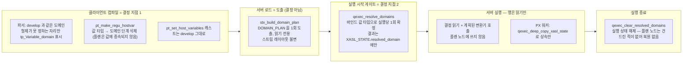

---

## 2층 — 한 문장의 수명

예시 문장: `SELECT sum(? + ?) FROM t WHERE c_str = ?`
- `? + ?` : 형제가 없어 컴파일이 타입을 못 정하는 자리(게이트 슬롯)
- `c_str = ?` : 형제 `c_str` 이 있어 컴파일이 타입을 정하는 자리(클라이언트가 캐스트)

### 기존 (develop)

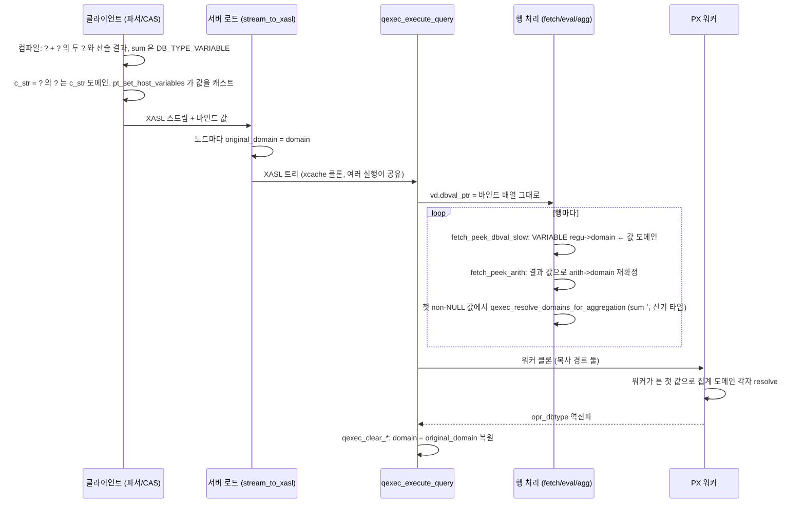

### 변경 (PR 8022)

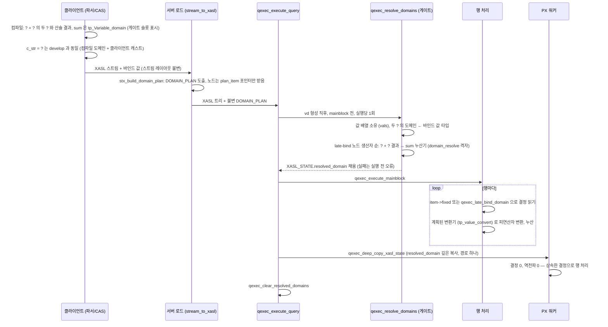

---

## 3층 — 자료구조: 플랜 노드와 실행 상태

### 기존 (develop)

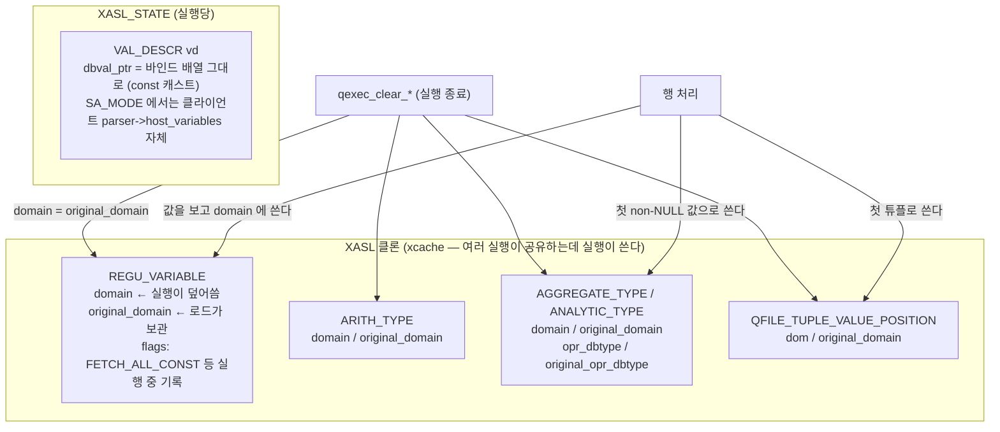

### 변경 (PR 8022)

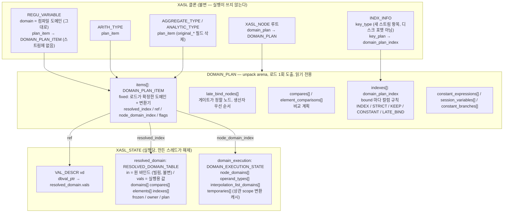

핵심 차이: develop 은 "노드 필드 = 실행 상태" 라서 공유 클론에 쓰고 되돌려야 했다. PR 은 노드에 **불변 계획 포인터**만 두고, 실행별 답은 `XASL_STATE` 두 멤버에 둔다. 같은 번호(`resolved_index`, `ref`, `node_domain_index`)로 세 배열을 찾는다.

---

## 4층 — 게이트 내부

### 기존 (develop) — 게이트가 없고, 같은 결정이 실행 하위에 흩어져 있다

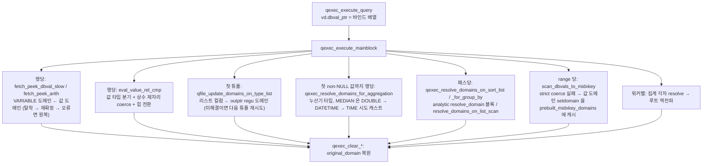

### 변경 (PR 8022) — `qexec_resolve_domains` 한 곳, 단계 순서 고정

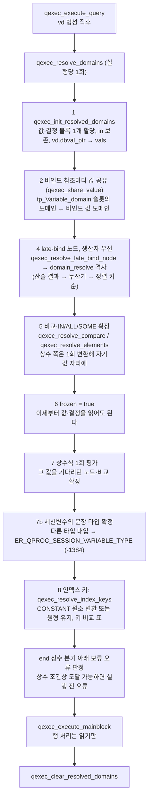

대응표 — 게이트 단계가 develop 의 어느 자리를 대체했나:

| 게이트 단계 | develop 에서 같은 결정을 하던 자리 (감사표 ID) |
|---|---|
| 2 슬롯 도메인 ← 값 | `fetch_peek_dbval_slow` S-05, REGUVAL_LIST S-06 |
| 4 late-bind 노드 | `fetch_peek_arith` S-01~S-04, 집계 첫값 S-23·S-26~S-28, 리스트·정렬·GROUP BY S-13~S-20, 해시 조인 키 S-22 |
| 5 비교 | `eval_value_rel_cmp` S-09·S-10, top-N S-11 |
| 7 상수식 | `FETCH_ALL_CONST` 제자리 coerce + 힙 전환 S-09·S-39 |
| 7b 세션변수 | `T_EVALUATE_VARIABLE` 저장값 타입 S-07 |
| 8 인덱스 키 | `scan_dbvals_to_midxkey` S-30, ISS S-31, MRO S-32, `btree_compare_key` 폴백 S-12 |
| (PX 상속) | 워커 resolve·역전파 S-34~S-37 |
| (복원 삭제) | `qexec_clear_*` + `original_domain` S-38 |

---

## 5층 — 행 경로 다섯 자리

### 5-a 산술 fetch

기존 (develop):

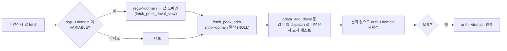

변경 (PR 8022):

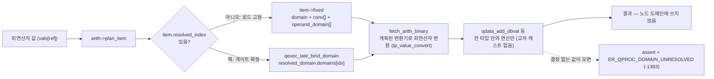

### 5-b 비교

기존 (develop):

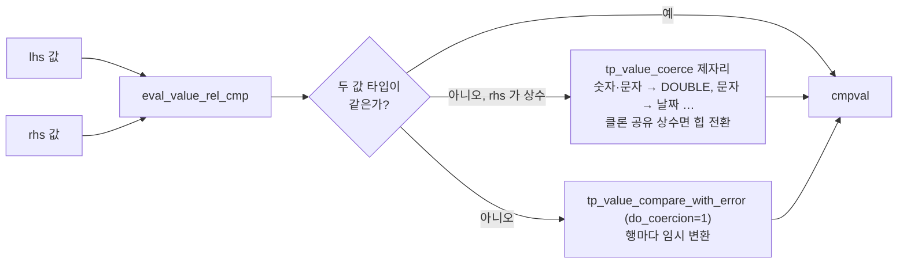

변경 (PR 8022):

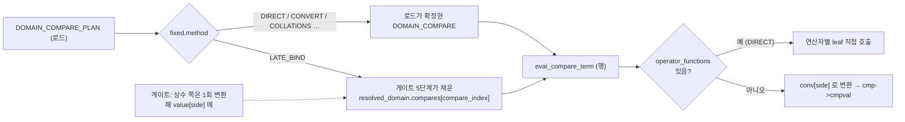

### 5-c 집계와 리스트 파일

기존 (develop):

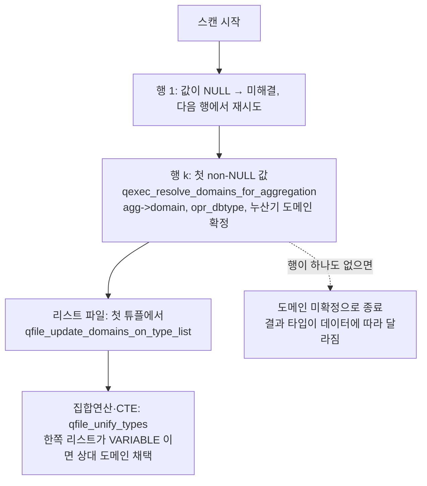

변경 (PR 8022):

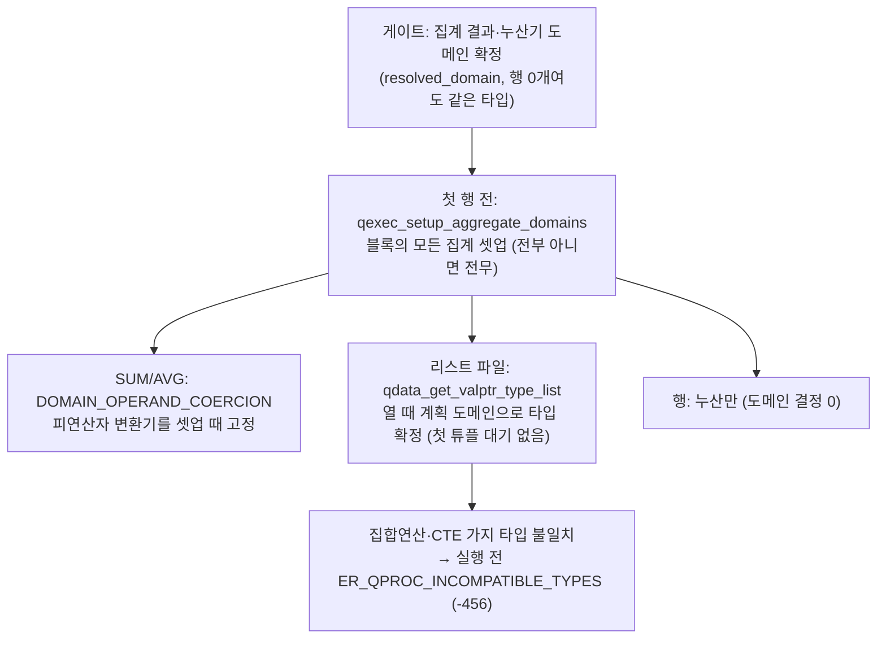

### 5-d 인덱스 키

기존 (develop):

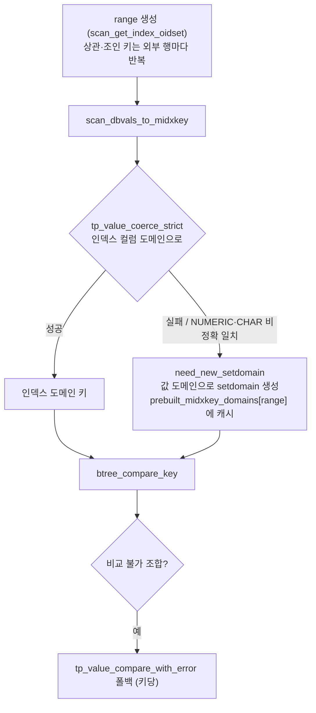

변경 (PR 8022):

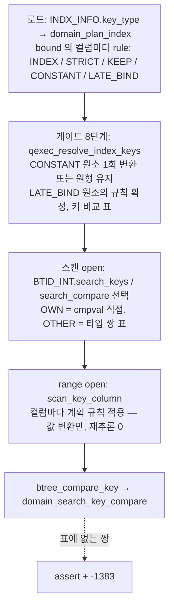

### 5-e PX 워커

기존 (develop):

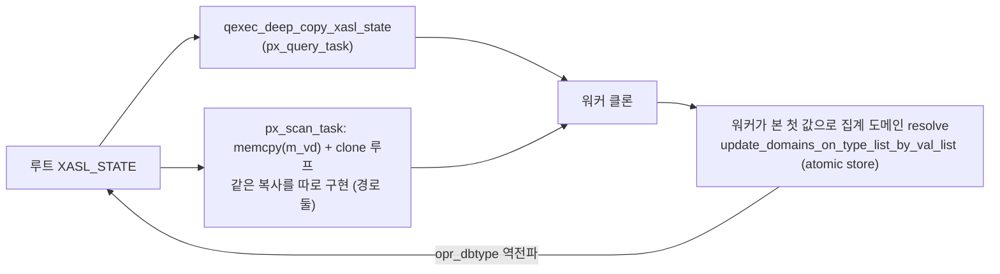

변경 (PR 8022):

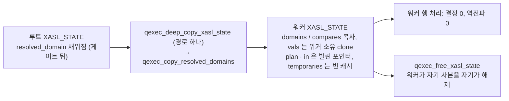

---

## 6층 — 변환기와 도메인 규칙 모듈 (ADR 0022·0023·0024)

### 기존 (develop) — 같은 규칙이 여러 코드에 따로 산다

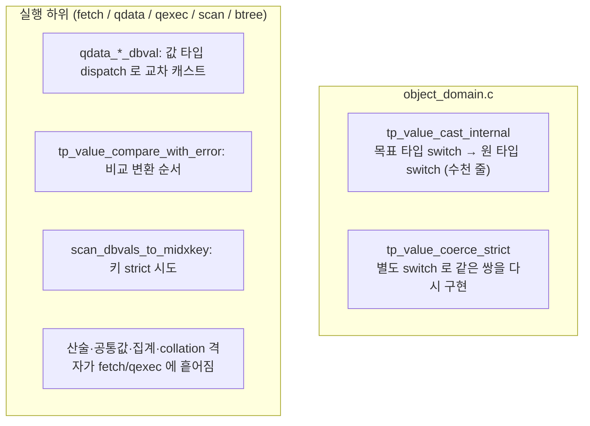

### 변경 (PR 8022) — 셀 함수 한 벌, 해석기 한 모듈

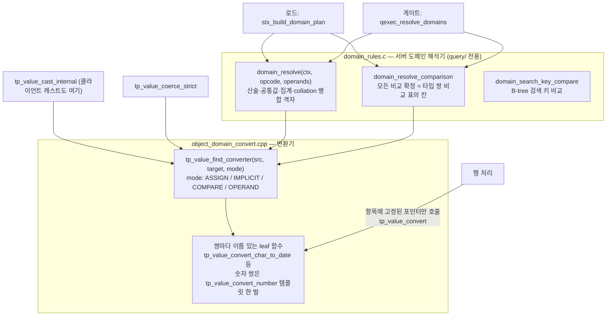

요점: 로드·게이트만 `tp_value_find_converter` 를 조회하고, 행 루프는 계획 항목에 고정된 함수 포인터를 부른다. 클라이언트 캐스트(`tp_value_cast_internal`)와 게이트가 **같은 셀**을 부르므로 규칙이 두 벌이 되지 않는다.

---

## 7층 — 경계: 결정 없이 행에 도달하면

| 자리 | 기존 (develop) | 변경 (PR 8022) |
|---|---|---|
| 로드: 필터·함수 인덱스 스트림에 게이트 슬롯이 있으면 | 그대로 로드, `fpcache_claim` 이 오류를 삼킴 | `stx_index_stream_rejected` 로 로드 거부 (-1383), 오류 전파 |
| 행: 결정 없는 VARIABLE 도메인을 만나면 | 값에서 도메인을 정해 계속 | optdebug `assert` + release `ER_QPROC_DOMAIN_UNRESOLVED` (-1383). 재컴파일 트리거에 넣지 않아 위반이 숨지 않음 |
| 세션변수: 문장 안에서 다른 타입 대입 | 읽기마다 저장값 타입 | 게이트 7b 가 실행 전 `ER_QPROC_SESSION_VARIABLE_TYPE` (-1384) |
| 집합연산·CTE 가지 타입 불일치 | 두 가지 모두 행이 있을 때만 -456, 한쪽이 비면 다른 쪽 타입 채택 | 게이트가 실행 전 -456 |

---

## 읽을 때 주의할 점 (ADR 제목과 구현이 다른 곳)

- ADR 0021 제목은 "클라이언트 캐스트 삭제" 이지만 **Amendment(D-335-08, D-336-A·B)** 로 정정됐다: 클라이언트 캐스트(`pt_set_host_variables`)는 develop 그대로 남고, 게이트는 값을 바꾸지 않고 참조마다 복제한 뒤 `tp_Variable_domain` 슬롯의 도메인만 값에서 기록한다. 이유는 XASL 캐시 키가 리터럴 문장과 바인드 문장을 구분하지 않는다는 것(F-335-04)과 OBJECT 바인드가 클라이언트 전용 코드라는 것(F-335-05).
- ADR 0020 의 `REGU_VARIABLE_GATE` 비트는 구현에서 이름이 다르다: 컴파일은 도메인 자체를 `tp_Variable_domain` 으로 두고(`pt_make_regu_hostvar`), 로드가 `REGU_VARIABLE_VARIABLE_DOMAIN`(0x8000, 스트림에 없음) 과 `DOMAIN_PLAN_LATE_BIND` 항목 플래그를 도출한다.
- ADR 0020 의 "G2 블록 게이트" 는 최종 구현에 없다(제목에 "블록 게이트 없음"). 상관 값의 scope 변환은 `domain_execution.temporaries[]` 가 첫 사용 때 1회 변환하는 것으로 대신한다.
