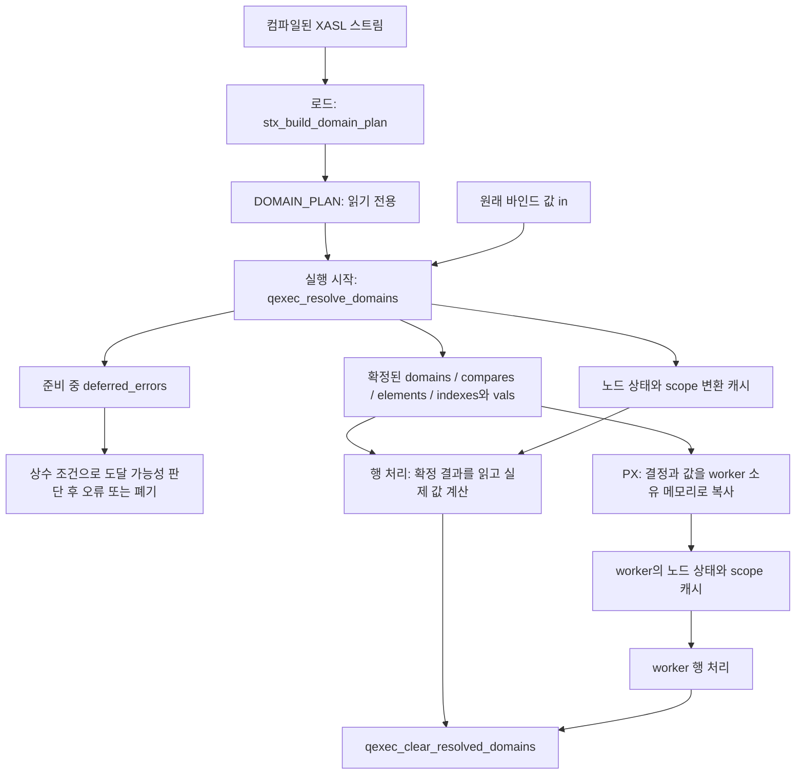

# CUBRID PR #8022 도메인 상태 정리: 다른 LLM에게 전달할 작업 명세

작성일: 2026-09-30. 이 문서 하나에 변경 제안, 유지할 동작, 작업 순서, 검증 기준, 현재 구조의 전체 필드 설명을 담는다. 이전 대화나 별도 로컬 리뷰 파일 없이 읽을 수 있다. 엔진 소스와 원래 결정 기록은 아래 링크에서 확인한다.

## 목적과 작업 기준

[CUBRID/cubrid#8022](https://github.com/CUBRID/cubrid/pull/8022)는 도메인/collation과 변환·비교 정책을 행 처리 전에 확정한다. 구현 과정의 배경과 결정은 [workspace#312](https://github.com/xmilex-git/workspace/issues/312)에 있으며, 최근 재정리는 [#374](https://github.com/xmilex-git/workspace/issues/374), 저장 크기 압축 과제는 [#375](https://github.com/xmilex-git/workspace/issues/375)에 있다.

사용자의 요청은 현재 구현의 과도한 복잡성을 줄이고, 특히 `RESOLVED_DOMAIN_TABLE`과 관련 구조를 기존 CUBRID 개발자가 직관적으로 읽을 수 있게 만드는 것이다. 기존 SQL 동작과 실행 전 도메인 확정 계약을 보존하는 리팩터링을 목표로 한다.

이 문서의 정적 검토 기준 HEAD는 **`ca907aaed3d94ed7e1aa87a5463fd064b8f3c208`**다. 문서 작성 시 엔진 수정, 빌드, SQL/CTP, 성능 측정을 수행하지 않았다. 아래 제거·압축 후보는 코드에 근거한 제안이며 구현·검증이 끝난 결과가 아니다.

다른 LLM이 구현 지시로 이 문서를 받으면, 현재 HEAD와 사용처를 다시 확인한 뒤 **0단계의 기존 공간 재사용 검토**와 작은 제거 작업부터 진행한다. 아래 제안 이름과 배치는 목표를 설명하는 예시다. 같은 목표를 더 단순한 코드로 달성할 수 있으면 그 근거를 기록하고 선택한다. 다음 사용자의 명시적 범위 지시가 이 문서의 기본 작업 순서보다 우선한다.

2026-09-30 추가 검토: 최초 리뷰는 미사용 필드와 수명 혼합에 집중했다. 사용자가 지적한 기존 REGU/XASL 공간 재사용 관점으로 다시 비교하여, analytic의 함수별 union 재사용, SUM/AVG의 과한 공통 타입, 노드별 특수 배열의 일괄 할당을 추가했다. **상태 구조를 더 만들기 전에 이미 있는 적절한 runtime 공간으로 흡수할 수 있는지 먼저 판단한다.**

## 시작할 때 확인할 것

- 대상 엔진 저장소의 HEAD, 작업 트리 변경, 현재 PR diff를 기록한다. 아래 줄 번호는 기준 HEAD의 위치이므로 변경된 코드에서는 심볼로 다시 찾는다.
- #312 본문·댓글, #374의 최종 결정·댓글, 적용 중인 ADR-0019~0024를 읽는다. ADR-0022의 변환기 표 설계는 ADR-0023으로 대체되었다.
- 현재 코드에서 선언, 작성, 소비, 오류 정리, PX 복사 경로를 확인한다. 문서의 검색 결과를 현재 HEAD의 사실로 무조건 가정하지 않는다.
- 작업 위치의 AGENTS.md/CLAUDE.md와 빌드·성능·CTP 지침을 따른다. 아래 환경 설명은 문서 작성 당시의 정보다.

기준 환경은 Rocky Linux 8.10이며 tooling repo는 `/home/cubrid/dev/workspace`, 엔진 checkout은 `/home/cubrid/dev/cubrid-worktree/dpin`이다. Tooling repo에는 엔진 `src/`가 없다. 다른 환경에서는 실제 엔진 checkout을 명시적으로 찾는다. 원래 checkout에는 `cubrid-cci`의 기존 변경이 있어 보존해야 한다. 다른 작업도 함께 진행되므로 구현은 기존 변경을 확인한 후 필요하면 별도 `codex/` 브랜치/worktree에서 한다.

## 유지해야 하는 동작

| 영역 | 유지할 계약 |
|---|---|
| 계획과 실행 상태 | `DOMAIN_PLAN`은 로드가 도출하는 읽기 전용 계획이다. 실행별 결과·값은 `XASL_STATE`가 소유한다. 공유 XASL 노드에 실행별 도메인을 써넣지 않는다. |
| 타입 결정 시점 | 컴파일/로드와 실행 전 준비가 정책을 확정한다. 행 경로는 확정된 변환 함수·비교 정책을 실행한다. 행 값의 변환과 타입 정책의 재추론을 구분한다. |
| 기존 타입 규칙 | 숫자·문자·날짜 등의 기존 결과 타입, precision/scale, codeset/collation을 보존한다. 클라이언트 cast와 literal/bind의 XASL 공유 계약도 유지한다. |
| 원래 입력 | 원래 입력 `in`과 준비된 실행 값 `vals`를 구분한다. result cache·DBLINK·SA 입력 alias가 요구하는 원래 입력을 보존한다. |
| 값 참조 | `(val_pos, target_domain, fail_policy)`가 다른 참조를 하나의 bind 참조로 합치지 않는다. |
| 상수 오류 | 준비 중 발견한 상수 오류는 실행 전 처리한다. 상수 조건상 도달할 수 없는 분기의 오류는 억제한다. 행 조건의 미선택 분기나 일반적인 결과 0행은 억제 근거가 아니다. Interrupt/OOM은 즉시 전파한다. |
| 비교 오류와 rank | 양측 변환 순서, 첫 변환 성공 후 타입, 실패 측, -181 타입 이름 순서, term 밖 비교의 rank를 보존한다. 관련 필드는 각각 다른 정보를 담는다. |
| 복합 키 | 컬럼별 strict 변환과 실패 시 원래 타입 유지, ASC/DESC, 혼합 도메인을 보존한다. 키 전체에 strict/keep 하나를 적용하지 않는다. |
| 세션/비캐시 값 | 세션 변수는 문장 안에서 정한 타입을 사용하되 값과 대입 부작용은 기존 시점에 처리한다. NON_CACHEABLE 값 자체를 상수 캐시로 바꾸지 않는다. |
| scope 캐시 | 정책은 사전 확정하고 고정 값의 실제 변환은 scope의 첫 사용에 한다. 재진입 시 generation을 바꾼다. 실패 캐시와 성공적으로 변환된 NULL을 구분한다. |
| PX | worker는 leader의 확정 정책을 복사받는다. 값 payload와 변경 가능한 실행 상태는 worker가 소유한다. scope 캐시는 비어 있는 상태로 시작한다. |
| 미확정 검사 | optdebug의 미확정 상태 검사와 release의 `ER_QPROC_DOMAIN_UNRESOLVED` 전파를 유지한다. 문제를 숨기는 일반 비교/캐스트 fallback으로 대체하지 않는다. |

## 0단계: 기존 공간 재사용과 저장 타입의 과잉부터 확인

### 0.1 Analytic의 함수별 info union 재사용

- 기존 공간: `src/xasl/xasl_analytic.hpp:64`의 `analytic_function_info` union과 `analytic_list_node.info`. 현재 NTILE, percentile, cume-percent 계열의 함수별 정보를 담는다.
- 새로 추가한 공간: 같은 헤더 `:107`의 `RESOLVED_DOMAIN operand_coercion`. SUM/AVG 전용이지만 모든 analytic 노드가 이 공통 멤버를 포함한다.
- 소비: `query_analytic.cpp:101`에서 초기화하고 SUM/AVG branch의 `:119`에서 채우며 `:497`에서 사용한다. 기존 info 멤버들과 SUM/AVG의 상태는 서로 다른 함수 종류에서 사용된다.
- 후보: `info.sum_avg` 같은 함수별 union 멤버에 coercion을 넣는다. 현 16바이트 union + 56바이트 별도 상태를 하나의 56바이트 union으로 합치는 LP64 배치는 약 16바이트 순절감 후보이며 실제 sizeof/offset을 확인한다.
- `:101`의 현재 무조건 초기화를 그대로 union에 옮기면 percentile 등의 활성 멤버를 덮어쓸 수 있다. SUM/AVG 조건 안에서만 초기화한다. Partition 재시작, clone/worker copy, 정리를 확인한다.
- pack/unpack은 percentile 함수에서만 해당 info 포인터를 기록하는 현재 조건을 보존한다 (`stream_to_xasl.c:6504`, `xasl_to_stream.c:5807` 부근). Runtime 상태를 스트림에 추가하지 않는다.

### 0.2 두 입력 변환에 필요한 정보만 저장

- `RESOLVED_DOMAIN`은 결과 도메인 1개 + converter 3개 + operand target 3개로, LP64에서 7개 포인터에 해당하는 56바이트다.
- SUM/AVG에 새로 저장하는 coercion은 `domain_resolve_operand_coercion()`이 두 입력의 converter/target만 채운다. 이 용도에서는 결과 `domain`과 3번째 converter/target을 사용하지 않는다.
- 기준: `domain_rules.c:461,572`, `query_opfunc.c:2458`, `xasl_aggregate.hpp:86`, `xasl_analytic.hpp:107`.
- 후보: 두 converter/target 쌍만 보관하는 32바이트 저장 형태 또는 그에 해당하는 작은 기존 runtime 저장을 사용한다. 일반 식의 풍부한 3-input 결과 저장과 구분한다.
- 변환 규칙과 binary arithmetic helper를 재사용한다. 저장 타입을 줄이려고 SUM/AVG 전용 타입 추론·변환 dispatch를 새로 복제하지 않는다. 비소유 보기나 단순 인자 전달처럼 추가 할당·row dispatch가 없는 방법을 비교한다.
- 작은 저장을 읽을 때마다 56바이트 객체를 다시 구성하는 행 경로를 추가하지 않는다. Helper가 두 입력의 기존 배열을 직접 받는 방법 등과 실제 명령 수를 비교한다.
- 일반 aggregate의 경우 `accumulator_domain`은 hash GROUP BY 등의 공통 누적 helper도 전달받는다. `aggregate_specific_function_info` union으로 옮기는 변경은 이 전달·소유 경로까지 확인한 후 결정한다. Analytic과 같다고 단순 치환하지 않는다.

### 0.3 노드별 특수 배열을 모든 노드에 배정하는 비용

- `qexec_alloc_resolved_domains()`의 `domain_resolve.c:212`는 `n_node_domains`개마다 `node_domains`, `interpolation_list_domains`, `operand_types`를 모두 배정한다.
- 뒤의 두 배열은 MEDIAN/PERCENTILE 리스트와 aggregate/analytic operand type의 특수 용도다. 일반 노드에서도 공간이 예약되고, 관련 함수가 없는 문장에도 두 배열이 생길 수 있다.
- 후보: 관련 함수가 없으면 특수 배열을 할당하지 않거나, 해당 함수의 기존 runtime 저장으로 흡수하거나, 필요한 항목만 보관한다. LP64에서 두 특수 배열은 슬롯당 12바이트 payload에 해당하며 전체 절감량은 실제 필요 항목 수로 계산한다.
- 현재 모든 배열이 같은 `node_domain_index`를 사용하는 계약과 초기화·접근·PX 복사를 함께 확인한다. 배열을 sparse하게 바꾸려고 범용 map/variant 계층이나 행마다 비싼 lookup을 추가하지 않는다.

### 0.4 단순 bind의 REGU 내부 저장 후보

- 기존 `REGU_VARIABLE`에는 `type`, `domain`, `flags`, `value.val_pos`가 있고 `value`는 타입별 union이다 (`regu_var.hpp:183` 부근).
- 단순 bind도 현재는 큰 `DOMAIN_PLAN_ITEM` 80바이트와 cold 32바이트 모델을 사용한다. `cold.val_pos` 등 기존 노드에서 이미 알 수 있는 정보도 별도 메타데이터로 가진다.
- 작은 bind handle을 union 안에 두거나 필요한 항목만 별도 저장하는 대안은 ADR-0020의 D-323-16에서 측정 후 결정하도록 보류한 기존 후보다. #375의 압축 검토에서 실제로 비교한다.
- 이 대안은 이번 정적 검토에서 완성·검증한 설계가 아니다. 전체 item 배열의 번호·소유권 검사, literal/bind 공유, target/fail별 참조, publish 시점, PX의 동일 번호 대응까지 바꿔야 할 수 있다.
- `vfetch_to`나 `value`의 활성 멤버를 임의로 scratch로 덮어쓰지 않는다. TYPE_POSITION/상수/산술 등의 실제 값 읽기·쓰기 경로와 충돌한다.

### 0.5 현재 코드가 이미 재사용하거나 분리가 필요한 곳

| 대상 | 소스에서 확인한 사실 | 판단 |
|---|---|---|
| regu/arith/agg/analytic의 `domain_plan` 포인터 | 기존 `original_domain` 포인터 자리를 교체한다. | 이 포인터가 노드를 무조건 키웠다는 지적은 틀리다. 외부 item 비용과 구분한다. |
| alias의 도메인 item | `domain_plan.c:4751`은 별도 execution domain이 필요 없는 alias의 item을 공유한다. | alias 재사용을 전부 없앤 구현은 아니다. 실행 상태가 다른 소비자는 구분한다. |
| SUM/AVG accumulator | `query_aggregate.cpp:898`의 공유 경로가 유지된다. | 기존 누적 결과 공유를 없앴다는 근거는 없다. |
| 상수의 `ARITH_TYPE.value` / `FUNCTION_TYPE.value` | `domain_resolve.c:1699,1750`은 결과를 실행 배열로 move/clone한 뒤 노드 payload를 정리한다. | PX가 다른 thread에서 노드를 정리할 때의 교차 heap 해제를 막는 이유가 있다. 같은 payload의 영구 중복 저장이라고 단정하지 않는다. |
| 노드의 컴파일 `domain` / `opr_dbtype` | 현재 계약은 컴파일 값은 그대로 두고 실행별 채택 상태를 별도로 저장한다. | 다시 덮어쓰려면 원복·캐시 clone·PX 계약까지 재설계해야 한다. 기존 runtime union 재사용과 구분한다. |

완료 조건: 공간 재사용이 가능한 구체적 대상과 불가능/비용이 큰 대상을 코드 근거로 나누고, 선택한 변경의 전후 layout·활성 union 멤버·소유권·초기화 경로를 제시한다. 구조 분리 자체를 목표로 삼지 않는다.

## 1단계: 소비하지 않는 메타데이터 제거

### 1.1 DOMAIN_PLAN_ITEM_COLD.pair

- 위치: `domain_plan.h:105`.
- 기준 HEAD에는 이 필드를 개별적으로 설정하거나 읽는 사용처가 없다. cold 구조 전체의 초기화·복사와 실제 필드 소비를 구분해서 확인한다.
- 필드와 관련 layout 검사를 정리한다. 현재 cold는 32바이트다. LP64에서는 해당 포인터 제거로 24바이트 배치가 가능한 후보이며 실제 sizeof를 확인한다.
- `DOMAIN_ELEMENT_COMPARE_PLAN.pair`와 다른 구조의 동명 필드는 실제 사용되므로 구분한다.
- `cold.name`은 `domain_list_column_name`과의 포인터 동일성 검사에 사용된다. 출력용 문자열로 보고 함께 제거하지 않는다.

### 1.2 n_non_cacheable / non_cacheable_refs

- 위치: `domain_plan.h:370`, `domain_plan.c:4693,4788,4799,4821`.
- 기준 HEAD는 목록을 세고 할당하고 채운 뒤 소비하지 않는다.
- 필드, 개수 집계, 배열 할당, 할당 실패 검사, 채우는 코드와 보조 변수 `vol`까지 제거한다.
- `OPERAND_NON_CACHEABLE` 분류와 `resolved_non_cacheable`는 실제 동작에 필요하므로 유지한다.

### 1.3 소비자 없는 flags

- `DOMAIN_PLAN_KEY1`, `DOMAIN_PLAN_KEY2`, `DOMAIN_PLAN_ISS`, `DOMAIN_PLAN_KEEP_LAZY`: 기준 HEAD에는 정의 외 사용처가 없다.
- `DOMAIN_PLAN_TRUNCATE_OK`: `domain_plan.c:1592`에서 설정하지만 읽지 않는다.
- 현재 사용처를 재확인하여 비트와 설정을 제거한다. 남은 비트 값은 그대로 유지한다.
- 실제 인덱스 키/skip scan과 truncation 수용 정책은 별도 경로에 있다. 그 동작은 유지한다.

완료 조건: 삭제한 필드·비트에 대한 참조가 남지 않고, 실사용 operand 분류·키·변환 정책은 보존된다. 전후 field 목록과 layout을 기록한다.

## 2단계: 필요한 정보의 크기로 표현 단순화

### 2.1 세션 의존 마스크를 유무로 표현

기준 HEAD의 `domain_plan.c:4871`은 세션 읽기마다 `1ULL << n_reads`를 배정하며 63 이후 읽기는 마지막 비트로 합친다. 현재 소비자는 개별 읽기를 식별하지 않고 의존성이 있는지만 사용한다.

- `DOMAIN_PLAN.resolved_session_reads[]`와 `DOMAIN_ELEMENT_COMPARE_PLAN.session_reads`는 의미가 드러나는 bool 의존성으로 바꾸는 후보가 적절하다. 전파는 OR이며 세션 읽기 자신은 true다.
- `DOMAIN_COMPARE`의 LATE_BIND_SESSION 구분을 유지한다. 실행의 `DOMAIN_COMPARE.session_reads` 복사는 제거 후보로 검토한다.
- 소비 위치: `domain_resolve.c:777,1673,2265,2677`, `domain_plan.c:3784`, `query_executor.c:22153`와 관련 작성 경로.
- `domain_rules.c:1998`의 `domain_compare_equal()`도 이 마스크를 읽는다. 필드 제거 시 동일성 검사와 전역 비교 표의 중복 제거 결과를 함께 확인한다.
- `DOMAIN_SESSION_VARIABLE.reads/assigns` 목록은 변수별 타입 일관성 검증에 필요하므로 유지한다.
- 세션 변수 준비의 여러 pass와 producer 순서도 유지한다. 의존성 표현의 단순화가 준비 순서 단순화를 뜻하지 않는다.

완료 조건: 개별 비트 소비가 없다는 현재 소스 근거를 기록하고, 모든 의존 전파·세션 처리 시점·비교 동일성 검사가 새 표현과 일치한다. 세션 값/대입 자체의 평가 시점이 보존된다.

### 2.2 scope 캐시의 검증 필드를 검증 빌드로 한정

- `DOMAIN_EXECUTION_TEMPORARY.conv/target`는 초기화·저장 외에 `domain_resolve.h:306`의 assert에서만 읽힌다.
- 현재 사용처가 같다면 두 필드를 검증 빌드 전용으로 두는 후보를 적용한다. assert와 관련 작성도 같은 빌드 조건으로 맞춘다.
- `generation`, `scope`, `value`, `converted`의 의미와 정리 경로는 유지한다. `converted == NULL`은 성공 NULL과 다르다.
- 모든 관련 번역 단위의 빌드 조건과 layout이 일치하는지 확인한다. 두 포인터의 LP64 저장 공간 16바이트는 절감 후보이며 실제 struct 크기를 측정한다.

완료 조건: 검증 빌드에서 기존 불변식 검사가 유지되고, release에서 검증 전용 저장이 사라진다. 재진입·변환 실패·NULL·PX에서 캐시 동작이 동일하다.

## 3단계: 상태를 수명과 변경 시점에 따라 분리

가장 중요한 구조 문제는 `RESOLVED_DOMAIN_TABLE`의 27개 필드가 실행 시작에 확정하는 정책, 행에서 채택하는 노드 상태, scope 값 캐시, 준비 중 오류를 함께 담는다는 점이다. 목표 배치 예시는 다음과 같다.

```text
DOMAIN_PLAN                       로드의 읽기 전용 계획
XASL_STATE.resolved_domain         이번 실행의 값·도메인·비교·키 확정 결과
XASL_STATE.domain_execution        노드 상태 + scope 변환 캐시
DOMAIN_RESOLVE_WORK                준비 함수의 지역 작업 상태
```

이름은 제안이다. **0단계에서 기존 runtime 공간으로 흡수할 수 있는 상태를 먼저 정리한 뒤, 남는 상태에 필요한 분리만 적용한다.** 새 클래스 계층, 가상 호출, 범용 상태 프레임워크를 만들지 않는다. 기존 owner 할당과 배열 중심의 inline 접근을 유지한다. 단순히 중첩 구조를 만드는 것만으로 메모리가 줄었다고 보고하지 않는다.

### 3.1 보류 오류를 지역 작업 상태로

- 이동 대상: `deferred_errors`, `n_deferred_errors`, `max_deferred_errors`.
- 오류는 준비 단계에서 모으고 마지막 도달 가능성 검사 후 처리한다. 처리 순서와 오류 내용은 유지한다.
- 지역 작업 상태를 필요한 내부 준비 함수에 전달한다. 함수마다 별도 목록이나 오류 ownership을 새로 만들지 않는다.
- `qexec_resolve_domains()`의 조기 반환, 부분 할당 실패, 마지막 오류 발생까지 지역 목록을 회수하는 하나의 정리 경로를 만든다. 엔진의 기존 오류 처리 스타일을 따른다.
- worker 복사나 행 fetch에 이 지역 상태를 넘기지 않는다. `value_states`는 행 fetch도 사용하므로 함께 옮겨 없애지 않는다.

### 3.2 노드 상태와 scope 캐시를 실행 멤버로

- 노드 상태: `node_domains`, `interpolation_list_domains`, `operand_types`, `n_node_domains`.
- scope 캐시: `temporaries`, `scope_generations`, `n_temporaries`, `n_scopes`.
- XASL_STATE의 inline 실행 멤버로 묶는다. 기존 배열 배치를 보존할 수 있으면 보존하고, 행 접근에 추가 heap 할당이나 간접 참조를 넣지 않는다.
- 배열의 해제 주소와 소유권을 명확히 한다. 현재 공통 블록의 base는 `vals`이며 노드 배열을 별도 멤버로 옮겨도 내부 포인터를 개별 free하지 않는다.
- 각 접근 함수와 setup/first-value/cleanup/PX 경로를 새 위치에 맞춘다. 단순한 전역 문자열 치환으로 끝내지 않는다.
- PX의 `own_load == false`이면 노드 상태 복사, true이면 초기 상태 유지라는 현재 규칙을 보존한다. Scope 캐시는 worker에서 새로 시작한다.
- `owner`, `plan`, `copied_from_leader`의 소유권 검사와 동일 스트림의 item 번호 대응을 유지한다.

### 3.3 frozen의 실제 의미를 드러내기

`frozen`은 `domain_resolve.c:2688`에서 상수식 평가 전에 true가 된다. 준비 단계의 상수 평가가 기존 fetch 접근 함수를 사용하기 때문이다. 그 뒤에도 상수·세션·키 결정을 채운다.

- 전체 객체의 불변성을 뜻하는 플래그로 설명하지 않는다. 현재 접근 허용 시점과 최종 준비 완료 시점을 명확히 설명한다.
- 플래그를 함수 끝으로 옮기거나 두 상태로 분리하려면 준비 중 fetch의 접근 계약을 먼저 조사한다.
- 이번 분리에 꼭 필요하지 않으면 플래그의 제어 흐름은 유지하고 주석·문서를 정확히 고친다. 읽기 혼동을 해결하려고 새 준비 상태 기계를 만들지 않는다.

완료 조건: 확정 결과와 행 변경 상태, 준비 전용 오류가 코드와 문서에서 구별된다. 초기화·부분 실패·정리·PX의 각 소유자가 명확하며 행 경로 비용을 늘리지 않았다는 근거가 있다.

## 4단계: 고정 계획 항목의 저장 크기 압축 검토

이 항목은 이미 #375의 미결 과제다. 앞 단계의 제거·표현·수명 분리와 구분하여 후보를 비교한다. 구현 범위는 다음 사용자의 지시에 맞춘다.

현재 `DOMAIN_PLAN_ITEM`은 80바이트이고 cold는 32바이트다. 단순한 항목에도 풍부한 `RESOLVED_DOMAIN`을 inline으로 보관한다. 공통 필드를 작게 두고 필요한 고정 결과만 별도 pool에 저장하거나 동일한 고정 결과를 공유하는 후보를 검토할 수 있다.

| 후보 | 확인할 장점 | 확인할 비용/제약 |
|---|---|---|
| 작은 공통 item + 풍부한 고정 결과 pool | 단순 항목이 많은 계획의 캐시 크기 감소 | 결과 접근의 간접 참조, 추가 번호/분기, pool 준비 비용 |
| 동일한 고정 결과의 공유 | 같은 domain/converter/target 묶음을 반복 저장하지 않음 | 동일성 기준의 정확성, 중복 제거 준비 비용, lookup 방식 |
| 기존 hot item 유지 + cold 압축 | 행 경로 변경을 작게 유지 | 최대 절감 폭이 제한적임 |

`fixed.domain`, `conv[]`, `operand_domain[]`를 쓰는 고정 CAST·산술·aggregate·list 소비자를 모두 조사한다. 가변 item만 남기거나 `fixed`를 실행 결과와 무조건 union으로 합치는 방식은 이 정보를 잃을 수 있다. 기존 `RESOLVED()`의 O(1) 접근과 비교의 첫 64바이트 배치를 평가 기준에 포함한다.

완료 조건: 후보별 실제 item 수, sizeof/offset, XASL cache bytes, 준비 명령 수, 행 경로 명령 수와 비용을 제시한다. 새 크기 계약과 접근 방식의 tradeoff를 설명한다. 구조도나 예상 바이트만으로 절감/무회귀를 확정하지 않는다.

## 검증과 완료 보고

구현 단계마다 변경 범위에 맞는 빌드와 동작 검증을 완료한다. 다음 확인을 하나의 큰 변경 뒤로 모두 미루지 않는다.

- optdebug/release 빌드와 repository가 요구하는 정적 검사를 수행한다. Unit tests/ctest는 이 환경의 사용자 정책에 따라 실행·활성화하지 않는다.
- CTP는 `just ctp`/`just ctp-rerun`의 컨테이너 경로로 실행한다. testcase ref는 PR 또는 `TC_REF`로 명시한다. Host CTP는 다른 CUBRID 프로세스까지 종료할 수 있어 사용하지 않는다.
- SQL/medium CTP와 아래 의미 있는 경계 사례를 확인한다. Medium은 분할하지 않는다.
- 타입/값/오류 차이를 baseline과 비교한다. 기존 #374의 성공 기록을 이번 패치의 새 검증으로 표시하지 않는다.
- 저장 크기·행 접근이 바뀌면 실제 sizeof/offset, 같은 DB의 반복 A/B, 명령 수와 관련 hot symbol을 확인한다. CTP 성공만으로 성능 무회귀를 주장하지 않는다.
- 기존 병렬 작업과 데이터베이스를 보존한다. Scratch는 tooling repo의 `.git_ignored_dir/scratch/`에 둔다.
- 다음 작업 지시에 GitHub 변경이 포함되어 있지 않으면 결과는 로컬 diff와 보고서로 제공한다. 이 문서 자체는 push·merge·issue/PR 댓글 게시 지시가 아니다.

| 경계 사례 | 확인할 동작 |
|---|---|
| Analytic SUM/AVG와 NTILE·PERCENTILE·CUME_DIST | 함수별 union의 활성 멤버 보존, partition 초기화/재시작, percentile 입력 포인터 보존 |
| SUM/AVG의 일반 coercion 경로와 숫자 accumulator 경로 | 문자열 등 변환 입력, NULL/오류, GROUP BY/PX에서도 변환 대상·순서와 누적 결과 유지 |
| NULL / 여러 타입의 bind | 원래 입력 유지, 다른 target/fail 참조, 결과 타입과 NULL 결과 |
| 상수 조건과 행 조건의 CASE/IF/COALESCE/AND/OR | 도달 불가능한 상수 오류 억제와 일반 상수 오류의 실행 전 발생 |
| key range / 복합 인덱스 / ASC·DESC / skip scan | 컬럼별 strict/keep, 혼합 도메인, bound 공유, 오류 타입 순서 |
| 세션 변수 여러 읽기와 문장 내 대입 | 타입 일관성과 의존 준비 순서, 값·부작용 유지 |
| 상관 subquery의 반복 진입 | 새 외부 값에서 캐시 무효화, 같은 scope 내 변환 재사용 |
| 변환 성공 NULL / 변환 실패 | 캐시 성공과 실패의 구분, 기존 오류 순서 |
| PX의 두 XASL 복사 방식 | 정책 복사, worker 소유 값, 노드 초기화/복사, 빈 scope 캐시 |
| 중간 준비 실패와 정리 | deferred errors·하위 값·공통 블록의 누수/이중 해제 방지 |

최종 산출물에는 다음을 포함한다.

1. 실제 구현한 단계와 보류/기각한 후보 및 근거.
2. 필드 이동·제거·이름 변경의 before/after 표, 소유권과 PX 규칙.
3. 엔진 diff와 변경된 헤더 주석. 필드는 뜻, 작성 시점, 소비자, 수명, sentinel을 설명한다.
4. 최종 구조에 맞춘 개발자 필드 문서. 아래 부록은 기준 HEAD의 설명이므로 구현 후 최신화한다.
5. 정확한 빌드·testcase ref·검증 결과와 성능/메모리 측정. 실행하지 못한 항목은 구분한다.

## 참고 소스와 결정 기록

- [domain_plan.h: 계획과 실행 구조](https://github.com/CUBRID/cubrid/blob/ca907aaed3d94ed7e1aa87a5463fd064b8f3c208/src/query/domain_plan.h)
- [domain_plan.c: 목록·참조·의존성 도출](https://github.com/CUBRID/cubrid/blob/ca907aaed3d94ed7e1aa87a5463fd064b8f3c208/src/query/domain_plan.c)
- [domain_rules.h: 확정 도메인·비교·키 규칙](https://github.com/CUBRID/cubrid/blob/ca907aaed3d94ed7e1aa87a5463fd064b8f3c208/src/query/domain_rules.h)
- [domain_rules.c: 규칙과 비교 표](https://github.com/CUBRID/cubrid/blob/ca907aaed3d94ed7e1aa87a5463fd064b8f3c208/src/query/domain_rules.c)
- [domain_resolve.h: 행 접근 함수](https://github.com/CUBRID/cubrid/blob/ca907aaed3d94ed7e1aa87a5463fd064b8f3c208/src/query/domain_resolve.h)
- [domain_resolve.c: 준비·복사·정리](https://github.com/CUBRID/cubrid/blob/ca907aaed3d94ed7e1aa87a5463fd064b8f3c208/src/query/domain_resolve.c)
- [xasl_analytic.hpp: 기존 함수별 union과 추가 coercion](https://github.com/CUBRID/cubrid/blob/ca907aaed3d94ed7e1aa87a5463fd064b8f3c208/src/xasl/xasl_analytic.hpp#L64)
- [xasl_aggregate.hpp: accumulator의 coercion 저장](https://github.com/CUBRID/cubrid/blob/ca907aaed3d94ed7e1aa87a5463fd064b8f3c208/src/xasl/xasl_aggregate.hpp#L80)
- [query_opfunc.c: 두 입력의 coercion 소비](https://github.com/CUBRID/cubrid/blob/ca907aaed3d94ed7e1aa87a5463fd064b8f3c208/src/query/query_opfunc.c#L2458)
- [ADR-0020: 노드 내 union/flags 인라인 후보의 보류](https://github.com/xmilex-git/workspace/blob/main/docs/adr/0020-two-decision-points-compile-and-execution-gate.md)
- [ADR-0023: 하나의 switch로 변환기 선택](https://github.com/xmilex-git/workspace/blob/main/docs/adr/0023-converters-are-found-by-one-switch.md)
- [ADR-0024: 타입 쌍 비교 표와 자리별 확정 비교](https://github.com/xmilex-git/workspace/blob/main/docs/adr/0024-comparison-resolution-is-a-type-pair-table-cell.md)

## 부록 A. 기준 HEAD의 전체 필드 가이드

이 부록은 현재 구현을 설명한다. 앞의 변경 제안을 이미 적용한 구조가 아니다. 예시는 값 흐름을 설명하기 위한 것이며 문서 작성에서 SQL을 실행하지 않았다.

### 1. 먼저 알아야 할 세 가지

`TP_DOMAIN`은 타입과 precision/scale, codeset/collation 등의 설명이다. `DB_VALUE`는 실제 값이다. 이 PR에서는 **어떤 타입으로 계산할지 결정하는 일**과 **실제 값을 계산·변환하는 일**을 분리한다. 타입 결정은 XASL 로드 또는 실행 시작에 끝내고, 행 처리는 정해진 변환 함수와 비교 함수를 사용한다. 값이 행마다 바뀌면 값 변환은 여전히 행마다 필요하다.

`DOMAIN_PLAN`은 XASL을 로드할 때 만드는 읽기 전용 실행 준비표다. 컴파일된 도메인으로 확정할 수 있는 내용과, 실행 때 바인드 등을 받아 확정해야 할 내용이 함께 있다. 여러 실행이 공유하는 XASL 노드에 실행별 도메인을 써넣지 않기 위한 설계다.

`XASL_STATE.resolved_domain`의 `RESOLVED_DOMAIN_TABLE`은 이번 실행의 상태다. 이름은 도메인 테이블이지만, 실제로는 **확정된 타입·비교·키 정책, 준비된 값, 노드별 실행 상태, 값 변환 캐시, 준비 중 오류 목록**까지 담는다. 필드를 이해하려면 먼저 이 역할들을 나눠 읽어야 한다.

| 기존 코드에서 익숙한 대상 | 이 PR에서 찾아볼 곳 |
|---|---|
| 호스트 변수의 원래 `DB_VALUE` 배열 | `resolved_domain.in` |
| `VAL_DESCR.dbval_ptr`로 실행 중 읽는 값 | `resolved_domain.vals`와 `DOMAIN_PLAN_ITEM.ref` |
| 산술식·함수의 결과 타입과 피연산자 변환 | `RESOLVED_DOMAIN.domain`, `conv[]`, `operand_domain[]` |
| 실행 중 노드에 기록하고 clear 때 복원하던 domain | `node_domains[]`와 노드 도메인 접근 함수 |
| aggregate/analytic의 `opr_dbtype` | `operand_types[]`와 `qexec_node_operand_type()` |
| `tp_value_compare_with_error()`의 타입 선택·변환 순서 | `DOMAIN_COMPARE` |
| `scan_dbvals_to_midxkey()`의 컬럼별 strict 변환/원형 유지 | `domain_plan_key_elem`과 `RESOLVED_KEY_ELEMENT` |
| 외부 행이 고정된 동안 반복 사용되는 상관 값의 변환 결과 | `DOMAIN_EXECUTION_TEMPORARY` |

### 2. 실행 흐름과 소유권



`qexec_resolve_domains()`는 다음 순서로 준비한다. 상수·세션 변수에 의존하는 항목은 해당 값이 준비되는 단계까지 기다린다.

1. 실행 상태를 할당하고 원래 입력을 `in`으로 보존한다. 실행용 값 배열을 `vals`로 연결한다.
2. 바인드 값의 참조를 준비하고, 가변 바인드의 도메인을 확정한다.
3. 피연산자가 먼저 오도록 정렬된 노드의 결과 도메인과 비교 방법을 확정한다.
4. 상수식을 평가하면서 그 값을 기다리던 도메인·비교를 확정한다.
5. 세션 변수의 문장 내 타입을 확정하고 그 타입에 의존하는 항목을 처리한다.
6. 인덱스 키의 상수 값과 컬럼별 변환 정책을 확정한다.
7. 미뤄둔 오류가 상수 조건상 도달 가능한지 판단한 후 반환한다.

**`frozen`은 위 3과 4 사이에서 이미 `true`가 된다.** 상수식 평가도 기존 fetch 경로와 `RESOLVED()`를 쓰므로 접근 함수의 준비 상태 검사를 통과시켜야 하기 때문이다. 그 뒤에도 준비 함수가 값을 채운다. 따라서 `frozen == true`만 보고 전체 객체가 완성되어 더는 쓰이지 않는다고 해석하면 안 된다. `qexec_resolve_domains()`의 성공 반환 뒤에는 타입 결정이 완료되어 있고, 노드 상태와 scope 캐시는 행 처리 중에도 바뀐다.

할당을 맡는 `owner`는 해당 실행의 `THREAD_ENTRY`다. `vals`, `domains`, `compares`, `elements`, `indexes`, 노드 도메인 배열, `value_states`는 **한 할당 블록 안의 서로 다른 구간**이다. 그 블록의 해제 주소는 `vals`다. 각각의 포인터를 따로 free하면 안 된다. 컬렉션 원소·인덱스 키의 하위 블록, temporaries, scope generations, deferred errors는 별도 할당이다. `TP_DOMAIN` 포인터는 캐시 도메인을 참조하며 여기서 개별 해제하지 않는다.

원래 입력 `in`은 빌린 배열이다. 일반 바인드는 `qexec_share_value()`로 payload를 공유할 수 있고, 계산·변환한 값은 실행이 관리한다. PX 복사에서는 worker가 사용할 값의 payload를 clone한다. 정리는 각 `DB_VALUE`를 clear하고 소유 블록을 해제한 뒤 `vd.dbval_ptr`을 `in`으로 복원한다.

소스: [준비·할당·PX 복사](https://github.com/CUBRID/cubrid/blob/ca907aaed3d94ed7e1aa87a5463fd064b8f3c208/src/query/domain_resolve.c#L138), [실행 준비 본체](https://github.com/CUBRID/cubrid/blob/ca907aaed3d94ed7e1aa87a5463fd064b8f3c208/src/query/domain_resolve.c#L2530), [정리와 scope 처리](https://github.com/CUBRID/cubrid/blob/ca907aaed3d94ed7e1aa87a5463fd064b8f3c208/src/query/domain_resolve.c#L2924).

### 3. 서로 다른 인덱스를 구분하기

한 항목에 여러 인덱스가 있는 이유는 **타입 설명, 실제 값, 실행 중 노드 상태**가 서로 다른 배열에 있기 때문이다.

| 필드 | 가리키는 곳 | 없는 경우 | 주의점 |
|---|---|---|---|
| `DOMAIN_PLAN_ITEM.resolved_index` | `domains[resolved_index]` | `-1` | 음수이면 `item.fixed`를 읽는다. `items[]`의 항목 번호와 다르다. |
| `DOMAIN_PLAN_ITEM.ref` | `vals[ref]` | `-1` | 준비된 값의 위치다. 원래 바인드의 `val_pos`와 항상 같지는 않다. |
| `DOMAIN_PLAN_ITEM.node_domain_index` | `node_domains[node_domain_index - 1]` 등 | `0` | 1부터 시작한다. 노드별 실행 상태 3개 배열이 같은 번호를 쓴다. |
| `DOMAIN_COMPARE.compare_index` | `compares[compare_index]` | `-1` | `LATE_BIND*`인 계획 비교가 실행별 비교를 찾는 번호다. |
| `DOMAIN_ELEMENT_COMPARE_PLAN.resolved_elements_index` | `elements[resolved_elements_index]` | `-1` | 원소 번호가 아니라 ALL/SOME 비교 항목 번호다. |
| `domain_plan_index.resolved_keys_index` | `indexes[resolved_keys_index]` | `-1` | 실행별 키 준비가 필요한 인덱스 스캔의 번호다. |
| `domain_plan_key_elem.resolved_element` | 해당 `RESOLVED_INDEX_KEYS.elements[]` | `-1` | 그 스캔 안에서의 키 컬럼 결정 번호다. |
| `temporaries[i]`라는 계획 필드의 값 | 실행의 `temporaries[value - 1]` | `0` | `DOMAIN_PLAN_ITEM`과 `DOMAIN_COMPARE_PLAN`의 필드는 1부터 시작한다. |
| `constant_branch` | `plan.constant_branches[]` | `-1` | 가장 안쪽의 상수 조건 분기다. `parent`를 따라 바깥 조건도 검사한다. |

예를 들어 `item.resolved_index == 5`, `item.ref == 12`, `item.node_domain_index == 3`이라면 결과 타입·변환은 `domains[5]`, 준비된 실제 값은 `vals[12]`, 노드의 실행 상태는 세 배열의 `[2]`에 있다. 이 숫자들은 설명용이며 실제 계획의 배치를 뜻하지 않는다.

### 4. RESOLVED_DOMAIN_TABLE: 27개 필드의 역할

정의: [domain_plan.h의 RESOLVED_DOMAIN_TABLE](https://github.com/CUBRID/cubrid/blob/ca907aaed3d94ed7e1aa87a5463fd064b8f3c208/src/query/domain_plan.h#L456).

#### 4.1 입력과 준비된 값

| 필드 | 무엇인가 | 누가 쓰고 누가 읽는가 / 수명 |
|---|---|---|
| `in` | 이번 실행에 전달된 원래 `DB_VALUE` 배열. 변환 전 입력을 보존한다. | 초기화에서 기존 `vd.dbval_ptr`을 보관한다. 준비 함수·result cache·DBLINK 등 원래 입력을 필요로 하는 경로가 읽는다. 빌린 배열이며 여기서 해제하지 않는다. |
| `vals` | 실행용 값 배열. 바인드 참조, 상수식 결과, 비교를 위해 한 번 변환한 상수 등이 들어간다. 동시에 공통 할당 블록의 시작 주소다. | 준비 함수가 채우고 `vd.dbval_ptr`/`REGU_RESOLVED_VALUE()`로 읽는다. 실행 종료까지 유지하고 각 값을 clear한 뒤 블록을 해제한다. |
| `n_vals` | `vals`와 `value_states`의 길이. | `max(vd.dbval_cnt, plan.n_refs)`로 정한다. 실제 입력 수가 계획의 참조 수보다 클 수 있으므로 `plan.n_refs`로 무조건 대체할 수 없다. |
| `value_states` | 각 `vals` 위치의 상수식 준비 상태: `PENDING`, `EVALUATED`, `FAILED`. | 상수 평가가 갱신한다. 행 fetch도 `EVALUATED` 여부를 읽어 계산된 값을 재사용하므로 준비 전용 임시 배열이 아니다. PX에도 복사한다. |

#### 4.2 실행 시작에 확정하는 결정

| 필드 | 무엇인가 | 누가 쓰고 누가 읽는가 / 수명 |
|---|---|---|
| `domains` | 가변 바인드·노드의 `RESOLVED_DOMAIN` 배열. 결과 도메인과 피연산자별 변환을 담는다. | 준비 함수가 채우고 `RESOLVED(vd, item)` 등이 읽는다. 고정 항목은 이 배열 대신 `item.fixed`를 사용한다. |
| `n_resolved` | `domains` 길이. | 할당·접근 범위 검사·PX 복사가 사용한다. 정상 구성에서는 `plan.n_resolved`와 같다. |
| `compares` | 이번 실행에 확정한 `DOMAIN_COMPARE` 배열. | `qexec_resolve_compare()`가 채우고 predicate·산술 비교 경로가 읽는다. 고정 비교는 계획의 `fixed`에 있다. |
| `n_compare_indexes` | `compares` 길이. | 모든 비교식 수가 아니라 실행별 확정이 필요한 비교 수다. 정상 구성에서는 `plan.n_compare_indexes`와 같다. |
| `elements` | ALL/SOME 비교별 `DOMAIN_ELEMENTS`. 상수 컬렉션의 변환된 원소나 전역 비교 표를 읽는 방법이다. | `qexec_resolve_elements()`가 채우고 ALL/SOME 평가가 읽는다. 원소 값·비교 하위 블록은 별도 소유한다. |
| `n_elements` | 위 `elements` 배열의 길이. | `plan.n_element_comparisons`에 대응한다. **컬렉션 원소 개수가 아니다.** 원소 개수는 각 `DOMAIN_ELEMENTS.n`이다. |
| `indexes` | 실행별 준비가 필요한 인덱스 스캔의 `RESOLVED_INDEX_KEYS` 배열. | `qexec_resolve_index_keys()`가 채우고 scan의 키 작성·비교가 읽는다. 각 스캔의 하위 블록은 별도 소유한다. |
| `n_indexes` | 위 `indexes` 배열의 길이. | `plan.n_resolved_index_keys`에 대응한다. 전체 스캔 수 `plan.n_indexes`와 다를 수 있다. |

#### 4.3 소유자와 계획의 관계

| 필드 | 무엇인가 | 누가 쓰고 누가 읽는가 / 수명 |
|---|---|---|
| `owner` | 이 실행 상태를 할당·해제하고 변경할 thread. | 초기화/PX 복사에서 설정한다. 노드 상태·scope 캐시 접근과 정리가 소유권을 확인한다. Worker에는 worker의 thread를 넣는다. |
| `plan` | 이 실행의 준비를 설명하는 읽기 전용 `DOMAIN_PLAN`. | 초기화에서 연결한다. 항목 소유권, scope 배치, 분기·세션 변수 등의 준비에 사용한다. PX 복사도 leader의 포인터를 보존한다. |
| `frozen` | 준비된 값·도메인 접근을 허용하는 상태 표시. 전체 객체의 const 보장은 아니다. | 상수식 평가 전에 준비 함수가 설정한다. `REGU_RESOLVED_VALUE()`와 가변 `RESOLVED()`가 검사한다. 섹션 2의 설정 시점에 주의한다. |
| `copied_from_leader` | PX worker가 leader의 확정 결과를 복사받았다는 표시. | PX 복사에서 설정한다. worker가 같은 스트림을 따로 로드하여 항목 포인터가 달라도 동일한 인덱스로 접근하는 것을 소유권 검사에서 허용한다. |

#### 4.4 기존 노드의 실행별 상태를 옮긴 배열

| 필드 | 무엇인가 | 누가 쓰고 누가 읽는가 / 수명 |
|---|---|---|
| `node_domains` | 노드가 이번 실행에서 채택한 도메인. 원래 XASL 노드에 쓰던 실행별 domain의 대체 저장소다. | 초기값 `NULL`. 소비자 설정이나 노드의 첫 계산에서 `qexec_set_node_domain()` 등으로 기록하고 `qexec_get_node_domain()`으로 읽는다. 도메인 추론을 행에서 다시 하라는 공간이 아니다. |
| `interpolation_list_domains` | MEDIAN/PERCENTILE의 리스트 값과 정렬 키에 사용하는 도메인. 최종 결과 도메인과 다를 수 있다. | 초기값 `NULL`. interpolation 리스트 설정에서 기록하고 관련 접근 함수로 읽는다. `node_domains`와 같은 번호 체계다. |
| `operand_types` | aggregate/analytic가 사용하는 실행별 `opr_dbtype`. | 초기값 `-1`. 준비/첫 값 처리에서 채택하고 `qexec_node_operand_type()`으로 읽는다. 결과 타입이나 accumulator 도메인과 구분한다. |
| `n_node_domains` | 위 3개 배열의 공통 길이. | 할당·접근 검사·복사에 사용한다. 정상 구성에서는 `plan.n_node_domains`와 같다. `node_domain_index == 0`인 노드는 컴파일된 값을 사용한다. |

#### 4.5 준비 중에만 필요한 오류 목록

| 필드 | 무엇인가 | 누가 쓰고 누가 읽는가 / 수명 |
|---|---|---|
| `deferred_errors` | 상수 조건 안에서 발생하여 도달 가능성을 확인할 때까지 보류한 오류 기술 목록. | 준비 함수가 추가하고 마지막 `qexec_raise_deferred_errors()`가 읽는다. 정상 준비 완료 시 해제한다. 중간 실패 시 공통 정리에서 해제한다. Worker에 복사하지 않는다. |
| `n_deferred_errors` | 보류 오류의 현재 개수. | 추가·마지막 검사·정리가 사용한다. |
| `max_deferred_errors` | 할당된 목록의 수용량. | 목록 확장에 사용한다. 준비 완료 뒤 행 처리에는 필요 없다. |

#### 4.6 scope 안에서 재사용하는 값 변환 캐시

| 필드 | 무엇인가 | 누가 쓰고 누가 읽는가 / 수명 |
|---|---|---|
| `temporaries` | 한 실행 또는 상관 scope에서 고정된 값을 같은 타입으로 반복 변환하지 않기 위한 배열. | 최초 사용 시 `qexec_execution_temporary()`가 변환 결과를 만든다. 값이 바뀌는 scope를 다시 시작하면 이전 결과를 재사용하지 않는다. Worker는 빈 캐시로 시작한다. |
| `scope_generations` | scope가 시작/재시작된 횟수. 각 캐시 항목의 generation과 비교한다. | 실행 scope 0은 1로, 나머지는 0으로 초기화한다. `qexec_enter_temporary_scope()`가 증가시키고 캐시 접근이 읽는다. |
| `n_temporaries` | `temporaries` 길이. | 할당·접근 검사·정리가 사용한다. 정상 구성에서는 `plan.n_temporaries`와 같다. |
| `n_scopes` | `scope_generations` 길이. | 실행 scope 하나와 상관 값이 고정되는 block scope들을 포함한다. 정상 구성에서는 `plan.n_scopes`와 같다. |

### 5. 확정된 도메인과 비교: 행이 실행할 작업

#### 5.1 RESOLVED_DOMAIN

정의: [domain_rules.h의 RESOLVED_DOMAIN](https://github.com/CUBRID/cubrid/blob/ca907aaed3d94ed7e1aa87a5463fd064b8f3c208/src/query/domain_rules.h#L37). 로드 또는 `domain_resolve()`가 채운다. `DOMAIN_PLAN_ITEM.fixed`와 실행의 `domains[]`가 같은 구조를 사용한다.

| 필드 | 뜻 |
|---|---|
| `domain` | 이 식/함수의 결과 도메인. |
| `conv[3]` | 규칙이 정한 피연산자 변환 함수. `NULL`이면 해당 변환이 없다. 변환 모드는 ARITH/ASSIGN/COMPARE 등 문맥에서 선택된다. |
| `operand_domain[3]` | 각 변환 함수의 대상 도메인. 결과 도메인과 반드시 같지는 않다. |

산술식에서는 보통 `conv[i]`가 피연산자 i를 `operand_domain[i]`로 변환한다. aggregate에서는 `operand_domain[0]`이 accumulator 도메인이다. 문자열 분기의 collation 병합에서는 `conv[0]`/`conv[1]`이 VARCHAR/CHAR 경로를 뜻한다. 따라서 이 배열을 모든 경우에 단순한 첫 번째/두 번째 SQL 인자로 해석하면 안 된다. 배열 길이 3은 개별 규칙의 고정 결과 저장 공간이며, 함수의 전체 인자 목록은 `DOMAIN_LATE_BIND_LINK`의 별도 배열에 있다.

#### 5.2 DOMAIN_COMPARE_KEY와 DOMAIN_OPERAND

정의: [DOMAIN_OPERAND](https://github.com/CUBRID/cubrid/blob/ca907aaed3d94ed7e1aa87a5463fd064b8f3c208/src/query/domain_rules.h#L44), [DOMAIN_COMPARE_KEY](https://github.com/CUBRID/cubrid/blob/ca907aaed3d94ed7e1aa87a5463fd064b8f3c208/src/query/domain_rules.h#L112). `DOMAIN_OPERAND`는 도메인 규칙을 호출할 때 만드는 입력이다. 실행 상태에 저장하는 최종 결과가 아니다.

| 구조.필드 | 뜻 |
|---|---|
| `DOMAIN_OPERAND.domain` | 로드에서는 계획 도메인, 실행 준비에서는 확정된 값/노드의 도메인. |
| `DOMAIN_OPERAND.val_type` | MEDIAN/ADDTIME/STR_TO_DATE 등의 값에 따라 달라지는 인자 분류. 로드 시 또는 값 분류가 없으면 `DB_TYPE_NULL`. |
| `DOMAIN_OPERAND.coll_id` | 문자열 인자의 collation ID. 그 외에는 `-1`. |
| `DOMAIN_OPERAND.coercibility` | 문자열 collation 병합 우선순위. 해당 없으면 `-1`. |
| `DOMAIN_OPERAND.is_variable_pos` | 컴파일 때 가변이던 위치를 실행 준비가 확정하는지 표시한다. aggregate 등의 기존 규칙을 재현하는 데 사용한다. |
| `DOMAIN_COMPARE_KEY.type` | 비교할 값의 타입. |
| `DOMAIN_COMPARE_KEY.codeset` | 문자열/ENUM의 codeset. |
| `DOMAIN_COMPARE_KEY.collation` | 문자열/ENUM의 collation. |

비교 key는 타입·codeset·collation으로 **어떤 비교 정책을 쓸지** 찾기 위한 요약이다. 값 변환 대상의 전체 precision/scale 등을 표현하는 `TP_DOMAIN`과 용도가 다르다.

#### 5.3 DOMAIN_COMPARE

정의: [DOMAIN_COMPARE](https://github.com/CUBRID/cubrid/blob/ca907aaed3d94ed7e1aa87a5463fd064b8f3c208/src/query/domain_rules.h#L167). 로드의 `domain_resolve_comparison()` 또는 실행 준비가 채운다. 비교 evaluator와 `domain_compare_values()`가 읽는다. `[0]`은 왼쪽, `[1]`은 오른쪽이다.

| 필드 | 뜻 |
|---|---|
| `operator_functions` | 관계 연산자 `REL_OP`별 실행 함수 표. DIRECT 비교 항목은 해당 연산자의 함수를 바로 고른다. `NULL`이면 기존 `eval_value_rel_cmp` 경로를 쓴다. |
| `cmp` | 비교할 최종 타입의 `pr_type`. 실제 값 비교에 `cmpval`을 사용한다. |
| `conv[2]` | 각 측의 변환 함수. `NULL`이면 변환하지 않는다. |
| `target[2]` | 각 측의 변환 대상 도메인. |
| `value[2]` | 준비 중 변환한 상수의 `vals` 위치. `-1`은 행에서 받은 값, `-2`는 준비 함수가 소유한 컬렉션 원소 값을 뜻한다. |
| `collation` | `cmpval`에 전달할 collation. 문자열이 아니면 0. |
| `method` | 실행 방식: DIRECT, CONVERT, COLLATIONS, OBJECT, RANK, VALUES, KEYS. 계획의 LATE_BIND/LATE_BIND_SESSION은 실행의 확정 항목을 찾아야 한다는 표시다. |
| `coercion` | 기존 비교가 `cmpval`에 주던 `do_coercion`. 일반 변환 비교와 coercion 없는 컬렉션 순서 비교를 구분한다. |
| `compare_index` | 계획이 LATE_BIND*일 때 사용할 실행의 `compares[]` 위치. 그 외에는 `-1`. |
| `first` | 기존 코드가 먼저 변환하던 측. 두 변환의 순서가 오류와 rank 결과에 영향을 준다. |
| `source[2]` | 변환 전 양측의 `DB_TYPE`. 변환 실패 시 오류의 타입 이름과 rank를 재현한다. |
| `converted_first` | 첫 변환이 성공한 뒤 그 측의 타입. 두 번째 변환이 실패했을 때 기존 결과를 재현한다. |
| `failed` | 준비 중 변환에 실패한 상수 측의 비트. Predicate term은 준비 오류, term 밖의 비교는 기존 rank 결과를 유지한다. |
| `reason` | VALUES 방법이 기존 값 비교를 사용하는 이유: NULL, VARIABLE, UNRESOLVED. 미확정 상태를 허용하는 예외 목록으로 해석하면 안 된다. |
| `rank` | RANK 방법의 미리 정한 `DB_LT`/`DB_GT` 결과. |
| `codeset_side` | 다른 codeset의 문자열을 ENUM 쪽으로 맞춰야 하는 측. 없으면 `-1`. |
| `session_reads` | 세션 변수 읽기에 의존하는 계획 비교의 64비트 마스크. 실행 준비가 복사한다. 현재 흐름은 개별 비트로 재확정하지 않으며 단순화 검토 대상이다. |

`source`, `first`, `converted_first`, `failed`, `rank`는 같은 정보를 중복 저장한 필드가 아니다. 변환 전 타입, 첫 변환 성공 후 타입, 실패 지점이 각각 다르다. 이를 하나로 합치면 `ER_TP_CANT_COERCE`의 타입 이름 순서나 term 밖 비교 결과가 달라질 수 있다.

#### 5.4 DOMAIN_ELEMENTS: IN/ALL/SOME의 오른쪽 값 읽기

정의: [DOMAIN_ELEMENTS](https://github.com/CUBRID/cubrid/blob/ca907aaed3d94ed7e1aa87a5463fd064b8f3c208/src/query/domain_plan.h#L237).

| 필드 | 뜻 |
|---|---|
| `value` | POSITIONS 방식의 상수 컬렉션 원소 `[n]`. 준비 함수가 소유한 복사이며 필요한 원소는 미리 변환한다. |
| `element_compare` | POSITIONS 방식에서 원소 위치별로 사용할 `compares[]`의 번호 `[n]`. 같은 비교 정책을 공유할 수 있다. |
| `compares` | POSITIONS에서는 중복을 합친 비교 정책들. PAIR에서는 하나의 비교 정책 `compares[0]`. |
| `row` | ROW 방식에서 전역 타입 쌍 비교 표의 왼쪽 타입 행 번호. `-1`이면 양쪽 값의 key로 표를 찾는다. |
| `n` | POSITIONS 방식의 실제 원소 수. |
| `n_compares` | 보관한 비교 정책 수. 원소 수와 다를 수 있다. |
| `read` | NONE: NULL 상수, POSITIONS: 상수 원소별, ROW: 행이 만든 컬렉션의 각 원소 타입으로 표 조회, PAIR: 단일 정책. |

행이 만든 컬렉션의 원소 타입은 데이터마다 다를 수 있다. ROW/KEYS가 타입 쌍 표를 조회하는 것은 이 경우의 사전 계산된 비교 정책을 선택하는 경로다. 일반 식의 도메인을 행마다 다시 추론하는 경로로 되돌리면 안 된다. [ADR-0024](https://github.com/xmilex-git/workspace/blob/main/docs/adr/0024-comparison-resolution-is-a-type-pair-table-cell.md)의 계약을 따른다.

### 6. 인덱스 키: 스캔, 범위, 컬럼의 세 단계

정의: [키 계획과 실행별 키 결정](https://github.com/CUBRID/cubrid/blob/ca907aaed3d94ed7e1aa87a5463fd064b8f3c208/src/query/domain_plan.h#L270). 계획은 로드가 만들고, CONSTANT/LATE_BIND 부분을 `qexec_resolve_index_keys()`가 실행별로 채운다. 행 scan은 그 정책으로 키를 작성한다.

```text
domain_plan_index (인덱스 스캔 하나)
  bounds[2 * n_ranges + 1]
    각 범위의 key1, key2 / 마지막은 index skip scan용
      domain_plan_key.elems[n_elems] (인덱스 컬럼 순서)

RESOLVED_INDEX_KEYS (이번 실행에 확정한 부분)
  elements[n_elements]  : 상수 또는 가변 컬럼의 결정
  domains[n_bounds]    : 상수 복합 키의 최종 도메인
```

| 구조.필드 | 뜻 |
|---|---|
| `domain_plan_index.key_type` | 실제 B-tree 키 도메인. 복합 키에는 컬럼별 domain과 ASC/DESC 방향이 있다. |
| `domain_plan_index.asc_key_type` | 모든 컬럼을 ASC로 만든 도메인. Multi-range optimization의 정렬에 쓴다. |
| `domain_plan_index.bounds` | 각 범위의 양 끝과 skip scan용 끝 하나. 길이는 `2 * n_ranges + 1`. |
| `domain_plan_index.n_ranges` | 키 범위 수. |
| `domain_plan_index.n_resolved_elements` | 실행 준비가 확정할 CONSTANT/LATE_BIND 컬럼 수. |
| `domain_plan_index.n_mixed_key_caches` | 원래 타입으로 유지될 컬럼이 있어 혼합 도메인을 캐시해야 하는 bound 수. |
| `domain_plan_index.resolved_keys_index` | 실행의 `indexes[]` 위치. 실행별 준비가 없으면 `-1`. |
| `domain_plan_index.constant_branch` | 이 스캔을 감싸는 가장 안쪽 상수 조건. 상수 키 오류의 도달 가능성 판단에 쓴다. |
| `domain_plan_index.other_keys` | 키 컬럼이 인덱스 컬럼과 그대로 비교할 수 없는 type/collation의 값을 받을 수 있는지. 해당 비교는 타입 쌍 표를 쓴다. |
| `domain_plan_key.elems` | 한 bound의 컬럼별 계획 `[n_elems]`. |
| `domain_plan_key.n_elems` | bound의 컬럼 수. bound가 없으면 0. |
| `domain_plan_key.mixed_key_cache` | scan의 키 상태 안에서 혼합 도메인을 보관할 위치. 없으면 `-1`. |
| `domain_plan_key.midxkey` | 복합 키 `F_MIDXKEY` 여부. |
| `domain_plan_key.constant` | 모든 컬럼이 CONSTANT여서 bound의 도메인까지 실행 준비에 한 번 구성할 수 있는지. |
| `domain_plan_key_elem.regu` | 해당 컬럼 값을 얻는 regu. skip scan에서 인덱스로부터 얻는 skip 값이면 `NULL`. |
| `domain_plan_key_elem.index_elem` | 인덱스의 해당 컬럼 도메인. |
| `domain_plan_key_elem.keep_elem` | 값을 원래 타입으로 유지할 때 쓸 도메인. 인덱스 컬럼의 ASC/DESC 방향을 적용한다. |
| `domain_plan_key_elem.strict_conv` | STRICT 정책의 변환 함수. 인덱스 컬럼 도메인으로 엄격하게 변환한다. |
| `domain_plan_key_elem.resolved_element` | 실행의 해당 키 결정 배열 안에서의 위치. 실행별 결정이 없으면 `-1`. |
| `domain_plan_key_elem.rule` | INDEX: 컬럼 도메인, STRICT: 엄격 변환 후 실패하면 원형 유지, KEEP: 원래 도메인, CONSTANT/LATE_BIND: 준비 함수가 값/도메인으로 확정. |
| `domain_plan_key_elem.shared` | 같은 바인드를 쓰는 key2가 같은 컬럼의 key1 상수 결정을 재사용하는지. |
| `RESOLVED_INDEX_KEYS.elements` | CONSTANT/LATE_BIND 컬럼들의 이번 실행 결정 `[n_elements]`. |
| `RESOLVED_INDEX_KEYS.domains` | 상수 복합 bound의 최종 도메인 `[n_bounds]`. 인덱스 도메인 또는 유지된 타입이 섞인 캐시 도메인. |
| `RESOLVED_INDEX_KEYS.n_elements` | 위 컬럼 결정 배열의 길이. |
| `RESOLVED_INDEX_KEYS.n_bounds` | 위 bound 도메인 배열의 길이. |
| `RESOLVED_INDEX_KEYS.other_keys` | 이번 실행 값까지 고려한 다른 비교 key 허용 여부. B-tree 비교 상태로 전달한다. |
| `RESOLVED_KEY_ELEMENT.value` | CONSTANT에서 실제 키에 쓸 준비된 값. 변환된 값 또는 원형 유지된 값. |
| `RESOLVED_KEY_ELEMENT.domain` | CONSTANT의 값이 복합 키에 기록될 도메인. 변환 성공 시 컬럼 도메인, 유지 시 방향을 반영한 원래 도메인. |
| `RESOLVED_KEY_ELEMENT.keep_elem` | LATE_BIND에서 값을 원형 유지할 때 쓸 방향 포함 도메인. |
| `RESOLVED_KEY_ELEMENT.strict_conv` | LATE_BIND 결과가 STRICT일 때 사용할 변환 함수. |
| `RESOLVED_KEY_ELEMENT.rule` | 가변 컬럼 도메인에서 확정한 INDEX/STRICT/KEEP 정책. 도메인을 주는 값이 NULL뿐이면 LATE_BIND 표시가 남을 수 있다. |
| `RESOLVED_KEY_ELEMENT.kept` | CONSTANT의 값이 원래 타입으로 유지되어 복합 키가 혼합 도메인을 필요로 하는지. |
| `DOMAIN_SEARCH_KEYS.other_keys` | B-tree 비교가 다른 key를 받을 수 있음을 알리는 작은 상태. false이면 인덱스 컬럼과 그대로 비교한다. |

`STRICT`는 모든 실패를 문장 오류로 만드는 뜻이 아니다. **엄격 변환을 시도한 후 실패한 컬럼의 원래 타입을 유지하는 기존 복합 키 동작**이다. 한 컬럼은 INT로 변환되고 다른 컬럼은 DOUBLE로 유지되는 혼합 키가 가능하다. 하나의 키 전체에 strict/keep 하나를 적용하거나 유지 도메인을 모두 인덱스 도메인으로 바꾸면 결과·정렬·오류가 달라질 수 있다.

### 7. scope 변환 캐시와 보류 오류의 하위 필드

#### 7.1 DOMAIN_EXECUTION_TEMPORARY

정의: [DOMAIN_EXECUTION_TEMPORARY](https://github.com/CUBRID/cubrid/blob/ca907aaed3d94ed7e1aa87a5463fd064b8f3c208/src/query/domain_plan.h#L414). 준비 시 빈 상태로 할당한다. 최초 행 사용이 값을 변환하고 이후 같은 generation은 재사용한다.

| 필드 | 뜻 |
|---|---|
| `generation` | 캐시 값이 만들어진 scope generation. 0은 아직 변환하지 않았음을 뜻한다. |
| `converted` | 재사용 가능한 결과의 주소 `&value`. `NULL`이면 아직 변환하지 않았거나 캐시 시도가 실패하여 행의 기존 변환 경로를 사용한다. |
| `scope` | 이 값이 고정되는 scope 번호. `plan.temporary_scope[]`를 항목에 복사하여 접근한다. |
| `value` | 캐시가 소유한 변환된 `DB_VALUE`. 재변환/종료 시 clear한다. |
| `conv` | 이 generation에서 쓴 변환 함수. 현재 소비자는 재사용 시 동일 함수인지 확인하는 assert다. |
| `target` | 그 변환의 대상 도메인. 현재 소비자는 위와 같은 assert다. |

외부 행의 값 `outer.s`를 내부 스캔의 여러 행과 비교한다고 하자. 계획은 변환 정책을 정한다. 외부 행이 바뀌면 scope generation이 증가한다. 새 generation의 **첫 실제 사용**이 `outer.s`를 변환하고 이후 내부 행은 재사용한다. Scope 시작에서 바로 변환하면 외부 값이 아직 준비되지 않았거나 실제로 읽지 않을 값을 계산할 수 있으므로, 현재 코드는 시작에서 generation만 바꾼다.

`converted == NULL`을 `DB_IS_NULL(&value)`로 대체하면 안 된다. NULL 값을 성공적으로 변환한 상태와, 변환 실패로 행의 원래 경로를 써야 하는 상태가 다르다. 실패한 generation도 기록하여 불필요한 캐시 재시도를 피하고, 실제 오류는 기존 행 처리의 순서대로 발생하게 한다.

#### 7.2 DOMAIN_DEFERRED_ERROR와 상수 분기

정의: [분기 종류와 계획](https://github.com/CUBRID/cubrid/blob/ca907aaed3d94ed7e1aa87a5463fd064b8f3c208/src/query/domain_plan.h#L166), [DOMAIN_DEFERRED_ERROR](https://github.com/CUBRID/cubrid/blob/ca907aaed3d94ed7e1aa87a5463fd064b8f3c208/src/query/domain_plan.h#L434).

| 구조.필드 | 뜻 |
|---|---|
| `DOMAIN_PLAN_CONSTANT_BRANCH.selector` | 조건을 평가할 PRED_EXPR, REGU_VARIABLE 또는 XASL_NODE. 실제 타입은 `kind`로 정해진다. |
| `DOMAIN_PLAN_CONSTANT_BRANCH.parent` | 바깥 상수 분기 번호. 없으면 `-1`. |
| `DOMAIN_PLAN_CONSTANT_BRANCH.kind` | CASE/IF/DECODE의 true/not-true, NULL/not-NULL, AND의 not-false, OR의 not-true, 최상위 LIMIT 조건 중 하나. |
| `DOMAIN_DEFERRED_ERROR.compare` | COMPARE 오류에서 실패한 비교의 확정 정책. |
| `DOMAIN_DEFERRED_ERROR.constant_branch` | 오류가 발생한 가장 안쪽 상수 분기. |
| `DOMAIN_DEFERRED_ERROR.index` | CONSTANT 오류에서 `plan.constant_expressions[]`의 위치. |
| `DOMAIN_DEFERRED_ERROR.arg` | COMPARE는 key-range term 여부, KEY는 첫 타입, ARGUMENT_TYPE은 함수 종류. |
| `DOMAIN_DEFERRED_ERROR.arg2` | KEY 오류의 두 번째 타입. 기존 오류의 타입 이름 순서를 보존한다. |
| `DOMAIN_DEFERRED_ERROR.kind` | CONSTANT, COMPARE, KEY, ARGUMENT_TYPE 중 오류 종류. |
| `DOMAIN_DEFERRED_ERROR.failed` | COMPARE에서 변환 실패한 상수 측의 비트. |

상수식 오류를 모두 즉시 발생시키면, 상수 조건상 선택될 수 없는 CASE arm에서도 새 오류가 생긴다. 반대로 행이 어느 분기를 택할지 기다리면 실행 전 오류라는 계약을 잃는다. 현재 구현은 상수 조건으로만 도달 가능성을 판단한다. **행 조건의 미선택 분기나 결과 0행은 일반 상수 오류를 없애는 근거가 아니다.** Interrupt/OOM도 이 목록으로 미루지 않는다.

예를 들어 바인드만으로 CASE 조건이 확정되어 오류가 있는 arm에 도달할 수 없으면 그 오류를 내지 않는 것이 목표다. 테이블 컬럼에 따라 arm을 고르면 어느 행이든 도달할 수 있으므로, 준비 중 발견한 상수 오류는 실행 전 오류다. 이 차이가 오류 목록과 상수 분기 계획을 별도로 둔 이유다. 오류 기술은 완성된 메시지 복사본이 아니며, 마지막 단계에서 원래 오류를 재현하기 위해 상수 평가를 다시 할 수도 있다.

### 8. DOMAIN_PLAN_ITEM: 각 노드가 붙잡는 작은 진입점

정의: [DOMAIN_PLAN_ITEM과 cold 부분](https://github.com/CUBRID/cubrid/blob/ca907aaed3d94ed7e1aa87a5463fd064b8f3c208/src/query/domain_plan.h#L71). 모두 로드가 작성한다. 실행 중 변경하지 않는다. 현재 크기 계약은 item 80바이트, cold 32바이트다.

| 필드 | 뜻 |
|---|---|
| `resolved_index` | 실행별 도메인이 필요한 항목의 `domains[]` 위치. `-1`이면 `fixed`. |
| `ref` | 이 참조가 읽을 준비된 값의 `vals[]` 위치. 값 참조가 없으면 `-1`. |
| `flags` | 별도 역할/해석을 표시하는 아래 비트들. |
| `operand_class` | CONST: 실행 동안 고정, ROW: 현재 block의 행마다 변화, CORRELATED: 바깥 block의 scope 동안 고정, NON_CACHEABLE: fetch를 상수 캐시로 바꾸면 안 되는 값. |
| `fail` | 이 참조의 변환 실패 정책 ERROR/NULL/KEEP. 같은 바인드라도 대상 도메인과 실패 정책이 다르면 다른 참조다. |
| `node_domain_index` | 노드의 실행 도메인·interpolation 리스트 도메인·operand type 배열의 공통 1-based 번호. 0이면 없다. |
| `fixed` | 로드에 확정한 `RESOLVED_DOMAIN`. 결과뿐 아니라 별도 피연산자 대상 도메인과 변환 함수도 담는다. |
| `compares` | union의 비교 용도. FIELD/NULLIF/LEAST/GREATEST가 사용할 계획 비교들의 포인터 배열. |
| `temporaries[2]` | union의 캐시 용도. 산술 양측 또는 SUM/AVG의 입력 변환 캐시 번호. 1-based이며 0이면 없다. |

`compares`와 `temporaries`는 **같은 union 공간**이다. 노드 opcode가 어떤 쪽을 사용하는지 정한다. 또한 `fixed`를 가변 항목에서 항상 안 쓰는 공간으로 취급하면 안 된다. 가변 노드도 컴파일된 결과·변환 제약을 준비 과정에서 사용할 수 있다.

| DOMAIN_PLAN_ITEM_COLD 필드 | 뜻 |
|---|---|
| `val_pos` | 원래 입력 `in[]`에서의 바인드 위치. 바인드가 아니면 `-1`. `ref`는 변환별 보조 위치일 수 있다. |
| `ctx` | 이 참조가 필요한 규칙의 문맥: ARITH, COMPARE, ASSIGN, COMMON_VALUE, AGG, ANALYTIC, FUNC_ARG, LIST_COLUMN, KEY_ELEM. |
| `opcode` | 그 문맥의 연산/함수 코드. AGG/ANALYTIC는 FUNC_CODE, 산술 등은 해당 OPERATOR_TYPE. |
| `constant_branch` | 해당 항목을 감싸는 가장 안쪽 상수 분기. |
| `pair` | 현재 HEAD에서 개별 값을 설정하거나 읽는 사용처가 없다. 제거 검토 대상이다. |
| `name` | 항목 종류/진단에 쓰는 이름. 일부 검증은 `domain_list_column_name`과 포인터 동일성으로 종류를 검사한다. 단순한 출력 문자열로 보고 제거하면 안 된다. |

#### flags의 현재 의미

| 비트 | 현재 의미/사용 |
|---|---|
| `DOMAIN_PLAN_LATE_BIND` | 실행의 입력 도메인에서 확정해야 하는 항목. |
| `DOMAIN_PLAN_ALIAS` | 다른 생산자의 도메인 결정에 연결된 항목. |
| `DOMAIN_PLAN_ACCUMULATOR` | 고정 aggregate의 `fixed.operand_domain[0]`이 accumulator 도메인임을 표시. |
| `DOMAIN_PLAN_LATE_BIND_COLLATION` | 타입은 컴파일되어 있지만 값의 collation을 실행 준비에 반영해야 한다. |
| `DOMAIN_PLAN_VALUE_ARGUMENT` | MEDIAN/PERCENTILE 인자가 값에 따라 분류되는 경로다. |
| `DOMAIN_PLAN_VARIABLE` | 노드의 컴파일 도메인이 가변이며 실행 도메인 배열을 사용한다. |
| `DOMAIN_PLAN_VARIABLE_POSITION` | list position의 `pos_descr.dom`이 가변이며 position의 실행 도메인을 사용한다. |
| `DOMAIN_PLAN_LATE_BIND_COERCION` | 산술 결과 도메인은 고정되어 있고, 가변 피연산자의 operand coercion만 실행 준비가 확정한다. |
| `DOMAIN_PLAN_LIST_BIND` | 컴파일된 output list 컬럼 도메인에 바인드를 맞추는 tuple write 동작을 실행 준비로 옮긴다. |
| `DOMAIN_PLAN_KEY1`, `DOMAIN_PLAN_KEY2`, `DOMAIN_PLAN_ISS`, `DOMAIN_PLAN_KEEP_LAZY` | 현재 HEAD에서는 정의 외 사용처가 없다. 실제 key/skip scan 정책은 섹션 6의 구조들이 담는다. |
| `DOMAIN_PLAN_TRUNCATE_OK` | 현재 HEAD에서는 설정만 하고 읽지 않는다. 실제 변환의 truncation 정책과 별개로 이 비트는 제거 검토 대상이다. |

### 9. DOMAIN_PLAN 전체 필드: 준비 순서를 설명하는 목록들

정의: [DOMAIN_PLAN](https://github.com/CUBRID/cubrid/blob/ca907aaed3d94ed7e1aa87a5463fd064b8f3c208/src/query/domain_plan.h#L346). 로드의 `stx_build_domain_plan()`이 배열과 번호를 만들고 준비 함수가 읽는다. `n_*`는 아래 대응 배열/상태의 길이이며 XASL 로드 메모리의 수명 동안 고정된다.

| 필드 | 뜻 |
|---|---|
| `n_items`, `items` | 모든 계획 항목의 개수와 배열. 노드가 이 배열 안의 항목을 가리킨다. |
| `items_cold` | `items`와 같은 순서의 cold 메타데이터. |
| `n_resolved` | 실행마다 필요한 `RESOLVED_DOMAIN` 슬롯 수. |
| `n_refs` | 계획이 예약한 실행 값 슬롯 수. 원래 바인드 위치와 보조 값 위치를 포함한다. |
| `dbval_cnt` | 스트림/계획이 사용하는 원래 값 위치의 범위. 실제 전달된 입력 수와 구분한다. |
| `n_late_bind_nodes`, `late_bind_nodes` | 실행에 확정할 노드의 개수와 목록. 피연산자 생산자가 소비자보다 먼저 온다. |
| `late_bind_links` | 위 목록과 같은 순서의 입력 연결 설명. |
| `resolved_late_bind_node` | `domains` 슬롯마다 그것을 확정하는 late-bind 노드 번호. 바인드이면 `-1`. |
| `resolved_non_cacheable` | 해당 도메인의 생산자에 상수 캐시가 금지된 값이 포함되는지. 값 고정 여부를 판단한다. |
| `resolved_session_reads` | 해당 도메인이 의존하는 세션 변수 읽기들의 마스크. 현재는 의존성 유무로 처리 시점을 정한다. |
| `n_const_refs`, `const_refs` | 준비에서 값을 연결할 상수/바인드 참조의 개수와 목록. |
| `const_ref_pos` | 위 목록마다 원래 바인드 위치. 상수 subtree는 `-1`. 입력 연결에서 cold 항목을 찾아가지 않게 복사해 둔다. |
| `n_non_cacheable`, `non_cacheable_refs` | 로드가 세고 채우는 NON_CACHEABLE 참조 목록. 현재 HEAD에서는 이후 읽는 경로가 없다. operand 분류와 `resolved_non_cacheable`는 별도로 사용된다. |
| `n_indexes`, `indexes` | 전체 인덱스 스캔의 키 계획 개수와 목록. |
| `n_resolved_index_keys` | 위 목록 중 실행별 키 결정이 필요한 스캔 수. 실행의 `indexes[]` 길이다. |
| `n_compare_indexes`, `compares` | 실행별 확정이 필요한 일반 비교의 개수와 목록. 실행의 `compares[]`와 같은 순서다. |
| `n_constant_expressions`, `constant_expressions` | 한 번 평가할 상수식의 개수와 목록. 피연산자부터 평가한다. |
| `constant_comparisons_first` | 각 상수식 평가 직전에 준비할 비교 목록의 시작/끝 offset. 길이는 `n_constant_expressions + 1`. |
| `constant_comparisons` | 위 offset이 구분하는 비교 번호 목록. 일반 비교 k 또는 ALL/SOME 비교 `n_compare_indexes + k`다. 마지막 상수 이후 처리하는 비교는 이 목록에 넣지 않는다. |
| `n_element_comparisons`, `element_comparisons` | 실행별 준비가 필요한 ALL/SOME 비교 개수와 목록. 실행의 `elements[]`와 같은 순서다. |
| `n_node_domains` | 노드별 실행 상태 슬롯 수. |
| `n_session_variables`, `session_variables` | 문장이 읽는 세션 변수의 개수와 읽기/대입 목록. |
| `n_constant_branches`, `constant_branches` | 상수 조건으로 선택되는 분기의 개수와 목록. 바깥 조건이 먼저 온다. |
| `n_temporaries` | scope마다 재사용할 변환 값의 개수. |
| `temporary_scope` | 각 변환 캐시가 속할 scope 번호 `[n_temporaries]`. |
| `n_scopes` | 실행 scope와 상관 값이 고정되는 block scope의 총수. |

#### 준비 목록이 참조하는 하위 구조

| 구조.필드 | 뜻 |
|---|---|
| `DOMAIN_LATE_BIND_LINK.operands` | 해당 노드의 피연산자 계획 항목 목록. |
| `DOMAIN_LATE_BIND_LINK.literal` | 같은 위치의 literal 값 포인터 목록. |
| `DOMAIN_LATE_BIND_LINK.consumer` | 해당 노드의 컴파일된 소비자 도메인. AGG/ANALYTIC에서는 함수의 컴파일 도메인. |
| `DOMAIN_LATE_BIND_LINK.argument` | 고정 aggregate/analytic 인자의 컴파일 도메인. 가변 인자이면 `NULL`. |
| `DOMAIN_LATE_BIND_LINK.n_operands` | 두 피연산자 목록의 길이. 함수에 따라 3을 넘을 수 있다. |
| `DOMAIN_LATE_BIND_LINK.elt_index` | ELT의 0번 피연산자가 상수 index이고 뒤가 분기 값들이라는 표시. |
| `DOMAIN_LATE_BIND_LINK.after_constants` | 상수 subtree 평가 후에 도메인을 확정해야 하는 노드. |
| `DOMAIN_LATE_BIND_LINK.elt_index_cast` | ELT의 index에 컴파일러가 적용한 cast 도메인. cast가 없으면 `NULL`. |
| `DOMAIN_PLAN_CONSTANT_EXPRESSION.item` | 결과를 보관할 값의 `ref`와 도메인 계획을 가진 항목. |
| `DOMAIN_PLAN_CONSTANT_EXPRESSION.regu` | 실제 상수식을 평가할 regu. |
| `DOMAIN_SESSION_VARIABLE.name` | 세션 변수 이름을 담은 `DB_VALUE`. |
| `DOMAIN_SESSION_VARIABLE.reads` | 그 변수의 T_EVALUATE_VARIABLE late-bind 노드 번호 목록. |
| `DOMAIN_SESSION_VARIABLE.assigns` | 그 변수에 대입할 값의 계획 항목 목록. |
| `DOMAIN_SESSION_VARIABLE.n_reads` | reads 길이. |
| `DOMAIN_SESSION_VARIABLE.n_assigns` | assigns 길이. |

세션 변수는 문장 시작의 값과 문장 안의 대입들을 고려하여 **문장 동안 하나의 타입**을 사용한다. 값이나 대입의 부작용은 행마다 발생할 수 있다. `resolved_session_reads`의 마스크를 보고 변수 읽기 자체를 상수 값으로 캐시하면 안 된다. 실제 변수별 읽기/대입 목록은 타입 일관성 검증에 필요하다.

### 10. DOMAIN_COMPARE_PLAN과 DOMAIN_ELEMENT_COMPARE_PLAN

정의: [DOMAIN_COMPARE_PLAN](https://github.com/CUBRID/cubrid/blob/ca907aaed3d94ed7e1aa87a5463fd064b8f3c208/src/query/domain_plan.h#L134), [DOMAIN_ELEMENT_COMPARE_PLAN](https://github.com/CUBRID/cubrid/blob/ca907aaed3d94ed7e1aa87a5463fd064b8f3c208/src/query/domain_plan.h#L216). 로드가 작성하고 실행 준비가 읽는다.

| DOMAIN_COMPARE_PLAN 필드 | 뜻 |
|---|---|
| `fixed` | 로드에 확정한 비교. 실행별 확정이면 method가 LATE_BIND/LATE_BIND_SESSION이고 실행 배열을 가리키는 번호를 담는다. |
| `operand[2]` | 양측 계획 항목. 항목이 없는 측은 `domain[]`를 사용한다. |
| `domain[2]` | 항목 없는 측의 컴파일 도메인 또는 로드에 확정된 출력 도메인. 예: DOUBLE로 finalize되는 aggregate를 읽는 측. |
| `literal[2]` | literal 측의 실제 값. |
| `collate[2]` | COLLATE/APPLY_COLLATION을 반영할 domain. 비교 key와 상수 값의 codeset/collation을 맞춘다. |
| `constant[2]` | 상수 측의 바인드 또는 캐시된 subtree 항목. 그 항목의 ref가 값을 가리킨다. |
| `value[2]` | 이 비교 전용으로 변환한 상수 값을 둘 `vals` 위치. 없으면 `-1`. |
| `after_constants` | 상수 subtree의 값이 준비된 뒤 비교를 확정한다. |
| `predicate` | Predicate/ALL/SOME term인지. 상수 변환 실패가 준비 오류인지, term 밖의 rank 결과인지 구분한다. |
| `key_range` | 인덱스 where_range term인지. B-tree가 내던 -181 오류의 타입 이름 순서를 유지한다. |
| `bind[2]` | 상수 측이 subtree 결과가 아니라 클라이언트가 보낸 바인드인지. |
| `constant_branch` | 해당 비교를 감싸는 가장 안쪽 상수 분기. |
| `temporaries[2]` | scope 동안 고정되는 측의 변환 캐시 번호. 1-based, 0이면 없다. |

| DOMAIN_ELEMENT_COMPARE_PLAN 필드 | 뜻 |
|---|---|
| `pair` | 왼쪽 비교 대상과 오른쪽 list 컬럼/값의 계획 비교. |
| `row` | ROW 방식에서 전역 비교 표의 왼쪽 key 행 번호. `-1`이면 양측 key로 조회한다. |
| `resolved_elements_index` | 실행별 `elements[]` 위치. 없으면 `-1`. |
| `session_reads` | 세션 변수 의존 마스크. 현재는 0인지 여부로 준비 시점을 나눈다. |
| `kind` | PAIR: list 컬럼/비컬렉션 정책, ROW: 행이 만드는 컬렉션의 표 조회, LATE_BIND: 실행의 `DOMAIN_ELEMENTS`를 읽는다. |

여기의 `pair`는 실제로 사용되는 비교 계획이다. 사용처 없는 `DOMAIN_PLAN_ITEM_COLD.pair`와 이름만 같으며 제거 대상이 아니다.

### 11. PX 복사에서 무엇을 유지하고 무엇을 다시 시작하는가

| 대상 | 처리 | 이유 |
|---|---|---|
| `domains`, `compares` | 배열 복사. 함수·캐시 도메인 포인터와 값 인덱스는 유지. | leader가 확정한 타입 정책을 worker가 다시 추론하지 않는다. |
| `vals`, 상수 컬렉션 원소, 상수 키 값 | worker 소유 payload로 clone. | leader의 private heap 값을 worker가 소유·변경·해제하지 않는다. |
| `value_states` | 복사. | 준비된 상수 값의 fetch 가능 여부를 유지한다. |
| `in`, `plan` | leader의 포인터를 보존. | 입력과 읽기 전용 계획은 빌린 참조다. worker의 항목 주소가 달라도 번호는 동일해야 한다. |
| `owner` | worker의 thread로 설정. | 변경·정리는 worker가 맡는다. |
| `frozen`, `copied_from_leader` | frozen을 복사하고 copied_from_leader를 true로 설정. | 읽기 가능 상태와 동일 인덱스의 별도 로드 항목을 허용한다. |
| 노드 상태 3개 배열 | `own_load == false`이면 복사, true이면 초기 상태 유지. | XASL 복사 방식에 맞춰 이미 채택한 상태를 유지하거나 worker의 별도 로드 노드에서 시작한다. |
| `temporaries`, `scope_generations` | 빈 캐시로 새 할당. 실행 scope만 시작 상태. | 상관 scope와 변환 값은 worker 자신의 실행 흐름에 속한다. |
| `deferred_errors` | 복사하지 않는다. | leader의 실행 준비에서 처리가 끝나야 하는 상태다. |

`plan`을 worker 계획으로 무조건 치환하거나 `copied_from_leader`를 없애는 것은 이름 정리만으로 끝나는 변경이 아니다. 항목 번호의 동일성, 별도 XASL 로드, 소유권 검사까지 함께 바꾸고 검증해야 한다.

### 12. 코드를 따라 읽는 순서

1. 노드에 연결된 `DOMAIN_PLAN_ITEM`에서 `fixed` 또는 `resolved_index`를 확인한다.
2. 실제 값이 필요한 경로이면 `ref`와 `in`의 `val_pos`를 구분한다.
3. 결과 도메인과 피연산자 변환을 읽는다. aggregate는 accumulator/operand type을 별도로 확인한다.
4. Predicate이면 `DOMAIN_COMPARE_PLAN.fixed.method`를 보고 고정 비교인지 실행별 비교인지 확인한다.
5. ALL/SOME이면 PAIR/ROW/LATE_BIND와 실행의 NONE/POSITIONS/ROW/PAIR를 구분한다.
6. 인덱스이면 스캔의 bound, 컬럼별 rule, 이번 실행의 resolved element 순서로 읽는다.
7. 실행 중 값 재사용이면 temporary 번호와 scope generation을 확인한다.
8. 오류·PX·정리는 위 값과 하위 블록의 소유자를 함께 확인한다.

`select ? + ?` 같은 바인드 산술식에서 컴파일러가 가변으로 남긴 입력은 실행 시작에 값의 타입을 받는다. 준비는 그 타입들로 결과와 피연산자 변환을 확정하고, 해당 노드/상수식에 할당한 값 슬롯을 채운다. 행은 타입을 다시 정하는 대신 `RESOLVED()`의 결정과 준비된 값을 쓴다. 컴파일러가 이미 입력을 고정 타입으로 cast한 경우에는 고정 항목 경로를 쓸 수 있다. 모든 `?`가 반드시 late-bind라는 뜻은 아니다.

### 13. 문서의 근거와 범위

- 구현: 고정 HEAD의 `domain_plan.h/.c`, `domain_rules.h/.c`, `domain_resolve.h/.c`, `fetch.c`, `query_evaluator.c`, `query_executor.c`, 관련 scan 및 값 변환 호출 경로를 확인했다.
- 계약: [#312 본문·댓글](https://github.com/xmilex-git/workspace/issues/312), [#374 재정리의 결정·댓글](https://github.com/xmilex-git/workspace/issues/374), ADR-0019~0024. #374가 끝낸 현재 용어와 구조를 사용한다.
- 크기 압축은 [#375](https://github.com/xmilex-git/workspace/issues/375)의 미결 과제다. 이 문서의 제거 후보 표시는 확정된 새 계약이 아니다.
- 이번 작업은 정적 소스·설계 검토와 문서 작성이다. 빌드, SQL/CTP, 성능 측정은 수행하지 않았다. 기존 캠페인의 성공 기록을 이번 문서의 실행 검증으로 표시하지 않는다.
