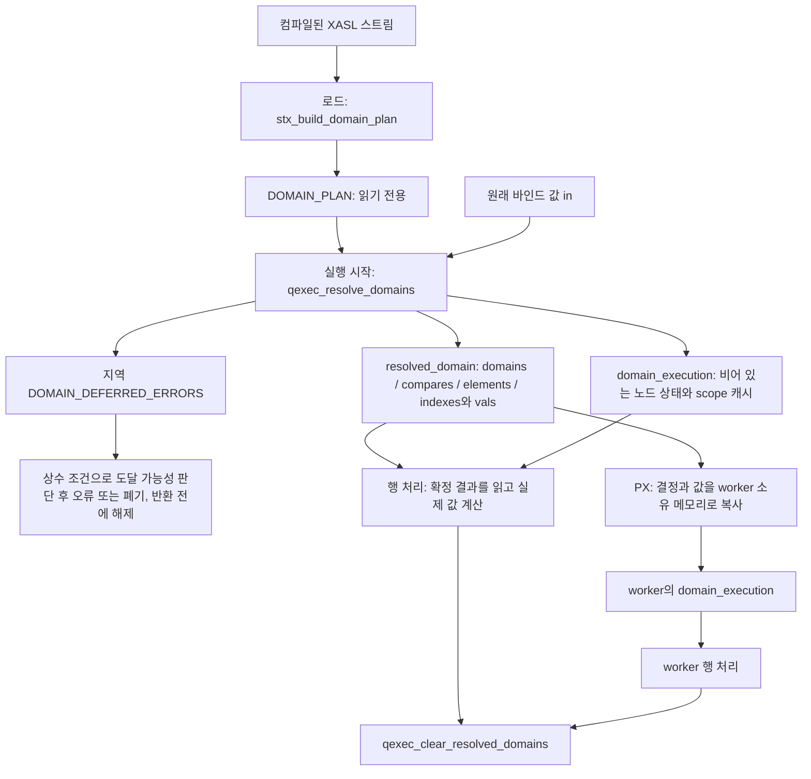

# PR #8022 도메인 상태 읽기: 기존 CUBRID 개발자를 위한 필드 가이드

기준: [CUBRID/cubrid#8022](https://github.com/CUBRID/cubrid/pull/8022), HEAD `d91666acd`, 2026-10-01.

이 문서는 **현재 구현을 설명한다.** `ca907aaed` 기준의 첫 판을 [정리 작업 명세](pr8022-compact-refactor-handoff.md)의 0~3단계 적용 뒤 구조(커밋 `be1e08e01`, `3ceafd994`, `88a438e17`)와 미사용 코드 정리(`c997c02d5`), 리뷰 반영(`ad7927e4e`, `5213742f3`, `d91666acd`)으로 고쳤다. 예시는 데이터 흐름을 설명하기 위한 것이다.

빠르게 찾아볼 곳: [실행 상태의 세 부분](#4-실행-상태-확정-결과-행이-바꾸는-상태-준비-중-오류), [SUM/AVG와 함수 노드의 실행 상태](#5-sumavg와-함수-노드가-따로-두는-것), [노드의 계획 항목](#9-domain_plan_item-각-노드가-붙잡는-작은-진입점), [전체 준비 목록](#10-domain_plan-전체-필드-준비-순서를-설명하는-목록들), [PX 복사 규칙](#12-px-복사에서-무엇을-유지하고-무엇을-다시-시작하는가).

## 1. 먼저 알아야 할 세 가지

`TP_DOMAIN`은 타입과 precision/scale, codeset/collation 등의 설명이다. `DB_VALUE`는 실제 값이다. 이 PR에서는 **어떤 타입으로 계산할지 결정하는 일**과 **실제 값을 계산·변환하는 일**을 분리한다. 타입 결정은 XASL 로드 또는 실행 시작에 끝내고, 행 처리는 정해진 변환 함수와 비교 함수를 사용한다. 값이 행마다 바뀌면 값 변환은 여전히 행마다 필요하다.

`DOMAIN_PLAN`은 XASL을 로드할 때 만드는 읽기 전용 실행 준비표다. 컴파일된 도메인으로 확정할 수 있는 내용과, 실행 때 바인드 등을 받아 확정해야 할 내용이 함께 있다. 여러 실행이 공유하는 XASL 노드에 실행별 도메인을 써넣지 않기 위한 설계다.

실행 상태는 수명에 따라 세 곳에 있다.

| 어디 | 무엇 | 수명 |
|---|---|---|
| `XASL_STATE.resolved_domain` (`RESOLVED_DOMAIN_TABLE`) | 실행 시작에 확정한 값·도메인·비교·ALL/SOME·인덱스 키 | 준비가 채우고, 행은 읽기만 한다 |
| `XASL_STATE.domain_execution` (`DOMAIN_EXECUTION_STATE`) | 노드가 채택한 실행 도메인·리스트 도메인·operand type, scope마다 한 번 변환한 값 | 행 처리 중에 바뀐다 |
| `DOMAIN_DEFERRED_ERRORS` (`qexec_resolve_domains`의 지역 변수) | 상수 분기 아래에서 보류한 준비 오류 | 한 번의 `qexec_resolve_domains` 호출 안에서만 산다 |

| 기존 코드에서 익숙한 대상 | 이 PR에서 찾아볼 곳 |
|---|---|
| 호스트 변수의 원래 `DB_VALUE` 배열 | `resolved_domain.in` |
| `VAL_DESCR.dbval_ptr`로 실행 중 읽는 값 | `resolved_domain.vals`와 `DOMAIN_PLAN_ITEM.ref` |
| 산술식·함수의 결과 타입과 피연산자 변환 | `RESOLVED_DOMAIN.domain`, `conv[]`, `operand_domain[]` |
| SUM/AVG가 값을 더할 때의 피연산자 변환 | `DOMAIN_OPERAND_COERCION` (aggregate는 `accumulator_domain.operand_coercion`, analytic은 `info.sum_avg.operand_coercion`) |
| 실행 중 노드에 기록하고 clear 때 복원하던 domain | `domain_execution.node_domains[]`와 노드 도메인 접근 함수 |
| aggregate/analytic의 `opr_dbtype` | `domain_execution.operand_types[]`와 `qexec_node_operand_type()` |
| `tp_value_compare_with_error()`의 타입 선택·변환 순서 | `DOMAIN_COMPARE` |
| `scan_dbvals_to_midxkey()`의 컬럼별 strict 변환/원형 유지 | `domain_plan_key_elem`과 `RESOLVED_KEY_ELEMENT` |
| 외부 행이 고정된 동안 반복 사용되는 상관 값의 변환 결과 | `domain_execution.temporaries[]` (`DOMAIN_EXECUTION_TEMPORARY`) |

## 2. 실행 흐름과 소유권



`qexec_resolve_domains()`는 지역 보류 오류 목록을 만들고 `qexec_resolve_domains_internal()`의 단계를 부른 뒤, 단계가 어떻게 끝났든 목록을 해제한다. 단계의 순서는 다음과 같다. 상수·세션 변수에 의존하는 항목은 해당 값이 준비되는 단계까지 기다린다.

1. 실행 상태를 할당하고 원래 입력을 `in`으로 보존한다. 실행용 값 배열을 `vals`로 연결한다.
2. 바인드 값의 참조를 준비하고, 가변 바인드의 도메인을 확정한다.
3. 피연산자가 먼저 오도록 정렬된 노드의 결과 도메인과 비교 방법을 확정한다.
4. 상수식을 평가하면서 그 값을 기다리던 도메인·비교를 확정한다.
5. 세션 변수의 문장 내 타입을 확정하고 그 타입에 의존하는 항목을 처리한다.
6. 인덱스 키의 상수 값과 컬럼별 변환 정책을 확정한다.
7. 미뤄둔 오류가 상수 조건상 도달 가능한지 판단한 후 반환한다.

**`frozen`은 위 3과 4 사이에서 `true`가 된다.** 상수식 평가도 기존 fetch 경로(`REGU_RESOLVED_VALUE()`, `qexec_late_bind_domain()`)를 쓰므로 그때부터 값과 결정을 읽을 수 있어야 하기 때문이다. 그 뒤에도 준비는 상수·세션 변수·인덱스 키가 정하는 결정을 계속 채운다. `frozen`은 "읽어도 된다"는 표시이며 "더 쓰지 않는다"는 뜻이 아니다. 행은 `qexec_resolve_domains()`가 성공한 뒤에 시작한다.

할당을 맡는 `owner`는 해당 실행의 `THREAD_ENTRY`다. `vals`, `domains`, `compares`, `elements`, `indexes`, `value_states`와 `domain_execution`의 노드 배열 세 개는 **한 할당 블록 안의 서로 다른 구간**이다. 그 블록의 해제 주소는 `resolved_domain.vals`다. 각각의 포인터를 따로 free하면 안 된다. 컬렉션 원소·인덱스 키의 하위 블록, `temporaries`, `scope_generations`는 별도 할당이다. `TP_DOMAIN` 포인터는 캐시 도메인을 참조하며 여기서 개별 해제하지 않는다. 보류 오류 목록은 실행 상태에 들어가지 않는다.

원래 입력 `in`은 빌린 배열이다. 일반 바인드는 `qexec_share_value()`로 payload를 공유할 수 있고, 계산·변환한 값은 실행이 관리한다. PX 복사에서는 worker가 사용할 값의 payload를 clone한다. 정리(`qexec_clear_resolved_domains`)는 각 `DB_VALUE`를 clear하고 소유 블록과 scope 캐시를 해제한 뒤 `vd.dbval_ptr`을 `in`으로 복원한다.

소스: [준비·할당·PX 복사](https://github.com/CUBRID/cubrid/blob/d91666acd69b2db8b4fbf42f2cdbe115bc774565/src/query/domain_resolve.c#L138), [실행 준비 본체](https://github.com/CUBRID/cubrid/blob/d91666acd69b2db8b4fbf42f2cdbe115bc774565/src/query/domain_resolve.c#L2616), [정리와 scope 처리](https://github.com/CUBRID/cubrid/blob/d91666acd69b2db8b4fbf42f2cdbe115bc774565/src/query/domain_resolve.c#L3042).

## 3. 서로 다른 인덱스를 구분하기

한 항목에 여러 인덱스가 있는 이유는 **타입 설명, 실제 값, 실행 중 노드 상태**가 서로 다른 배열에 있기 때문이다.

| 필드 | 가리키는 곳 | 없는 경우 | 주의점 |
|---|---|---|---|
| `DOMAIN_PLAN_ITEM.resolved_index` | `resolved_domain.domains[resolved_index]` | `-1` | 음수이면 `item.fixed`를 읽는다. `items[]`의 항목 번호와 다르다. |
| `DOMAIN_PLAN_ITEM.ref` | `resolved_domain.vals[ref]` | `-1` | 준비된 값의 위치다. 원래 바인드의 `val_pos`와 항상 같지는 않다. |
| `DOMAIN_PLAN_ITEM.node_domain_index` | `domain_execution.node_domains[node_domain_index - 1]` 등 | `0` | 1부터 시작한다. 세 노드 배열이 같은 번호를 쓴다. 아래 번호 순서를 보라. |
| `DOMAIN_COMPARE.compare_index` | `resolved_domain.compares[compare_index]` | `-1` | `LATE_BIND*`인 계획 비교가 실행별 비교를 찾는 번호다. |
| `DOMAIN_ELEMENT_COMPARE_PLAN.resolved_elements_index` | `resolved_domain.elements[resolved_elements_index]` | `-1` | 원소 번호가 아니라 ALL/SOME 비교 항목 번호다. |
| `domain_plan_index.resolved_keys_index` | `resolved_domain.indexes[resolved_keys_index]` | `-1` | 실행별 키 준비가 필요한 인덱스 스캔의 번호다. |
| `domain_plan_key_elem.resolved_element` | 해당 `RESOLVED_INDEX_KEYS.elements[]` | `-1` | 그 스캔 안에서의 키 컬럼 결정 번호다. |
| `temporaries[i]`라는 계획 필드의 값 | `domain_execution.temporaries[value - 1]` | `0` | `DOMAIN_PLAN_ITEM`과 `DOMAIN_COMPARE_PLAN`의 필드, aggregate의 `accumulator_domain.temporary`는 1부터 시작한다. |
| `constant_branch` | `plan.constant_branches[]` | `-1` | 가장 안쪽의 상수 조건 분기다. `parent`를 따라 바깥 조건도 검사한다. |

**노드 번호 순서.** 로드는 `node_domain_index`를 MEDIAN/PERCENTILE aggregate에 먼저, 그다음 나머지 aggregate와 analytic 함수에, 마지막으로 다른 노드에 매긴다. 그래서 리스트 도메인은 앞의 `n_interpolation_list_domains`개, operand type은 앞의 `n_operand_types`개 항목만 가지며, 세 배열은 여전히 같은 번호로 읽는다. 접근 함수는 debug 빌드에서 이 범위를 assert한다.

예를 들어 `item.resolved_index == 5`, `item.ref == 12`, `item.node_domain_index == 3`이라면 결과 타입·변환은 `resolved_domain.domains[5]`, 준비된 실제 값은 `resolved_domain.vals[12]`, 노드의 실행 도메인은 `domain_execution.node_domains[2]`에 있다. 그 노드가 aggregate라면 operand type도 `operand_types[2]`에 있다. 이 숫자들은 설명용이다.

## 4. 실행 상태: 확정 결과, 행이 바꾸는 상태, 준비 중 오류

### 4.1 RESOLVED_DOMAIN_TABLE (`XASL_STATE.resolved_domain`)

정의: [domain_plan.h의 RESOLVED_DOMAIN_TABLE](https://github.com/CUBRID/cubrid/blob/d91666acd69b2db8b4fbf42f2cdbe115bc774565/src/query/domain_plan.h#L448). 준비(`qexec_resolve_domains`)가 채우고 행은 읽기만 한다. 16개 필드, 104바이트(LP64). `XASL_STATE`는 두 멤버를 합쳐 232바이트다(이전 240).

| 필드 | 무엇인가 | 누가 쓰고 누가 읽는가 / 수명 |
|---|---|---|
| `in` | 이번 실행에 전달된 원래 `DB_VALUE` 배열. 변환 전 입력을 보존한다. | 초기화에서 기존 `vd.dbval_ptr`을 보관한다. 준비 함수·result cache·DBLINK 등 원래 입력을 필요로 하는 경로가 읽는다. 빌린 배열이며 여기서 해제하지 않는다. |
| `vals` | 실행용 값 배열. 바인드 참조, 상수식 결과, 비교를 위해 한 번 변환한 상수 등이 들어간다. 동시에 공통 할당 블록의 시작 주소다. | 준비 함수가 채우고 `vd.dbval_ptr`/`REGU_RESOLVED_VALUE()`로 읽는다. 실행 종료까지 유지하고 각 값을 clear한 뒤 블록을 해제한다. |
| `domains` | 가변 바인드·노드의 `RESOLVED_DOMAIN` 배열. | 준비 함수가 채우고, 행에서는 `qexec_late_bind_domain()`이 읽는다(fetch의 산술 `fetch_arith_binary()`, 분기 결과 변환 `fetch_convert_to_resolved_branch()`, 세션 변수 읽기 `fetch_session_read_value()`). aggregate·analytic은 준비·첫 값에서 `qexec_resolved_domain()`으로 읽는다. 고정 항목은 이 배열 대신 `item.fixed`를 직접 읽는다. |
| `n_vals` | `vals`와 `value_states`의 길이. | `max(vd.dbval_cnt, plan.n_refs)`. 실제 입력 수가 계획의 참조 수보다 클 수 있다. |
| `n_resolved` | `domains` 길이. | 정상 구성에서는 `plan.n_resolved`와 같다. |
| `n_compare_indexes` | `compares` 길이. | 실행별 확정이 필요한 비교 수다. |
| `n_elements` | `elements` 길이. | `plan.n_element_comparisons`에 대응한다. **컬렉션 원소 개수가 아니다.** |
| `owner` | 이 실행 상태를 할당·해제하고 변경할 thread. | 초기화/PX 복사에서 설정한다. `domain_execution`의 쓰기와 정리도 이 thread만 한다. |
| `plan` | 이 실행의 준비를 설명하는 읽기 전용 `DOMAIN_PLAN`. | 초기화에서 연결한다. PX 복사도 leader의 포인터를 보존한다. |
| `frozen` | 값과 결정을 읽어도 된다는 표시. | 상수식 평가 직전에 설정한다. `REGU_RESOLVED_VALUE()`와 `qexec_owns_resolved_index()`(`qexec_late_bind_domain()`이 부른다)가 debug 빌드에서 assert로 검사한다. 2절의 설정 시점을 보라. |
| `copied_from_leader` | PX worker가 leader의 확정 결과를 복사받았다는 표시. | worker가 같은 스트림을 따로 로드하여 항목 포인터가 달라도 동일한 번호로 접근하는 것을 소유권 검사에서 허용한다. |
| `compares` | 이번 실행에 확정한 `DOMAIN_COMPARE` 배열. | `qexec_resolve_compare()`가 채우고 predicate·산술 비교 경로가 읽는다. |
| `elements` | ALL/SOME 비교별 `DOMAIN_ELEMENTS`. | `qexec_resolve_elements()`가 채운다. 원소 값·비교 하위 블록은 별도 소유한다. |
| `value_states` | 각 `vals` 위치의 상수식 준비 상태: `PENDING`(할당 시 초기값), `EVALUATED`, `FAILED`. | 상수 평가가 갱신한다. 행 fetch도 `EVALUATED`를 읽으므로 준비 전용 배열이 아니다. PX에도 복사한다. |
| `indexes` | 실행별 준비가 필요한 인덱스 스캔의 `RESOLVED_INDEX_KEYS` 배열. | `qexec_resolve_index_keys()`가 채운다. 각 스캔의 하위 블록은 별도 소유한다. |
| `n_indexes` | `indexes` 길이. | `plan.n_resolved_index_keys`에 대응한다. |

### 4.2 DOMAIN_EXECUTION_STATE (`XASL_STATE.domain_execution`)

정의: [domain_plan.h의 DOMAIN_EXECUTION_STATE](https://github.com/CUBRID/cubrid/blob/d91666acd69b2db8b4fbf42f2cdbe115bc774565/src/query/domain_plan.h#L482). 준비가 빈 상태로 할당하고 행이 채운다. 10개 필드, 64바이트(LP64). 접근 함수는 `vd->xasl_state->domain_execution`을 읽으며, `resolved_domain`을 읽던 때와 포인터를 따라가는 단계 수가 같다.

| 필드 | 무엇인가 | 누가 쓰고 누가 읽는가 / 수명 |
|---|---|---|
| `node_domains` | 노드가 이번 실행에서 채택한 도메인. 원래 XASL 노드에 쓰던 실행별 domain의 대체 저장소다. | 초기값 `NULL`. 소비자 설정이나 노드의 첫 계산에서 `qexec_set_node_domain()`으로 기록하고 `qexec_get_node_domain()`으로 읽는다. |
| `interpolation_list_domains` | MEDIAN/PERCENTILE aggregate의 리스트 값과 정렬 키에 쓰는 도메인. 최종 결과 도메인과 다를 수 있다. | 초기값 `NULL`. `qexec_setup_interpolation_list()`가 기록한다. 길이는 `n_interpolation_list_domains`. |
| `operand_types` | aggregate/analytic가 사용하는 실행별 `opr_dbtype`. | 초기값 `-1`. 준비/첫 값 처리에서 채택하고 `qexec_node_operand_type()`으로 읽는다. 길이는 `n_operand_types`. |
| `n_node_domains` | `node_domains` 길이. | `plan.n_node_domains`. |
| `n_operand_types` | `operand_types` 길이: aggregate와 analytic 함수의 수. | `plan.n_operand_types`. 이 함수들이 앞 번호를 받는다(3절). |
| `n_interpolation_list_domains` | `interpolation_list_domains` 길이: MEDIAN/PERCENTILE aggregate의 수. | `plan.n_interpolation_list_domains`. |
| `temporaries` | 한 실행 또는 상관 scope에서 고정된 값을 같은 타입으로 반복 변환하지 않기 위한 배열. | 최초 사용 시 `qexec_execution_temporary()`가 변환한다. worker는 빈 캐시로 시작한다. 별도 할당. |
| `scope_generations` | scope가 시작/재시작된 횟수. | 실행 scope 0은 1, 나머지는 0으로 시작한다. `qexec_enter_temporary_scope()`가 늘린다. 별도 할당. |
| `n_temporaries` | `temporaries` 길이. | `plan.n_temporaries`. |
| `n_scopes` | `scope_generations` 길이. | 실행 scope 하나와 상관 값이 고정되는 block scope들. |

### 4.3 DOMAIN_DEFERRED_ERRORS (`qexec_resolve_domains`의 지역 목록)

정의: [domain_resolve.c의 DOMAIN_DEFERRED_ERRORS](https://github.com/CUBRID/cubrid/blob/d91666acd69b2db8b4fbf42f2cdbe115bc774565/src/query/domain_resolve.c#L455)와 [DOMAIN_DEFERRED_ERROR](https://github.com/CUBRID/cubrid/blob/d91666acd69b2db8b4fbf42f2cdbe115bc774565/src/query/domain_resolve.c#L441). 실행 상태에 들어가지 않는다.

| 필드 | 무엇인가 | 누가 쓰고 누가 읽는가 / 수명 |
|---|---|---|
| `errors` | 상수 조건 안에서 발생하여 도달 가능성을 확인할 때까지 보류한 오류 기술 목록. | 오류를 미루는 준비 함수가 매개변수로 받아 `qexec_defer_constant_error()`로 추가하고, 마지막 `qexec_raise_deferred_errors()`가 읽는다. `qexec_resolve_domains()`가 반환 전에 해제한다(조기 반환 포함). PX로 복사하지 않는다. |
| `n_errors` | 현재 개수. | 추가와 마지막 검사가 사용한다. |
| `max_errors` | 할당된 수용량. | 목록 확장에 사용한다. |

## 5. SUM/AVG와 함수 노드가 따로 두는 것

SUM/AVG는 첫 값 뒤에 들어오는 값을 누적 값에 더할 때 `qdata_add_dbval`이 값의 타입으로 하던 피연산자 변환을 준비 때 정한다. 이 변환은 두 입력의 converter와 target이면 충분하다.

정의: [DOMAIN_OPERAND_COERCION](https://github.com/CUBRID/cubrid/blob/d91666acd69b2db8b4fbf42f2cdbe115bc774565/src/query/domain_rules.h#L74).

| 필드 | 뜻 |
|---|---|
| `conv[2]` | 피연산자 i의 변환 함수. `NULL`이면 변환하지 않는다. |
| `operand_domain[2]` | 피연산자 i의 변환 대상 도메인. |

- `domain_resolve_operand_coercion()`이 이 구조를 채운다. 산술 노드의 `RESOLVED_DOMAIN`도 같은 두 쌍을 `conv[]`/`operand_domain[]`에 담으므로, `qdata_coerce_arith_operands()`는 두 배열을 인자로 받아 어느 쪽이든 그대로 읽는다. 행마다 한쪽 모양을 다른 모양으로 만들지 않는다.
- aggregate는 `accumulator_domain.operand_coercion`에 둔다. `accumulator_domain`은 해시 GROUP BY·PX helper가 통째로 받고, XASL clear가 모든 aggregate의 `info.percentile.percentile_reguvar`를 읽으므로 aggregate의 `info` union으로 옮기지 않는다.
- analytic은 함수별 union의 `info.sum_avg.operand_coercion`에 둔다. 다른 멤버(`ntile`, `percentile`, `cume_percent`)를 읽는 곳은 모두 함수 종류를 먼저 검사하고, 스트림은 PERCENTILE의 비율 regu만 기록한다. `qdata_initialize_analytic_func()`는 partition마다 SUM/AVG일 때만 이 멤버를 쓴다.

| 노드 | 이전 | 현재 (LP64 release) |
|---|---|---|
| `aggregate_accumulator_domain` | 80 B (`RESOLVED_DOMAIN operand_coercion`) | 56 B |
| `aggregate_list_node` | 264 B | 240 B |
| `analytic_function_info` (union) | 16 B + 노드의 별도 56 B `RESOLVED_DOMAIN` | 32 B |
| `analytic_list_node` | 424 B | 384 B |

## 6. 확정된 도메인과 비교: 행이 실행할 작업

### 6.1 RESOLVED_DOMAIN

정의: [domain_rules.h의 RESOLVED_DOMAIN](https://github.com/CUBRID/cubrid/blob/d91666acd69b2db8b4fbf42f2cdbe115bc774565/src/query/domain_rules.h#L37). 로드 또는 `domain_resolve()`가 채운다. `DOMAIN_PLAN_ITEM.fixed`와 실행의 `domains[]`가 같은 구조를 사용한다.

| 필드 | 뜻 |
|---|---|
| `domain` | 이 식/함수의 결과 도메인. |
| `conv[3]` | 규칙이 정한 피연산자 변환 함수. `NULL`이면 해당 변환이 없다. 변환 모드는 ARITH/ASSIGN/COMPARE 등 문맥에서 선택된다. |
| `operand_domain[3]` | 각 변환 함수의 대상 도메인. 결과 도메인과 반드시 같지는 않다. |

산술식에서는 보통 `conv[i]`가 피연산자 i를 `operand_domain[i]`로 변환한다. aggregate에서는 `operand_domain[0]`이 accumulator 도메인이다. 문자열 분기의 collation 병합에서는 `conv[0]`/`conv[1]`이 VARCHAR/CHAR 경로를 뜻한다. 따라서 이 배열을 모든 경우에 단순한 첫 번째/두 번째 SQL 인자로 해석하면 안 된다. 배열 길이 3은 개별 규칙의 고정 결과 저장 공간이며, 함수의 전체 인자 목록은 `DOMAIN_LATE_BIND_LINK`의 별도 배열에 있다.

### 6.2 DOMAIN_COMPARE_KEY와 DOMAIN_OPERAND

정의: [DOMAIN_OPERAND와 DOMAIN_COMPARE_KEY](https://github.com/CUBRID/cubrid/blob/d91666acd69b2db8b4fbf42f2cdbe115bc774565/src/query/domain_rules.h#L44). `DOMAIN_OPERAND`는 도메인 규칙을 호출할 때 만드는 입력이다. 실행 상태에 저장하는 최종 결과가 아니다.

| 구조.필드 | 뜻 |
|---|---|
| `DOMAIN_OPERAND.domain` | 로드에서는 계획 도메인, 실행 준비에서는 확정된 값/노드의 도메인. |
| `DOMAIN_OPERAND.val_type` | MEDIAN/ADDTIME/STR_TO_DATE 등의 값에 따라 달라지는 인자 분류. 로드 시 또는 값 분류가 없으면 `DB_TYPE_NULL`. |
| `DOMAIN_OPERAND.coll_id` | 문자열 인자의 collation ID. 그 외에는 `-1`. |
| `DOMAIN_OPERAND.is_variable_pos` | 컴파일 때 가변이던 위치를 실행 준비가 확정하는지 표시한다. |
| `DOMAIN_COMPARE_KEY.type` | 비교할 값의 타입. |
| `DOMAIN_COMPARE_KEY.codeset` | 문자열/ENUM의 codeset. |
| `DOMAIN_COMPARE_KEY.collation` | 문자열/ENUM의 collation. |

비교 key는 타입·codeset·collation으로 **어떤 비교 정책을 쓸지** 찾기 위한 요약이다. 값 변환 대상의 전체 precision/scale 등을 표현하는 `TP_DOMAIN`과 용도가 다르다.

### 6.3 DOMAIN_COMPARE

정의: [DOMAIN_COMPARE](https://github.com/CUBRID/cubrid/blob/d91666acd69b2db8b4fbf42f2cdbe115bc774565/src/query/domain_rules.h#L163). 로드의 `domain_resolve_comparison()` 또는 실행 준비가 채운다. 비교 evaluator와 `domain_compare_values()`가 읽는다. `[0]`은 왼쪽, `[1]`은 오른쪽이다. 72바이트이며 행이 읽는 필드는 앞 64바이트에 있다.

| 필드 | 뜻 |
|---|---|
| `operator_functions` | 관계 연산자 `REL_OP`별 실행 함수 표. DIRECT 비교 항목은 해당 연산자의 함수를 바로 고른다. `NULL`이면 기존 `eval_value_rel_cmp` 경로를 쓴다. |
| `cmp` | 비교할 최종 타입의 `pr_type`. 실제 값 비교에 `cmpval`을 사용한다. |
| `conv[2]` | 각 측의 변환 함수. `NULL`이면 변환하지 않는다. |
| `target[2]` | 각 측의 변환 대상 도메인. |
| `value[2]` | 준비 중 변환한 상수의 `vals` 위치. `-1`은 행에서 받은 값, `-2`는 준비 함수가 소유한 컬렉션 원소 값을 뜻한다. |
| `collation` | `cmpval`에 전달할 collation. 문자열이 아니면 0. |
| `method` | 실행 방식: DIRECT, CONVERT, COLLATIONS, OBJECT, RANK, VALUES, KEYS. 계획의 LATE_BIND는 실행의 확정 항목을 찾아야 한다는 표시이고, LATE_BIND_SESSION은 그 비교가 세션 변수 읽기에 걸려 있어 세션 변수 단계에서 확정된다는 표시다. |
| `coercion` | 기존 비교가 `cmpval`에 주던 `do_coercion`. |
| `compare_index` | 계획이 LATE_BIND*일 때 사용할 실행의 `compares[]` 위치. 그 외에는 `-1`. |
| `first` | 기존 코드가 먼저 변환하던 측. 두 변환의 순서가 오류와 rank 결과에 영향을 준다. |
| `source[2]` | 변환 전 양측의 `DB_TYPE`. 변환 실패 시 오류의 타입 이름과 rank를 재현한다. |
| `converted_first` | 첫 변환이 성공한 뒤 그 측의 타입. 두 번째 변환이 실패했을 때 기존 결과를 재현한다. |
| `failed` | 준비 중 변환에 실패한 상수 측의 비트. Predicate term은 준비 오류, term 밖의 비교는 기존 rank 결과를 유지한다. |
| `rank` | RANK 방법의 미리 정한 `DB_LT`/`DB_GT` 결과. |
| `codeset_side` | 다른 codeset의 문자열을 ENUM 쪽으로 맞춰야 하는 측. 없으면 `-1`. |

`source`, `first`, `converted_first`, `failed`, `rank`는 같은 정보를 중복 저장한 필드가 아니다. 변환 전 타입, 첫 변환 성공 후 타입, 실패 지점이 각각 다르다. 이를 하나로 합치면 `ER_TP_CANT_COERCE`의 타입 이름 순서나 term 밖 비교 결과가 달라질 수 있다.

### 6.4 DOMAIN_ELEMENTS: IN/ALL/SOME의 오른쪽 값 읽기

정의: [DOMAIN_ELEMENTS](https://github.com/CUBRID/cubrid/blob/d91666acd69b2db8b4fbf42f2cdbe115bc774565/src/query/domain_plan.h#L236).

| 필드 | 뜻 |
|---|---|
| `value` | POSITIONS 방식의 상수 컬렉션 원소 `[n]`. 준비 함수가 소유한 복사이며 필요한 원소는 미리 변환한다. |
| `element_compare` | POSITIONS 방식에서 원소 위치별로 사용할 `compares[]`의 번호 `[n]`. 같은 비교 정책을 공유할 수 있다. |
| `compares` | POSITIONS에서는 중복을 합친 비교 정책들. PAIR에서는 하나의 비교 정책 `compares[0]`. |
| `row` | ROW 방식에서 전역 타입 쌍 비교 표의 왼쪽 타입 행 번호. `-1`이면 양쪽 값의 key로 표를 찾는다. |
| `n` | POSITIONS 방식의 실제 원소 수. |
| `n_compares` | 보관한 비교 정책 수. 원소 수와 다를 수 있다. |
| `read` | NONE: NULL 상수, POSITIONS: 상수 원소별, ROW: 행이 만든 컬렉션의 각 원소 타입으로 표 조회, PAIR: 단일 정책. |

행이 만든 컬렉션의 원소 타입은 데이터마다 다를 수 있다. ROW/KEYS가 타입 쌍 표를 조회하는 것은 이 경우의 사전 계산된 비교 정책을 선택하는 경로다. 일반 식의 도메인을 행마다 다시 추론하는 경로로 되돌리면 안 된다. [ADR-0024](../adr/0024-comparison-resolution-is-a-type-pair-table-cell.md)의 계약을 따른다.

## 7. 인덱스 키: 스캔, 범위, 컬럼의 세 단계

정의: [키 계획과 실행별 키 결정](https://github.com/CUBRID/cubrid/blob/d91666acd69b2db8b4fbf42f2cdbe115bc774565/src/query/domain_plan.h#L269). 계획은 로드가 만들고, CONSTANT/LATE_BIND 부분을 `qexec_resolve_index_keys()`가 실행별로 채운다. 행 scan은 그 정책으로 키를 작성한다.

```text
domain_plan_index (인덱스 스캔 하나)
  bounds[2 * n_ranges + 1]
    각 범위의 key1, key2 / 마지막은 index skip scan용
      domain_plan_key.elems[n_elems] (인덱스 컬럼 순서)

RESOLVED_INDEX_KEYS (이번 실행에 확정한 부분)
  elements[n_elements]  : 상수 또는 가변 컬럼의 결정
  domains[n_bounds]    : 상수 복합 키의 최종 도메인
```

| 구조.필드 | 뜻 |
|---|---|
| `domain_plan_index.key_type` | 실제 B-tree 키 도메인. 복합 키에는 컬럼별 domain과 ASC/DESC 방향이 있다. |
| `domain_plan_index.asc_key_type` | 모든 컬럼을 ASC로 만든 도메인. Multi-range optimization의 정렬에 쓴다. |
| `domain_plan_index.bounds` | 각 범위의 양 끝과 skip scan용 끝 하나. 길이는 `2 * n_ranges + 1`. |
| `domain_plan_index.n_ranges` | 키 범위 수. |
| `domain_plan_index.n_resolved_elements` | 실행 준비가 확정할 CONSTANT/LATE_BIND 컬럼 수. |
| `domain_plan_index.n_mixed_key_caches` | 원래 타입으로 유지될 컬럼이 있어 혼합 도메인을 캐시해야 하는 bound 수. |
| `domain_plan_index.resolved_keys_index` | 실행의 `indexes[]` 위치. 실행별 준비가 없으면 `-1`. |
| `domain_plan_index.constant_branch` | 이 스캔을 감싸는 가장 안쪽 상수 조건. 상수 키 오류의 도달 가능성 판단에 쓴다. |
| `domain_plan_index.other_keys` | 키 컬럼이 인덱스 컬럼과 그대로 비교할 수 없는 type/collation의 값을 받을 수 있는지. 해당 비교는 타입 쌍 표를 쓴다. |
| `domain_plan_key.elems` | 한 bound의 컬럼별 계획 `[n_elems]`. |
| `domain_plan_key.n_elems` | bound의 컬럼 수. bound가 없으면 0. |
| `domain_plan_key.mixed_key_cache` | scan의 키 상태 안에서 혼합 도메인을 보관할 위치. 없으면 `-1`. |
| `domain_plan_key.midxkey` | 복합 키 `F_MIDXKEY` 여부. |
| `domain_plan_key.constant` | 모든 컬럼이 CONSTANT여서 bound의 도메인까지 실행 준비에 한 번 구성할 수 있는지. |
| `domain_plan_key_elem.regu` | 해당 컬럼 값을 얻는 regu. skip scan에서 인덱스로부터 얻는 skip 값이면 `NULL`. |
| `domain_plan_key_elem.index_elem` | 인덱스의 해당 컬럼 도메인. |
| `domain_plan_key_elem.keep_elem` | 값을 원래 타입으로 유지할 때 쓸 도메인. 인덱스 컬럼의 ASC/DESC 방향을 적용한다. |
| `domain_plan_key_elem.strict_conv` | STRICT 정책의 변환 함수. 인덱스 컬럼 도메인으로 엄격하게 변환한다. |
| `domain_plan_key_elem.resolved_element` | 실행의 해당 키 결정 배열 안에서의 위치. 실행별 결정이 없으면 `-1`. |
| `domain_plan_key_elem.rule` | INDEX: 컬럼 도메인, STRICT: 엄격 변환 후 실패하면 원형 유지, KEEP: 원래 도메인, CONSTANT/LATE_BIND: 준비 함수가 값/도메인으로 확정. |
| `domain_plan_key_elem.shared` | 같은 바인드를 쓰는 key2가 같은 컬럼의 key1 상수 결정을 재사용하는지. |
| `RESOLVED_INDEX_KEYS.elements` | CONSTANT/LATE_BIND 컬럼들의 이번 실행 결정 `[n_elements]`. |
| `RESOLVED_INDEX_KEYS.domains` | 상수 복합 bound의 최종 도메인 `[n_bounds]`. 인덱스 도메인 또는 유지된 타입이 섞인 캐시 도메인. |
| `RESOLVED_INDEX_KEYS.n_elements` | 위 컬럼 결정 배열의 길이. |
| `RESOLVED_INDEX_KEYS.n_bounds` | 위 bound 도메인 배열의 길이. |
| `RESOLVED_INDEX_KEYS.other_keys` | 이번 실행 값까지 고려한 다른 비교 key 허용 여부. B-tree 비교 상태로 전달한다. |
| `RESOLVED_KEY_ELEMENT.value` | CONSTANT에서 실제 키에 쓸 준비된 값. 변환된 값 또는 원형 유지된 값. |
| `RESOLVED_KEY_ELEMENT.domain` | CONSTANT의 값이 복합 키에 기록될 도메인. 변환 성공 시 컬럼 도메인, 유지 시 방향을 반영한 원래 도메인. |
| `RESOLVED_KEY_ELEMENT.keep_elem` | LATE_BIND에서 값을 원형 유지할 때 쓸 방향 포함 도메인. |
| `RESOLVED_KEY_ELEMENT.strict_conv` | LATE_BIND 결과가 STRICT일 때 사용할 변환 함수. |
| `RESOLVED_KEY_ELEMENT.rule` | 가변 컬럼 도메인에서 확정한 INDEX/STRICT/KEEP 정책. 도메인을 주는 값이 NULL뿐이면 LATE_BIND 표시가 남을 수 있다. |
| `RESOLVED_KEY_ELEMENT.kept` | CONSTANT의 값이 원래 타입으로 유지되어 복합 키가 혼합 도메인을 필요로 하는지. |
| `DOMAIN_SEARCH_KEYS` | B-tree 비교가 읽는 세 값의 enum으로 값 전달된다(`BTID_INT.search_keys`). NONE: 질의 계획 밖의 B-tree 검색(값끼리 비교), OWN: 모든 값이 컬럼 자신의 key라 인덱스와 그대로 비교, OTHER: 다른 key를 받는 컬럼이 있어 타입 쌍 표로 비교. midxkey 원소 비교 콜백은 문맥 인자 없이 OWN용과 OTHER용 두 함수다. |

`STRICT`는 모든 실패를 문장 오류로 만드는 뜻이 아니다. **엄격 변환을 시도한 후 실패한 컬럼의 원래 타입을 유지하는 기존 복합 키 동작**이다. 한 컬럼은 INT로 변환되고 다른 컬럼은 DOUBLE로 유지되는 혼합 키가 가능하다. 하나의 키 전체에 strict/keep 하나를 적용하거나 유지 도메인을 모두 인덱스 도메인으로 바꾸면 결과·정렬·오류가 달라질 수 있다.

## 8. scope 변환 캐시와 보류 오류의 하위 필드

### 8.1 DOMAIN_EXECUTION_TEMPORARY

정의: [DOMAIN_EXECUTION_TEMPORARY](https://github.com/CUBRID/cubrid/blob/d91666acd69b2db8b4fbf42f2cdbe115bc774565/src/query/domain_plan.h#L414). `domain_execution.temporaries[]`의 원소다. 준비 시 빈 상태로 할당한다. 최초 행 사용이 값을 변환하고 이후 같은 generation은 재사용한다. release 88바이트, debug 104바이트.

| 필드 | 뜻 |
|---|---|
| `generation` | 캐시 값이 만들어진 scope generation. 0은 아직 변환하지 않았음을 뜻한다. |
| `converted` | 재사용 가능한 결과의 주소 `&value`. `NULL`이면 아직 변환하지 않았거나 캐시 시도가 실패하여 행의 기존 변환 경로를 사용한다. |
| `scope` | 이 값이 고정되는 scope 번호. `plan.temporary_scope[]`를 항목에 복사하여 접근한다. |
| `value` | 캐시가 소유한 변환된 `DB_VALUE`. 재변환/종료 시 clear한다. |
| `conv`, `target` | **debug 빌드에만 있다.** 이 generation에서 쓴 변환 함수와 대상 도메인. 재사용하는 읽기가 같은 변환을 요청하는지 assert한다. |

외부 행의 값 `outer.s`를 내부 스캔의 여러 행과 비교한다고 하자. 계획은 변환 정책을 정한다. 외부 행이 바뀌면 scope generation이 증가한다. 새 generation의 **첫 실제 사용**이 `outer.s`를 변환하고 이후 내부 행은 재사용한다. Scope 시작에서 바로 변환하면 외부 값이 아직 준비되지 않았거나 실제로 읽지 않을 값을 계산할 수 있으므로, 시작에서는 generation만 바꾼다.

`converted == NULL`을 `DB_IS_NULL(&value)`로 대체하면 안 된다. NULL 값을 성공적으로 변환한 상태와, 변환 실패로 행의 원래 경로를 써야 하는 상태가 다르다. 실패한 generation도 기록하여 불필요한 캐시 재시도를 피하고, 실제 오류는 기존 행 처리의 순서대로 발생하게 한다.

### 8.2 DOMAIN_DEFERRED_ERROR와 상수 분기

정의: [분기 종류와 계획](https://github.com/CUBRID/cubrid/blob/d91666acd69b2db8b4fbf42f2cdbe115bc774565/src/query/domain_plan.h#L164), [DOMAIN_DEFERRED_ERROR](https://github.com/CUBRID/cubrid/blob/d91666acd69b2db8b4fbf42f2cdbe115bc774565/src/query/domain_resolve.c#L441)는 domain_resolve.c에 있다.

| 구조.필드 | 뜻 |
|---|---|
| `DOMAIN_PLAN_CONSTANT_BRANCH.selector` | 조건을 평가할 PRED_EXPR, REGU_VARIABLE 또는 XASL_NODE. 실제 타입은 `kind`로 정해진다. |
| `DOMAIN_PLAN_CONSTANT_BRANCH.parent` | 바깥 상수 분기 번호. 없으면 `-1`. |
| `DOMAIN_PLAN_CONSTANT_BRANCH.kind` | CASE/IF/DECODE의 true/not-true, NULL/not-NULL, AND의 not-false, OR의 not-true, 최상위 LIMIT 조건 중 하나. |
| `DOMAIN_DEFERRED_ERROR.compare` | COMPARE 오류에서 실패한 비교의 확정 정책. |
| `DOMAIN_DEFERRED_ERROR.constant_branch` | 오류가 발생한 가장 안쪽 상수 분기. |
| `DOMAIN_DEFERRED_ERROR.index` | CONSTANT 오류에서 `plan.constant_expressions[]`의 위치. |
| `DOMAIN_DEFERRED_ERROR.arg` | COMPARE는 key-range term 여부, KEY는 첫 타입, ARGUMENT_TYPE은 함수 종류. |
| `DOMAIN_DEFERRED_ERROR.arg2` | KEY 오류의 두 번째 타입. 기존 오류의 타입 이름 순서를 보존한다. |
| `DOMAIN_DEFERRED_ERROR.kind` | CONSTANT, COMPARE, KEY, ARGUMENT_TYPE 중 오류 종류. |
| `DOMAIN_DEFERRED_ERROR.failed` | COMPARE에서 변환 실패한 상수 측의 비트. |

상수식 오류를 모두 즉시 발생시키면, 상수 조건상 선택될 수 없는 CASE arm에서도 새 오류가 생긴다. 반대로 행이 어느 분기를 택할지 기다리면 실행 전 오류라는 계약을 잃는다. 현재 구현은 상수 조건으로만 도달 가능성을 판단한다. **행 조건의 미선택 분기나 결과 0행은 일반 상수 오류를 없애는 근거가 아니다.** Interrupt/OOM도 이 목록으로 미루지 않는다.

예를 들어 바인드만으로 CASE 조건이 확정되어 오류가 있는 arm에 도달할 수 없으면 그 오류를 내지 않는 것이 목표다. 테이블 컬럼에 따라 arm을 고르면 어느 행이든 도달할 수 있으므로, 준비 중 발견한 상수 오류는 실행 전 오류다. 이 차이가 오류 목록과 상수 분기 계획을 별도로 둔 이유다. 오류 기술은 완성된 메시지 복사본이 아니며, 마지막 단계에서 원래 오류를 재현하기 위해 상수 평가를 다시 할 수도 있다.

## 9. DOMAIN_PLAN_ITEM: 각 노드가 붙잡는 작은 진입점

정의: [DOMAIN_PLAN_ITEM과 cold 부분](https://github.com/CUBRID/cubrid/blob/d91666acd69b2db8b4fbf42f2cdbe115bc774565/src/query/domain_plan.h#L71). 모두 로드가 작성한다. 실행 중 변경하지 않는다. 현재 크기 계약은 item 80바이트, cold 16바이트다. 노드(REGU_VARIABLE, ARITH_TYPE, QFILE_TUPLE_VALUE_POSITION, AGGREGATE_TYPE, ANALYTIC_TYPE)는 항목을 `plan_item` 멤버로 가리키고, INDX_INFO는 키 계획을 `key_plan` 멤버로 가리킨다. `XASL_NODE.domain_plan`만 `DOMAIN_PLAN` 전체다.

| 필드 | 뜻 |
|---|---|
| `resolved_index` | 실행별 도메인이 필요한 항목의 `domains[]` 위치. `-1`이면 `fixed`. |
| `ref` | 이 참조가 읽을 준비된 값의 `vals[]` 위치. 값 참조가 없으면 `-1`. |
| `flags` | 별도 역할/해석을 표시하는 아래 비트들. |
| `operand_class` | CONST: 실행 동안 고정, ROW: 현재 block의 행마다 변화, CORRELATED: 바깥 block의 scope 동안 고정, NON_CACHEABLE: fetch를 상수 캐시로 바꾸면 안 되는 값. |
| `node_domain_index` | `domain_execution`의 세 노드 배열의 공통 1-based 번호. 0이면 없다. |
| `fixed` | 로드에 확정한 `RESOLVED_DOMAIN`. 결과뿐 아니라 별도 피연산자 대상 도메인과 변환 함수도 담는다. |
| `compares` | union의 비교 용도. FIELD/NULLIF/LEAST/GREATEST가 사용할 계획 비교들의 포인터 배열. |
| `temporaries[2]` | union의 캐시 용도. 산술 양측 또는 SUM/AVG의 입력 변환 캐시 번호. 1-based이며 0이면 없다. |

`compares`와 `temporaries`는 **같은 union 공간**이다. 노드 opcode가 어떤 쪽을 사용하는지 정한다. 또한 `fixed`를 가변 항목에서 항상 안 쓰는 공간으로 취급하면 안 된다. 가변 노드도 컴파일된 결과·변환 제약을 준비 과정에서 사용할 수 있다.

| DOMAIN_PLAN_ITEM_COLD 필드 | 뜻 |
|---|---|
| `val_pos` | 원래 입력 `in[]`에서의 바인드 위치. 바인드가 아니면 `-1`. `ref`는 변환별 보조 위치일 수 있다. |
| `ctx` | 이 참조가 필요한 규칙의 문맥: ARITH, COMPARE, ASSIGN, COMMON_VALUE, AGG, ANALYTIC, FUNC_ARG, LIST_COLUMN, KEY_ELEM. |
| `opcode` | 그 문맥의 연산/함수 코드. AGG/ANALYTIC는 FUNC_CODE, 산술 등은 해당 OPERATOR_TYPE. |
| `constant_branch` | 해당 항목을 감싸는 가장 안쪽 상수 분기. |
| `synthetic` | XASL 노드가 가리키지 않는 집합 연산·CTE 리스트 컬럼 항목. 로드의 미확정 검사는 이 항목 대신 그 소비자를 검사한다. |

### flags의 현재 의미

쓰이지 않던 KEY1(0x02), KEY2(0x04), ISS(0x08), KEEP_LAZY(0x20), TRUNCATE_OK(0x80)는 없어졌고, 0x02는 이제 `DOMAIN_PLAN_CONSUMER_CONVERTS`다. 나머지 값은 이전과 같다.

| 비트 | 현재 의미/사용 |
|---|---|
| `DOMAIN_PLAN_LATE_BIND` (0x01) | 실행의 입력 도메인에서 확정해야 하는 항목. |
| `DOMAIN_PLAN_CONSUMER_CONVERTS` (0x02) | 비교, 인덱스 키, 대입, CAST처럼 값을 자기 타입에서 스스로 해석·변환하는 소비자의 참조. 바인드 값이 계획 타입일 필요가 없다. 계획 타입으로 값을 읽는 참조와는 값 슬롯도 생산자도 공유하지 않는다. 예전의 3값 실패 정책(ERROR/NULL/KEEP)에서 읽는 쪽이 실제로 묻던 것은 이것 하나였다. |
| `DOMAIN_PLAN_ALIAS` (0x10) | 다른 생산자의 도메인 결정에 연결된 항목. |
| `DOMAIN_PLAN_ACCUMULATOR` (0x40) | 고정 aggregate의 `fixed.operand_domain[0]`이 accumulator 도메인임을 표시. |
| `DOMAIN_PLAN_LATE_BIND_COLLATION` (0x100) | 타입은 컴파일되어 있지만 값의 collation을 실행 준비에 반영해야 한다. |
| `DOMAIN_PLAN_VALUE_ARGUMENT` (0x200) | MEDIAN/PERCENTILE 인자가 값에 따라 분류되는 경로다. |
| `DOMAIN_PLAN_VARIABLE` (0x400) | 노드의 컴파일 도메인이 가변이며 실행 도메인 배열을 사용한다. |
| `DOMAIN_PLAN_VARIABLE_POSITION` (0x800) | list position의 `pos_descr.dom`이 가변이며 position의 실행 도메인을 사용한다. |
| `DOMAIN_PLAN_LATE_BIND_COERCION` (0x1000) | 산술 결과 도메인은 고정되어 있고, 가변 피연산자의 operand coercion만 실행 준비가 확정한다. |
| `DOMAIN_PLAN_LIST_BIND` (0x2000) | 컴파일된 output list 컬럼 도메인에 바인드를 맞추는 tuple write 동작을 실행 준비로 옮긴다. |

값 포인터 alias는 flags 전체도 비교한다. TRUNCATE_OK가 있던 때에는 non-strict CAST 아래의 값 포인터가 생산자 항목을 공유하지 못했지만, 지금은 다른 값 포인터처럼 공유한다(도메인·operand class·flags가 같을 때).

## 10. DOMAIN_PLAN 전체 필드: 준비 순서를 설명하는 목록들

정의: [DOMAIN_PLAN](https://github.com/CUBRID/cubrid/blob/d91666acd69b2db8b4fbf42f2cdbe115bc774565/src/query/domain_plan.h#L345). 로드의 `stx_build_domain_plan()`이 배열과 번호를 만들고 준비 함수가 읽는다. `n_*`는 아래 대응 배열/상태의 길이이며 XASL 로드 메모리의 수명 동안 고정된다.

| 필드 | 뜻 |
|---|---|
| `n_items`, `items` | 모든 계획 항목의 개수와 배열. 노드가 이 배열 안의 항목을 가리킨다. |
| `items_cold` | `items`와 같은 순서의 cold 메타데이터. |
| `n_resolved` | 실행마다 필요한 `RESOLVED_DOMAIN` 슬롯 수. |
| `n_refs` | 계획이 예약한 실행 값 슬롯 수. 원래 바인드 위치와 보조 값 위치를 포함한다. |
| `dbval_cnt` | 스트림/계획이 사용하는 원래 값 위치의 범위. 실제 전달된 입력 수와 구분한다. |
| `n_late_bind_nodes`, `late_bind_nodes` | 실행에 확정할 노드의 개수와 목록. 피연산자 생산자가 소비자보다 먼저 온다. |
| `late_bind_links` | 위 목록과 같은 순서의 입력 연결 설명. |
| `resolved_late_bind_node` | `domains` 슬롯마다 그것을 확정하는 late-bind 노드 번호. 바인드이면 `-1`. |
| `resolved_non_cacheable` | 해당 도메인의 생산자에 상수 캐시가 금지된 값이 포함되는지. |
| `resolved_session_dependent` | 해당 결정이 세션 변수 읽기에 걸려 있는지(`bool`). 읽기 자신은 true이고 생산자를 OR로 물려받는다. 세션 변수 단계에서 확정할지 정하는 데만 쓰며, 읽기 값을 상수로 캐시하라는 뜻이 아니다. |
| `n_const_refs`, `const_refs` | 준비에서 값을 연결할 상수/바인드 참조의 개수와 목록. |
| `const_ref_pos` | 위 목록마다 원래 바인드 위치. 상수 subtree는 `-1`. 입력 연결에서 cold 항목을 찾아가지 않게 복사해 둔다. |
| `n_indexes`, `indexes` | 전체 인덱스 스캔의 키 계획 개수와 목록. |
| `n_resolved_index_keys` | 위 목록 중 실행별 키 결정이 필요한 스캔 수. 실행의 `indexes[]` 길이다. |
| `n_compare_indexes`, `compares` | 실행별 확정이 필요한 일반 비교의 개수와 목록. 실행의 `compares[]`와 같은 순서다. |
| `n_constant_expressions`, `constant_expressions` | 한 번 평가할 상수식의 개수와 목록. 피연산자부터 평가한다. |
| `constant_comparisons_first` | 각 상수식 평가 직전에 준비할 비교 목록의 시작/끝 offset. 길이는 `n_constant_expressions + 1`. |
| `constant_comparisons` | 위 offset이 구분하는 비교 번호 목록. 일반 비교 k 또는 ALL/SOME 비교 `n_compare_indexes + k`다. |
| `n_element_comparisons`, `element_comparisons` | 실행별 준비가 필요한 ALL/SOME 비교 개수와 목록. 실행의 `elements[]`와 같은 순서다. |
| `n_node_domains` | 실행 도메인을 갖는 노드 수. |
| `n_operand_types` | 그중 앞 번호의 aggregate와 analytic 함수 수. |
| `n_interpolation_list_domains` | 그중 앞 번호의 MEDIAN/PERCENTILE aggregate 수. |
| `n_session_variables`, `session_variables` | 문장이 읽는 세션 변수의 개수와 읽기/대입 목록. |
| `n_constant_branches`, `constant_branches` | 상수 조건으로 선택되는 분기의 개수와 목록. 바깥 조건이 먼저 온다. |
| `n_temporaries` | scope마다 재사용할 변환 값의 개수. |
| `temporary_scope` | 각 변환 캐시가 속할 scope 번호 `[n_temporaries]`. |
| `n_scopes` | 실행 scope와 상관 값이 고정되는 block scope의 총수. |

### 준비 목록이 참조하는 하위 구조

| 구조.필드 | 뜻 |
|---|---|
| `DOMAIN_LATE_BIND_LINK.operands` | 해당 노드의 피연산자 계획 항목 목록. |
| `DOMAIN_LATE_BIND_LINK.literal` | 같은 위치의 literal 값 포인터 목록. |
| `DOMAIN_LATE_BIND_LINK.consumer` | 해당 노드의 컴파일된 소비자 도메인. AGG/ANALYTIC에서는 함수의 컴파일 도메인. |
| `DOMAIN_LATE_BIND_LINK.argument` | 고정 aggregate/analytic 인자의 컴파일 도메인. 가변 인자이면 `NULL`. |
| `DOMAIN_LATE_BIND_LINK.n_operands` | 두 피연산자 목록의 길이. 함수에 따라 3을 넘을 수 있다. |
| `DOMAIN_LATE_BIND_LINK.elt_index` | ELT의 0번 피연산자가 상수 index이고 뒤가 분기 값들이라는 표시. |
| `DOMAIN_LATE_BIND_LINK.after_constants` | 상수 subtree 평가 후에 도메인을 확정해야 하는 노드. |
| `DOMAIN_LATE_BIND_LINK.elt_index_cast` | ELT의 index에 컴파일러가 적용한 cast 도메인. cast가 없으면 `NULL`. |
| `DOMAIN_PLAN_CONSTANT_EXPRESSION.item` | 결과를 보관할 값의 `ref`와 도메인 계획을 가진 항목. |
| `DOMAIN_PLAN_CONSTANT_EXPRESSION.regu` | 실제 상수식을 평가할 regu. |
| `DOMAIN_SESSION_VARIABLE.name` | 세션 변수 이름을 담은 `DB_VALUE`. |
| `DOMAIN_SESSION_VARIABLE.reads` | 그 변수의 T_EVALUATE_VARIABLE late-bind 노드 번호 목록. |
| `DOMAIN_SESSION_VARIABLE.assigns` | 그 변수에 대입할 값의 계획 항목 목록. |
| `DOMAIN_SESSION_VARIABLE.n_reads` | reads 길이. |
| `DOMAIN_SESSION_VARIABLE.n_assigns` | assigns 길이. |

세션 변수는 문장 시작의 값과 문장 안의 대입들을 고려하여 **문장 동안 하나의 타입**을 사용한다. 값이나 대입의 부작용은 행마다 발생할 수 있다. `resolved_session_dependent`를 보고 변수 읽기 자체를 상수 값으로 캐시하면 안 된다. 실제 변수별 읽기/대입 목록은 타입 일관성 검증에 필요하다.

## 11. DOMAIN_COMPARE_PLAN과 DOMAIN_ELEMENT_COMPARE_PLAN

정의: [DOMAIN_COMPARE_PLAN](https://github.com/CUBRID/cubrid/blob/d91666acd69b2db8b4fbf42f2cdbe115bc774565/src/query/domain_plan.h#L133), [DOMAIN_ELEMENT_COMPARE_PLAN](https://github.com/CUBRID/cubrid/blob/d91666acd69b2db8b4fbf42f2cdbe115bc774565/src/query/domain_plan.h#L214). 로드가 작성하고 실행 준비가 읽는다.

| DOMAIN_COMPARE_PLAN 필드 | 뜻 |
|---|---|
| `fixed` | 로드에 확정한 비교. 실행별 확정이면 method가 LATE_BIND/LATE_BIND_SESSION이고 실행 배열을 가리키는 번호를 담는다. |
| `operand[2]` | 양측 계획 항목. 항목이 없는 측은 `domain[]`를 사용한다. |
| `domain[2]` | 항목 없는 측의 컴파일 도메인 또는 로드에 확정된 출력 도메인. 예: DOUBLE로 finalize되는 aggregate를 읽는 측. |
| `literal[2]` | literal 측의 실제 값. |
| `collate[2]` | COLLATE/APPLY_COLLATION을 반영할 domain. 비교 key와 상수 값의 codeset/collation을 맞춘다. |
| `constant[2]` | 상수 측의 바인드 또는 캐시된 subtree 항목. 그 항목의 ref가 값을 가리킨다. |
| `value[2]` | 이 비교 전용으로 변환한 상수 값을 둘 `vals` 위치. 없으면 `-1`. |
| `after_constants` | 상수 subtree의 값이 준비된 뒤 비교를 확정한다. |
| `predicate` | Predicate/ALL/SOME term인지. 상수 변환 실패가 준비 오류인지, term 밖의 rank 결과인지 구분한다. |
| `key_range` | 인덱스 where_range term인지. B-tree가 내던 -181 오류의 타입 이름 순서를 유지한다. |
| `bind[2]` | 상수 측이 subtree 결과가 아니라 클라이언트가 보낸 바인드인지. |
| `constant_branch` | 해당 비교를 감싸는 가장 안쪽 상수 분기. |
| `temporaries[2]` | scope 동안 고정되는 측의 변환 캐시 번호. 1-based, 0이면 없다. |

| DOMAIN_ELEMENT_COMPARE_PLAN 필드 | 뜻 |
|---|---|
| `pair` | 왼쪽 비교 대상과 오른쪽 list 컬럼/값의 계획 비교. |
| `row` | ROW 방식에서 전역 비교 표의 왼쪽 key 행 번호. `-1`이면 양측 key로 조회한다. |
| `resolved_elements_index` | 실행별 `elements[]` 위치. 없으면 `-1`. |
| `session_dependent` | LATE_BIND: 한쪽이 세션 변수 읽기에 걸려 있어 세션 변수 단계에서 확정한다. |
| `kind` | PAIR: list 컬럼/비컬렉션 정책, ROW: 행이 만드는 컬렉션의 표 조회, LATE_BIND: 실행의 `DOMAIN_ELEMENTS`를 읽는다. |

## 12. PX 복사에서 무엇을 유지하고 무엇을 다시 시작하는가

`qexec_copy_resolved_domains()`가 두 멤버를 함께 채운다.

| 대상 | 처리 | 이유 |
|---|---|---|
| `resolved_domain.domains`, `compares` | 배열 복사. 함수·캐시 도메인 포인터와 값 인덱스는 유지. | leader가 확정한 타입 정책을 worker가 다시 추론하지 않는다. |
| `vals`, 상수 컬렉션 원소, 상수 키 값 | worker 소유 payload로 clone. | leader의 private heap 값을 worker가 소유·변경·해제하지 않는다. |
| `value_states` | 복사. | 준비된 상수 값의 fetch 가능 여부를 유지한다. |
| `in`, `plan` | leader의 포인터를 보존. | 입력과 읽기 전용 계획은 빌린 참조다. worker의 항목 주소가 달라도 번호는 동일해야 한다. |
| `owner` | worker의 thread로 설정. | 변경·정리는 worker가 맡는다. |
| `frozen`, `copied_from_leader` | frozen을 복사하고 copied_from_leader를 true로 설정. | 읽기 가능 상태와 동일 번호의 별도 로드 항목을 허용한다. |
| `domain_execution`의 노드 배열 세 개 | `own_load == false`이면 각자의 길이만큼 복사, true이면 초기 상태 유지. | XASL 복사 방식에 맞춰 이미 채택한 상태를 유지하거나 worker의 별도 로드 노드에서 시작한다. worker가 첫 값에서 operand type을 쓰므로 노드 자체에 두지 않고 worker 사본에 둔다. |
| `domain_execution.temporaries`, `scope_generations` | 빈 캐시로 새 할당. 실행 scope만 시작 상태. | 상관 scope와 변환 값은 worker 자신의 실행 흐름에 속한다. |
| 보류 오류 | 해당 없음. | `qexec_resolve_domains()` 호출의 지역 목록이며 반환 전에 해제된다. |

`plan`을 worker 계획으로 무조건 치환하거나 `copied_from_leader`를 없애는 것은 이름 정리만으로 끝나는 변경이 아니다. 항목 번호의 동일성, 별도 XASL 로드, 소유권 검사까지 함께 바꾸고 검증해야 한다.

## 13. 코드를 따라 읽는 순서

1. 노드에 연결된 `DOMAIN_PLAN_ITEM`에서 `fixed` 또는 `resolved_index`를 확인한다.
2. 실제 값이 필요한 경로이면 `ref`와 `in`의 `val_pos`를 구분한다.
3. 결과 도메인과 피연산자 변환을 읽는다. aggregate는 accumulator/operand type을, SUM/AVG는 `DOMAIN_OPERAND_COERCION`을 별도로 확인한다.
4. Predicate이면 `DOMAIN_COMPARE_PLAN.fixed.method`를 보고 고정 비교인지 실행별 비교인지 확인한다.
5. ALL/SOME이면 PAIR/ROW/LATE_BIND와 실행의 NONE/POSITIONS/ROW/PAIR를 구분한다.
6. 인덱스이면 스캔의 bound, 컬럼별 rule, 이번 실행의 resolved element 순서로 읽는다.
7. 실행 중 값 재사용이면 `domain_execution`의 temporary 번호와 scope generation을 확인한다.
8. 오류·PX·정리는 위 값과 하위 블록의 소유자를 함께 확인한다.

`select ? + ?` 같은 바인드 산술식에서 컴파일러가 가변으로 남긴 입력은 실행 시작에 값의 타입을 받는다. 준비는 그 타입들로 결과와 피연산자 변환을 확정하고, 해당 노드/상수식에 할당한 값 슬롯을 채운다. 행은 타입을 다시 정하는 대신 준비가 확정한 결정(고정 항목은 `item.fixed`, 가변 항목은 `qexec_late_bind_domain()`)과 준비된 값을 쓴다. 컴파일러가 이미 입력을 고정 타입으로 cast한 경우에는 고정 항목 경로를 쓸 수 있다. 모든 `?`가 반드시 late-bind라는 뜻은 아니다.

행 경로가 확정 결과를 읽는 곳은 `fetch_arith_binary()`/`fetch_cast_operand()`의 `item->fixed` 직접 읽기(고정 항목)와 `qexec_late_bind_domain()`(가변 항목)이다. 한때 있던 공용 접근 함수 `RESOLVED()`는 부르는 곳이 없어 없앴다.

## 14. 문서의 근거와 범위

- 구현: `d91666acd`의 `domain_plan.h/.c`, `domain_rules.h/.c`, `domain_resolve.h/.c`, `query_opfunc.h/.c`, `query_aggregate.cpp`, `query_analytic.cpp`, `xasl_aggregate.hpp`, `xasl_analytic.hpp`, `fetch.c`, `query_evaluator.c`, `query_executor.h/.c`와 PX 복사 경로. 크기는 release/optdebug 빌드의 DWARF(`gdb ptype /o`)에서 읽었다.
- 계약: [#312 본문·댓글](https://github.com/xmilex-git/workspace/issues/312), [#374 재정리의 결정·댓글](https://github.com/xmilex-git/workspace/issues/374), ADR-0019~0024.
- 계획 항목의 저장 크기 압축은 [#375](https://github.com/xmilex-git/workspace/issues/375)의 미결 과제다. 2026-09-30 측정(측정 전용 빌드, 벤치 문장 45개): plan은 XASL 로드 요청 바이트의 26.3%이고, 항목 1201개 중 894개가 고정 결정만 가지며 서로 다른 고정 결정은 191개다. 요청 바이트 절감은 (c) cold 24→16바이트 1.4%(리뷰 반영 `ad7927e4e`에서 `name`을 `synthetic` 표시로 바꾸며 이뤄졌다), (b) 32바이트 항목과 공유 고정 결정 6.9%, (d) 단순 바인드 항목 제거 2.4%였고, (b)와 (d)의 구현 여부는 정해지지 않았다.
- 검증: 커밋마다 optdebug/release 빌드, 컨테이너 CTP sql 17483/17483과 medium 975/975(`tc/pr-8022` `f9eaf6ac0`, case 판정이 `ca907aaed`와 같음), release 사용자 공간 명령 수 A/B(`ca907aaed` 대비). 수치는 각 커밋 메시지에 있다.
