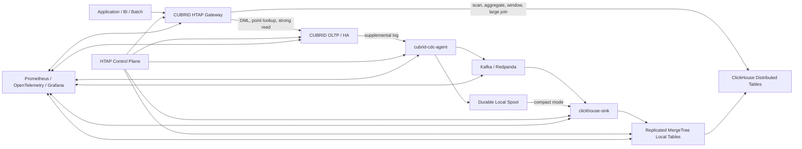

# CUBRID + 외부 OLAP 엔진 기반 분산 HTAP/OLAP 패키지 설계 보고서

- 작성 기준일: 2026-08-15
- 대상: CUBRID `develop` 및 CUBRID 11.4 공개 문서, ClickHouse 최신 공개 문서 기준
- 문서 성격: 제품 아키텍처 제안서 + POC 구현 명세 + 검증 계획
- 권고안: **CUBRID를 트랜잭션 원장으로 유지하고, ClickHouse를 비동기 분석 복제본으로 결합하는 느슨하게 결합된 HTAP 패키지**
- 가칭: **CUBRID HTAP Fabric** 또는 **CUBRID Analytics Extension**

---

## 목차

1. [최종 결론](#1-최종-결론)
2. [이 구성을 어떤 제품으로 정의해야 하는가](#2-이-구성을-어떤-제품으로-정의해야-하는가)
3. [현재 CUBRID에서 활용 가능한 기반과 한계](#3-현재-cubrid에서-활용-가능한-기반과-한계)
4. [대안 아키텍처 비교](#4-대안-아키텍처-비교)
5. [권장 목표 아키텍처](#5-권장-목표-아키텍처)
6. [데이터 동기화 설계](#6-데이터-동기화-설계)
7. [CDC 이벤트 및 버전 계약](#7-cdc-이벤트-및-버전-계약)
8. [초기 스냅샷·재동기화 설계](#8-초기-스냅샷재동기화-설계)
9. [ClickHouse 물리 테이블 설계](#9-clickhouse-물리-테이블-설계)
10. [쿼리 라우팅과 단일 패키지화](#10-쿼리-라우팅과-단일-패키지화)
11. [CUBRID DBLink에 ClickHouse를 직접 추가하는 방안](#11-cubrid-dblink에-clickhouse를-직접-추가하는-방안)
12. [CUBRID 코드 변경 제안](#12-cubrid-코드-변경-제안)
13. [ClickHouse 외 엔진 교체 가능 구조](#13-clickhouse-외-엔진-교체-가능-구조)
14. [배포 패키지와 운영 토폴로지](#14-배포-패키지와-운영-토폴로지)
15. [HA·장애 복구·백프레셔](#15-ha장애-복구백프레셔)
16. [보안·권한·거버넌스](#16-보안권한거버넌스)
17. [관측성 및 서비스 수준 목표](#17-관측성-및-서비스-수준-목표)
18. [검증 캠페인](#18-검증-캠페인)
19. [구현 로드맵과 예상 공수](#19-구현-로드맵과-예상-공수)
20. [주요 위험과 대응](#20-주요-위험과-대응)
21. [즉시 착수할 구현 순서](#21-즉시-착수할-구현-순서)
22. [부록 A. 예시 설정과 SQL](#부록-a-예시-설정과-sql)
23. [부록 B. 제안 API](#부록-b-제안-api)
24. [참고 자료](#참고-자료)

---

# 1. 최종 결론

## 1.1 권장안

가장 현실적이고 제품화 가능성이 높은 구조는 다음과 같다.

> **CUBRID는 ACID 트랜잭션과 최신 원본 데이터를 책임지고, ClickHouse는 CUBRID 로그 기반 CDC를 통해 갱신되는 분산 분석 복제본을 책임진다. 두 엔진은 하나의 설치 패키지·제어 평면·모니터링·논리 카탈로그·쿼리 게이트웨이로 묶되, 하나의 트랜잭션 도메인인 것처럼 가장하지 않는다.**

즉, 핵심 데이터 경로는 다음과 같다.

```text
Application
   │
   ├── OLTP/DML/point query ───────> CUBRID
   │                                  │
   │                                  └── supplemental log
   │                                            │
   │                                     cubrid-cdc-agent
   │                                            │
   │                              Kafka/Redpanda 또는 direct sink
   │                                            │
   └── OLAP/scan/aggregate ───────> ClickHouse distributed cluster
```

제품 형태로는 “단일 엔진형 HTAP”이 아니라 **federated HTAP**, **loosely coupled HTAP**, **operational-to-analytical replication package**라고 정의하는 편이 정확하다.

## 1.2 핵심 의사결정

| 항목 | 권고 |
|---|---|
| 원본 데이터 및 ACID | CUBRID |
| 대용량 스캔·집계·분산 OLAP | ClickHouse |
| 주 동기화 경로 | CUBRID native CDC API + `supplemental_log=1` |
| DBLink의 역할 | 운영 편의용 원격 조회, 작은 결과, 관리 쿼리 |
| DBLink를 통한 대량 CDC | 사용하지 않음 |
| 일관성 | at-least-once 전달 + 멱등 적용 + bounded staleness |
| cross-engine 2PC | 1차 제품에서 지원하지 않음 |
| read-your-write | CUBRID commit token/LSA와 ClickHouse watermark 비교로 선택 지원 |
| 쿼리 라우팅 | POC는 명시적 엔드포인트, 제품은 명시적 힌트/세션 기반 게이트웨이 |
| ClickHouse 테이블 | append-only, current-state, history, aggregate-delta를 구분 |
| ClickHouse 갱신 | `ReplacingMergeTree(version, is_deleted)`를 기본으로 하되 `FINAL` 계약을 숨기지 않음 |
| 분산 | 동일 PK의 모든 버전이 반드시 같은 ClickHouse shard로 이동 |
| 내부 CUBRID columnar | 장기적인 로컬 가속 계층으로 병행하되 외부 OLAP POC의 선행 조건으로 삼지 않음 |
| 대체 OLAP 엔진 | 어댑터 인터페이스를 두어 StarRocks·Doris로 교체 가능하게 설계 |

## 1.3 가장 먼저 만들어야 할 POC

첫 POC는 기능을 넓히지 말고 다음 수직 흐름만 완성하는 것이 좋다.

1. CUBRID 단일 DB, ClickHouse 단일 노드
2. PK가 있는 2~3개 테이블만 등록
3. 쓰기 일시 중지 방식의 초기 스냅샷
4. `cubrid_log` 기반 INSERT/UPDATE/DELETE/COMMIT/ABORT 추출
5. commit 전까지 트랜잭션별 이벤트 버퍼링
6. ClickHouse `ReplacingMergeTree`에 full-row upsert 및 tombstone 적용
7. durable LSA checkpoint
8. 에이전트 재시작·중복 전송·ClickHouse 일시 장애 복구
9. CUBRID와 ClickHouse 결과 differential check
10. 별도 OLTP/OLAP 엔드포인트

이 POC가 통과한 뒤에 Kafka, 다중 shard, 자동 라우팅, DDL 자동화, Kubernetes 패키지화를 추가해야 한다.

---

# 2. 이 구성을 어떤 제품으로 정의해야 하는가

## 2.1 제공할 수 있는 것

이 패키지는 다음 가치를 제공할 수 있다.

- 애플리케이션의 트랜잭션은 기존 CUBRID에 유지
- 분석 쿼리로 인한 CUBRID buffer pool·CPU·latch·I/O 간섭 감소
- 여러 CUBRID OLTP shard의 데이터를 하나의 ClickHouse 클러스터로 통합 분석
- 수 초 수준의 최신성을 목표로 하는 operational analytics
- TPC-H·대시보드·로그성 집계·고카디널리티 GROUP BY·대규모 scan 가속
- 하나의 설치·업그레이드·상태 조회·백업 정책·알림 체계
- 엔진별 직접 접속과 논리적 단일 접속을 모두 제공

## 2.2 제공한다고 말하면 안 되는 것

1차 제품에서 다음을 보장한다고 표현하면 안 된다.

- CUBRID와 ClickHouse를 아우르는 단일 직렬화 가능 트랜잭션
- cross-engine `COMMIT`/`ROLLBACK`
- 모든 SELECT의 CUBRID와 ClickHouse 결과 의미론 완전 동일
- cross-table 분석 복제본의 즉시 원자적 가시성
- 장애 상황에서도 무조건 0초 지연
- ClickHouse background merge만으로 항상 중복이 제거된 결과
- 여러 CUBRID shard를 아우르는 글로벌 ACID

제품 문구는 다음처럼 명시하는 편이 안전하다.

> “CUBRID 원본 트랜잭션 데이터를 비동기적으로 ClickHouse에 반영하며, 설정된 freshness SLO 내에서 분석 질의를 제공한다. 강한 일관성이 필요한 질의는 CUBRID로 실행된다.”

## 2.3 제안 일관성 등급

| 등급 | 실행 엔진 | 계약 |
|---|---|---|
| `OLTP_STRONG` | CUBRID | 기존 CUBRID 트랜잭션·격리 수준 |
| `ANALYTIC_LATEST` | ClickHouse | 현재까지 반영된 최신 분석 복제본, 지연 허용 |
| `ANALYTIC_AFTER(token)` | ClickHouse 또는 CUBRID fallback | 지정 commit token 이상 반영될 때까지 제한 시간 대기 |
| `ANALYTIC_BATCH_SNAPSHOT` | ClickHouse snapshot dataset | 특정 배치/스냅샷 버전으로 고정 |
| `AUTO` | Gateway | 검증된 규칙과 freshness 정책으로 선택 |

`ANALYTIC_AFTER(token)`은 “정확히 해당 시점의 snapshot”이 아니라 **그 commit 이상이 반영되었다는 하한 보장**으로 정의해야 한다. 이후 트랜잭션이 함께 보일 수 있으며, 다중 테이블의 원자적 snapshot까지 의미하지 않는다.

---

# 3. 현재 CUBRID에서 활용 가능한 기반과 한계

## 3.1 DBLink와 이기종 Gateway

CUBRID 11.4 DBLink는 동일 기종 CUBRID와 이기종 Oracle·MySQL·MariaDB를 지원하며, 이기종 연결에는 `cubrid_gateway`와 ODBC 드라이버를 사용한다. 여러 외부 DB를 설정할 수 있지만 한 질의에서 조회할 수 있는 타 DB는 하나이며, 이기종 원격 DML은 로컬 트랜잭션과 하나로 묶이지 않고 별도 auto-commit으로 처리된다. 또한 remote table 형식에서 GROUP BY·HAVING·LIMIT 등이 원격으로 충분히 push되지 않아 전체 데이터를 로컬로 가져오는 경우가 명시돼 있다. [R1]

이 특성 때문에 DBLink는 다음에는 적합하다.

- 작은 dimension 또는 관리 테이블 조회
- 운영자가 명시적으로 작성한 ClickHouse 원격 SQL
- 임시 검증·데이터 비교
- CUBRID SQL에서 소규모 외부 결과를 가져오는 호환 기능

반대로 다음에는 적합하지 않다.

- 지속적인 대량 CDC
- TPC-H fact table 원격 scan
- 네트워크를 넘는 대규모 cross-engine join
- CUBRID와 ClickHouse의 원자적 DML
- ClickHouse를 CUBRID 실행기의 투명한 storage tier처럼 사용하는 방식

## 3.2 CUBRID Gateway 코드 관점

현재 `src/broker/cas_cgw_odbc.c`는 ODBC 기반의 비교적 일반적인 실행 경로를 갖고 있지만, 지원 DBMS 목록과 여러 분기 처리는 Oracle·MySQL·MariaDB를 기준으로 작성돼 있다. `src/broker/cas_protocol.h`의 gateway DBMS enum에도 ClickHouse 항목이 없다. [R6][R7]

따라서 ClickHouse ODBC driver를 설치하는 것만으로 공식 지원이 완성되지는 않는다. 최소한 다음 변경이 필요하다.

- `CAS_CGW_DBMS_CLICKHOUSE` 추가
- 지원 DBMS whitelist·설정 검증 추가
- CCI와 프로토콜 enum 동기화
- ClickHouse unsigned integer, `DateTime64`, `Decimal`, `Nullable`, `UUID`, `Array`, `LowCardinality` 매핑
- prepared statement와 parameter binding 검증
- identifier quoting, LIMIT, 함수, timezone 처리
- UPDATE/DELETE mutation을 원격 테이블 DML로 허용할지 정책 결정
- unsupported type·overflow·NULL 의미론 테스트

## 3.3 CUBRID CDC 기반

CUBRID는 `supplemental_log`를 통해 CDC·flashback 해석에 필요한 부가 정보를 로그에 기록한다. 값 `1`은 DML과 DDL, 값 `2`는 DML 정보만 기록하며, 추가 로그로 인해 성능과 로그 공간에 영향이 있음을 공식 문서가 명시한다. [R2]

`src/api/cubrid_log.h`에는 다음 공개 API가 존재한다. [R3]

```c
cubrid_log_set_connection_timeout();
cubrid_log_set_extraction_timeout();
cubrid_log_set_max_log_item();
cubrid_log_set_all_in_cond();
cubrid_log_set_extraction_table();
cubrid_log_set_extraction_user();

cubrid_log_connect_server();
cubrid_log_find_lsa();
cubrid_log_extract();
cubrid_log_clear_log_item();
cubrid_log_finalize();
```

공개 이벤트에는 DDL, DML, DCL, TIMER가 있고, DML은 changed column과 condition column 데이터를 가진다. 내부 `log_impl.h`에는 DCL 타입으로 COMMIT과 ABORT가 정의되어 있으며, CDC queue entry는 다음 LSA를 보유한다. [R5]

이는 외부 OLAP 복제의 기반으로 충분히 가치가 있다. 다만 현재 공개 인터페이스 그대로 제품을 만들기 전에 다음을 검증하거나 확장해야 한다.

### P0 검증·확장 항목

1. **레코드별 position**
   - 공개 `CUBRID_LOG_ITEM`에는 개별 이벤트의 record LSA와 commit LSA가 없다.
   - `cubrid_log_extract()`의 LSA는 배치 cursor 성격이다.
   - 재시작·행 버전 ordering·freshness token을 위해 이벤트별 위치가 필요하다.

2. **트랜잭션 경계**
   - DML이 COMMIT보다 먼저 전달되는 구조라면 에이전트가 transaction ID별로 버퍼링해야 한다.
   - ABORT 시 모두 폐기해야 한다.
   - XA/2PC는 최종 decision 전까지 노출하면 안 된다.

3. **완전한 row image**
   - UPDATE의 changed column과 condition column만으로 항상 full after-image를 복구할 수 있는지 확인해야 한다.
   - `cubrid_log_set_all_in_cond(1)`이 UPDATE/DELETE의 full before-image를 보장하는지 테스트해야 한다.
   - 불충분하면 typed full before/after image API가 필요하다.

4. **스키마 표현 버전**
   - class OID와 column index만으로 ALTER 전후의 오래된 로그를 안전하게 해석할 수 있는지 확인해야 한다.
   - event에 representation ID, schema generation 또는 schema version이 필요하다.

5. **일관된 초기 snapshot token**
   - 온라인 스냅샷과 CDC 사이에 gap이 없음을 보장할 원자적 barrier API가 현재 공개 API에 명시돼 있지 않다.
   - POC는 쓰기 정지 방식으로 시작하고, 제품 단계에서 snapshot token API를 추가하는 것이 안전하다.

6. **HA source identity**
   - active 전환 후 LSA 연속성, DB 복원·재생성, 로그 timeline 변경을 구분할 source epoch가 필요하다.

7. **권한**
   - 현재 코드의 CDC 연결 인증 경로는 DBA 그룹 확인에 의존하는 부분이 있어, 제품에서는 `CDC_READER`와 같은 최소 권한을 별도로 도입해야 한다. [R4]

## 3.4 기존 내부 columnar 구현과의 관계

기존 `feature/columnar` 계열 검토 자료에서는 다음 수직 기능이 구현된 것으로 정리돼 있다.

```text
CREATE TABLE ... USING COLUMNAR
  → FILE_COLUMNAR
  → transaction-class write state
  → stripe flush / compression / footer
  → column projection
  → vectorized predicate bitmap
  → min/max skipping
  → 기존 qexec projection·aggregation
  → derived-table materialization 기반 join
```

그러나 commit 오류 전파, WAL redo/undo, MVCC snapshot visibility, 동시 INSERT, savepoint·2PC, metapage scale, 조인 물질화 성능 등이 병합 차단 요소로 평가됐다. 또한 실제 실행 모델은 block 단위 read/decompress/filter 후 qualified row를 기존 qexec에 넘기는 하이브리드 구조다. [R17]

따라서 내부 columnar와 외부 ClickHouse는 경쟁 관계보다 다음처럼 역할을 나누는 편이 좋다.

| 계층 | 역할 |
|---|---|
| CUBRID heap | 최신 OLTP, 강한 일관성, point access |
| CUBRID local columnar | 장기적으로 매우 신선한 로컬 분석, 작은 범위의 HTAP |
| ClickHouse | 여러 CUBRID node/shard를 합친 대규모 분산 OLAP |

외부 ClickHouse POC를 내부 columnar 완성 이후로 미루면 전체 사업 일정이 storage correctness 작업에 종속된다. 반대로 동일한 logical catalog와 routing interface를 사용하면, 나중에 local columnar를 또 하나의 `OlapAdapter`로 편입할 수 있다.

---

# 4. 대안 아키텍처 비교

| 방안 | 구현 속도 | 대량 OLAP | 동기화 신뢰성 | 단일 접점 | 제품 권고 |
|---|---:|---:|---:|---:|---|
| DBLink만으로 ClickHouse 조회 | 빠름 | 낮음 | 해당 없음 | 일부 가능 | 데모·관리용 |
| ClickHouse ODBC Engine으로 CUBRID 직접 scan | 빠름 | CUBRID 부하 큼 | 해당 없음 | ClickHouse 중심 | 작은 dimension만 |
| CUBRID CDC → ClickHouse, 별도 endpoint | 보통 | 높음 | 높게 설계 가능 | 낮음 | **POC 권고** |
| CUBRID CDC → ClickHouse + HTAP Gateway | 보통~높음 | 높음 | 높게 설계 가능 | 높음 | **제품 권고** |
| CUBRID executor에 remote columnar operator 깊게 통합 | 느림 | 잠재적으로 높음 | 복잡 | 높음 | 장기 연구 |
| CUBRID 내부 columnar만 사용 | 느림 | 단일 DB 한계 | CUBRID 내부 계약 | 높음 | 장기 보완 |

## 4.1 DBLink-only가 주 아키텍처가 되기 어려운 이유

- row-oriented ODBC 왕복 비용
- remote aggregate·limit·join pushdown 제약
- CUBRID 실행기 memory/list-file 물질화 비용
- ClickHouse 분산 실행 계획을 CUBRID optimizer가 이해하지 못함
- 원격 DB 장애가 OLTP query path에 직접 전파
- 별도 auto-commit으로 인한 DML 일관성 오해
- 분석 쿼리가 외부에서 끝나지 않고 중간 결과를 CUBRID로 대량 전송할 가능성

## 4.2 CDC 복제형이 유리한 이유

- 분석 쿼리가 ClickHouse 내부에서 끝남
- columnar storage, data skipping, parallel aggregation, shard 병렬성이 그대로 작동
- CUBRID OLTP와 resource isolation
- network 전송이 query-time row 이동이 아니라 write-time batch 이동
- source-of-truth와 derived read model의 책임이 명확
- 장애 시 replay·resnapshot·검증 절차를 독립적으로 설계 가능

---

# 5. 권장 목표 아키텍처



## 5.1 구성 요소

### CUBRID OLTP tier

- 모든 application DML의 원본
- transaction, lock, constraint, trigger, sequence 담당
- HA active/standby 또는 여러 application shard
- 분석 복제 대상 table/column allowlist 보관

### `cubrid-cdc-agent`

- `cubrid_log` API로 로그 추출
- transaction별 DML 버퍼링
- COMMIT 시에만 publish
- ABORT 시 폐기
- schema cache 및 type conversion
- event ID·source position·version 생성
- durable checkpoint와 local spool 관리
- HA active 재탐색

### Durable bus

표준 제품에서는 Kafka 또는 호환 스트리밍 버스를 권장한다.

- CUBRID와 ClickHouse 장애 도메인 분리
- replay와 다수 consumer
- 대규모 backlog 흡수
- schema registry·DLQ
- 여러 분석 sink 확장

단일 노드 개발판에서는 bus를 생략하고 agent가 local spool을 거쳐 ClickHouse sink로 직접 전달할 수 있다.

### `clickhouse-sink`

ClickHouse Kafka Table Engine을 그대로 쓰는 방법도 있으나, 공식 문서는 Kafka Engine이 at-least-once이며 드문 중복 가능성을 명시한다. [R11] 제품 v1에서는 별도 sink가 다음 면에서 유리하다.

- CUBRID transaction boundary 인식
- table별 schema barrier
- deterministic batching
- DLQ와 재처리
- sink watermark
- snapshot과 live stream 병합
- ClickHouse shard 직접 라우팅
- insert 성공 후 ack 유실에 대한 멱등 재시도
- 엔진 교체용 adapter

Kafka Engine은 compact/optional integration으로 제공할 수 있다.

### ClickHouse cluster

- local `ReplicatedMergeTree` 계열 테이블
- global `Distributed` 테이블
- 동일 PK는 항상 동일 shard
- history/current/aggregate 물리 모델 분리
- ClickHouse Keeper 또는 배포 환경에 맞는 coordination

ClickHouse의 `Distributed` 테이블은 자체 데이터를 저장하지 않고 여러 서버의 local table을 병렬 조회하며, 가능한 집계를 원격 shard에서 부분 수행한다. [R10]

### HTAP Gateway

- logical catalog
- route hint·session policy
- query semantic allowlist
- freshness token 대기
- OLAP 실패 시 fallback 정책
- 결과 type normalization
- audit 및 query trace

### Control Plane

- source 등록
- table attach/detach
- snapshot lifecycle
- schema migration
- lag·watermark 조회
- resync
- version compatibility
- 인증서·secret rotation
- backup/restore orchestration

---

# 6. 데이터 동기화 설계

## 6.1 기본 원칙

1. CUBRID commit 성공 전에 ClickHouse에 가시화하지 않는다.
2. end-to-end exactly-once를 억지로 주장하지 않는다.
3. 전달은 at-least-once로 하고, 이벤트 식별자와 버전으로 결과를 멱등 수렴시킨다.
4. CUBRID checkpoint는 downstream durable ack 이후에만 전진시킨다.
5. 로그 유실·timeline 변경 시 조용히 건너뛰지 않고 table을 `STALE/RESNAPSHOT_REQUIRED` 상태로 전환한다.
6. UPDATE와 DELETE를 분석 테이블의 storage semantics에 맞는 full-row 또는 delta event로 변환한다.
7. DDL은 raw SQL 복제가 아니라 logical schema diff로 처리한다.

## 6.2 트랜잭션 처리 상태기계

```text
READ_DML
  └─ transaction_id별 buffer에 추가

READ_COMMIT
  ├─ transaction batch 완성
  ├─ commit_position 부여
  ├─ durable bus 또는 spool에 원자적으로 publish
  └─ source read checkpoint 후보 전진

READ_ABORT
  └─ 해당 transaction buffer 폐기

SINK_APPLY
  ├─ target schema version 확인
  ├─ table/shard별 batch 구성
  ├─ ClickHouse insert
  ├─ duplicate-safe retry
  └─ sink applied watermark 전진
```

## 6.3 대형 트랜잭션

트랜잭션 전체를 메모리에만 보관하면 안 된다.

- 메모리 임계값 이하: in-memory buffer
- 초과: encrypted local transaction spool
- spool record에는 checksum과 event sequence 저장
- COMMIT 시 manifest를 publish
- ABORT 시 spool 제거
- process crash 후 미완료 transaction spool은 source log를 기준으로 복구 또는 폐기
- 최대 transaction bytes·rows를 metric으로 노출

Kafka를 사용할 때 한 CUBRID transaction을 Kafka transaction 하나로 묶는 방안은 가능하지만, 여러 topic/partition과 ClickHouse apply까지 포함한 end-to-end 원자성을 자동으로 보장하지는 않는다. 따라서 Kafka transaction은 transport 편의로만 보고, sink의 idempotency를 별도로 유지해야 한다.

## 6.4 topic 및 partition 전략

권장 topic 구조의 예시는 다음과 같다.

```text
cubrid.<source-cluster>.<database>.cdc
cubrid.<source-cluster>.<database>.ddl
cubrid.<source-cluster>.<database>.control
cubrid.<source-cluster>.<database>.dlq
```

partition key 선택에는 상충 관계가 있다.

- `table + primary_key`: 동일 row ordering이 좋고 병렬성이 높음
- `source_shard`: source commit order 유지가 쉽지만 병목 가능
- `transaction_id`: transaction 이벤트 집약은 쉽지만 동일 PK의 연속 transaction이 다른 partition으로 갈 수 있음

권장 방식은 다음과 같다.

- 행 이벤트는 `stable_table_id + primary_key`로 partition
- 모든 이벤트에 source record position과 commit position 포함
- DDL은 별도 ordered control stream
- sink는 버전 비교로 늦게 도착한 오래된 이벤트를 무해하게 처리
- transaction manifest는 별도 control stream에 기록

## 6.5 체크포인트 계약

서로 다른 위치를 분리해 저장해야 한다.

| 위치 | 의미 |
|---|---|
| `source_read_position` | agent가 CUBRID에서 읽은 위치 |
| `transport_durable_position` | bus/spool에 안전하게 기록된 위치 |
| `sink_applied_position` | ClickHouse insert ack를 받은 위치 |
| `table_watermark` | 특정 table이 오류 없이 연속 적용된 위치 |
| `global_safe_watermark` | 등록 table들의 최소 연속 적용 위치 |

source checkpoint는 단순히 “읽었다”가 아니라 **durable output을 확보했다**는 위치여야 한다. sink가 ClickHouse insert 성공 후 응답을 잃으면 같은 batch를 재시도할 수 있으므로, target은 중복을 허용한 뒤 version으로 수렴해야 한다.

---

# 7. CDC 이벤트 및 버전 계약

## 7.1 제안 이벤트 포맷

POC는 JSON을 사용할 수 있으나 제품은 Protobuf 또는 Avro처럼 schema evolution이 명시되는 포맷이 적합하다.

```json
{
  "format_version": 1,
  "source": {
    "cluster_id": "cubrid-prod-a",
    "database_id": "sales-db-uuid",
    "database_name": "sales",
    "source_shard": 3,
    "source_epoch": 17
  },
  "table": {
    "stable_table_id": "sales.orders#4",
    "schema": "sales",
    "name": "orders",
    "class_oid": "12|431|7",
    "representation_id": 28,
    "schema_version": 104
  },
  "transaction": {
    "transaction_id": 882193,
    "event_seq": 12,
    "commit_timestamp": "2026-08-15T04:12:31.221991Z",
    "commit_position": {
      "page_id": 981231,
      "offset": 112
    }
  },
  "record_position": {
    "page_id": 981229,
    "offset": 840
  },
  "operation": "UPDATE",
  "primary_key": {
    "order_id": 9182231
  },
  "before": {
    "status": "PAID",
    "amount": "19000.00"
  },
  "after": {
    "status": "SHIPPED",
    "amount": "19000.00"
  },
  "changed_columns": ["status"],
  "event_id": "sha256:...",
  "is_deleted": false
}
```

## 7.2 반드시 필요한 필드

- source cluster/database/shard identity
- source epoch 또는 timeline
- stable table identity
- class OID와 representation/schema version
- transaction ID
- record position
- commit position
- transaction 내 event sequence
- operation
- PK
- before/after image 또는 재구성 가능한 typed delta
- deterministic event ID
- commit timestamp
- trigger-generated 여부
- DDL barrier ID

## 7.3 `event_id` 생성

```text
event_id =
  SHA-256(
    source_database_uuid ||
    source_epoch ||
    record_page_id ||
    record_offset ||
    transaction_id ||
    event_seq ||
    stable_table_id
  )
```

UUID 크기가 필요하면 SHA-256의 일부를 사용하되, 충돌 정책과 원본 필드를 함께 저장한다.

## 7.4 row version

ClickHouse current-state table에서 최신 행을 선택하려면 전역적으로 비교 가능한 version이 필요하다. 단순 commit timestamp는 시계 역행과 동일 timestamp 문제 때문에 부적합하다.

권장 version은 다음과 같은 `UInt128`이다.

```text
version =
  source_epoch | record_page_id | record_offset | sub_sequence
```

구체적인 bit 배치는 CUBRID LSA 실제 범위와 ABI를 확인한 뒤 정한다. raw `uint64_t` 메모리 표현을 그대로 외부 정렬 키로 쓰지 말고, page/offset을 명시적으로 직렬화해야 한다.

- row 최신 버전 판정: `record_position`
- freshness 및 transaction 완료 판정: `commit_position`
- 동일 PK가 source shard를 이동할 수 있다면 별도의 migration epoch 필요
- 여러 source shard의 PK가 충돌할 수 있으면 `(source_cluster, source_shard, PK)`를 논리 키에 포함

## 7.5 full-row upsert와 partial update

`ReplacingMergeTree`에 sparse update를 그대로 넣으면 변경되지 않은 column이 사라질 수 있으므로 기본 current-state 테이블은 **full row**를 써야 한다.

선택지는 다음과 같다.

1. CDC가 full before/after image 제공
2. full before + changed after를 agent가 merge
3. agent가 embedded state store에서 직전 row를 관리
4. commit 이후 CUBRID를 PK lookup하여 full row를 읽음
5. ClickHouse의 sparse update 계열 엔진/기능 사용

4번은 조회 시점에 다음 transaction이 반영되어 잘못된 값을 읽을 수 있으므로 주 경로로 권장하지 않는다. 3번은 state store 규모와 복구 복잡도가 크다. 따라서 **CUBRID CDC가 정확한 typed full image를 제공하도록 확장하는 것이 가장 좋다.**

## 7.6 같은 transaction 안에서 동일 PK가 여러 번 변경되는 경우

예:

```sql
UPDATE t SET v = 2 WHERE id = 1;
UPDATE t SET v = 3 WHERE id = 1;
COMMIT;
```

sink는 다음 중 하나를 해야 한다.

- transaction 내 이벤트를 record position 순으로 모두 넣고 version으로 마지막 행을 선택
- COMMIT 전에 같은 PK의 이벤트를 coalesce하여 최종 after-image 하나만 넣음

current-state table에는 coalesce가 유리하지만, history/audit table에는 원 이벤트를 모두 보존할 수 있다.

## 7.7 INSERT 후 DELETE, DELETE 후 INSERT

동일 transaction 내에서 최종 상태를 계산해야 한다.

| 이벤트열 | current-state 결과 |
|---|---|
| INSERT → UPDATE | 최종 full row |
| INSERT → DELETE | row 없음 또는 tombstone |
| UPDATE → DELETE | tombstone |
| DELETE → INSERT | 새 row |
| PK 변경 | old PK tombstone + new PK insert |

PK UPDATE를 target에서 단일 UPDATE로 취급하지 말고 old key delete와 new key insert로 변환한다.

## 7.8 DDL 이벤트

raw CUBRID DDL 문자열을 ClickHouse에서 실행해서는 안 된다. SQL dialect와 storage 설계가 다르기 때문이다.

DDL 처리 절차는 다음과 같다.

1. CUBRID DDL COMMIT event 수신
2. 해당 table의 apply를 schema barrier에서 정지
3. CUBRID catalog에서 새 logical schema 조회
4. 이전 schema와 diff
5. 호환 변경이면 ClickHouse `ALTER`
6. 비호환 변경이면 shadow table 생성·backfill·swap
7. schema version 전진
8. 대기 중인 DML 재개

### in-place 가능 후보

- nullable column 추가
- 기본값이 안전한 column 추가
- 일부 widening conversion
- comment/metadata 변경

### shadow rebuild 후보

- PK 변경
- partition/sharding key 변경
- column drop/rename이 과거 event 해석을 깨뜨리는 경우
- type narrowing
- codeset/collation 변경
- table 재생성으로 stable identity가 바뀐 경우

---

# 8. 초기 스냅샷·재동기화 설계

## 8.1 POC: 쓰기 정지 스냅샷

가장 먼저 correctness를 증명할 때는 복잡한 온라인 알고리즘을 피한다.

```text
1. 대상 table 쓰기 정지
2. source barrier LSA 기록
3. CUBRID table full scan
4. ClickHouse bulk load
5. row count/checksum 검증
6. CDC를 barrier 이후부터 시작
7. 쓰기 재개
```

이 방식으로 CDC event semantics, type mapping, delete, replay를 먼저 검증한다.

## 8.2 제품: online snapshot + overlapping CDC

권장 알고리즘은 다음과 같다.

```text
1. CDC source identity와 barrier position 획득
2. barrier 이전 또는 barrier부터 CDC 수집을 시작하여 durable spool
3. CUBRID consistent snapshot transaction 시작
4. PK/range 단위 병렬 scan
5. 모든 snapshot row에 snapshot_base_version 부여
6. ClickHouse snapshot load 완료
7. snapshot manifest 검증
8. barrier 이후 CDC replay
9. sink watermark가 snapshot 종료 시점 이후로 전진하면 LIVE
```

snapshot이 barrier 이후에 commit된 일부 행을 보더라도 모든 snapshot row의 version을 barrier보다 낮게 두고, 이후 CDC가 더 높은 version으로 덮게 만들면 최종 수렴이 가능하다. 다만 snapshot transaction과 CDC barrier 사이의 정확한 규칙은 CUBRID에서 반드시 fault test해야 한다.

## 8.3 권장 CUBRID API 확장

가장 안전한 제품 API는 다음 개념을 제공한다.

```text
BEGIN CONSISTENT CDC SNAPSHOT
  → database_uuid
  → source_epoch
  → snapshot_id
  → snapshot_mvcc_token
  → start_lsa
  → catalog_schema_version
```

이 token으로 CCI scan session을 열고, CDC agent는 `start_lsa`부터 수집한다. snapshot 종료 시 server가 token lifetime과 archive retention을 관리한다.

## 8.4 snapshot range 설계

- PK 숫자 범위
- composite PK sampled boundary
- hash bucket
- partition table의 partition 범위
- PK가 없으면 hidden OID 또는 안정적 surrogate key 필요

PK가 없는 table은 current-state CDC가 어렵다. 기본 정책은 다음 중 하나다.

- append-only로만 허용
- 사용자가 replication key 지정
- hidden stable row identifier를 CUBRID CDC가 제공
- 분석 복제 대상에서 제외

## 8.5 snapshot manifest

```yaml
snapshot_id: snap-20260815-001
source:
  database_uuid: ...
  epoch: 17
  start_position: "981000:220"
table:
  stable_table_id: sales.orders#4
  schema_version: 104
ranges:
  - id: r0001
    lower: 0
    upper: 1000000
    rows: 998723
    checksum: ...
  - id: r0002
    lower: 1000000
    upper: 2000000
    rows: 1000142
    checksum: ...
status: VERIFIED
```

## 8.6 재동기화 조건

- source LSA를 더 이상 찾을 수 없음
- source epoch 변경 또는 DB restore 감지
- unrecoverable schema mismatch
- checksum mismatch
- sink version bug
- target table corruption
- operator가 mapping rule 변경
- 장시간 장애로 replay 비용이 snapshot보다 커짐

재동기화는 기존 table을 즉시 비우지 말고 shadow table에 수행한 후 logical view를 swap해야 한다.

---

# 9. ClickHouse 물리 테이블 설계

ClickHouse `ReplacingMergeTree`는 `ORDER BY` key가 같은 행을 background merge에서 대체하지만, merge 시점은 비동기이며 중복 부재를 보장하지 않는다. 정확한 current-state 결과에는 query-time `FINAL`이 필요하다. `ver`와 `is_deleted`도 공식 지원된다. [R9]

이 특성을 제품 계약에 반영하지 않으면 count, join, aggregate가 순간적으로 틀릴 수 있다.

## 9.1 table replication mode

| 모드 | 대상 | ClickHouse 엔진 | 의미 |
|---|---|---|---|
| `APPEND_ONLY` | 이벤트, 로그, 확정 fact | MergeTree | 수정·삭제 없음 |
| `UPSERT_CURRENT` | 주문·계정·상태 table | ReplacingMergeTree | 최신 상태 |
| `CDC_HISTORY` | 감사·재처리 | MergeTree | 모든 변경 보존 |
| `AGGREGATE_DELTA` | 업데이트 가능한 집계 | Summing/AggregatingMergeTree | before/after delta |
| `SNAPSHOT_ONLY` | 주기 배치 dimension | MergeTree | 배치 교체 |

table 등록 시 사용자가 모드를 명시하거나 workload analyzer가 추천하도록 한다.

## 9.2 current-state local table 예시

```sql
CREATE TABLE htap.orders_current_local
ON CLUSTER cubrid_olap
(
    source_cluster LowCardinality(String),
    source_shard UInt16,

    order_id Int64,
    customer_id Int64,
    status LowCardinality(String),
    amount Decimal(18, 2),
    created_at DateTime64(6, 'UTC'),
    updated_at DateTime64(6, 'UTC'),

    _source_epoch UInt64,
    _record_page UInt64,
    _record_offset UInt32,
    _commit_page UInt64,
    _commit_offset UInt32,
    _version UInt128,
    _event_id FixedString(32),
    _schema_version UInt64,
    _commit_ts DateTime64(6, 'UTC'),
    _is_deleted UInt8
)
ENGINE = ReplicatedReplacingMergeTree(
    '/clickhouse/tables/{shard}/htap/orders_current_local',
    '{replica}',
    _version,
    _is_deleted
)
PARTITION BY cityHash64(source_cluster, source_shard, order_id) % 32
ORDER BY (source_cluster, source_shard, order_id);
```

### 설계 이유

- PK의 모든 version이 같은 partition과 shard에 위치
- `_version`이 최신 행 결정
- delete는 tombstone
- source shard 간 PK 충돌 방지
- `created_at`이 수정될 수 있어도 partition이 이동하지 않음

partition 수 32는 예시일 뿐이며 table 크기와 merge 병렬성에 맞춰 측정해야 한다. 작은 table은 partition 없이 시작하는 편이 낫다.

## 9.3 distributed table

```sql
CREATE TABLE htap.orders_current
ON CLUSTER cubrid_olap
AS htap.orders_current_local
ENGINE = Distributed(
    cubrid_olap,
    htap,
    orders_current_local,
    cityHash64(source_cluster, source_shard, order_id)
);
```

동일 PK가 서로 다른 shard로 가면 각 shard의 `FINAL`만으로 전역 dedup이 되지 않을 수 있으므로 sharding key는 절대 변경 없이 유지해야 한다.

## 9.4 canonical current view

```sql
CREATE VIEW htap.orders AS
SELECT
    source_cluster,
    source_shard,
    order_id,
    customer_id,
    status,
    amount,
    created_at,
    updated_at
FROM htap.orders_current FINAL;
```

`is_deleted` parameter를 사용하는 `ReplacingMergeTree`는 `FINAL`에서 delete row를 적용한다. 운영자가 raw table을 직접 조회해 `FINAL`을 빠뜨리지 않도록, query user에게는 canonical view만 권한을 주는 편이 좋다.

## 9.5 history table

```sql
CREATE TABLE htap.orders_history_local
ON CLUSTER cubrid_olap
(
    source_cluster LowCardinality(String),
    source_shard UInt16,
    order_id Int64,
    operation Enum8('I' = 1, 'U' = 2, 'D' = 3),
    before_json String,
    after_json String,
    _version UInt128,
    _event_id FixedString(32),
    _commit_ts DateTime64(6, 'UTC'),
    _schema_version UInt64
)
ENGINE = ReplicatedMergeTree(
    '/clickhouse/tables/{shard}/htap/orders_history_local',
    '{replica}'
)
PARTITION BY toYYYYMM(_commit_ts)
ORDER BY
(
    source_cluster,
    source_shard,
    order_id,
    _version
);
```

history는 다음에 사용한다.

- audit
- target rebuild
- mapping bug 수정 후 replay
- time-travel 분석
- aggregate delta 재생성
- current-state checksum 추적

민감 데이터의 before image 보존 기간은 별도 정책으로 제한한다.

## 9.6 delete tombstone

공식 문서상 `ReplacingMergeTree(ver, is_deleted)`의 delete row 제거 기능 일부는 실험 설정과 cleanup merge에 의존한다. [R9] v1에서는 tombstone을 성급히 물리 삭제하지 않는 편이 안전하다.

- replay horizon보다 오래 보존
- source log/backup 보존 기간보다 길게 유지
- 닫힌 partition을 shadow rebuild하여 정리
- table-wide `OPTIMIZE ... FINAL` 주기 실행은 피함
- 삭제 전 낮은 version event가 다시 도착할 수 없는지 검증

## 9.7 update가 있는 table의 집계

다음은 잘못된 방식이다.

```text
orders_current에 새 version insert
  → Materialized View가 amount를 다시 SUM
  → 이전 version 값은 빠지지 않음
```

업데이트·삭제가 있는 fact의 incremental aggregate에는 before/after delta가 필요하다.

```text
INSERT: +after
DELETE: -before
UPDATE: -before, +after
```

예:

```sql
CREATE TABLE htap.sales_daily_delta_local
(
    sales_date Date,
    merchant_id Int64,
    amount_delta Decimal(20, 2),
    count_delta Int64
)
ENGINE = SummingMergeTree
PARTITION BY toYYYYMM(sales_date)
ORDER BY (sales_date, merchant_id);
```

append-only fact만 일반 materialized view로 바로 집계한다. current-state 기반 aggregate는 다음 중 하나를 선택한다.

- signed delta
- 주기적 refreshable rebuild
- history에서 `argMax` 후 query-time aggregate
- ETL job에서 stateful aggregation

## 9.8 insert batch

너무 작은 insert는 parts 증가와 merge pressure를 만든다. sink는 다음 복합 조건으로 flush한다.

- rows threshold
- bytes threshold
- max latency
- transaction boundary
- table/shard별 queue

초기값 예:

```yaml
flush:
  max_rows: 50000
  max_bytes: 67108864
  max_delay_ms: 250
  preserve_transaction_boundary: true
```

수치는 정답이 아니며 실제 row width, update ratio, shard 수로 보정한다.

## 9.9 CUBRID → ClickHouse type mapping

| CUBRID | ClickHouse 기본 매핑 | 주의 |
|---|---|---|
| SHORT | Int16 | 범위 검사 |
| INTEGER | Int32 | 범위 검사 |
| BIGINT | Int64 | 범위 검사 |
| FLOAT | Float32 | IEEE 차이 검증 |
| DOUBLE | Float64 | NaN/Inf 정책 |
| MONETARY | Decimal 또는 Float64 | CUBRID 실제 의미론에 따라 고정 |
| NUMERIC(p,s) | Decimal(p,s) | precision 초과 거절 |
| CHAR/VARCHAR | String | CHAR trailing space·collation 차이 |
| DATE | Date32 | 지원 범위 확인 |
| TIME | String 또는 정규화된 수치 | timezone 없음 |
| TIMESTAMP/DATETIME | DateTime64 | UTC 정규화 및 원 zone 보존 |
| TIMESTAMPTZ 계열 | DateTime64 + timezone column | 원 zone/offset 별도 보존 권장 |
| BIT/VARBIT | String/FixedString | bit length 보존 |
| JSON | JSON 또는 String | canonical raw 보존 |
| ENUM | LowCardinality(String) | enum 변경 정책 필요 |
| BLOB/CLOB | 미지원 또는 object URI | v1 allowlist에서 제외 권장 |
| SET/MULTISET/SEQUENCE | Array 또는 미지원 | 순서·중복 의미론 검증 |
| NULL | Nullable(T) | default 치환 금지 |

### 문자열 의미론

CUBRID와 ClickHouse의 collation, CHAR padding, LIKE, implicit cast, NULL ordering은 동일하다고 가정하면 안 된다. 특히 다음 질의는 자동 OLAP routing에서 제외하거나 differential test를 통과한 조합만 허용한다.

- locale-sensitive ORDER BY
- case/accent-insensitive 비교
- CHAR trailing space 의존
- multibyte LIKE `_`
- codeset 변환
- empty string과 NULL의 특수 처리
- CUBRID 고유 coercion

---

# 10. 쿼리 라우팅과 단일 패키지화

## 10.1 단계별 전략

### 단계 1: 별도 endpoint

- 기존 CUBRID JDBC/CCI endpoint
- ClickHouse native/HTTP/JDBC endpoint
- application 또는 BI 설정에서 명시 선택

가장 단순하며 데이터 경로 correctness를 먼저 검증할 수 있다.

### 단계 2: lightweight gateway

다음처럼 leading hint 또는 API option만 해석한다.

```sql
SELECT /*+ ROUTE(OLAP) */ ...
SELECT /*+ ROUTE(OLTP) */ ...
SELECT /*+ ROUTE(OLAP) FRESHNESS('5s') */ ...
```

```yaml
session:
  htap_route: auto
  max_staleness_ms: 5000
  fallback: cubrid
```

이 단계에서는 arbitrary SQL federation을 시도하지 않는다.

### 단계 3: semantic/cost-aware gateway

- SQL AST parsing
- CUBRID → ClickHouse 함수 rewrite
- logical catalog
- table freshness·size·statistics
- query shape
- result type normalization
- explain route

```sql
EXPLAIN ROUTE
SELECT merchant_id, SUM(amount)
FROM orders
WHERE created_at >= CURRENT_DATE - 7
GROUP BY merchant_id;
```

예상 출력:

```text
ROUTE: CLICKHOUSE
REASON:
  - replicated table: orders
  - estimated scan rows: 2.8B
  - aggregate/group-by query
  - current lag: 820ms <= session max 5000ms
SEMANTIC PROFILE: validated_v3
```

## 10.2 기본 라우팅 규칙

### CUBRID로 고정

- INSERT/UPDATE/DELETE/MERGE
- transaction 안의 SELECT
- `FOR UPDATE`
- point lookup 또는 매우 작은 index range
- sequence, trigger, stored procedure 의존
- temporary/session table
- 강한 read-your-write
- CUBRID 전용 type/function
- 검증되지 않은 collation·timezone 의미론
- OLAP replica lag 초과
- target schema mismatch

### ClickHouse 후보

- full scan 또는 대규모 range scan
- GROUP BY, DISTINCT, window function
- 대규모 ORDER BY/LIMIT
- 여러 CUBRID shard를 합친 분석
- BI dashboard
- append-only fact aggregate
- freshness 허용
- 등록·검증된 SQL subset

## 10.3 read-your-write token

CUBRID commit 응답 또는 별도 API가 다음 token을 반환하도록 한다.

```json
{
  "database_uuid": "...",
  "source_epoch": 17,
  "commit_position": "981231:112"
}
```

gateway 동작:

```text
if sink_applied_watermark >= requested_commit_position:
    ClickHouse 실행
else:
    timeout까지 대기
    timeout 정책에 따라:
      1. CUBRID fallback
      2. stale 허용
      3. 명시 오류
```

이 token은 session context나 HTTP header로 전달할 수 있다.

## 10.4 cross-engine join

v1에서 CUBRID와 ClickHouse를 한 query plan 안에서 join하는 기능은 기본 제공하지 않는 것이 좋다.

문제점:

- 어느 쪽으로 데이터를 이동할지 cost model 필요
- CUBRID row format ↔ ClickHouse column block 변환
- network spill
- 양쪽 snapshot 시점 불일치
- function/collation/type 차이
- cancellation·timeout·resource governance
- partial failure

필요한 경우 다음 순서로 확장한다.

1. 작은 CUBRID dimension을 ClickHouse dictionary 또는 snapshot table로 복제
2. 사용자가 명시한 작은 side만 gateway가 broadcast
3. 검증된 equi-join만 지원
4. 장기적으로 Calcite/Trino 계열 federation 또는 CUBRID remote block operator 검토

대부분의 운영 분석에서는 cross-engine join보다 필요한 dimension을 ClickHouse에 함께 복제하는 편이 더 빠르고 예측 가능하다.

## 10.5 단일 protocol 선택

완전히 투명한 단일 endpoint를 만들려면 protocol 전략이 필요하다.

| 방안 | 장점 | 단점 |
|---|---|---|
| 기존 CUBRID Broker/CAS 확장 | 기존 CCI/JDBC 호환 | server prepare 전 routing과 metadata 통합이 깊음 |
| 별도 PostgreSQL wire gateway | BI·도구 호환 | CUBRID SQL 완전 호환 아님 |
| HTTP/REST/Flight SQL | 구현·observability 용이 | 기존 application 수정 |
| SDK/router library | 가장 빠름 | 언어별 배포·중앙 통제 약함 |

권장 순서는 **별도 endpoint → HTTP/Flight SQL gateway → 필요 시 Broker 통합**이다.

2026년 ClickHouse는 공식 ADBC driver를 공개해 Arrow-native columnar 이동 선택지가 늘었다. [R13] 장기적으로 gateway·C++ adapter가 Arrow/ADBC를 사용하면 ODBC의 row-oriented conversion을 줄일 수 있다.

---

# 11. CUBRID DBLink에 ClickHouse를 직접 추가하는 방안

## 11.1 구현 가능성

기술적으로 가능하다. 현재 gateway가 ODBC 기반이므로 ClickHouse ODBC driver를 통해 연결할 수 있다. 그러나 공식 지원으로 만들려면 코드와 테스트가 필요하다.

## 11.2 예상 변경 파일

```text
src/broker/cas_protocol.h
src/broker/cas_cgw_odbc.c
src/broker/cas_cgw_execute.c
src/broker/broker_config.c
src/broker/broker_config.h
src/broker/broker_shm.c
src/broker/broker_shm.h
conf/cubrid_gateway.conf
CCI protocol mirror 및 관련 test
CUBRID manual
```

## 11.3 구현 항목

1. `CLICKHOUSE` gateway enum·문자열
2. config parser와 validation
3. ODBC connection string
4. driver capability detection
5. SQL type mapping
6. parameter bind
7. result metadata
8. query cancellation
9. timezone
10. identifier quoting
11. NULL·Decimal·UInt overflow
12. query error mapping
13. server-side query ID 전달
14. fetch batch size
15. read-only policy

## 11.4 ClickHouse type 정책 예

| ClickHouse | CUBRID DBLink 반환 |
|---|---|
| UInt8/16 | INTEGER |
| UInt32 | BIGINT |
| UInt64 | NUMERIC(20,0) 또는 범위 제한 |
| UInt128/256 | VARCHAR 또는 미지원 |
| Int8/16/32 | INTEGER |
| Int64 | BIGINT |
| Float32/64 | FLOAT/DOUBLE |
| Decimal | NUMERIC |
| Date/Date32 | DATE |
| DateTime/DateTime64 | DATETIME/TIMESTAMP 정책 |
| UUID | VARCHAR(36) |
| LowCardinality(T) | underlying T |
| Nullable(T) | nullable mapped type |
| Array/Tuple/Map | JSON 문자열 또는 미지원 |
| JSON | VARCHAR/JSON 정책 |
| FixedString | CHAR/VARCHAR |
| AggregateFunction | 미지원 |

## 11.5 DML 정책

ClickHouse의 UPDATE/DELETE는 OLTP row update와 같은 계약이 아니다. DBLink remote table DML을 무제한 허용하면 사용자가 로컬 CUBRID DML과 같은 것으로 오해할 수 있다.

권장:

- 기본 `READ_ONLY=ON`
- INSERT만 명시 허용
- UPDATE/DELETE/MERGE는 1차 지원 제외
- raw DBLINK SQL 실행은 관리자 권한
- CUBRID transaction rollback과 무관한 auto-commit임을 오류/경고에 표시

## 11.6 왜 주 OLAP 경로가 아닌가

CUBRID 매뉴얼은 remote table query 일부가 원격 GROUP BY·LIMIT 등을 push하지 못하고 전체 데이터를 가져올 수 있음을 경고한다. [R1] ClickHouse의 강점은 원격에서 대량 scan과 aggregation을 끝내는 데 있으므로, DBLink table extension이 이를 훼손하면 실효가 작다.

DBLink는 다음처럼 raw ClickHouse SQL을 명시해 결과를 작게 만드는 사용법이 낫다.

```sql
SELECT *
FROM DBLINK(
  ch_server,
  '
  SELECT merchant_id, sum(amount) AS revenue
  FROM htap.orders
  WHERE created_at >= today() - 7
  GROUP BY merchant_id
  ORDER BY revenue DESC
  LIMIT 100
  '
) AS t(
  merchant_id BIGINT,
  revenue NUMERIC(30,2)
);
```

## 11.7 반대 방향: ClickHouse → CUBRID ODBC

ClickHouse ODBC table engine은 외부 DB를 ODBC로 조회하며, ODBC driver crash가 ClickHouse server를 죽이지 않도록 별도 `clickhouse-odbc-bridge` process를 사용한다. [R12]

CUBRID ODBC driver를 연결해 다음 용도로 쓸 수 있다.

- 매우 작은 reference table
- 일회성 backfill
- 검증 query
- ClickHouse dictionary source 검토

대형 fact scan은 CUBRID OLTP에 부하를 주므로 금지하는 편이 좋다.

---

# 12. CUBRID 코드 변경 제안

## 12.1 변경 원칙

- 데이터 전송 agent는 CUBRID server process와 분리
- engine 변경은 CDC correctness와 metadata 노출에 집중
- ClickHouse 전용 코드를 CUBRID transaction/storage 내부에 직접 넣지 않음
- 기존 `cubrid_log` ABI를 깨지 않고 v2 추가
- OLAP adapter는 별도 repository/package에서 관리

## 12.2 `cubrid_log` v2 제안

```c
typedef struct cubrid_log_position_v2
{
  uint64_t database_epoch;
  int64_t page_id;
  int32_t offset;
  uint32_t sub_sequence;
} CUBRID_LOG_POSITION_V2;

typedef struct cubrid_log_schema_id_v2
{
  uint64_t stable_table_id_hi;
  uint64_t stable_table_id_lo;
  uint64_t class_oid;
  int32_t representation_id;
  uint64_t schema_version;
} CUBRID_LOG_SCHEMA_ID_V2;

typedef struct cubrid_log_item_v2
{
  uint32_t abi_version;
  int transaction_id;
  int data_item_type;
  int operation_type;

  CUBRID_LOG_POSITION_V2 record_position;
  CUBRID_LOG_POSITION_V2 commit_position;
  int64_t commit_timestamp_usec;

  CUBRID_LOG_SCHEMA_ID_V2 schema_id;

  uint32_t image_flags;
  CUBRID_TYPED_ROW before;
  CUBRID_TYPED_ROW after;

  uint32_t event_sequence;
  uint32_t flags;
} CUBRID_LOG_ITEM_V2;
```

## 12.3 추가 API 제안

```c
cubrid_log_get_source_identity_v2();
cubrid_log_get_current_position_v2();
cubrid_log_begin_consistent_snapshot_v2();
cubrid_log_end_consistent_snapshot_v2();
cubrid_log_get_table_schema_v2();
cubrid_log_extract_v2();
cubrid_log_get_status_v2();
```

### `get_source_identity`

반환 항목:

- database UUID
- database creation identity
- restore generation
- HA timeline/source epoch
- server role
- active host
- log format version

### `begin_consistent_snapshot`

반환 항목:

- snapshot token
- CDC start position
- MVCC snapshot identity
- schema catalog version
- token expiration

### `get_table_schema`

- stable table ID
- class OID
- representation ID
- column ID/name/type/domain
- PK
- nullable/default
- codeset/collation
- partition metadata
- hidden row identity 가능 여부

## 12.4 typed value wire format

현재 `char *data + length + column index`를 외부 제품이 장기간 해석하게 하면 CUBRID internal representation과 결합된다.

제안:

```text
column_id
cubrid_type_id
precision
scale
codeset
collation_id
is_null
encoded_length
canonical_bytes
```

- integer: fixed endian
- decimal: unscaled integer + scale
- string: UTF-8 또는 원 codeset + metadata
- datetime: UTC epoch + original timezone metadata
- bit: bit length + bytes
- LOB: locator/URI 정책
- collection: length-delimited nested values

## 12.5 전용 권한

```sql
CREATE USER htap_cdc PASSWORD '...';
GRANT CDC_READER ON DATABASE sales TO htap_cdc;
GRANT CDC_READ ON TABLE orders, customers TO htap_cdc;
```

`CDC_READER` 권한 범위:

- supplemental log 추출
- 허용 table schema 조회
- snapshot read
- DML·DDL 실행 불가
- 다른 user의 민감 table 접근 불가
- source 위치 및 상태 조회

## 12.6 시스템 카탈로그·DDL

제안 논리 DDL:

```sql
CREATE ANALYTIC REPLICA orders_ch
FOR TABLE sales.orders
USING CLICKHOUSE
WITH
(
  MODE = 'UPSERT_CURRENT',
  PRIMARY_KEY = 'order_id',
  SHARD_KEY = 'order_id',
  HISTORY = 'ON',
  MAX_STALENESS = '5s'
);
```

내부 또는 control plane catalog:

```text
db_analytic_cluster
db_analytic_replica
db_analytic_table
db_analytic_column_mapping
db_analytic_snapshot
db_analytic_watermark
db_analytic_error
```

초기에는 CUBRID system catalog를 건드리지 않고 control-plane DB에 저장해도 된다. 제품 통합도가 높아질 때 read-only system view를 CUBRID에 추가한다.

## 12.7 상태 조회

```sql
SHOW ANALYTIC REPLICAS;

SHOW ANALYTIC REPLICA orders_ch STATUS;
```

예:

```text
state                  LIVE
source_epoch           17
source_read_lsa        981300:240
transport_lsa          981298:512
sink_applied_lsa       981296:120
lag_ms                 840
snapshot_id            snap-20260815-001
schema_version         104
last_error             NULL
```

## 12.8 DBLink 2PC와의 관계

CUBRID 소스에는 DBLink 참여자 prepare/decision/recovery를 위한 2PC 코드가 존재한다. [R8] 그러나 ClickHouse 분석 복제에는 이를 연결하지 않는 것이 좋다.

- ClickHouse current-state 반영은 원본 commit 이후의 파생 작업
- OLTP commit이 ClickHouse 장애에 묶이면 availability와 latency가 크게 악화
- ClickHouse 여러 table의 원자 commit도 별도 문제
- recovery in-doubt 관리 비용이 분석 용도에 비해 과도

따라서 CUBRID commit은 원본에서 끝내고, 분석 반영은 asynchronous durable pipeline으로 처리한다.

---

# 13. ClickHouse 외 엔진 교체 가능 구조

## 13.1 `OlapAdapter` 인터페이스

```text
capabilities()
ensure_database()
ensure_schema()
begin_snapshot()
write_snapshot_batch()
finish_snapshot()
apply_change_batch()
get_applied_watermark()
validate_range()
query()
health()
drop_or_swap_table()
```

capability 예:

```json
{
  "supports_upsert": true,
  "supports_delete": true,
  "supports_partial_update": false,
  "supports_distributed_table": true,
  "supports_atomic_table_swap": true,
  "supports_arrow": true,
  "supports_exactly_once_sink": false
}
```

## 13.2 엔진 비교

| 항목 | ClickHouse | StarRocks | Apache Doris |
|---|---|---|---|
| 대규모 scan·aggregate | 매우 강함 | 강함 | 강함 |
| update-heavy current state | 별도 version/FINAL 설계 필요 | Primary Key table에 적합 | Unique Key Merge-on-Write에 적합 |
| Kafka ingest | Kafka Engine/Connect 등 | Routine Load | Routine Load/Flink/Kafka Connector |
| delete·upsert 직관성 | 상대적으로 복잡 | 높음 | 높음 |
| CUBRID ODBC/JDBC federation | ODBC engine | JDBC catalog는 beta | JDBC catalog |
| ClickHouse 생태계·형식 | 매우 넓음 | 넓음 | 넓음 |
| 최초 권고 | **기본 엔진** | update 비중이 매우 높으면 비교 | update 비중이 매우 높으면 비교 |

StarRocks Primary Key table은 최신 row를 유지하기 위한 primary-key index와 delete vector 구조를 제공하고, 실시간 update/delete 동기화 용도를 명시한다. [R14] Routine Load는 Kafka에서의 재시도와 progress 관리로 중복·유실 방지 semantics를 제공한다고 문서화한다. [R15]

Apache Doris는 Unique Key Merge-on-Write를 current-state update와 partial update에 권장하며, Kafka/CDC 통합 경로를 제공한다. [R16]

## 13.3 선택 기준

### ClickHouse가 우선인 경우

- append-only 또는 update 비율이 낮은 fact
- TPC-H형 scan·join·aggregate
- observability/event analytics
- 다양한 형식·object storage·ecosystem
- 운영팀이 ClickHouse 경험 보유

### StarRocks/Doris를 함께 비교할 경우

- 최신 row query가 대부분
- update/delete 비율이 높음
- `FINAL` 비용과 current-state 중복 window가 부담
- partial update가 핵심
- MySQL protocol 기반 BI 호환이 중요

최종 선택은 벤치마크로 정해야 한다. adapter를 먼저 정의하면 CUBRID CDC·snapshot·gateway 투자 대부분을 재사용할 수 있다.

---

# 14. 배포 패키지와 운영 토폴로지

## 14.1 Compact Edition

개발·데모·소규모용.

```text
1 CUBRID
1 cdc-agent
1 ClickHouse
1 htap-gateway
1 control-plane
direct sink + local spool
Docker Compose
```

특징:

- Kafka 없음
- HA 없음
- 데이터량 제한
- 단일 명령 설치
- 기능 검증과 데모

## 14.2 Standard Edition

운영 시작점.

```text
CUBRID HA active/standby
1 active CDC agent + 1 standby agent
Kafka/Redpanda 3 nodes
ClickHouse 1~2 shards × 2 replicas
Keeper 3 nodes
2 gateway instances
control-plane HA
Prometheus/Grafana/OpenTelemetry
```

`2 shards × 2 replicas`는 예시 시작점이며, 데이터 크기와 ingest/query 병렬성에 따라 `1 shard × 2 replicas`가 더 경제적일 수 있다.

## 14.3 Enterprise / Multi-source

- 여러 CUBRID database/shard
- 하나 또는 여러 ClickHouse cluster
- tenant별 topic·database·resource quota
- object storage tier
- cross-region DR
- Kubernetes Operator/Helm
- 중앙 schema registry
- policy·masking·audit
- chargeback

## 14.4 패키지 구조 예

```text
cubrid-htap/
├── bin/
│   ├── htapctl
│   ├── cubrid-cdc-agent
│   ├── clickhouse-sink
│   └── htap-gateway
├── conf/
│   ├── source.yaml
│   ├── mappings/
│   ├── clickhouse/
│   └── dashboards/
├── docker/
├── helm/
├── migrations/
├── schemas/
├── tests/
│   ├── correctness/
│   ├── failover/
│   ├── compatibility/
│   └── performance/
├── licenses/
├── sbom/
└── VERSION-MATRIX.md
```

## 14.5 지원 버전 행렬

임의 최신 버전을 자동 지원하지 말고 조합을 고정한다.

```text
CUBRID version
cubrid_log ABI version
CDC event format version
ClickHouse version
ODBC/ADBC/JDBC driver version
Kafka protocol version
Gateway version
Schema manager version
```

upgrade는 다음 순서로 호환성을 유지한다.

1. consumer가 새·구 이벤트 format 모두 읽음
2. producer upgrade
3. schema migration
4. target engine upgrade
5. 구 format 제거

---

# 15. HA·장애 복구·백프레셔

## 15.1 장애별 동작

| 장애 | 기대 동작 |
|---|---|
| CDC agent crash | durable transport 이후 checkpoint부터 재시작, 중복 허용 |
| CUBRID active crash | 새 active 식별, source identity/epoch 검증 후 resume |
| Kafka 장애 | local spool, 용량 한도와 경보 |
| ClickHouse 일부 replica 장애 | healthy replica/shard로 retry, replication 상태 감시 |
| ClickHouse 전체 장애 | bus backlog 유지, CUBRID commit은 계속 |
| insert 성공 후 ack 유실 | 동일 event 재전송, version/event ID로 수렴 |
| schema mismatch | 해당 table만 PAUSED, DLQ와 운영 경보 |
| LSA 없음 | 무시하지 않고 RESNAPSHOT_REQUIRED |
| snapshot 중 장애 | 완료 range manifest부터 재개 |
| control-plane 장애 | data plane은 기존 설정으로 계속 |
| gateway 장애 | direct CUBRID/ClickHouse endpoint escape hatch |

## 15.2 CUBRID HA failover 검증

다음은 추정으로 처리하면 안 되고 실제 fault test가 필요하다.

- standby promote 후 기존 LSA cursor 재사용 가능 여부
- archive log 전달 범위
- commit 직전/직후 active crash
- failover 중 중복 record
- DB copy/restore 후 같은 DB 이름
- split-brain 또는 두 timeline
- HA delay replica에서 CDC를 읽을 때의 지연

source identity가 다르면 자동 resume하지 않는다.

```text
(database_uuid, creation_id, restore_generation, source_epoch)
```

이 tuple이 일치하고 LSA가 존재할 때만 resume한다.

## 15.3 backpressure 정책

OLAP 장애가 CUBRID commit을 무기한 막게 해서는 안 된다.

### 기본 정책

1. bus backlog 증가
2. local spool 사용
3. warning/critical alert
4. CUBRID log volume 여유 감시
5. 보존 한계를 넘기기 전에 분석 replica를 stale로 선언
6. 필요하면 오래된 backlog를 버리는 대신 명시적으로 resnapshot
7. source data는 보존

### 선택적 strict 정책

규제·감사 용도에서 CDC 유실을 절대 허용할 수 없다면, hard threshold에서 application write를 throttle하는 정책을 별도 옵션으로 제공할 수 있다. 기본값으로 두면 OLAP 장애가 OLTP availability를 해친다.

## 15.4 archive retention

CDC가 필요한 LSA 이전 archive를 삭제하지 않도록 다음을 연동한다.

- 최소 consumer position
- snapshot start position
- backup policy
- maximum outage window
- log disk capacity
- resnapshot threshold

에이전트가 장기간 죽은 경우 CUBRID 로그를 무한 보존하는 대신 SLA를 넘으면 resnapshot을 선택할 수 있어야 한다.

---

# 16. 보안·권한·거버넌스

## 16.1 서비스 계정

| 계정 | 권한 |
|---|---|
| `htap_cdc` | CUBRID CDC + 허용 schema read |
| `htap_snapshot` | 대상 table snapshot SELECT |
| `htap_ingest` | ClickHouse target insert·schema 제한 |
| `htap_query` | canonical view SELECT |
| `htap_admin` | control plane 관리 |
| `htap_auditor` | 상태·감사 로그 조회 |

## 16.2 네트워크

- CUBRID CDC endpoint는 agent network에만 노출
- mTLS
- ClickHouse native/HTTP TLS
- Kafka TLS + SASL
- Keeper private network
- management plane 분리
- direct engine endpoint는 tenant/network policy로 제한

## 16.3 데이터 최소화

table 단위가 아니라 column allowlist를 제공한다.

```yaml
tables:
  sales.customer:
    columns:
      include: [customer_id, segment, region, created_at]
      exclude: [resident_number, password_hash]
    transforms:
      email: sha256
      phone: mask_last4
```

CDC spool, Kafka topic, history before-image에는 원본 민감값이 남을 수 있으므로 암호화·retention·삭제 정책을 함께 적용한다.

## 16.4 감사

- 누가 table replication을 등록했는지
- schema mapping 변경
- snapshot·resnapshot
- query route
- freshness fallback
- DLQ replay
- raw history 접근
- direct ClickHouse access
- 권한 변경

---

# 17. 관측성 및 서비스 수준 목표

## 17.1 핵심 position metrics

```text
cubrid_source_current_position
cdc_agent_read_position
cdc_transport_durable_position
cdc_sink_applied_position
cdc_table_contiguous_watermark
cdc_global_safe_watermark
```

단순 초 지연만 보면 clock skew에 취약하므로 position lag와 time lag를 모두 본다.

## 17.2 pipeline metrics

- transactions/sec
- rows/sec, bytes/sec
- transaction buffer bytes
- largest transaction
- spool disk bytes
- publish retry
- duplicate retry
- DLQ count
- schema blocked tables
- snapshot rows/ranges/throughput
- resnapshot count
- source LSA-not-found
- failover count

## 17.3 ClickHouse metrics

- insert latency
- active parts
- parts created/sec
- merge queue·merge bytes
- replication queue
- replica delay
- distributed send queue
- query p50/p95/p99
- `FINAL` query cost
- disk utilization
- rejected insert
- background pool saturation

## 17.4 CUBRID 영향 metrics

- commit latency before/after supplemental logging
- log bytes per transaction
- active/archive log disk
- CDC producer CPU
- network bytes
- buffer hit ratio 변화
- latch/lock 영향
- snapshot scan CPU/I/O
- OLTP throughput regression

## 17.5 제안 목표값

다음은 초기 검증 목표이며 제품 보증값이 아니다.

| 지표 | 초기 목표 |
|---|---|
| 정상 부하 CDC lag p95 | 2초 이하 |
| 정상 부하 CDC lag p99 | 10초 이하 |
| CUBRID OLTP throughput 감소 | 5% 이내 |
| CUBRID commit p99 증가 | 10% 이내 |
| restart 후 event loss | 0 |
| duplicate 후 final-state mismatch | 0 |
| snapshot+CDC gap | 0 |
| semantic validated query mismatch | 0 |
| ClickHouse node 1대 장애 시 query 지속 | standard topology에서 확인 |
| resnapshot 중 기존 OLAP view 가용 | 유지 |

실제 목표는 hardware, row width, DML rate, update ratio, log volume으로 재설정한다.

---

# 18. 검증 캠페인

## 18.1 Phase 0 feasibility gate

### CDC API

- INSERT event column image
- UPDATE full before/after 복원
- DELETE PK와 before image
- trigger INSERT/UPDATE/DELETE
- COMMIT·ABORT DCL
- transaction event 순서
- transaction ID 재사용
- record별 LSA 확보 가능성
- commit LSA 확보
- `cubrid_log_find_lsa`
- archive rollover
- LSA not found
- multiple consumer/session 제약
- DBA 권한 요구
- HA failover

### transaction cases

```text
insert → commit
insert → rollback
update → rollback
delete → rollback
insert → savepoint → rollback to savepoint → commit
same PK multiple updates → commit
insert → delete in same transaction
delete → insert in same transaction
trigger-generated DML
large transaction
XA/2PC commit
XA/2PC rollback
prepared transaction restart
```

이 gate에서 full image, event position, HA resume 중 하나라도 해결 경로가 없으면 제품 구현 전에 CUBRID CDC API를 먼저 수정한다.

## 18.2 type differential test

각 값을 CUBRID와 ClickHouse canonical view에서 비교한다.

- min/max/zero
- NULL
- negative
- decimal scale
- overflow 경계
- NaN/Inf 정책
- ASCII/한글/다국어
- CHAR trailing spaces
- 빈 문자열
- 날짜 최소·최대
- leap day
- DST transition
- timezone offset
- bit boundary
- JSON nested
- LOB rejection
- collection policy

## 18.3 schema test

- ADD nullable column
- ADD default column
- DROP
- RENAME
- type widening/narrowing
- PK 변경
- table rename
- drop/recreate same name
- DDL과 DML 같은 transaction
- snapshot 중 DDL
- old schema event replay
- schema manager crash

## 18.4 delivery·fault test

- agent kill before/after bus ack
- sink kill before/after ClickHouse ack
- Kafka partition leader change
- duplicated batch
- reversed batch arrival
- one event corruption
- disk full
- spool corruption
- ClickHouse timeout
- ClickHouse shard unavailable
- Keeper outage
- network partition
- CUBRID active crash
- archive deletion
- checkpoint file loss
- control-plane outage

## 18.5 final-state verification

### row-level

- row count
- PK set
- per-column checksum
- range checksum
- sample exact compare
- tombstone count
- max version
- duplicate version count

### query-level

검증된 SQL corpus를 두 엔진에서 실행하고 정규화 비교한다.

- filter
- group
- join
- order
- limit
- window
- decimal aggregate
- date bucket
- NULL
- string semantics

CUBRID와 ClickHouse 의미론이 다른 항목은 무리하게 같다고 만들지 말고 route policy에 반영한다.

## 18.6 성능 평가

### workload 조합

```text
CUBRID:
  TPC-C 또는 OLTP성 자체 workload
  YCSB read/update mix
  실제 업무 transaction trace

ClickHouse:
  TPC-H SF10/SF100
  SSB
  dashboard concurrency
  current-state FINAL query
```

### 비교군

1. CUBRID OLTP만
2. CUBRID + supplemental log, consumer 없음
3. CUBRID + CDC agent
4. CUBRID + CDC + Kafka
5. CUBRID + snapshot 동시
6. CUBRID + ClickHouse OLAP 동시

### 측정 항목

- CUBRID throughput/latency
- log bytes
- agent CPU
- transport throughput
- sink throughput
- lag distribution
- ClickHouse parts/merge
- query latency
- network
- recovery catch-up 시간
- resnapshot 시간
- storage amplification

## 18.7 Go/No-Go

다음 조건을 모두 통과해야 alpha 이후로 간다.

```text
[ ] committed event만 target final state에 반영
[ ] rollback/savepoint/XA 검증
[ ] 동일 PK ordering 정확
[ ] snapshot + CDC gap 없음
[ ] restart 중 loss 없음
[ ] duplicate replay 후 final state 동일
[ ] HA failover resume 또는 명시 resnapshot
[ ] schema mismatch가 silent corruption을 만들지 않음
[ ] OLTP overhead 목표 충족
[ ] lag 목표 충족
[ ] current view가 FINAL 계약을 강제
[ ] operational runbook 존재
```

---

# 19. 구현 로드맵과 예상 공수

아래 기간은 4~5명 규모 전담팀과 기존 CUBRID 내부 지식을 가정한 대략치다. CDC API 보완 범위와 HA 검증 결과에 따라 크게 달라질 수 있다.

## Phase 0. 사실 검증 및 SSOT — 2~3주

산출물:

- `CDC-CONTRACT.md`
- CUBRID/ClickHouse version pin
- CDC event dump tool
- transaction test 결과
- full image/LSA/schema/HA 판정
- POC scope 고정

No-Go 가능 항목을 이 단계에서 드러낸다.

## Phase 1. Compact POC — 4~6주

- write-stop snapshot
- direct sink
- 2~3 table
- INSERT/UPDATE/DELETE
- commit/abort buffering
- ReplacingMergeTree current view
- local checkpoint/spool
- basic checksum
- separate endpoints
- Docker Compose

## Phase 2. Streaming Alpha — 6~10주

- Kafka/Redpanda
- dedicated sink
- history table
- table registry
- online snapshot prototype
- DDL additive change
- lag/watermark
- failover/restart
- Prometheus dashboard
- explicit gateway routing

## Phase 3. Production Beta — 10~16주

- CUBRID CDC v2 필요한 변경
- HA timeline/source identity
- dedicated privilege
- schema shadow rebuild
- multi-shard ClickHouse
- backup/restore
- security hardening
- workload governance
- K8s/Helm 또는 installer
- compatibility matrix
- full fault campaign

## Phase 4. Product Expansion

- ClickHouse DBLink 공식 지원
- Arrow/ADBC/Flight 기반 block transfer
- semantic/cost-aware routing
- cross-source logical catalog
- StarRocks/Doris adapter
- 내부 CUBRID columnar adapter
- local-fresh vs global-OLAP 3단 routing
- approved cross-engine join

## 19.1 대략적인 person-month

| 영역 | 예상 |
|---|---:|
| CDC contract·CUBRID API 보완 | 4~7 PM |
| snapshot·resnapshot | 3~5 PM |
| transport·sink·idempotency | 4~6 PM |
| ClickHouse schema·operations | 3~5 PM |
| gateway·logical catalog | 4~8 PM |
| HA·security·observability | 4~7 PM |
| correctness·fault·performance QA | 6~10 PM |
| 합계 | 약 28~48 PM |

단일 개발자가 기능 시연을 만드는 것과 운영 가능한 DB 패키지를 만드는 것은 범위가 다르다. 제품화는 장애 복구, schema evolution, 보안, 업그레이드, resnapshot, 검증 도구가 전체 공수의 상당 부분을 차지한다.

---

# 20. 주요 위험과 대응

| 우선순위 | 위험 | 영향 | 대응 |
|---|---|---|---|
| P0 | CDC full image 불충분 | UPDATE 결과 오염 | `all_in_cond` 검증, v2 full image |
| P0 | 이벤트별/commit LSA 없음 | ordering·resume·freshness 불명확 | CDC v2 position |
| P0 | online snapshot gap | 영구 row 누락 | atomic snapshot token |
| P0 | HA timeline 오인 | 중복·누락 | source UUID/epoch |
| P0 | `FINAL` 없는 current query | 잘못된 count/join | canonical view와 권한 |
| P0 | cross-table atomicity 오해 | 업무 의미 오류 | 제품 계약·strong query routing |
| P0 | schema version 없이 old log 해석 | silent corruption | repr/schema version |
| P1 | supplemental log overhead | OLTP 성능 저하 | benchmark·allowlist·용량 |
| P1 | update-heavy aggregate 중복 | KPI 오류 | signed before/after delta |
| P1 | small insert parts 폭증 | ClickHouse 지연 | sink batching |
| P1 | 대형 transaction 메모리 | agent OOM | disk spool |
| P1 | log/archive 부족 | resnapshot | retention·alert |
| P1 | collation/timezone 차이 | 결과 mismatch | semantic profile·routing |
| P1 | DBLink 대량 원격 scan | 네트워크/메모리 폭증 | raw pushdown 또는 금지 |
| P1 | CDC가 DBA 권한 필요 | 보안 위험 | `CDC_READER` |
| P2 | 특정 OLAP 엔진 종속 | 교체 비용 | `OlapAdapter` |
| P2 | 내부 columnar와 중복 투자 | 일정 분산 | 공통 catalog/router |

---

# 21. 즉시 착수할 구현 순서

## 1. CDC dump utility

`cubrid_log`에서 원 이벤트를 사람이 읽을 수 있게 출력한다.

```text
transaction_id
data_item_type
dml/dcl type
classoid
changed/condition column
raw/decoded value
extract input/output LSA
timestamp
```

## 2. transaction semantics test

COMMIT/ABORT/savepoint/trigger/XA를 자동화하여 실제 event sequence를 고정한다.

## 3. full image 판정

UPDATE와 DELETE에서 full row를 정확히 만들 수 있는지 결정한다. 불가능하면 다른 구현을 진행하기 전에 CDC v2 설계를 확정한다.

## 4. source position·identity 설계

LSA를 page/offset으로 명시하고 DB restore/HA epoch를 포함한다.

## 5. one-table offline snapshot

PK가 있는 단순 table을 ClickHouse MergeTree에 bulk load하고 checksum을 맞춘다.

## 6. direct CDC sink

Kafka 없이 durable spool + ClickHouse batch insert를 만든다.

## 7. current-state table

INSERT/UPDATE/DELETE/tombstone/duplicate/restart를 `ReplacingMergeTree` canonical view에서 검증한다.

## 8. live consistency verifier

CUBRID와 ClickHouse를 range별로 비교하는 daemon/CLI를 만든다.

## 9. Kafka 분리

POC correctness가 확인된 뒤 durable bus를 넣는다.

## 10. gateway

마지막에 explicit `ROUTE(OLAP)`과 freshness token부터 추가한다.

---

# 부록 A. 예시 설정과 SQL

## A.1 CUBRID

```ini
# cubrid.conf
supplemental_log=1
```

실제 운영에서는 로그 증가량과 commit latency를 먼저 측정한다.

## A.2 agent 설정

```yaml
source:
  hosts:
    - cubrid-a:1523
    - cubrid-b:1523
  database: sales
  user: htap_cdc
  password_file: /run/secrets/cubrid_cdc_password

cdc:
  start: checkpoint
  max_items: 1024
  extraction_timeout_sec: 30
  all_in_condition: true
  transaction_memory_limit_mb: 256
  spool_dir: /var/lib/cubrid-htap/spool
  spool_limit_gb: 200

tables:
  - name: sales.orders
    mode: UPSERT_CURRENT
    primary_key: [order_id]
    history: true
    max_staleness_ms: 5000
  - name: sales.order_events
    mode: APPEND_ONLY
    primary_key: [event_id]

transport:
  mode: kafka
  brokers:
    - kafka-1:9093
    - kafka-2:9093
    - kafka-3:9093
  topic_prefix: cubrid.prod.sales
  tls: true

checkpoint:
  backend: sqlite
  fsync: true
```

## A.3 sink 설정

```yaml
target:
  engine: clickhouse
  cluster: cubrid_olap
  hosts:
    - ch-1:9440
    - ch-2:9440
  database: htap
  user: htap_ingest
  secure: true

batch:
  max_rows: 50000
  max_bytes: 67108864
  max_delay_ms: 250

apply:
  retry_backoff_ms: 200
  retry_max_ms: 30000
  dlq_after_attempts: 0
  require_schema_version: true
```

`dlq_after_attempts: 0`은 일시 오류를 횟수만으로 DLQ에 보내지 않고, 명시적으로 non-retryable인 schema/data 오류만 격리한다는 예다.

## A.4 logical registration

```sql
CREATE ANALYTIC REPLICA orders_ch
FOR TABLE sales.orders
USING CLICKHOUSE
WITH
(
  MODE = 'UPSERT_CURRENT',
  PRIMARY_KEY = 'order_id',
  SHARD_KEY = 'order_id',
  HISTORY = 'ON',
  MAX_STALENESS = '5s'
);
```

## A.5 route

```sql
SELECT /*+ ROUTE(OLAP) FRESHNESS('5s') */
       merchant_id,
       SUM(amount)
FROM orders
WHERE created_at >= CURRENT_DATE - 7
GROUP BY merchant_id;
```

## A.6 상태 CLI

```bash
htapctl source status sales
htapctl table status sales.orders
htapctl snapshot start sales.orders
htapctl snapshot verify sales.orders
htapctl table pause sales.orders
htapctl table resume sales.orders
htapctl table resync sales.orders --shadow
htapctl compare sales.orders --range 1:1000000
```

---

# 부록 B. 제안 API

## B.1 OLAP adapter

```cpp
struct SourcePosition
{
  std::uint64_t epoch;
  std::uint64_t page_id;
  std::uint32_t offset;
  std::uint32_t sequence;
};

struct ChangeEvent
{
  SourceIdentity source;
  TableIdentity table;
  TransactionIdentity transaction;
  SourcePosition record_position;
  SourcePosition commit_position;
  Operation operation;
  TypedRow before;
  TypedRow after;
  EventId event_id;
};

class OlapAdapter
{
public:
  virtual Capabilities capabilities () const = 0;

  virtual Result ensure_schema (const LogicalTableSchema &) = 0;

  virtual Result begin_snapshot (const SnapshotManifest &) = 0;
  virtual Result write_snapshot_batch (const RowBatch &) = 0;
  virtual Result finish_snapshot (const SnapshotManifest &) = 0;

  virtual Result apply_change_batch (const ChangeBatch &) = 0;

  virtual Result<SourcePosition> applied_watermark (
      const TableIdentity &) = 0;

  virtual Result<ValidationResult> validate_range (
      const TableIdentity &, const KeyRange &) = 0;

  virtual Health health () = 0;

  virtual ~OlapAdapter () = default;
};
```

## B.2 CDC source

```cpp
class CubridCdcSource
{
public:
  virtual Result<SourceIdentity> identify_source () = 0;

  virtual Result<SnapshotToken> begin_consistent_snapshot (
      const std::vector<TableIdentity> &) = 0;

  virtual Result<std::vector<RawLogItem>> extract (
      SourcePosition &cursor) = 0;

  virtual Result<LogicalTableSchema> get_schema (
      const TableIdentity &, std::int32_t representation_id) = 0;
};
```

## B.3 transaction assembler

```cpp
class TransactionAssembler
{
public:
  Result on_dml (const RawLogItem &);
  Result<std::optional<CommittedBatch>> on_commit (const RawLogItem &);
  Result on_abort (const RawLogItem &);

  // Memory threshold 초과 시 disk spool
  Result recover_spool ();
};
```

## B.4 freshness service

```text
wait_until(
  source_database,
  required_commit_position,
  table_set,
  timeout
) -> READY | TIMEOUT | STALE | RESNAPSHOT_REQUIRED
```

---

# 참고 자료

- **[R1] CUBRID DBLink, CUBRID 11.4 User Manual**  
  https://www.cubrid.org/manual/en/11.4/sql/dblink.html

- **[R2] CUBRID `supplemental_log`, CUBRID 11.4 System Parameters**  
  https://www.cubrid.org/manual/en/11.4/admin/config.html

- **[R3] CUBRID CDC public API — `src/api/cubrid_log.h`**  
  https://github.com/CUBRID/cubrid/blob/develop/src/api/cubrid_log.h

- **[R4] CUBRID CDC client implementation — `src/api/cubrid_log.c`**  
  https://github.com/CUBRID/cubrid/blob/develop/src/api/cubrid_log.c

- **[R5] CUBRID CDC internal structures — `src/transaction/log_impl.h`**  
  https://github.com/CUBRID/cubrid/blob/develop/src/transaction/log_impl.h

- **[R6] CUBRID heterogeneous ODBC gateway — `src/broker/cas_cgw_odbc.c`**  
  https://github.com/CUBRID/cubrid/blob/develop/src/broker/cas_cgw_odbc.c

- **[R7] CUBRID gateway protocol enum — `src/broker/cas_protocol.h`**  
  https://github.com/CUBRID/cubrid/blob/develop/src/broker/cas_protocol.h

- **[R8] CUBRID DBLink 2PC interface — `src/query/dblink_2pc.h`**  
  https://github.com/CUBRID/cubrid/blob/develop/src/query/dblink_2pc.h

- **[R9] ClickHouse ReplacingMergeTree**  
  https://clickhouse.com/docs/reference/engines/table-engines/mergetree-family/replacingmergetree

- **[R10] ClickHouse Distributed table engine**  
  https://clickhouse.com/docs/reference/engines/table-engines/special/distributed

- **[R11] ClickHouse Kafka table engine**  
  https://clickhouse.com/docs/integrations/connectors/data-ingestion/kafka/kafka-table-engine

- **[R12] ClickHouse ODBC table engine**  
  https://clickhouse.com/docs/reference/engines/table-engines/integrations/odbc

- **[R13] ClickHouse official ADBC driver announcement, 2026-07-10**  
  https://clickhouse.com/blog/introducing-the-clickhouse-adbc-driver

- **[R14] StarRocks Primary Key table**  
  https://docs.starrocks.io/docs/table_design/table_types/primary_key_table

- **[R15] StarRocks Routine Load**  
  https://docs.starrocks.io/docs/loading/RoutineLoad

- **[R16] Apache Doris Merge-on-Write / Kafka and CDC integration**  
  https://doris.apache.org/docs/dev/table-design/data-model/merge-on-write/  
  https://doris.apache.org/docs/dev/key-features/kafka-cdc-integration/

- **[R17] 내부 검토 자료**  
  `cubrid-columnar-code-architecture-review-implementation-validation-spec.md`

---

# 결론

이 프로젝트의 성공 여부는 ClickHouse를 연결하는 ODBC 코드 자체보다 **CUBRID CDC의 제품 계약을 얼마나 정확히 정의하느냐**에 달려 있다.

가장 좋은 순서는 다음과 같다.

```text
CUBRID CDC contract 확정
→ offline snapshot + direct sink POC
→ transaction-safe current-state 복제
→ restart/duplicate/failover 검증
→ Kafka와 분산 ClickHouse
→ explicit HTAP gateway
→ schema automation·운영 패키지
→ DBLink ClickHouse 호환
→ Arrow/ADBC 및 내부 columnar 통합
```

따라서 1차 목표는 “CUBRID SQL에서 ClickHouse를 바로 조회하게 만들기”가 아니라, **CUBRID commit을 정확히 해석하고 재처리 가능한 형태로 ClickHouse에 반영하는 데이터 평면을 만드는 것**이어야 한다. 그 위에 단일 설치, 단일 상태 조회, 단일 논리 카탈로그와 명시적 쿼리 라우팅을 얹으면 실제 배포 가능한 분산 HTAP/OLAP 패키지가 된다.
